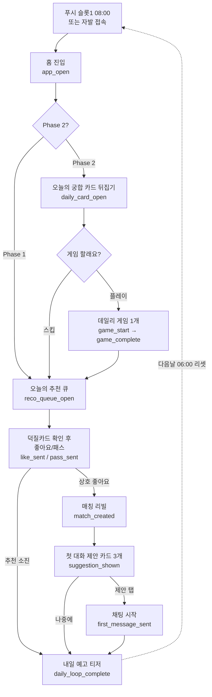

# A3 — 핵심 루프 설계 (Core Loop Design)

> 근거 문서: `ORCHESTRATOR_SPEC.md` §1(서비스 정의), §5(게임·리텐션), §6(유료 구조), §8(Phase 로드맵).
> 선행 산출물(01_market.md, 02_persona.md)은 작성 시점에 존재하지 않아 스펙만을 근거로 설계했다.

## 다음 에이전트에게 넘기는 결정사항

1. **루프는 2단계로 배포한다.** Phase 1은 게임 없는 축소 루프(접속→오늘의 추천 5명→좋아요/매칭→대화), Phase 2에서 "오늘의 궁합 카드→게임 1개" 단계를 루프 앞에 삽입해 완성 루프로 확장한다. Phase 1 코드는 이 삽입을 전제로 홈 화면을 **슬롯 구조**(카드 슬롯은 Phase 1에서 추천 큐 헤더로 대체)로 만들 것 → C3/E2 반영.
2. **일일 리셋 시각 = KST 06:00 고정.** 추천 큐 재계산(D3), 궁합 카드 발행(D7), 데일리 퀘스트 리셋(F 그룹)이 모두 이 시각 기준. 스트릭 판정도 "06:00~다음날 05:59 사이 1회 접속" 기준으로 통일한다.
3. **푸시는 일 최대 2건, 고정 슬롯제.** 슬롯1 = 오전 08:00 "오늘의 궁합 카드/추천 도착"(데일리 앵커, 매일), 슬롯2 = 이벤트성(매칭 성사·새 메시지·좋아요 수신 중 우선순위 최상위 1건, 12:00~21:00 사이 발생 즉시, 이미 2건 소진 시 다음날로 이월하지 않고 폐기). 죄책감·조바심 유발 카피 금지 → D7/F3 구현 기준.
4. **퍼널 이벤트 이름은 본 문서 §5의 스네이크케이스 정의를 그대로 사용한다** (`daily_card_open`, `match_created` 등). 임의 개명 금지 — D7(알림), D8(어드민 지표), E1~E4(클라이언트 계측), F3(실험)이 전부 이 이름으로 로깅/집계한다. 이벤트 테이블 또는 로깅 파이프는 D1이 `analytics_events(id, profile_id, name, props jsonb, created_at)` 형태로 확보할 것.
5. **첫 대화 제안 카드는 Phase 1부터 필수**(§1 차별점이므로 게임과 무관). 매칭 생성 시 `matches.first_suggestion(jsonb)`에 공통 취미 기반 제안 3개를 서버가 미리 생성해 저장한다 → D3/D4/E3 반영. Phase 2에서 제안 소스에 취향 배틀·퀴즈 결과가 추가된다.

---

## 1. 일일 루프 상세 설계

### 1.0 설계 원칙

- 루프의 목적은 **"내일 다시 올 이유"를 오늘 심는 것**. 게임·카드는 수단이며, 종착점은 항상 대화다(§5 핵심 원칙).
- 무료 유저 기준으로 설계한다(추천 5명, 카드 1장). 유료 티어는 같은 루프의 반복 횟수만 늘린다.
- 하루 총 체류 목표: **5~8분**. 데이팅 앱의 무한 스와이프식 체류 극대화를 하지 않는다(§1 "하지 않는 것").

### 1.1 Phase 1 축소 루프 — 접속 → 오늘의 추천 5명 → 좋아요/매칭 → 대화

Phase 1에는 게임(F 그룹)과 궁합 카드(§5-1)가 없다. 축소 루프는 4단계다.

| # | 단계 | 화면 | 소요시간 목표 | 다음 단계로 넘어가는 훅 | 이탈 시 복구 장치 |
|---|---|---|---|---|---|
| S1 | 접속 | 홈(`/home`). 상단: "오늘의 추천 5명 도착" 배너 + 남은 추천 수. 하단 탭: 홈/매칭/채팅/프로필 | 앱 진입 ~10초 | 배너 자체가 CTA. 미확인 추천 수 뱃지 | 오전 08:00 푸시 슬롯1 "오늘의 추천 5명이 도착했어요". D3/D7 미접속 리마인더(§3) |
| S2 | 오늘의 추천 5명 | 추천 큐(`/discover`). 덕질카드가 첫 화면(사진 아님, §1). 카드당: 취미 Top3 + 최애 + 궁합 근거 3줄(`daily_recommendations.reasons`). 좋아요/패스 2버튼 + 슈퍼라이크 | 카드당 20~40초, 총 2~3분 | 5명 소진 화면에서 "내일 06:00에 새 추천" 카운트다운 + 받은 좋아요 블러 목록으로 유도 | 큐 중간 이탈 시 미소진 카드는 당일 내 유지(`seen_at` null 카드부터 재개). 소진 전 이탈이 2일 연속이면 큐 정렬을 궁합점수 최상위 우선으로 조정(D3) |
| S3 | 좋아요/매칭 | 매칭 리빌 화면(Phase 1은 단순 모달, 스크래치 연출은 Phase 2). 상호 좋아요 즉시 "매칭!" + 첫 대화 제안 카드 3개 노출 | 리빌 ~10초 | 제안 카드 탭 = 첫 메시지 자동 발송 → 즉시 채팅방 진입. "나중에" 선택 시 매칭 탭에 대기 표시 | 매칭 후 첫 메시지 없이 24시간 경과 시 푸시 슬롯2 후보 "OO님과의 공통 취미 이야기를 시작해보세요"(제안 카드 딥링크). 죄책감 카피 금지 |
| S4 | 대화 | 채팅(`/chat/[matchId]`). 상단에 상대 덕질카드 요약 고정. 연락처 마스킹 상태 표시(3일 후 해제, D4) | 3~5분 | 상대 응답 도착 = 푸시 슬롯2 후보. 대화 지속 자체가 리텐션 | 응답 없는 방은 목록에서 "제안 카드 다시 보내기" 리믹스 버튼 제공. 7일 무응답 방은 조용히 하단 정렬(재촉 알림 금지) |
| S5 | (내일 예고 — 축소판) | S2 소진 화면 겸용: "내일의 추천은 06:00에 도착" + 받은 좋아요 수 블러 티저 | ~10초 | 티저가 다음날 S1 복귀 동기 | 없음(종착 화면) |

**축소 루프 요약**: `푸시/자발 접속 → 홈 배너 → 추천 5명 소진 → (매칭 시) 제안 카드로 첫 대화 → 내일 예고 티저`. 목표 체류 5분 내외.

### 1.2 Phase 2 완성 루프 — 접속 → 오늘의 궁합 카드 → 게임 1개 → 매칭/대화 → 내일 예고

Phase 1 루프를 유지한 채, 홈의 카드 슬롯에 **오늘의 궁합 카드**가, 카드와 추천 큐 사이에 **게임 1개**가 삽입된다.

| # | 단계 | 화면 | 소요시간 목표 | 다음 단계로 넘어가는 훅 | 이탈 시 복구 장치 |
|---|---|---|---|---|---|
| L1 | 접속 | 홈. 최상단 = 뒤집히지 않은 오늘의 궁합 카드(스트릭 뱃지·데일리 퀘스트 3종 체크리스트 병기) | ~10초 | 뒤집기 전 카드의 호기심 갭("오늘의 궁합 ??%"). 스트릭 이어가기 표시(중립 톤) | 오전 08:00 푸시 슬롯1 "오늘의 궁합 카드가 도착했어요". 카드 미개봉 상태로 당일 유지, 자정 지나도 죄책감 카피 없이 새 카드로 교체 |
| L2 | 오늘의 궁합 카드 | 카드 뒤집기 애니메이션 → 상대 덕질카드 + 궁합 % + 이유 3줄. 무료 1장/플러스 3장/프로 5장(§6) | 30~60초 | 카드 하단 CTA 2개: "관심 보내기"(좋아요) / **"이 사람과 취향 배틀"**(게임 진입 — L3 훅). 퀘스트 "카드 확인" 자동 완료 체크 표시 | 카드만 보고 이탈 시, 당일 재접속하면 홈이 L3(게임)부터 재개. 상대가 나를 좋아요하면 푸시 슬롯2 후보 |
| L3 | 게임 1개 | 데일리 게임 1개 노출(로테이션: 취향 배틀 기본, 주 2회 덕질 퀴즈 대전). 취향 배틀 = 익명 2지선다 5문항 | 1~2분 | 결과 화면 "당신과 87% 같은 선택을 한 사람" 노출 + 관심 표시 버튼 → 자연스럽게 매칭 풀로 연결(L4). 퀴즈 대전은 완료 시 대화방 자동 오픈 옵션 | 게임 스킵 가능(스킵해도 추천 큐 진입 차단 없음 — 게임은 핑계이지 관문이 아님). 스킵 2일 연속 시 다음날 게임 종류를 교체해 노출(F3 실험 변수) |
| L4 | 매칭/대화 | Phase 1의 S2~S4와 동일 + 매칭 리빌이 스크래치 카드 연출로 업그레이드. 첫 대화 제안 카드 소스에 취향 배틀·퀴즈 결과 추가 | 3~5분 | 게임 결과가 첫 메시지 소재("우리 배틀에서 4/5 같았어요") → 어색함 제거(§1) | S2~S4와 동일 |
| L5 | 내일 예고 | 오늘 루프 완료 화면: 퀘스트 완료 현황 + 스트릭 +1 + **내일 카드 티저**("내일은 '보드게임' 태그가 겹치는 분이에요") + 받은 좋아요 블러 | ~15초 | 티저의 정보 갭이 다음날 L1 복귀 동기. 7일 스트릭 보상(슈퍼라이크 1개) 진행바 | 예고 화면 미도달(중간 이탈)이어도 스트릭은 "접속" 기준으로 인정 — 완주 강요 없음. 스트릭 단절 시 "다시 시작하면 돼요" 중립 카피(§5-5, 죄책감 금지) |

**완성 루프 요약**: `푸시 → 카드 뒤집기 → 게임 1개(스킵 가능) → 추천/매칭/대화 → 내일 예고 + 퀘스트/스트릭 정산`. 목표 체류 6~8분.

### 1.3 일일 루프 플로우 다이어그램 (Phase 2 완성 루프, Phase 1 경로 병기)

---

## 2. 주간 루프

주간 루프의 리듬: **월요일 = 새 시작, 주중 = 누적, 금요일 = 주말 약속 전환, 일요일 밤 = 정산·예고.**

| 요소 | 시점 (KST) | 내용 | 루프 연결 |
|---|---|---|---|
| **주간 퀘스트 발행** | 월 06:00 | 예: "이번 주 취향 배틀 3회", "새 매칭 1명과 대화 10turn". 보상 = 슈퍼라이크/코인(§6 소모성과 정합) | 데일리 퀘스트(접속·카드·투표·답장)의 상위 묶음. 데일리를 4일 이상 완주하면 주간이 자연 달성되는 난이도로 설계 — 별도 노가다 금지 |
| **주간 취미 이벤트 공개** | 월 06:00 공개, 주중 참여 | 온라인 미션형(예: "이번 주 최애 사진 한 장") + 오프라인 모임(호스트 = 인증 회원만, `events`/`event_rsvps`) | 이벤트 참여물·RSVP 명단이 새로운 관심 표시 접점 → 일일 루프 밖의 매칭 유입 경로 |
| **오프모임 전환 푸시 없음 — 화면 내 유도만** | 금요일 홈 배너 | "이번 주말 [홍대 보드게임] 모임 2자리 남음". 매칭된 쌍에게는 첫 대화 제안 카드에 주말 이벤트 삽입 | 대화 → 만남 전환(§1 서비스 정의의 종착점). 푸시 슬롯을 소모하지 않고 배너로만 |
| **취미 랭킹 리셋** | 월 06:00 리셋, 일 21:00 확정 스냅샷 | "이번 주 클라이밍 덕후 TOP 10"(활동량 기준, 익명 옵션, §5-7) | 일요일 저녁 마지막 접속 동기 + 월요일 "새 판 시작" 복귀 동기. 리셋 직전 순위 하락 조바심 푸시는 금지 |
| **주간 정산 화면** | 일 21:00 이후 첫 접속 시 | 이번 주: 매칭 n건, 대화 n턴, 스트릭, 퀘스트 보상 수령 + 다음 주 이벤트 예고 | 주간판 "내일 예고". 수령 버튼이 월요일 복귀 훅 |

주간 루프는 전부 Phase 2 이후(F1~F3, 이벤트는 Phase 5)다. **Phase 1의 주간 리듬은 D7의 미접속 리마인더(D3/D7)뿐이다.**

---

## 3. 푸시/알림 정책과 루프의 연결

**전제(§5): 일 최대 2건. 이 상한은 트랜잭션성 포함 마케팅·리텐션 푸시 전체에 적용한다.** (야간 21:00~08:00 발송 금지, 광고성 알림은 정보통신망법상 수신동의 필수 — 상세는 B1 산출물을 따른다.)

### 3.1 슬롯 구조

| 슬롯 | 발송 시각 | 내용 | 비고 |
|---|---|---|---|
| 슬롯1 (데일리 앵커) | 08:00 고정 | Phase 1: "오늘의 추천 5명 도착" / Phase 2: "오늘의 궁합 카드 도착" | 매일 1건. 유저가 06:00~08:00 사이 이미 접속했으면 발송 생략(그날 슬롯1은 소멸, 슬롯2로 전용하지 않음 → 실질 1건) |
| 슬롯2 (이벤트성) | 발생 즉시, 단 12:00~21:00 창 안에서만 | 우선순위: ① 매칭 성사 ② 새 메시지(방별 하루 1회 집계) ③ 좋아요 수신(블러) ④ 매칭 후 24h 무대화 제안 카드 리마인드 | 하루 최상위 1건만. 창 밖 발생 건은 다음 창 시작 시 최신 1건만 발송, 나머지 폐기(이월 금지) |
| 미접속 리마인더 | D3, D7에 슬롯1 대체 | "새 추천이 쌓여 있어요" 팩트형 카피 | D7 이후 무반응이면 푸시 전면 중단, 주 1회 상한의 다이제스트로 강등(재접속 시 원복). 스팸 방지 상한(D7 스펙) 준수 |

### 3.2 카피 원칙 — 죄책감 유발 금지 (§5-5, §6 다크패턴 금지와 정합)

- **금지**: "스트릭이 끊겨요 😢", "OO님이 기다리다 지쳤어요", "지금 안 보면 사라져요", 가짜/부풀린 좋아요 알림, 미응답 상대를 대신한 재촉("답장을 기다리고 있어요").
- **허용 원칙**: ① 팩트만("새 추천 5명이 도착했어요") ② 유저가 얻는 것 중심("궁합 92% 카드가 열려 있어요") ③ 행동 명령형 대신 초대형 어미("~해보세요" OK, "~해야 해요" 금지) ④ 이모지 최대 1개.
- 스트릭 단절 후 첫 푸시는 스트릭을 언급하지 않는다(새 카드/추천만 언급).
- 모든 푸시 카피는 F3의 A/B 대상이지만, 위 금지 목록은 실험 대상에서 제외(고정 제약).

### 3.3 루프 단계별 매핑

- S1/L1 진입 실패(미접속) → 슬롯1이 유일한 복구 수단.
- S3/L4 매칭 성사 → 슬롯2 ①.
- S4 대화 중단 → 슬롯2 ②(상대 답장 시에만; 내 무응답에 대한 재촉 없음).
- L5 내일 예고 → 푸시가 아니라 화면 티저로만. 예고 내용을 다음날 슬롯1 카피에 재사용해 연결감을 만든다("어제 예고한 보드게임 덕후, 도착!").

---

## 4. 루프 단계별 측정 지표

### 4.1 퍼널 이벤트 정의 (이 이름 그대로 구현에 사용)

공통 속성: `profile_id`, `ts`, `phase`(1|2), `tier`(free|plus|pro), `session_id`.

**온보딩 (E1 계측)**
| 이벤트 | 시점 | 주요 props |
|---|---|---|
| `signup_start` | 가입 화면 진입 | `referrer` |
| `age_gate_pass` | 연령확인 통과 | — |
| `hobby_select_complete` | 취미 5개 선택 완료 | `hobby_slugs` |
| `quiz_complete` | 궁합 퀴즈 10문항 완료 | `duration_sec` |
| `duckcard_complete` | 덕질카드 작성 완료 | — |
| `photo_upload_complete` | 사진 업로드(검수 대기) | `photo_count` |
| `onboarding_complete` | 온보딩 전체 완료 | `total_duration_sec` |

**일일 루프 (E2/E3 계측)**
| 이벤트 | 루프 단계 | 주요 props |
|---|---|---|
| `app_open` | S1/L1 | `source`(push|organic|deeplink), `push_slot`(1|2|null) |
| `daily_card_open` | L2 (Phase 2) | `card_index`, `compat_score` |
| `game_start` / `game_complete` / `game_skip` | L3 (Phase 2) | `game_type`(battle|quiz), `result` |
| `reco_queue_open` | S2 | `queue_size`, `resumed`(bool) |
| `reco_card_view` | S2 | `target_id`, `position`(1~5) |
| `like_sent` / `pass_sent` / `superlike_sent` | S2 | `target_id`, `source`(queue|card|game_result|event) |
| `match_created` | S3/L4 | `match_id`, `source` |
| `suggestion_shown` / `suggestion_tap` | S3 | `match_id`, `suggestion_type`(hobby|battle|quiz) |
| `first_message_sent` | S4 | `match_id`, `via_suggestion`(bool), `hours_since_match` |
| `message_sent` / `message_reply` | S4 | `match_id`, `turn_count` |
| `daily_loop_complete` | S5/L5 | `steps_done`, `duration_sec` |

**주간 루프 / 리텐션 (F3 계측)**
| 이벤트 | 시점 | 주요 props |
|---|---|---|
| `quest_complete` | 퀘스트 달성 | `quest_key`, `kind`(daily|weekly) |
| `streak_incremented` / `streak_broken` | 06:00 정산 | `streak_days` |
| `weekly_recap_view` | 주간 정산 화면 | `matches`, `turns` |
| `event_rsvp` | 이벤트 신청 | `event_id`, `hobby_slug` |
| `ranking_view` | 랭킹 화면 | `hobby_slug`, `my_rank` |
| `push_sent` / `push_open` | 푸시 (D7 서버 계측) | `slot`(1|2|reminder), `copy_variant` |

### 4.2 핵심 퍼널과 목표치

- **온보딩 퍼널**: `signup_start → onboarding_complete` 완주율 목표 60% 이상. 최대 이탈 예상 지점 = 퀴즈 10문항(`quiz_complete` 전) — 문항별 진행 props로 감시.
- **데일리 퍼널 (Phase 1)**: `app_open → reco_queue_open → like_sent(≥1) → daily_loop_complete`. `app_open→reco_queue_open` 80%, 큐 소진율 70% 목표.
- **데일리 퍼널 (Phase 2)**: `app_open → daily_card_open → (game_complete|game_skip) → reco_queue_open → daily_loop_complete`. `daily_card_open`율 85% 목표(카드가 앵커라는 가설 검증 지표).
- **매칭→대화 전환**: `match_created → first_message_sent` 24h 내 70% 목표, `via_suggestion` 비중 50% 이상이면 제안 카드 가설 성립.
- **리텐션 KPI (§5)**: D1 40% / D7 20% / D30 10%. 기준 이벤트 = `app_open`. 코호트 기준일 = `onboarding_complete` 날짜.
- **푸시 건전성**: `push_open`율 슬롯1 15%+, 푸시 후 24h 내 알림 끄기 전환율 0.5% 미만(넘으면 카피/빈도 재검토).

### 4.3 대시보드 (D8 반영)

D8 어드민 지표 화면에 최소: 데일리 퍼널 5단계 막대, D1/D7/D30 코호트 곡선, `match_created→first_message_sent` 전환율, 푸시 슬롯별 오픈율. 신고율(D5)과 함께 배치해 "리텐션을 위해 안전을 희생하지 않는지" 교차 감시.

---

## 부록 — Phase 1 → Phase 2 루프 마이그레이션 체크리스트

1. 홈 카드 슬롯: 추천 배너 → 궁합 카드 컴포넌트 교체 (E2, C2의 카드 뒤집기 컴포넌트).
2. `daily_recommendations`에서 카드용 1명(최고점)을 분리 발행하는 로직 추가 (D3) — 카드 대상은 당일 추천 5명과 중복되지 않게.
3. 푸시 슬롯1 카피 교체: "추천 도착" → "궁합 카드 도착" (D7).
4. 첫 대화 제안 카드 소스 확장: `hobby` 단일 → `hobby|battle|quiz` (D4, `suggestion_type` props와 일치).
5. `game_*`, `quest_*`, `streak_*` 이벤트 계측 활성화 (F2/F3).
