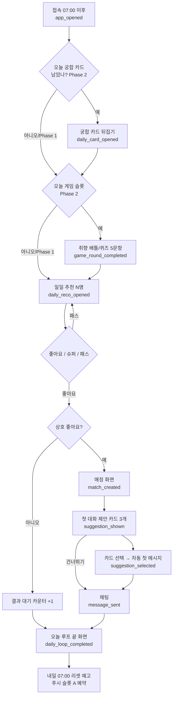

# 03 — 핵심 루프 설계 (A3)

> 입력: `00_brief.md`. 이 문서는 **설계 문서**이며 코드를 포함하지 않는다.
> 시간 표기는 전부 **KST(UTC+9)**. DB 저장은 UTC, 리셋 경계 계산만 KST로 한다.

## 다음 에이전트에게 넘기는 결정사항

- **일일 리셋 = 매일 07:00 KST.** `daily_recommendations.date`는 "KST 07:00을 하루의 시작"으로 하는 `loop_date`다 (UTC 22:00 경계). D1/D3는 이 경계로 배치를 돌린다. 자정 리셋은 채택하지 않는다(새벽 사용 유도 방지, 출근길 접속 훅).
- **Phase 1 루프** = 접속 → 추천 5명 → 좋아요 → 매칭 → 첫 대화 제안 카드 → 채팅. `game_profiles/quests/game_sessions` 테이블은 D1이 만들되 **Phase 1 앱 코드에서는 읽고 쓰지 않는다.**
- **첫 대화 제안 카드는 Phase 1 범위다** (브리프 §게임 8번에 속하지만 "게임"이 아니라 매칭 성사 화면의 일부). 룰 기반 템플릿(본 문서 §5)으로 매칭 생성 시 서버(Edge Function 또는 DB 트리거)에서 3개를 만들어 `matches.first_suggestion(jsonb)`에 저장. AI/LLM 호출 없음.
- **Phase 2로 미루는 요소**: 오늘의 궁합 카드, 취향 배틀, 덕질 퀴즈 대전, 매칭 리빌 스크래치, 스트릭/데일리 퀘스트, 주간 이벤트, 취미 랭킹. 일일 루프의 "게임 1개" 슬롯은 Phase 1에서 **빈 슬롯**이며 화면에 자리(placeholder UI)도 만들지 않는다.
- **추천 노출 상태 기계**: `daily_recommendations`에 `seen_at`(브리프 스키마) 외에 **`acted_at`, `action(like/super/pass/null)`** 컬럼 추가를 D1에 요청. 좋아요/패스 없이 본 것(seen)과 판단한 것(acted)을 분리해야 재노출 규칙(§6)이 성립한다.
- **재노출 규칙**: pass → 30일 재노출 금지, seen-only(무행동) → 7일 후 재노출 가능(1회만), like 보낸 상대 → 재노출 안 함(매칭 대기), 차단/신고 → 영구 제외.
- **좋아요 받은 사람 우선 노출**: 나를 이미 좋아한 사람은 점수에 `+0.10`(브리프 "상호 관심 신호" 0.1 가중치를 이 케이스에 만점 부여) 후 **일일 5명 중 최대 2명까지** 포함. 무료 회원에게도 그 사람이 나를 좋아했다는 **사실은 카드에 표시하지 않는다**(유료 "나를 좋아한 사람" 가치 보존). 매칭 성사 시에만 "서로 좋아요" 표기.
- **신규 가입자 부스트**: 가입 후 72시간 동안 타인의 추천 풀에서 점수 `+0.05`, 최대 노출 상한 일 40회. 부스트 대상은 사진 1장 이상 검수 통과 + 취미 Top3 완료 + 퀴즈 ≥10문항인 프로필로 한정.
- **푸시 예산 일 2건**: 슬롯 A(아침 07:30 추천 리셋), 슬롯 B(저녁 19:30~21:00 사이 이벤트 기반). 매칭/메시지 알림은 **예산을 소비하지 않되** 시간당 1건으로 뭉친다(§7). Phase 1은 Web Push(VAPID) 기준.
- **Phase 1 "내일 다시 올 이유"** 3종: (1) 07:00 새 추천 5명 + 아침 푸시, (2) 상대의 응답(좋아요 매칭/답장) 알림, (3) 어제 보낸 좋아요의 "결과 대기" 카운터 화면. 스트릭/보상은 쓰지 않는다.
- **주간 리셋 = 월요일 07:00 KST.** 슈퍼라이크 주간 지급(무료 1/플러스 5/프로 15)은 Phase 1부터 이 시각에 `item_ledger`에 적립(잔여분 소멸, 이월 없음). 랭킹/배틀 결과 리셋도 같은 시각 — 단 Phase 2.
- **매칭 즉시 화면 순서 고정**: 매칭 애니메이션 → 제안 카드 3개 → 카드 1개 선택 시 채팅방에 그 카드 본문이 **첫 메시지로 자동 전송**(발신자 = 카드 선택자). 카드 선택을 건너뛰고 채팅에 직접 입장도 가능.
- **분석 이벤트 명명 규칙**: `snake_case`, `<object>_<past_verb>` 형태, 공통 속성 `{user_id_hash, loop_date, session_id, mode(friend/dating), plan(free/plus/pro)}`. 이벤트 표는 §8. Phase 1 필수 이벤트는 표에 ★ 표시.
- **일일 루프 정의 KPI**: "루프 완주" = `daily_reco_opened` ∧ `like_sent`(≥1) 를 같은 `loop_date`에 기록. D1/D7/D30 리텐션은 이 완주 기준이 아니라 **접속(`app_opened`)** 기준으로 측정하되, 완주율은 보조 지표로 분리한다.

---

## 1. 루프 설계 원칙

1. **하루 5분, 끝이 있는 루프.** 무제한 스와이프 금지(브리프). 오늘 5명을 다 보면 "끝" 화면이 나오고, 내일 07:00 리셋을 명시한다. 끝이 있어야 "내일"이 생긴다.
2. **취미가 먼저, 얼굴은 두 번째.** 추천 카드의 1면은 덕질 카드(취미 Top3 + 최애 + 요즘 빠진 것 + 겹치는 취미 하이라이트). 사진은 카드 뒤집기/스크롤로 노출.
3. **어색함은 시스템이 깬다.** 매칭 직후 빈 채팅창을 절대 보여주지 않는다. 제안 카드 3개가 먼저.
4. **죄책감 카피 금지.** "오늘 안 오면 사라져요" 류 금지(브리프). 리마인더는 정보형("새 추천 5명 도착").
5. **게임은 루프의 확장이지 전제가 아니다.** Phase 1 루프는 게임 없이 스스로 닫혀야 한다.

---

## 2. 일일 루프 (완성형, Phase 2 기준)

| # | 단계 | 화면 | 유저 액션 | 시스템 동작 | 소요 | 다음 단계 훅 | Phase |
|---|---|---|---|---|---|---|---|
| 1 | 접속 | 홈(오늘 탭). 상단: 오늘 날짜/`loop_date`, 새 추천 N명 배지, 미읽음 채팅 배지 | 앱/웹 열기 | `app_opened` 기록, `last_active_at` 갱신, 오늘 추천 미생성 시 즉시 생성(폴백) | 5초 | "오늘의 궁합 카드 1장 도착" 배너 | 1 |
| 2 | 오늘의 궁합 카드 | 뒤집는 카드 1장(무료 1/플러스 3/프로 5). 앞면: 취미 겹침 % 티저, 뒷면: 상대 덕질 카드 + 좋아요 버튼 | 탭해서 뒤집기 → 좋아요/패스 | 카드 대상 = 오늘 추천 중 최고 점수 1명을 별도 표기(추천 5명과 **중복 허용**, 카드 열람 시 seen 처리) | 30초 | "나머지 추천 4명 보기" | 2 |
| 3 | 게임 1개 | 오늘의 게임 슬롯(취향 배틀 / 퀴즈 대전 중 요일별 1개) | 5문항 답변 | 답변을 `quiz_answers` 보조 신호로 저장, 퀘스트 진행 | 60~90초 | "결과는 내일 07:00 공개" + 추천 목록 진입 | 2 |
| 4 | 추천/좋아요 | 추천 리스트(5/15/30). 카드 1면 덕질 카드, 겹치는 취미 강조, "같이 할 수 있는 것" 1줄 미리보기 | 좋아요/슈퍼라이크/패스 | `likes` insert, 상호 좋아요 시 `matches` 생성 + 제안 카드 3개 생성 | 2~3분 | 매칭 시 즉시 매칭 화면. 없으면 "결과 대기 N건" | 1 |
| 5 | 매칭/대화 | 매칭 화면 → 제안 카드 3개 → 채팅 | 카드 선택 → 메시지 전송 | 카드 본문 자동 첫 메시지, 상대에게 푸시(뭉침) | 1~5분 | 답장 알림이 다음 접속 트리거 | 1 |
| 6 | 내일 예고 | "오늘 루프 끝" 화면: 결과 대기 N건, 내일 07:00 새 추천, 내일 게임 종류, 이번 주 이벤트 D-day | 알림 허용(미허용 시 1회 요청), 닫기 | 푸시 구독 상태 확인, `daily_loop_completed` 기록 | 10초 | 아침 푸시 슬롯 A 예약 | 1 (게임/이벤트 문구는 2) |

총 소요 목표: **4~8분**. 8분 초과 시 루프가 "일과"가 아니라 "부담"이 된다.



---

## 3. 주간 루프 (Phase 2·5, 슈퍼라이크 충전만 Phase 1)

주간 경계 = **월요일 07:00 KST**. 주간 배치는 일일 배치(07:00) 직전에 실행한다.

| 요일 | 07:00 배치 | 낮/저녁 | 유저 관점 |
|---|---|---|---|
| **월** | 주간 리셋: 슈퍼라이크 지급(1/5/15, 잔여 소멸), 취미 랭킹 스냅샷 확정 후 리셋, 지난주 취향 배틀 결과 확정 | 슬롯 B 푸시: "지난주 취향 배틀 결과 공개" (Phase 2) | 새 슈퍼라이크 + 지난주 결과 보기 = 월요일 접속 이유 |
| **화** | 이번 주 취미 이벤트 3개 공개(취미별·지역별, `events`) | 슬롯 B: 이벤트 오픈(관심 취미 일치자만) | RSVP 시작, 프로 우선 참가 24h 선행 |
| **수** | — | 게임 슬롯 = 덕질 퀴즈 대전 | 중간 지점 활성 유지 |
| **목** | 이벤트 RSVP 마감 D-2 알림(참가자에게만) | 게임 슬롯 = 취향 배틀 | 주간 배틀 응답 수집 피크 |
| **금** | 주말 이벤트 리마인드(참가자 한정, 예산 소비) | 슬롯 B: "이번 주말 같은 취미 이벤트" | 주말 만남 유도 |
| **토** | — | 오프라인/온라인 이벤트 진행 | 이벤트 후 참가자 간 매칭 부스트(+0.05, 48h) |
| **일** | 취향 배틀 응답 마감 22:00 | 슬롯 B: "이번 주 배틀 마감 전 참여" (미참여자만) | 월요일 결과 기대감 |

- **취미 이벤트**: 주 3개(취미 카테고리 상위 3개 × 지역 1개). 호스트는 운영팀 계정(Phase 5 이전엔 사용자 호스트 금지).
- **랭킹 리셋**: 취미별 "이번 주 활발한 덕후" 상위 10명. 점수 = 게임 참여 + 매칭 후 대화 지속(첫 24h 내 왕복 3회 이상). 좋아요 수는 랭킹에 넣지 않는다(외모 점수화 방지).
- **슈퍼라이크 충전**: 월 07:00 `item_ledger`에 `+N` (ref=`weekly_grant:<iso_week>`). 구매분(₩4,900/5개)은 소멸하지 않고 별도 ref로 구분.
- **주간 취향 배틀 결과**: 일 22:00 마감, 월 07:00 공개. 무료는 상위 1개 항목만, 플러스 5, 프로 전체(브리프 표).

---

## 4. Phase 1 최소 루프 (게임 없이)

```
접속 → 일일 추천 5명 → 좋아요/패스 → 매칭 → 첫 대화 제안 카드 3개 → 채팅 → 루프 끝 화면
```

| 단계 | 화면 요소 (Phase 1 한정) | 시스템 |
|---|---|---|
| 접속 | 오늘 탭. 상단 "오늘의 추천 5명 · 07:00 갱신". 알림 미허용 시 소프트 요청 배너(하루 1회) | 오늘 추천 없으면 온디맨드 생성(배치 실패 폴백) |
| 추천 5명 | 세로 카드 리스트(스와이프 아님, 스크롤+버튼). 카드 1면: 닉네임/연령대/지역(구 단위)/취미 Top3(겹침 강조)/최애/요즘 빠진 것/"같이 할 수 있는 것" 1줄. 2면: 사진 | `seen_at` 기록(뷰포트 50% 이상 1초) |
| 좋아요 | 좋아요 / 슈퍼라이크(주 1) / 패스. 패스 확인창 없음, 되돌리기는 유료 | `likes` insert, `acted_at/action` 갱신 |
| 매칭 | 풀스크린 매칭 화면. 양쪽 덕질 카드가 겹치는 애니메이션, 겹친 취미 태그 강조 | `matches` insert + `first_suggestion` 3개 생성 |
| 제안 카드 | 카드 3개 가로 스크롤. 각 카드: 제목·본문·"이걸로 시작하기" | 선택 시 채팅에 본문 자동 전송 |
| 채팅 | 텍스트+이미지(검수), 신고/차단 항상 상단 | 마스킹(`masked_body`), 상대 푸시(뭉침) |
| 루프 끝 | "오늘 5명을 모두 봤어요." 결과 대기 N건 / 매칭 M건 / 내일 07:00 새 추천 | `daily_loop_completed` |

### 4.1 게임 없이 "내일 다시 올 이유" 만들기

| 훅 | 동작 | 이유가 되는 원리 |
|---|---|---|
| **리셋 시각 고정 07:00** | 홈과 루프 끝 화면에 "내일 07:00에 새 추천 5명" 명시, 07:30 푸시 슬롯 A | 예측 가능한 보상 시각 = 습관 앵커(출근길) |
| **결과 대기 카운터** | 내가 보낸 좋아요 중 미응답 건수를 루프 끝·홈에 표시. 상대가 좋아요하면 즉시 매칭 알림 | 어제의 행동이 오늘의 결과로 이어짐 |
| **상대 응답 알림** | 매칭 성사·답장 도착 시 푸시(뭉침, 예산 미소비) | 가장 강한 재방문 트리거. 가짜 알림 절대 금지 |
| **추천 사유 노출** | 카드마다 "겹치는 취미 2개 · 저녁 시간대 같음"처럼 `reasons` 표시 | "내일 5명은 또 다를 것"이라는 기대 |
| **좋아요 받은 사람 우선 노출** | 나를 좋아한 사람이 내 추천에 들어오므로 매칭 확률이 매일 조금씩 오름 | 며칠 쓰면 매칭이 생긴다는 체감 |
| **미완료 루프 리마인드** | 오늘 추천을 열었지만 5명을 다 안 본 경우에만 슬롯 B(19:30) 1회 "아직 3명 남았어요" | 정보형, 손실 회피 카피 금지 |
| **프로필 완성 넛지** | 사진 검수 대기/퀴즈 미완료 시 홈 상단 1줄(닫기 가능, 주 1회 재표시) | 완성도 ↑ → 추천 품질 ↑ 체감 |

Phase 1에서 **하지 않는 것**: 스트릭, 코인, 퀘스트, 카운트다운 타이머 애니메이션, "N명이 당신을 봤어요" 류의 허수 알림.

---

## 5. 첫 대화 제안 카드 생성 규칙 (Phase 1, 룰 기반)

### 5.1 입력

| 입력 | 출처 | 비고 |
|---|---|---|
| `common_hobbies[]` | `profile_hobbies` 교집합, 양쪽 rank 합이 작은 순 | 없으면 카테고리 일치로 완화 |
| `a_fav`, `b_fav` | `profile_hobbies.fav_note` (겹치는 취미 기준) | 텍스트는 마스킹 필터 통과분만 사용 |
| `common_slots[]` | `availability` 교집합 (weekday × slot) | 없으면 "주말"로 폴백 |
| `same_region` | `region_code` 앞 2자리(시/도) 일치 여부, 구 단위 일치 여부 | 동(洞) 이하 노출 금지 |
| `mode` | friend / dating | dating은 "만나요" 계열 템플릿 비중 ↓ (첫 대화는 온라인 활동 우선) |

### 5.2 조립 규칙

1. 후보 템플릿을 카테고리별 풀에서 뽑는다: **카드1 = 겹치는 취미 1순위 템플릿, 카드2 = 겹치는 취미 2순위(없으면 1순위의 다른 템플릿), 카드3 = 시간대/지역 기반 범용 템플릿.**
2. 각 템플릿은 `requires` 조건(예: `same_region`, `common_slot`, `fav_note`)이 있고, 조건 미충족 시 스킵. 풀이 비면 범용(`GEN`) 템플릿으로 채운다.
3. 같은 두 사람의 카드 3개는 서로 다른 템플릿 ID여야 한다. 최근 30일 내 같은 유저에게 노출된 템플릿 ID는 우선순위를 낮춘다(다양성).
4. 슬롯 표기: `{hobby}` 취미명, `{fav}` 상대 최애(상대 카드에서 가져온 값), `{slot}` "평일 저녁"/"주말 오후"처럼 사람말로 변환, `{region}` 시/도 또는 구 단위.
5. 출력 = `first_suggestion: [{id, template_id, title, body, kind(online/offline/talk)}, ...3]`. `body`는 채팅 첫 메시지로 그대로 전송 가능한 **1~2문장, 존댓말, 질문으로 끝남**.
6. 금지: 외모 언급, 만남 장소 특정(카페명 등), 연락처 요구, 시간 확정 표현("내일 7시에 봐요").

### 5.3 템플릿 예시 (18개)

| ID | 카테고리 | requires | kind | 제목 | 본문 (채팅 첫 메시지) |
|---|---|---|---|---|---|
| GAME-1 | 게임 | hobby | online | 같이 한 판 | `{hobby}` 하시는군요! 저도 요즘 계속 하고 있어요. 주로 어떤 모드 하세요? |
| GAME-2 | 게임 | hobby, common_slot | online | 듀오 시간 맞추기 | 둘 다 `{slot}`에 시간이 맞는 것 같아요. 언제 한 번 같이 플레이해볼까요? |
| ANIME-1 | 애니/웹툰 | fav | talk | 최애 토크 | `{fav}` 좋아하신다고요! 어느 편이 제일 인상 깊으셨어요? |
| ANIME-2 | 애니/웹툰 | hobby | online | 이번 분기 신작 | 이번 분기에 보고 계신 작품 있어요? 저는 추천받고 싶어요. |
| IDOL-1 | 아이돌/공연 | fav | talk | 입덕 계기 | `{fav}` 팬이시군요. 입덕 계기가 궁금해요! 저는 무대 영상 보고 빠졌어요. |
| IDOL-2 | 아이돌/공연 | hobby, same_region | offline | 공연 같이 | `{region}`에서 공연 자주 가세요? 다음에 같은 공연 있으면 같이 가도 좋겠어요. |
| BOARD-1 | 보드게임 | hobby | talk | 인생 보드게임 | 보드게임 좋아하시네요! 제일 자주 하는 게임이 뭐예요? |
| BOARD-2 | 보드게임 | hobby, same_region, common_slot | offline | 보드게임 카페 | `{region}` 쪽 보드게임 카페 가보셨어요? `{slot}`에 한 번 같이 가면 재밌을 것 같아요. |
| RUN-1 | 러닝/운동 | hobby | talk | 러닝 루틴 | 러닝 하시는군요! 보통 몇 km 정도 뛰세요? 저는 5km 루틴이에요. |
| RUN-2 | 러닝/운동 | hobby, same_region | offline | 같이 뛰기 | `{region}` 근처 러닝 코스 추천해주실 수 있어요? 주말에 같이 뛰어도 좋고요. |
| CLIMB-1 | 클라이밍 | hobby | talk | 볼더링 난이도 | 클라이밍 하신다고요! 요즘 어느 난이도 하세요? |
| CAFE-1 | 카페투어 | hobby, same_region | offline | 카페 리스트 | `{region}` 카페 많이 다니세요? 제 리스트랑 교환해요! |
| PHOTO-1 | 사진 | hobby | talk | 장비 토크 | 사진 찍으시는군요. 폰이세요, 카메라세요? 요즘 뭐 찍으세요? |
| PHOTO-2 | 사진 | hobby, common_slot | offline | 출사 | `{slot}`에 시간 맞으시면 가볍게 출사 한 번 어때요? |
| CODE-1 | 코딩 | hobby | talk | 사이드 프로젝트 | 코딩 하시네요! 요즘 만들고 있는 거 있으세요? 저는 토이 프로젝트 중이에요. |
| BOOK-1 | 독서 | fav | talk | 최근 읽은 책 | `{fav}` 좋아하신다니 반가워요. 최근에 읽은 책 한 권 추천해주세요! |
| GEN-1 | 범용 | common_slot | talk | 시간대 | 둘 다 `{slot}`에 활동하시네요. 그 시간엔 보통 뭐 하세요? |
| GEN-2 | 범용 | (없음) | talk | 요즘 빠진 것 | 프로필에 적으신 "요즘 빠진 것" 이야기 더 듣고 싶어요! 어떻게 시작하셨어요? |

카테고리 풀은 `hobbies.category` 기준으로 매핑하며, 새 취미 카테고리 추가 시 최소 `*-1`(talk) 템플릿 1개를 함께 추가하는 것을 D3 규칙으로 둔다.

---

## 6. 추천 리셋 / 노출 규칙

### 6.1 리셋

- **매일 07:00 KST** 일괄 생성 배치(D3). 06:50부터 생성 시작, 07:00에 공개(`date = loop_date`).
- 배치 미생성 유저(배치 후 가입, 배치 실패)는 접속 시 **온디맨드 생성**. 온디맨드 결과도 같은 `loop_date`로 저장해 하루 1회만 생성.
- 추천 수: 무료 5 / 플러스 15 / 프로 30. 플랜 변경은 다음 리셋부터 반영(당일 추가 생성 없음).
- 추천 풀 부족(후보 < N) 시 부족분은 빈 칸으로 두고 "이 지역/취미에 아직 사람이 적어요" 안내 — **재노출로 억지로 채우지 않는다.**

### 6.2 제외/재노출

| 상태 | 정의 | 재노출 |
|---|---|---|
| 매칭됨 | `matches` 존재 | 영구 제외 |
| 내가 좋아요 보냄 | `likes.from=나` | 제외 (상대 응답 대기) |
| 패스 | `action=pass` | **30일** 후 재노출 가능 |
| 본 것만(무행동) | `seen_at` 있고 `acted_at` 없음 | **7일** 후 1회 재노출, 그래도 무행동이면 30일 |
| 안 본 것 | 추천됐지만 `seen_at` 없음 | 다음날 즉시 재노출 가능(점수 유지) |
| 차단/신고 | `blocks`, `reports` 양방향 | 영구 제외 |
| 제재/휴면 | `status != active`, 14일 미접속 | 제외 (복귀 시 해제) |
| 모드 불일치 | friend ↔ dating | 제외. dating 모드는 `verify_level ≥ 1` 양쪽 필수 |

### 6.3 우선 노출

1. **나를 좋아한 사람**: 점수 `+0.10`, 일일 N 중 최대 40%(무료 2/플러스 6/프로 12). 카드에 표기하지 않음.
2. **신규 가입자 부스트**: 가입 72시간, `+0.05`, 완성 프로필 조건 충족 시. 일 노출 상한 40회(과다 좋아요로 신규 유저가 압도되는 것 방지).
3. **최근 활동**: `last_active_at` 48h 내 `+0.03`, 7일 이상 `-0.10`. 답 안 오는 상대를 덜 보여주는 것이 매칭 체감을 좌우한다.
4. **유료 부스트(1h, Phase 3)**: 구매 시각부터 1시간 동안 타인 추천 풀에서 `+0.15`, 온디맨드 생성에만 영향(배치 완료된 당일 추천은 바꾸지 않음).
5. 상한 후 남은 자리는 순수 점수순. 동점 시 `created_at` 최신 우선.

---

## 7. 푸시 예산 (일 최대 2건)

**정의**: "예산 소비 푸시" = 시스템이 먼저 보내는 마케팅/리마인드 성격. **매칭 성사·답장 도착은 상대의 행동에 대한 응답이므로 예산 미소비**, 단 시간당 1건으로 뭉치고 23:00~07:00은 보류(07:00 일괄).

| 슬롯 | 시각 (KST) | 내용 | 조건 | Phase |
|---|---|---|---|---|
| A | 07:30 | "새 추천 5명 도착" (+ 결과 대기 N건이면 함께) | 전일 접속 or 최근 7일 내 접속. 30일 미접속은 주 1회(월)로 감축 | 1 |
| B | 19:30~21:00 (유저의 `availability` evening/night 기준 택1) | 아래 우선순위에서 **1개만** | 하루 1건 | 1 (①②) / 2 (③④) |
| — | 즉시(뭉침) | 매칭 성사 / 답장 도착 | 예산 미소비, 시간당 1건, 야간 보류 | 1 |

슬롯 B 우선순위: ① 오늘 추천 미완료(열었으나 남음) → ② 사진 검수 결과(승인/반려) → ③ 게임/배틀 마감·결과 → ④ 이벤트 오픈/리마인드(관심 취미 일치자만). 해당 없으면 **보내지 않는다** (예산은 상한이지 목표가 아님).

규칙: 알림 미허용 유저에게는 인앱 배너로만. 하루 2건 상한은 유저 로컬 `loop_date` 기준으로 계산. 가짜 좋아요/허수 조회수 알림 금지(브리프).

---

## 8. 분석 이벤트 명세

공통 속성: `user_id_hash, loop_date, session_id, mode, plan, platform(web/app)`. ★ = Phase 1 필수.

| 루프 단계 | 이벤트 | 주요 속성 | 트리거 |
|---|---|---|---|
| 온보딩 | ★ `onboarding_step_completed` | `step(age_gate/hobbies/quiz/photos/availability/mode)` , `duration_ms` | 각 단계 완료 |
| 온보딩 | ★ `onboarding_completed` | `hobby_count, quiz_count, photo_count` | 첫 추천 화면 진입 가능 시 |
| 접속 | ★ `app_opened` | `source(direct/push/link)`, `push_slot(A/B/instant)` | 세션 시작 |
| 접속 | ★ `push_permission_prompted` / `push_permission_granted` | `attempt_no` | 배너/브라우저 프롬프트 |
| 궁합 카드 | `daily_card_opened` | `card_index, target_score` | 카드 뒤집기 (Phase 2) |
| 궁합 카드 | `daily_card_acted` | `action(like/pass)` | 카드 위 행동 |
| 게임 | `game_round_started` / `game_round_completed` | `game_type, question_count, duration_ms` | Phase 2 |
| 추천 | ★ `daily_reco_opened` | `reco_count, from_like_count, boosted_count` | 추천 리스트 진입 |
| 추천 | ★ `reco_card_seen` | `target_id_hash, position, score_bucket` | 뷰포트 50% 1초 |
| 추천 | ★ `reco_card_flipped` | `position` | 사진면 전환 |
| 좋아요 | ★ `like_sent` | `type(like/super), position, reasons_shown` | 버튼 |
| 좋아요 | ★ `pass_sent` | `position` | 버튼 |
| 좋아요 | ★ `daily_reco_exhausted` | `liked, passed, unseen` | 5명 완료 화면 |
| 매칭 | ★ `match_created` | `match_id_hash, hours_since_first_like, initiator(me/them)` | 서버 |
| 매칭 | ★ `match_screen_viewed` | `match_id_hash` | 매칭 화면 |
| 제안 카드 | ★ `suggestion_shown` | `template_ids[3], kinds[3]` | 카드 3개 렌더 |
| 제안 카드 | ★ `suggestion_selected` | `template_id, kind, position` | 선택 |
| 제안 카드 | ★ `suggestion_skipped` | — | 건너뛰기 |
| 채팅 | ★ `message_sent` | `match_id_hash, is_first, has_image, length_bucket` | 전송 |
| 채팅 | ★ `message_read` | `match_id_hash, latency_min` | 읽음 |
| 채팅 | ★ `conversation_reciprocated` | `match_id_hash, hours_since_match` | 양쪽 각 1회 이상 |
| 안전 | ★ `report_submitted` / ★ `block_submitted` | `reason_code, surface(profile/chat)` | 제출 |
| 루프 끝 | ★ `daily_loop_completed` | `likes, matches, pending_results, duration_ms` | 루프 끝 화면 |
| 푸시 | ★ `push_sent` / ★ `push_opened` | `slot(A/B/instant), kind` | 서버/클라이언트 |
| 주간 | `weekly_grant_applied` | `item_type, amount` | 월 07:00 배치 (Phase 1 슈퍼라이크 포함 ★) |
| 주간 | `battle_result_viewed` / `event_rsvp_submitted` / `ranking_viewed` | `week_iso` | Phase 2/5 |
| 결제 | `paywall_viewed` / `subscription_started` | `trigger(reco_limit/likes_you/undo)` | Phase 3 |

파생 지표: 루프 완주율 = `daily_loop_completed / app_opened`(같은 `loop_date`), 매칭→첫 메시지 전환 = `message_sent(is_first) / match_created`, 제안 카드 채택률 = `suggestion_selected / suggestion_shown`, 응답률 = `conversation_reciprocated / match_created` (24h 내).

---

## 9. 열린 질문 (후속 에이전트)

- D1: `daily_recommendations`에 `acted_at, action` 추가 및 `(profile_id, date)` 유니크 인덱스 확정.
- D3: 온디맨드 생성 시 좋아요 받은 사람 상한(40%)을 배치와 동일하게 적용할지.
- E(알림): Web Push 구독이 없는 유저의 슬롯 B 대체(이메일 X, 인앱 배너만)로 충분한지 Phase 1 데이터로 판단.
- F(게임): 궁합 카드 대상이 추천 5명과 중복될 때 카드에서 좋아요하면 추천 리스트 카드도 `acted` 처리(단일 진실).
