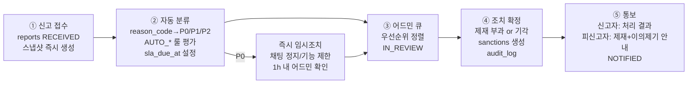

# A5 · 안전/신뢰 정책 (Trust & Safety Policy)

> 덕메이트(DuckMate) 안전/신뢰 정책 확정본. 절대 규칙 §0-2(성인 전용), §0-3(안전 > 성장)을 구현 가능한 수준으로 구체화한다. 본 문서의 enum·숫자 기준은 D1(스키마), D2(인증), D4(채팅), D5(모더레이션), D8(어드민)이 그대로 구현한다.

---

## 다음 에이전트에게 넘기는 결정사항

### → D1 (DB 스키마)
- `profiles.verify_level`: `smallint` CHECK 0~3. 기본값 0. 레벨 정의는 §1 표 그대로.
- `profiles.birth_year`가 아니라 **`birth_date date NOT NULL`로 변경 권고** — 만 19세 계산은 "한국 나이"가 아닌 **만 나이 기준, `birth_date <= (current_date - interval '19 years')`** 로 판정한다. birth_year만으로는 생일 미도래자를 걸러낼 수 없음. (본인인증 후 PASS가 주는 생년월일로 덮어쓰고 이후 수정 불가.)
- `reports.reason_code`: `text` + CHECK enum. 값 목록은 §2 택소노미의 세부 코드 18개 전부 (예: `HARASS_SEXUAL`, `SCAM_ROMANCE`, `FAKE_PROFILE`, ...). 상위 카테고리 컬럼은 두지 않고 코드 prefix로 유도한다.
- `reports.status`: `received → auto_triaged → in_review → actioned → dismissed → notified` (enum: `RECEIVED`, `AUTO_TRIAGED`, `IN_REVIEW`, `ACTIONED`, `DISMISSED`, `NOTIFIED`).
- `reports.priority`: `P0`/`P1`/`P2` (§6 자동 분류 결과 저장), `reports.sla_due_at timestamptz` (접수 +24h, P0는 +1h).
- `reports.evidence`: jsonb 스냅샷. 구조는 §4.2. **신고 시점 기준 직전 72시간 + 최대 200개 메시지**를 서버(service role)가 복사.
- `sanctions.level`: `smallint` 1~5 (§3 표: 1=경고, 2=기능제한 72h, 3=정지 7일, 4=정지 30일, 5=영구정지). `sanctions.status`(`ACTIVE`/`EXPIRED`/`REVOKED`), `sanctions.report_id` FK, `sanctions.appeal_status`(`NONE`/`PENDING`/`ACCEPTED`/`REJECTED`) 추가.
- 추가 테이블 3개: `report_rate_limits`(무고성 신고 방지용은 뷰로 대체 가능), **`moderation_flags`**(자동 탐지 히트 로그: id, match_id, message_id, rule_code, action, created_at), **`appeals`**(id, sanction_id, profile_id, body, status, decided_by, decided_at, decided_reason).
- `messages`에 `masked_body`는 스펙대로 유지 + **`mask_rules jsonb`**(어떤 룰이 어느 구간을 마스킹했는지 offset 기록) 추가 — 어드민 원문 대조용.
- 보존 기간(§4.3): 신고된 대화 스냅샷 **분쟁 종결 후 1년**, 일반 메시지는 탈퇴 후 지체 없이 파기하되 매칭 상대 화면 사본은 상대 탈퇴 시까지. `audit_logs` 3년.
- RLS: `reports`/`sanctions`/`moderation_flags`/`appeals`/`audit_logs`는 **service role 전용**(본인은 자기 신고의 status만 조회 가능한 뷰 제공). evidence 스냅샷은 어떤 클라이언트에서도 SELECT 불가.

### → D2 (Auth/인증)
- 레벨 승급 조건·강등 조건은 §1.2. **레벨은 단조 증가가 아님**: 사진 재검수 반려 시 3→2 강등, 제재 시 기능 정지가 레벨보다 우선.
- 연령 차단 3중 게이트(§1.3): (a) 가입 시 생년월일 자기신고, (b) 레벨 2 본인인증에서 PASS 생년월일로 검증 — 불일치·미달 시 **즉시 계정 정지 + 데이터 파기 큐**, (c) 레벨 0~1 상태에서는 프로필 비공개이므로 미성년자가 통과해도 노출 면적 0.

### → D4 (채팅)
- 연락처 마스킹 정규식·해제 조건은 §5.3 그대로 (전화번호/카톡ID/이메일/외부링크 4종). **매칭 성립 `matches.matched_at` + 72시간 경과 && 양측 verify_level ≥ 2** 일 때만 전화번호·카톡ID 마스킹 해제. 이메일·단축URL·송금링크는 **영구 마스킹**.
- 마스킹은 서버측(Edge Function insert 훅)에서 `masked_body` 생성. 원문 `body`는 저장하되 클라이언트 RLS는 `masked_body`만 노출.
- 금칙어/패턴 히트 시 조치 단계는 §5.2 (LOG → MASK → WARN → QUEUE → BLOCK_SEND).
- 이미지 전송은 **양측 verify_level ≥ 2** (스펙 §3 D4 명세와 일치).

### → D5 (모더레이션)
- 자동 제재 룰(§3.2): **서로 다른 신고자 3인**이 30일 내 동일 대상 신고(수리 기준 충족) 시 자동 `sanctions.level=2`(기능제한 72h) + 어드민 큐 P1. `SAFETY_MINOR`·`SCAM_*`·`HARASS_SEXUAL_MINOR급` P0 신고는 1건으로도 즉시 임시조치.
- SLA(§6): 전체 신고 **접수→1차 조치 통보 24h 이내**, P0는 1h 이내 임시조치. `sla_due_at` 초과 시 어드민에게 에스컬레이션 알림.
- 이의제기(§3.3): 통보 후 30일 내 1회, 처리 기한 7일, 처리 중 제재 유지(집행정지 없음). 영구정지 인용 시 복구 + 제재 이력 `REVOKED`.

---

## 1. 인증 단계별 권한 체계

### 1.1 verify_level 정의

| 레벨 | 명칭 | 승급 조건 | 시스템상 의미 |
|---|---|---|---|
| **0** | 가입 | 이메일 가입 + 생년월일 자기신고(만 19세 이상 체크) + 약관 동의 | 계정만 존재. 온보딩(취미 선택, 퀴즈, 덕질카드 작성)까지만 가능. 타인에게 일절 노출되지 않음 |
| **1** | 휴대폰 인증 | 국내 휴대폰 번호 SMS OTP 인증 (번호당 계정 1개, VoIP/알뜰 선불 차단은 어댑터 옵션) | 탐색(둘러보기)과 좋아요 가능. 여전히 "미인증" 뱃지, 프로필은 인증 회원에게만 요약 노출 |
| **2** | 본인인증 완료 | 포트원(PASS/다날) 본인인증 → CI/DI 확보, **생년월일·만 19세 재검증**, CI 중복 시 기존 계정 안내(1인 1계정) | 정식 회원. 매칭·채팅·이미지 전송·데이팅 모드 진입 가능 |
| **3** | 사진 검수 완료 | 프로필 사진 ≥ 1장 검수 승인(얼굴 존재, 도용·AI 생성 의심 없음) + 필요 시 제스처 셀피 대조 | "인증 뱃지" 표시, 이벤트 호스팅 가능, 추천 큐 우선 노출 가중치 |

강등 규칙: 사진 전체가 반려/삭제되면 3→2. 휴대폰 번호 해지 확인 시 재인증 요구(기능은 유지하되 30일 유예). 본인인증(레벨 2)은 강등 없음 — 단 CI 분쟁(명의도용 신고) 시 계정 잠금.

### 1.2 레벨별 허용 기능 매트릭스

| 기능 | Lv 0 | Lv 1 | Lv 2 | Lv 3 |
|---|:---:|:---:|:---:|:---:|
| 온보딩(취미/퀴즈/덕질카드 작성) | O | O | O | O |
| 프로필 공개(타인에게 노출) | X | △ 요약만, "미인증" 표시 | O | O + 인증 뱃지 |
| 탐색(추천 카드 열람) | X | O | O | O |
| 좋아요 보내기 | X | O (일 3회 제한) | O | O |
| 매칭 성립 | X | X | O | O |
| 채팅(텍스트) | X | X | O | O |
| 이미지 전송 | X | X | O (양측 Lv≥2) | O |
| 데이팅 모드 전환 | X | X | O | O |
| 취미 친구 모드 | X | O | O | O |
| 이벤트 RSVP | X | X | O | O |
| 이벤트 호스팅 | X | X | X | O |
| 결제/구독 | X | X | O | O |

원칙: **미인증 유저 간 DM 불가**(스펙 §1)를 매칭 성립 조건에 내장 — `likes`는 Lv1부터 가능하지만 `matches` 행 생성은 양측 Lv≥2일 때만. 한쪽이 Lv1이면 "상대가 본인인증을 완료하면 매칭됩니다" 대기 상태.

### 1.3 만 19세 미만 완전 차단 지점 (3중 게이트)

1. **가입 게이트(Lv0)**: 생년월일 입력 → 만 나이 계산(`birth_date <= current_date - 19 years`) → 미달 시 가입 자체 거부, 입력값 저장하지 않음.
2. **본인인증 게이트(Lv2)**: PASS가 반환한 생년월일이 진실의 원천. (a) 만 19세 미만 → **즉시 status=banned + 개인정보 파기 큐 등록 + audit_log**, (b) 자기신고 생년월일과 불일치 → PASS 값으로 덮어쓰고 계속(만 19세 이상인 경우).
3. **런타임 게이트**: 프로필 노출·매칭·채팅·결제의 모든 RLS/서버 로직에 `verify_level >= 2` 조건이 걸려 있으므로, 1번 게이트를 속여 통과한 미성년자도 타인 접촉 면적이 0. 채팅 중 미성년자 의심 신고(`SAFETY_MINOR`)는 P0 — 1시간 내 계정 잠금.

---

## 2. 신고 사유 택소노미 (reason_code)

`reports.reason_code` enum. prefix가 카테고리를 겸한다. UI에서는 카테고리 선택 → 세부 선택 2단.

| 카테고리 | reason_code | 설명 | 기본 우선순위 |
|---|---|---|:---:|
| 성희롱/성적 침해 | `HARASS_SEXUAL` | 성적 발언, 원치 않는 성적 접근, 성적 이미지 요구 | P1 |
| | `HARASS_SEXUAL_IMAGE` | 음란 이미지 전송 | P0 |
| 괴롭힘 | `HARASS_VERBAL` | 욕설, 모욕, 비하 | P2 |
| | `HARASS_STALKING` | 집요한 재접촉, 오프라인 미행·따라오기 언급 | P0 |
| | `HARASS_THREAT` | 협박, 폭력 예고, 신상 유포 협박 | P0 |
| 사기 | `SCAM_ROMANCE` | 로맨스 스캠(친밀감 형성 후 금전 요구) | P0 |
| | `SCAM_MONEY` | 금전 요구·대출·투자(코인/주식 리딩) 권유 | P0 |
| | `SCAM_EXTERNAL_LINK` | 피싱·외부 사이트 유도 | P1 |
| 프로필 위조 | `FAKE_PROFILE` | 타인 사진 도용, AI 생성 사진, 신원 사칭 | P1 |
| | `FAKE_INFO` | 나이·성별 등 핵심 정보 허위 | P1 |
| 상업 행위 | `SPAM_AD` | 광고, 홍보, 타 서비스 유도 | P2 |
| | `SPAM_PROSTITUTION` | 성매매 제안·조건만남 | P0 |
| 미성년 관련 | `SAFETY_MINOR` | 미성년자 의심 | P0 |
| 오프라인 위해 | `SAFETY_OFFLINE` | 만남에서의 위협·폭력·범죄 (수사기관 안내 병행) | P0 |
| 부적절 콘텐츠 | `CONTENT_HATE` | 혐오 발언(성별·지역·장애·인종 등) | P1 |
| | `CONTENT_ILLEGAL` | 불법 촬영물, 마약 등 불법 정보 | P0 |
| | `CONTENT_SELF_HARM` | 자해·자살 암시 (제재 아닌 보호 프로토콜: 상담 리소스 안내) | P0 |
| 기타 | `OTHER` | 상기 외 (detail 필수 입력) | P2 |

운영 규칙:
- 신고는 매칭 상대·프로필 열람 화면에서 가능. `match_id` 있으면 대화 스냅샷 자동 첨부(§4).
- 무고성 신고 방지: 동일 신고자→동일 대상 중복 신고는 병합, 신고 남용(30일 내 기각 5건)은 신고 기능 30일 제한.
- `CONTENT_SELF_HARM`은 제재 파이프라인이 아닌 보호 파이프라인(자살예방상담 109 안내 배너)으로 분기.

---

## 3. 제재 등급 체계

### 3.1 sanctions.level

| level | 명칭 | 내용 | 기간 | 적용 예 |
|:---:|---|---|---|---|
| 1 | 경고 | 알림 통보 + 커뮤니티 가이드라인 재동의 요구. 기능 제한 없음 | 기록 1년 유지 | 경미한 욕설 1회, 마스킹 우회 시도 |
| 2 | 기능 제한 | 신규 좋아요·매칭·채팅 발신 정지 (기존 대화 열람은 가능) | 72시간 | 자동 제재(3인 신고), 반복 경고 |
| 3 | 일시 정지 | 로그인 시 정지 안내만 표시, 프로필 비노출 | 7일 | 성희롱, 프로필 위조 확인 |
| 4 | 장기 정지 | 동일 | 30일 | 재범, 스팸·상업 행위 반복 |
| 5 | 영구 정지 | status=banned, **CI 해시 블랙리스트 등록**(재가입 차단), 휴대폰 번호 해시 블랙리스트 | 영구 | 스캠, 성매매, 미성년, 불법 콘텐츠, 오프라인 위해 |

- 즉시 영구정지(레벨 5 직행) 사유: `SCAM_*` 확인, `SPAM_PROSTITUTION`, `SAFETY_MINOR`(본인이 미성년), `CONTENT_ILLEGAL`, `SAFETY_OFFLINE` 확인.
- 누진: 1년 내 동일 카테고리 재위반 시 한 단계 상향. 레벨 3 이상 제재 2회 → 다음 위반은 레벨 5.
- 제재 중 결제: 정지 기간만큼 구독 이용기간 보상하지 않음(영구정지 시 미사용분 환불정책 §은 A4/B2 환불정책 따름).

### 3.2 자동 제재 룰 (사람 개입 전 임시조치)

| 룰 ID | 조건 | 자동 조치 |
|---|---|---|
| `AUTO_3REPORTS` | **서로 다른 신고자 3인**이 30일 내 동일 대상 신고(기각 이력 병합 제외) | level 2 (기능 제한 72h) + 어드민 큐 P1 |
| `AUTO_P0_FREEZE` | P0 신고 1건 접수 | 즉시 해당 매칭 채팅 발신 정지(대상자만) + 큐 P0 |
| `AUTO_PATTERN_SCAM` | §5 스캠 패턴 룰 히트 3회/24h | level 2 + 큐 P0 |
| `AUTO_MASS_LIKE` | 좋아요 발신 속도 이상(신규 계정이 1시간 내 상한 도달 반복) | 좋아요 24h 제한 (제재 기록 없음, rate limit) |

자동 조치는 반드시 어드민 큐에 들어가 24h 내 사람이 확정/해제한다. 자동 조치가 사람 확인 없이 레벨 3 이상으로 올라가는 일은 없다.

### 3.3 이의제기 절차

1. 제재 통보(§6-⑤)에 이의제기 버튼 포함. **통보 후 30일 이내, 제재 건당 1회.**
2. `appeals` 테이블에 접수 → 어드민 큐 별도 탭. **처리 기한 7일.** 처리 중 제재는 유지(집행정지 없음).
3. 결과: `ACCEPTED`(제재 REVOKED + 이력 삭제 표시 + 정지 기간만큼 구독 보상) / `REJECTED`(사유 통보).
4. 처리자는 원 제재 처리자와 **다른 어드민**이어야 함(4-eyes). audit_log 필수.

---

## 4. 증거 보존

### 4.1 원칙
- 목적 제한: 스냅샷은 신고 처리·이의제기·법적 대응에만 사용. 클라이언트 노출 절대 불가(service role 전용).
- 최소 수집: 신고와 무관한 제3자 대화는 스냅샷에 포함하지 않는다(해당 match_id의 두 당사자 대화만).
- 신고 접수 즉시 스냅샷 — 가해자가 메시지를 삭제·탈퇴해도 증거가 남도록 **탈퇴/삭제 이전에 복사**한다.

### 4.2 스냅샷 범위 (`reports.evidence` jsonb)

```jsonc
{
  "snapshot_at": "...",              // 서버 생성 시각
  "match_id": "...",
  "window": { "from": "...", "to": "..." },  // 신고 시점 기준 직전 72시간
  "messages": [                       // 최대 200개, 초과 시 최신 우선
    { "id", "sender_id", "body",      // 원문 (masked 아님)
      "image_path", "created_at", "read_at" }
  ],
  "images_copied": ["evidence/{report_id}/..."], // 이미지 원본을 증거 버킷으로 복사
  "reported_profile": { "nickname", "bio", "photos": [...] }, // 프로필 신고 시
  "flags": [ /* 해당 구간의 moderation_flags 히트 */ ]
}
```

이미지: `evidence/` 전용 비공개 Storage 버킷으로 **복사본** 저장(원본 삭제와 무관하게 유지).

### 4.3 보존 기간

| 대상 | 기간 | 근거/비고 |
|---|---|---|
| 신고 evidence 스냅샷 | **분쟁 종결(조치 확정 또는 이의제기 종결) 후 1년** | 재신고·법적 분쟁 대비, 이후 자동 파기 |
| 영구정지 계정의 CI·휴대폰 해시 | 영구 (해시만, 원문 없이) | 재가입 차단 목적 |
| 일반 메시지(신고 없음) | 계정 존속 중 보관, 탈퇴 시 본인 발신분 지체 없이 파기 | 상대방 화면 사본은 상대 탈퇴 시까지 |
| audit_logs | 3년 | 통신비밀보호법상 로그 보존 관행 + 내부 감사 |
| 접속 로그(IP 등) | 3개월 | 통신사실확인자료 관행 |

### 4.4 법적 요청 대응
- 수사기관 요청은 **적법한 절차(영장, 통신비밀보호법·형사소송법상 요청서)** 확인 후에만 제공. 임의 요청에는 가입 여부 포함 불응.
- 제공 시 제공 사실·범위를 audit_log에 기록하고, 법령상 금지되지 않는 한 기간 경과 후 당사자 통지.
- 피해자 본인이 소송 목적으로 자기 대화 사본을 요청하면 **본인 수신/발신분에 한해** 제공(상대 개인정보 마스킹).
- 담당: 개인정보보호책임자(B1 지정)가 창구 단일화. 대응 기한 내부 기준 7일.

---

## 5. 성희롱/로맨스 스캠 탐지 룰

### 5.1 패턴 카테고리

| rule_code | 카테고리 | 예시 신호 |
|---|---|---|
| `PAT_CONTACT_EARLY` | 연락처 조기 교환 | 매칭 72h 내 전화번호/카톡ID/라인ID 패턴 |
| `PAT_MONEY` | 금전 요구 | "돈 보내", "송금", "계좌번호", "급전", "빌려줘", 계좌번호 패턴, 토스/카카오페이 송금 링크 |
| `PAT_INVEST` | 투자 권유 | "코인", "리딩방", "수익률", "재테크 정보", "선물거래" + 외부 링크 동반 |
| `PAT_EXTERNAL_LINK` | 외부 링크 | URL 전반, 특히 단축 URL(bit.ly 등)·오픈채팅 링크 |
| `PAT_SEXUAL` | 성적 발언 | 성적 금칙어 사전(운영 DB에서 관리, 코드 하드코딩 금지) + "조건", "만남비" 등 성매매 은어 |
| `PAT_OFFPLATFORM_PUSH` | 플랫폼 이탈 유도 | "여기 말고 ~에서 얘기하자" + 메신저명, 매칭 24h 내 반복 |
| `PAT_SCRIPT_DUP` | 스크립트 복붙 | 동일 발신자가 서로 다른 매칭 3곳 이상에 동일/유사 메시지(해시 비교) |

### 5.2 탐지 시 조치 단계 (rule_code별 기본 액션)

| 단계 | 액션 | 적용 |
|:---:|---|---|
| 1 | `LOG` — moderation_flags 기록만 | 저신뢰 히트 |
| 2 | `MASK` — masked_body에서 해당 구간 `●●●` 치환 + "연락처/링크는 매칭 3일 후 열려요" 안내 | `PAT_CONTACT_EARLY`, `PAT_EXTERNAL_LINK` |
| 3 | `WARN` — 발신자에게 경고 배너, **수신자에게 안전 안내 카드**("금전 요구는 스캠 신호입니다. 신고하기") | `PAT_MONEY` 1회, `PAT_INVEST` 1회, `PAT_SEXUAL` 1회 |
| 4 | `QUEUE` — 어드민 큐 이관(P0/P1) + 필요 시 AUTO_PATTERN_SCAM 자동 제재 | `PAT_MONEY`/`PAT_INVEST` 반복, `PAT_SCRIPT_DUP`, 성매매 은어 |
| 5 | `BLOCK_SEND` — 전송 자체 거부 | 계좌번호+금액 요구 결합 등 최고 신뢰 히트 |

수신자 보호 원칙: 마스킹·경고는 **가해 의심자에게는 탐지 로직을 노출하지 않는 문구**로(우회 학습 방지), 피해 가능자에게는 명시적 안전 카드로 표시한다.

### 5.3 연락처 마스킹 규칙 (정규식 수준)

적용 위치: 메시지 insert 시 서버(Edge Function)에서 `body` → `masked_body` 생성. 클라이언트는 항상 `masked_body`를 렌더.

해제 조건: **`now() >= matches.matched_at + interval '72 hours'` AND 양측 `verify_level >= 2`** 이면 `R1`(전화번호)·`R2`(카톡/라인 ID)는 마스킹하지 않음. `R3`(이메일)·`R4`(URL/송금링크)·`R5`(계좌번호)는 **기간 무관 상시 마스킹**(R4는 화이트리스트 도메인 제외 가능, 초기 화이트리스트는 빈 배열).

```txt
R1 전화번호 (변형 포함: 공백/하이픈/점/한글 숫자 삽입 우회)
  /0[17]\s*[-–.·]?\s*[0-9O공영일이삼사오육칠팔구]{1,2}(\s*[-–.·]?\s*[0-9O공영일이삼사오육칠팔구]){6,8}/giu
  + 우회 대응 전처리: "공일공", "영일영" → 숫자 치환 후 재검사

R2 메신저 ID
  /(카톡|카카오톡?|카까오|ㅋㅌ|kakao\s*(talk)?|라인|line|텔레(그램)?|telegram|인스타(그램)?|insta(gram)?|디엠|DM)\s*(아이디|ID|id|계정)?\s*[:：은는]?\s*@?[A-Za-z0-9._-]{3,30}/giu
  ※ 키워드+식별자 결합일 때만 마스킹 (키워드 단독 언급은 LOG만)

R3 이메일 (상시 마스킹)
  /[A-Za-z0-9._%+-]+\s*(@|＠|골뱅이)\s*[A-Za-z0-9.-]+\s*(\.|닷)\s*[A-Za-z]{2,}/giu

R4 URL/외부 링크 (상시 마스킹, 단축 URL·오픈채팅·송금 링크는 QUEUE 병행)
  /(https?:\/\/|www\.)[^\s]+|(open\.kakao\.com|bit\.ly|t\.me|toss\.me|qr\.kakaopay\.com)[^\s]*/gi

R5 계좌번호 (상시 마스킹 + 은행명 동반 시 PAT_MONEY 승급)
  /(\d[\d\- ]{9,16}\d)\s*(?:\(|\s)*(국민|신한|우리|하나|농협|카카오뱅크|케이뱅크|토스뱅크|기업|SC|씨티|새마을|우체국)/gu
```

마스킹 표기: 히트 구간을 `●●●●`로 치환하고 `mask_rules`에 `{rule, start, end}` 기록. 어드민/증거 스냅샷은 원문 열람.

---

## 6. 24시간 조치 SLA 파이프라인



| 단계 | 내용 | 시간 기준 |
|:---:|---|---|
| ① 접수 | reports 생성, evidence 스냅샷(§4.2) 동기 생성, 신고자에게 "접수됨 + 24h 내 처리" 즉시 안내 | 0h |
| ② 자동 분류 | reason_code 기본 우선순위(§2) + moderation_flags 이력 + 대상 제재 이력으로 P0/P1/P2 확정. AUTO_3REPORTS·AUTO_P0_FREEZE 평가 및 임시조치 실행 | 접수 즉시(동기) |
| ③ 어드민 큐 | D8 대시보드: P0 최상단, sla_due_at 카운트다운 표시. 초과 임박(–4h) 시 어드민 푸시 에스컬레이션 | P0: 1h 내 착수 |
| ④ 조치 | 제재 부과(§3.1) 또는 기각(DISMISSED, 사유 기록). 4-eyes: 레벨 5는 어드민 2인 승인 | **접수 +24h 내** |
| ⑤ 통보 | 신고자: 조치 여부(구체 제재 내용은 "조치 완료"로 요약 — 피신고자 개인정보 보호). 피신고자: 위반 조항·제재 내용·기간·이의제기 방법 | 조치 즉시 |

- SLA 측정: `handled_at - created_at` 의 P95 ≤ 24h를 D8 지표에 노출. P0 임시조치 ≤ 1h.
- 신고자 보호: 신고 사실은 피신고자에게 익명(누가 신고했는지 비노출). 신고 직후 해당 상대 자동 숨김 + 차단 원클릭 제안.
- 어드민 부재 시간대(야간) P0: 자동 임시조치가 커버하고, 사람 확정은 익일 오전까지 — 그래도 24h SLA 내.

---

## 부록: 안전 UX 필수 삽입 지점 (E그룹 참고)

- 매칭 성립 시 첫 화면에 안전 안내 1줄("금전 요구·외부 링크 유도는 신고해 주세요").
- 첫 오프라인 만남 제안 카드에는 공공장소 권장 문구 자동 포함.
- 모든 채팅방 상단 메뉴에 신고/차단 2탭 상시 노출(3뎁스 금지 — 다크패턴 금지 목록과 동일 원칙).
- 차단 시 상대에게 통지하지 않음. 차단은 양방향 비노출(RLS `blocks` 원칙과 일치).
