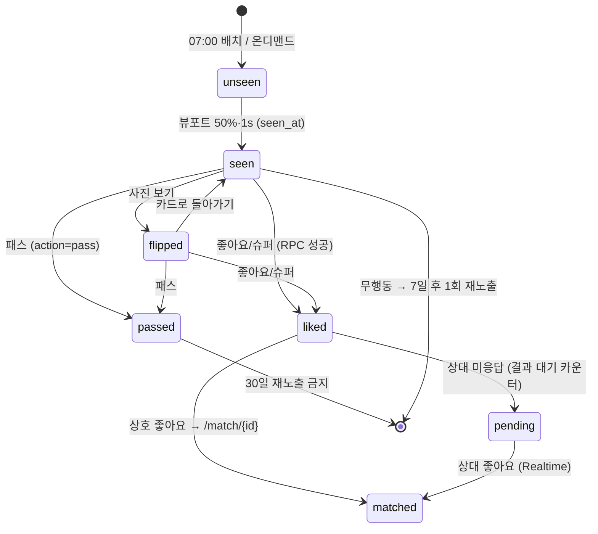
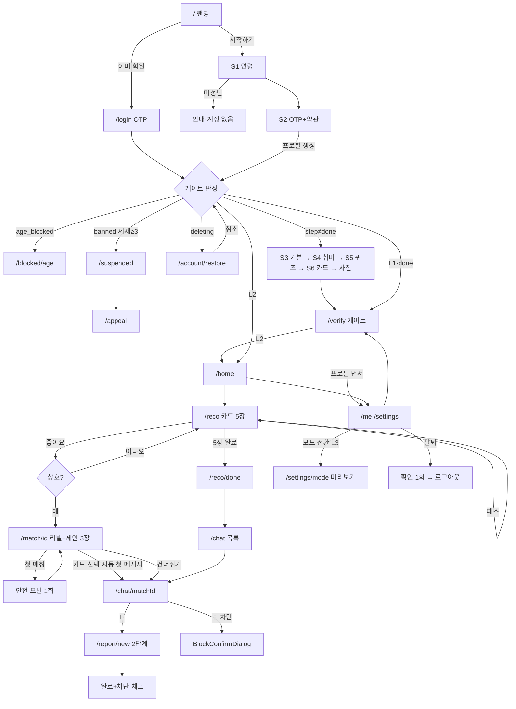

# 12 — 화면 플로우 / 라우트 / 상태 설계 (C3)

> 입력: `00_brief.md`, `06_PRD.md`(단일 기준, 특히 §0-49~53·§4·§6.1·부록 A), `02_persona.md`(온보딩 퍼널), `03_core_loop.md`(Phase 1 루프·제안 카드·이벤트), `05_trust_safety.md`(인증 게이트·신고/차단 UX·안전 문구).
> 이 문서는 **E1~E5가 라우트·상태·컴포넌트를 그대로 구현**하기 위한 화면 설계다. 코드 없음. 와이어프레임은 모바일 375px 기준 텍스트 박스이며 시각 스타일(색·타이포)은 C1/C2 산출물을 따른다. PRD와 충돌하면 PRD가 우선하고, 본 문서가 PRD를 **구체화**한 항목은 "C3 확정"으로 표시했다.

## 다음 에이전트에게 넘기는 결정사항

### 라우트 트리 (E1~E5 공통)
1. **라우트 그룹 4개 고정**: `(public)` 랜딩·법적·로그인 / `(onboarding)` 온보딩 7라우트 + `/verify` / `(app)` 홈·추천·매칭·채팅·프로필·설정·신고·제재 / `(admin)`. `apps/web/app/` 바로 아래에 이 4개 폴더만 두고, 각 그룹의 `layout.tsx`가 접근 게이트와 `metadata.robots`를 소유한다.
2. **PRD 부록 A 라우트에 C3가 추가한 라우트**: `/login`(재방문 OTP, `(public)`), `/onboarding/photos`(PRD S6를 카드/사진 두 라우트로 분리 — 진행률은 6/6 하나로 표기), `/settings`(설정 허브), `/settings/verify`(인증 센터), `/settings/subscription`(Phase 1 "준비 중"+티어 표), `/settings/data`(데이터 다운로드 안내), `/blocked/age`(연령 차단), `/account/restore`(탈퇴 유예 중 복구), `/offline`은 라우트가 아니라 오버레이. 그 외는 부록 A 그대로.
3. **접근 게이트 판정 순서(서버, `(app)`·`(onboarding)` layout 공통)**: ① 세션 없음 → `/login` ② `status='age_blocked'` → `/blocked/age` ③ `status='banned'` 또는 활성 `sanctions.level ≥ 3` → `/suspended` ④ `status='deleting'` → `/account/restore` ⑤ `onboarding_step != 'done'` → `/onboarding/{step}` ⑥ `verify_level < 2`이고 대상이 L2 라우트 → `/verify` ⑦ 통과. 클라이언트는 이 순서를 재구현하지 않고 서버 리다이렉트만 따른다.
4. **라우트별 인증 요구 레벨은 §1 표의 값이 유일한 소스**. `packages/db/src/permissions.ts`의 `ROUTE_MIN_LEVEL` 상수로 옮기고, `(app)/layout.tsx`가 `pathname`으로 조회한다. L2 라우트: `/home`, `/reco`, `/match/*`, `/chat/*`. L1 라우트(온보딩 완료 필요): `/me/*`, `/settings/*`, `/report/new`, `/appeal`.
5. **`/onboarding/phone`이 곧 로그인**이다. `/login`은 같은 `PhoneOtpScreen` 컴포넌트를 `mode='login'`으로 렌더한다. OTP 성공 후 `profiles` 행이 없고 생년월일 드래프트도 없으면 `/onboarding/age`로 보낸다(연령 확인은 계정 생성 전 필수).
6. **`noindex` 범위 = `(onboarding)`·`(app)`·`(admin)` 전부 + `/login`**. 각 그룹 `layout.tsx`에 `export const metadata = { robots: { index: false, follow: false } }`. `scripts/check-noindex.mjs`는 이 4곳 + `robots.txt` Disallow(`/onboarding`, `/verify`, `/home`, `/reco`, `/match`, `/chat`, `/me`, `/settings`, `/report`, `/appeal`, `/suspended`, `/blocked`, `/account`, `/admin`, `/login`)를 검사한다.
7. **매칭 화면은 모달이 아니라 풀스크린 라우트 `/match/[id]`**. 좋아요 RPC 응답 `{matched:true, match_id}` → `router.push`. 상대 쪽은 Realtime `matches` insert 수신 시 토스트 "새 매칭!"만 띄우고, 탭하면 같은 라우트로 이동(푸시 딥링크도 동일 경로).
8. **신고는 풀스크린 라우트 `/report/new?target=&match=&surface=`**, 차단은 라우트 없이 `BlockConfirmDialog` 모달. 신고 완료 화면 안에서 차단을 같이 처리한다(별도 이동 없음).

### 온보딩 상태 (E1 + D1 요청)
9. **D1 요청: `profiles.onboarding_step` 컬럼 추가** — enum `onboarding_step`: `basic | hobbies | quiz | card | photos | verify | done`. 값은 "다음에 보여줄 화면". OTP 성공 직후 기본값 `basic`. `age`·`phone`은 계정 생성 전이라 enum에 없다. 함께 `profiles.onboarding_started_at`(퍼널 소요 시간 계측용) 추가.
10. **서버 저장 시점 = "다음" 버튼**. 예외: 퀴즈는 답변마다 `quiz_answers` upsert(PRD S5), 사진은 업로드 즉시 `photos` insert. 뒤로가기는 서버 저장 없이 로컬 드래프트(Zustand `onboardingDraft`)만 유지한다.
11. **재진입 복귀 지점 = `onboarding_step`이 가리키는 화면**. 이미 저장된 화면들은 뒤로가기로 재방문 가능(값 프리필), `age`·`phone`은 재방문 불가. 온보딩 완료 후 `/onboarding/*` 접근은 `/home`으로 리다이렉트.
12. **"나중에"는 퀴즈·사진 두 화면에만 존재**. 탭 시 `onboarding_step`을 다음 값으로 전진시키고 `onboarding_step_skipped` 기록. 나중에 완료하는 진입점: 퀴즈 → `/me/edit#quiz`, 사진 → `/me/photos`. 홈 상단 넛지 1줄이 이 두 곳으로 연결된다(주 1회 재표시).
13. **연령 확인은 로그인 전이므로 서버에 저장하지 않는다.** 생년월일은 `onboardingDraft.birthDate`(sessionStorage 영속)에만 두고, OTP 성공 시 `profiles.birth_date`와 함께 행을 생성한다. 서버는 이때 만 나이를 재계산해 미성년이면 `age_blocked` 처리.

### 전역 상태 (Zustand 슬라이스 — `apps/web/src/stores/`)
14. **원칙: 서버 데이터는 TanStack Query, Zustand는 세션·드래프트·UI 상태만.** Zustand에 추천 목록·메시지·프로필 본문을 복제하지 않는다.
15. 슬라이스 7개 고정: `session`(userId·verify_level·mode·status·onboarding_step·activeSanctionLevel; 서버 layout이 hydrate) / `onboardingDraft`(birthDate·basic·hobbies·card·photoQueue; birthDate만 sessionStorage) / `reco`(loopDate·currentIndex·flippedIds·optimisticActed) / `chat`(activeMatchId·realtimeStatus(`connected|polling`)·draftByMatch·safetyBannerShownMatchIds) / `ui`(toasts·modalStack·isOffline·reducedMotion) / `push`(permission·subscribed·bannerDismissedLoopDate) / `analytics`(sessionId·source·pushSlot; `track()`이 읽음).
16. **`session.verify_level`·`mode`·`status`는 클라이언트가 직접 바꾸지 않는다.** 서버 RPC 응답 후 `invalidateQueries(['me'])` → layout 재검증으로만 갱신(PRD §0-39 `recompute_verify_level` 단일 함수 원칙).
17. TanStack Query 키 규약: `['me']`, `['reco', loopDate]`, `['matches']`, `['messages', matchId]`, `['likesPending']`, `['photos']`, `['blocks']`, `['sanctions']`. Realtime 수신 시 해당 키 `setQueryData` 후 `invalidate`. Realtime 끊기면 `chat.realtimeStatus='polling'` + 5초 폴링(PRD §5.5).

### 서버 vs 클라이언트 컴포넌트 판정 원칙
18. `layout.tsx`·`page.tsx`는 **항상 서버 컴포넌트**: 세션 확인·게이트 리다이렉트·초기 데이터 fetch(서버 Supabase 클라이언트)·`metadata`. 화면 본체는 `*Screen.tsx`(클라이언트) 하나에 초기 데이터를 props로 넘긴다.
19. **클라이언트 컴포넌트 필수 조건**: 폼 입력, 버튼 액션(RPC 호출), Realtime 구독, Zustand 접근, canvas/애니메이션, `navigator.*`(share·serviceWorker·OTP). 이 조건이 없으면 서버 컴포넌트(법적 페이지 mdx, 랜딩, 설정 허브 목록, 티어 표).
20. **데이터 뮤테이션은 전부 Supabase RPC 또는 Server Action** 한 겹을 거친다. 클라이언트에서 테이블 직접 insert는 `quiz_answers`·`availability`·`profile_hobbies`(온보딩 자기 행)만 허용, 나머지(`likes`·`matches`·`messages`·`reports`·`blocks`·`profiles.mode`)는 RPC.
21. **서버 4xx 매핑 고정**: `403 NOT_VERIFIED` → `/verify` 이동 / `403 NOT_ENTITLED` → 인라인 사유 문구(버튼 비활성) / `403 SANCTIONED` → `session.activeSanctionLevel` 갱신 + 레벨별 화면 / `409 ALREADY_ACTED` → 무시 / `429` → 토스트 "잠시 후 다시 시도해 주세요". `packages/db/src/errors.ts`의 코드 enum을 그대로 쓴다.

### 화면 규칙 (C 그룹 확정 → E)
22. **카운트다운 타이머 없음**. 리셋 안내는 정적 텍스트 "내일 07:00에 새 추천 5명"(A3 "카운트다운 타이머 애니메이션 금지"). 07:00 경과 후 홈 재진입 시 `['reco', loopDate]` 키가 바뀌므로 자동 갱신.
23. **추천 카드 = 세로 스냅 스크롤 리스트(스택형 시각)**, 한 장이 뷰포트 대부분을 차지. 스와이프 제스처 없음, 액션은 버튼 3개(패스·좋아요·슈퍼라이크). 카드 뒤집기는 버튼 + 탭 둘 다(접근성).
24. **"나를 좋아한 사람" 섹션은 Phase 1 미렌더**(PRD §0-46 `PAYMENTS_ENABLED=false`). 설계는 §3.4에 두고 E4가 Phase 3에서 켠다. 자리 표시 컴포넌트도 만들지 않는다.
25. **매칭 리빌 컴포넌트 `MatchReveal`은 `variant: 'simple' | 'scratch'`** prop만 예약. Phase 1은 `simple`만 구현, `scratch`는 F2(Phase 2).
26. **채팅방에는 만료 규칙이 없다.** 종료 상태는 `matches.status`가 `blocked | left | paused`일 때뿐. "N일 내 대화 시작" 류 타이머·카피 금지.
27. **신고 사유 14개는 2단계 선택(카테고리 5 → 세부)**. 카테고리 매핑은 §7.2 표가 유일한 소스이며 `packages/db/src/report-categories.ts`로 옮긴다. `reason_code`·라벨은 A5 §3 그대로.
28. **제재 화면은 레벨별 4종**: 1 경고 모달(확인 필수, 다음 진입 시 1회) / 2 채팅 제한 배너(방 상단, 읽기 가능) / 3~5 `/suspended`(해제 시각 + 이의신청) / 6 `/suspended` 영구 버전(이의신청 7일 내). `session.activeSanctionLevel`로 분기.
29. **계정 삭제는 2탭**: 설정 > 계정 > [탈퇴하기] → 확인 시트 1회 → 즉시 로그아웃. 만류·할인 팝업 없음. 유예 7일 중 재로그인 시 `/account/restore`에서 [탈퇴 취소] 1탭.
30. **분석 이벤트 발화 지점은 §10.2 표가 소스**. 각 `*Screen.tsx` 마운트 시 뷰 이벤트 1회, 액션 이벤트는 RPC 성공 콜백에서만(낙관적 UI 시점 아님).

## 1. 전체 라우트 맵

접근 조건 표기: `비로그인` / `L1`(OTP 완료·온보딩 미완) / `L1+done`(온보딩 완료) / `L2` / `L3` / `mode=dating`. `noindex` O = `robots: index:false`.

| 경로 | 화면명 | 접근 조건 | noindex | 담당 | Phase |
|---|---|---|---|---|---|
| `/` | 랜딩 | 비로그인(로그인 시 `/home`) | X | E5 | 1 |
| `/login` | 재방문 OTP 로그인 | 비로그인 | O | E1 | 1 |
| `/legal/terms` `/legal/privacy` `/legal/location` `/legal/youth` `/legal/business` | 법적 문서 5종 | 누구나 | X | E5/B | 1 |
| `/onboarding/age` | S1 연령 확인 | 비로그인(드래프트) | O | E1 | 1 |
| `/onboarding/phone` | S2 휴대폰 OTP + 약관 동의 | 비로그인 | O | E1 | 1 |
| `/onboarding/basic` | S3 기본 정보·활동 시간대 | L1, step=basic↑ | O | E1 | 1 |
| `/onboarding/hobbies` | S4 취미 3~5개 | L1, step=hobbies↑ | O | E1 | 1 |
| `/onboarding/quiz` | S5 궁합 퀴즈 10문항 | L1, step=quiz↑ | O | E1 | 1 |
| `/onboarding/card` | S6-a 덕질 카드 | L1, step=card↑ | O | E1 | 1 |
| `/onboarding/photos` | S6-b 사진(선택) | L1, step=photos↑ | O | E1 | 1 |
| `/verify` | S7 본인인증 게이트 | L1+done, verify_level<2 | O | E1 | 1 |
| `/home` | 홈(오늘 탭) | L2 | O | E2 | 1 |
| `/reco` | 오늘의 추천 카드 | L2 | O | E2 | 1 |
| `/reco/done` | 오늘 루프 끝 | L2 | O | E2 | 1 |
| `/match/[id]` | 매칭 성공 + 제안 카드 | L2, 매칭 당사자 | O | E2 | 1 |
| `/chat` | 채팅 목록 | L2 | O | E3 | 1 |
| `/chat/[matchId]` | 대화방 | L2, 매칭 당사자 | O | E3 | 1 |
| `/profile/[id]` | 상대 프로필(추천·매칭 상대만) | L2 | O | E5 | 1 |
| `/me` | 내 프로필(덕질 카드 미리보기) | L1+done | O | E5 | 1 |
| `/me/edit` | 덕질 카드·취미·퀴즈·시간대·bio 편집 | L1+done | O | E5 | 1 |
| `/me/photos` | 사진 관리(검수 배지) | L1+done | O | E5 | 1 |
| `/settings` | 설정 허브 | L1+done | O | E5 | 1 |
| `/settings/mode` | 모드 전환(미리보기 필수) | L1+done(전환 확정은 L3) | O | E5 | 1 |
| `/settings/verify` | 인증 센터(L0~L3) | L1+done | O | E5 | 1 |
| `/settings/subscription` | 구독 관리("준비 중"+티어 표) | L1+done | O | E4 | 1(표) / 3(결제) |
| `/settings/notifications` | 알림 설정 | L1+done | O | E5 | 1 |
| `/settings/blocks` | 차단 목록 | L1+done | O | E5 | 1 |
| `/settings/data` | 데이터 다운로드 안내 | L1+done | O | E5 | 1(안내) / 4(자동) |
| `/settings/account` | 휴면·탈퇴 | L1+done | O | E5 | 1 |
| `/report/new` | 신고 2단계 | L1+done | O | E5 | 1 |
| `/appeal` | 이의신청 | 로그인 + 활성 제재 ≥3 | O | E5 | 1 |
| `/suspended` | 제재 중 화면 | 로그인 + 제재 ≥3 또는 banned | O | E5 | 1 |
| `/blocked/age` | 연령 차단 | status=age_blocked | O | E1 | 1 |
| `/account/restore` | 탈퇴 유예 복구 | status=deleting | O | E5 | 1 |
| `/admin/photos` `/admin/reports` `/admin/users` | 어드민 | `admin_users` 역할(없으면 404) | O | E6 | 1 |
| `/shop` `/likes-you` / `/play/*` `/events/*` `/ranking` / `/update-required` | 상점·나를 좋아한 사람 / 게임·이벤트·랭킹 / 강제 업데이트 | L2 / L2 / 앱 버전 미달 | O | E4 / F1~F3 / E5 | 3 / 2·5 / 4 |

하단 탭 바(`(app)` 전용, L2 이상에서만 렌더): **오늘**(`/home`) · **추천**(`/reco`) · **채팅**(`/chat`, 미읽음 배지) · **나**(`/me`). L1 상태(`/me`·`/settings`만 접근)에서는 탭 바 대신 상단 "본인인증하고 추천 받기" 고정 배너.

## 2. 온보딩 플로우 (E1)

공통 프레임: 상단 진행 바 6칸(S1~S6, `/onboarding/photos`는 6/6 유지) + 좌측 뒤로가기(S1·S2 제외) + 단계 카피. "탈락" 표현 금지. 각 화면 마운트 시 `duration_ms` 타이머 시작, 완료 시 `onboarding_step_completed{step, duration_ms}`.


### S1 연령 확인 — `/onboarding/age`
```
┌─────────────────────────────────────┐
│ ■□□□□□                        1/6   │
│                                     │
│  덕메이트는 성인만 이용해요.        │
│  안전한 만남을 위해 먼저 확인할게요.│
│                                     │
│  생년월일                           │
│  ┌──────┐ ┌────┐ ┌────┐             │
│  │ YYYY │ │ MM │ │ DD │  숫자 키패드│
│  └──────┘ └────┘ └────┘             │
│  ⓘ 생년월일은 프로필에 표시되지 않고 │
│    연령대(20대 초반)로만 보여요.     │
│                                     │
│  [ 계속하기 ]  (3필드 유효 시 활성)  │
│                                     │
│  이미 회원이에요 → /login           │
└─────────────────────────────────────┘
```
- 검증: 실존 날짜, 미래 불가, 만 나이 = 클라이언트 KST 계산(서버는 S2에서 재계산). 오류 문구: "날짜를 다시 확인해 주세요".
- 만 19세 미만: 같은 라우트 안에서 안내 상태로 전환 — "덕메이트는 만 19세 이상만 이용할 수 있어요." 버튼 없음(랜딩으로 가는 링크만). 계정·이벤트 기록 없음(비로그인).
- 저장: `onboardingDraft.birthDate`(sessionStorage). 뒤로가기 = 랜딩. 이벤트: `onboarding_step_completed{step:age_gate}`.

### S2 휴대폰 인증 + 약관 동의 — `/onboarding/phone`
```
┌─────────────────────────────────────┐
│ ‹  ■■□□□□                     2/6   │
│  휴대폰 번호로 시작해요             │
│  번호는 본인 확인용이며 프로필에    │
│  절대 표시되지 않아요.              │
│  ┌──────────────────────┐           │
│  │ 010-0000-0000        │ [코드 받기]│
│  └──────────────────────┘           │
│  ─── 코드 발송 후 ───               │
│  ┌─┬─┬─┬─┬─┬─┐  자동 입력 시도      │
│  │ │ │ │ │ │ │  재전송 (30초 후)     │
│  └─┴─┴─┴─┴─┴─┘                      │
│  ☐ 전체 동의                        │
│   ☐ [필수] 이용약관         보기 ›  │
│   ☐ [필수] 개인정보처리방침 보기 ›  │
│   ☐ [필수] 청소년보호정책   보기 ›  │
│  [ 인증하고 시작하기 ]              │
└─────────────────────────────────────┘
```
- 검증: 국내 번호(`01[016789]` 10~11자리), 코드 6자리. 오류: "코드가 맞지 않아요 (남은 시도 N회)" / "요청이 많아요. 1시간 후 다시 시도해 주세요"(429, 번호당 시간당 5회). 필수 3개 미체크 시 버튼 비활성 + "필수 약관에 동의해 주세요".
- 성공: 서버 `create_profile` RPC(`birth_date`, `consented_at`, `verify_level=1`, `mode='friend'`, `onboarding_step='basic'`). 서버가 미성년 판정 시 `age_blocked` + 로그아웃 → `/blocked/age`. 기존 회원이면 게이트 순서대로 리다이렉트.
- 이벤트: `onboarding_step_completed{step:phone}`. 이 화면 전에는 이름·사진을 절대 묻지 않는다.

### S3 기본 정보·활동 시간대 — `/onboarding/basic`
```
┌─────────────────────────────────────┐
│ ‹  ■■■□□□                     3/6   │
│  어떻게 불러드릴까요?               │
│  닉네임  ┌──────────────┐ 2~10자    │
│          │              │           │
│  성별    (여성)(남성)(선택 안 함)    │
│  지역    [ 시/도 ▾ ] [ 시/군/구 ▾ ] │
│          ⓘ 동 단위는 묻지 않아요     │
│  주로 활동하는 시간 (최소 1칸)       │
│       월 화 수 목 금 토 일           │
│  아침 □  □  □  □  □  □  □           │
│  오후 □  □  □  □  □  □  □           │
│  저녁 □  □  □  □  □  □  □           │
│  밤   □  □  □  □  □  □  □           │
│  빠른 선택: [평일 저녁] [주말 낮]    │
│  [ 다음 ]                           │
└─────────────────────────────────────┘
```
- 검증: 닉네임 2~10자, `BW_*`·`CT_*` 서버 검사 → 인라인 오류 "사용할 수 없는 닉네임이에요" / "연락처처럼 보이는 닉네임은 쓸 수 없어요"; 성별 필수(선택 안 함 허용, 데이팅 모드 전환 시 재확인); 지역 2단 필수; 시간대 ≥1칸.
- 저장: 다음 탭 시 `profiles`(nickname·gender·region_code) + `availability` 일괄 → `onboarding_step='hobbies'`. 뒤로가기: S2로는 못 감(뒤로가기 버튼 없음, 로그아웃은 설정에서).
- 이벤트: `onboarding_step_completed{step:basic}` + `{step:availability}` 두 건.

### S4 취미 선택 — `/onboarding/hobbies`
```
┌─────────────────────────────────────┐
│ ‹  ■■■■□□                     4/6   │
│  좋아하는 걸 3~5개 골라요           │
│  3개만 골라도 시작할 수 있어요.     │
│  ┌ 🔍 취미 검색 ───────────────┐    │
│  [공연·팬덤][보드게임][러닝·클라이밍]│
│  [애니·웹툰][게임][카페투어][독서]   │
│  [사진·전시] [더보기 ›]              │
│  ── 선택됨 (2/5) ── 순서 = Top3 ≡드래그│
│  1 ▣ 아이돌 ★4 거의 매일  최애: ○○ │
│  2 ▣ 리듬게임 ★2 가끔       + 최애 │
│  ┌ 칩 탭 시 인라인 시트 ─────────┐  │
│  │ 얼마나 빠져 있어요?           │  │
│  │ ○관심 있음 ○가끔 ○주 1회      │  │
│  │ ○거의 매일 ○이게 인생         │  │
│  │ 최애/작품 (선택, 30자) [     ]│  │
│  │ 아직 시작 안 했어도 괜찮아요  │  │
│  └───────────────────────────────┘  │
│  [ 다음 (2/3 이상이면 활성) ]        │
│  찾는 취미가 없어요 → 직접 추가 요청 │
└─────────────────────────────────────┘
```
- 검증: 3 ≤ 선택 ≤ 5(6번째 탭 시 토스트 "5개까지 고를 수 있어요"), intensity 필수(기본 2 "가끔"), fav_note 30자·`CT_*`/`BW_*` 서버 검사. 선택 순서 1~3 = rank(드래그 변경).
- 저장: 다음 탭 시 `profile_hobbies` 전체 교체 → `onboarding_step='quiz'`. 뒤로가기: 드래프트 유지, S3 값 프리필.
- "직접 추가 요청" = `inquiries` insert 시트(카테고리 `hobby_request`), 온보딩 진행에 영향 없음.
- 이벤트: `onboarding_step_completed{step:hobbies, hobby_count}`.

### S5 궁합 퀴즈 — `/onboarding/quiz`
```
┌─────────────────────────────────────┐
│ ‹  ■■■■■□                     5/6   │
│  궁합 퀴즈   ●●●○○○○○○○  3/10       │
│  3문항만 답해도 추천이 시작돼요.    │
│  나머지는 나중에 답하면 정확도가    │
│  올라가요.                          │
│                                     │
│  약속 전날, 나는                    │
│  ┌───────────────────────────────┐  │
│  │ 확인 연락을 꼭 한다           │  │
│  ├───────────────────────────────┤  │
│  │ 정해졌으면 안 해도 된다       │  │
│  └───────────────────────────────┘  │
│                                     │
│                 [ 나중에 할게요 ]   │
└─────────────────────────────────────┘
```
- 문항당 1탭 → 즉시 `quiz_answers` upsert → 다음 문항. 문항 ≤30자, 선택지 2~4. 이전 문항으로 뒤로가기 가능(답 변경 시 upsert).
- "나중에 할게요" 항상 노출. 탭 시 `onboarding_step='card'` + `onboarding_step_skipped{step:quiz, answered:n}`. 10문항 완료 시 `onboarding_step_completed{step:quiz}`.
- 재진입: 서버 답변 수 n → n+1 문항부터. 나중에 완료: `/me/edit#quiz`.

### S6-a 덕질 카드 — `/onboarding/card`
```
┌─────────────────────────────────────┐
│ ‹  ■■■■■■                     6/6   │
│  이 카드가 사진보다 먼저 보여요 —   │
│  나답게 써주세요.                   │
│  ┌─ 미리보기(실시간) ─────────────┐ │
│  │ 서윤 · 20대 후반 · 마포구      │ │
│  │ 🎤 아이돌 ★4  🎮 리듬게임 ★2   │ │
│  │ 📷 굿즈 촬영 ★3   [입문 환영]  │ │
│  │ 최애: ○○                       │ │
│  │ 요즘 빠진 것: 컴백 무대 정주행 │ │
│  └────────────────────────────────┘ │
│  최애 (rank1 fav_note 기본값)        │
│  ┌───────────────────────────────┐  │
│  요즘 빠진 것 (40자)                 │
│  ┌───────────────────────────────┐  │
│  예시: [○○ 정주행 중][새 암장 도장깨기]│
│  [ 다음 ]                           │
└─────────────────────────────────────┘
```
- 검증: `now_into` 1~40자 필수(예시 칩 탭으로 채움 가능), 최애 선택(비우면 카드에서 행 숨김). 두 필드 모두 `CT_*`/`BW_*` 서버 검사.
- 저장: 다음 탭 시 `profiles.now_into` + rank1 `fav_note` → `onboarding_step='photos'`. 이벤트 `onboarding_step_completed{step:card}`.

### S6-b 사진(선택) — `/onboarding/photos`
```
┌─────────────────────────────────────┐
│ ‹  ■■■■■■                     6/6   │
│  사진은 나중에 올려도 돼요.         │
│  지금은 덕질 카드만으로 추천을 받아요│
│  ┌─────┐ ┌─────┐ ┌─────┐            │
│  │  +  │ │  +  │ │  +  │  최대 6장  │
│  └─────┘ └─────┘ └─────┘            │
│  ┌ 업로드됨 ─────────────────────┐  │
│  │ [썸네일] 대표 · 검수 대기      │  │
│  │ "24시간 안에 확인해요"         │  │
│  └───────────────────────────────┘  │
│  ⓘ 대표 사진은 얼굴이 보이는 본인   │
│    사진만 승인돼요. 취미·캐릭터     │
│    사진은 보조 사진으로 올릴 수 있어요│
│  [ 완료 ]        [ 사진은 나중에 ]  │
└─────────────────────────────────────┘
```
- 업로드: 클라이언트 압축 → 서버 리사이즈·EXIF 제거 → `photos.review_status='pending'`. 10MB·MIME 검사 실패 시 "이 파일은 올릴 수 없어요 (JPG/PNG/WebP, 10MB 이하)". 첫 장이 자동 대표(변경 가능).
- 완료/나중에 모두 `onboarding_step='verify'`, `onboarding_completed{hobby_count, quiz_count, photo_count}` 기록. 나중에는 추가로 `onboarding_step_skipped{step:photos}`.

### S7 본인인증 게이트 — `/verify` (온보딩 밖, 별도 layout)
```
┌─────────────────────────────────────┐
│  본인인증 후 추천이 시작돼요        │
│  ┌─ 인증 단계 ────────────────────┐ │
│  │ ✓ 휴대폰 확인                  │ │
│  │ ● 본인인증 (지금 여기)         │ │
│  │ ○ 사진 인증 (데이팅 모드용)    │ │
│  └────────────────────────────────┘ │
│  인증 결과 중 이름은 저장하지 않고  │
│  생년월일·성별만 확인해요.          │
│  [ 인증하기 ]                       │
│  [ 프로필 먼저 다듬기 ] → /me/edit  │
│  ── 실패 시 ──                      │
│  "지금은 초대된 번호만 인증할 수    │
│   있어요." (프로덕션 mock)           │
└─────────────────────────────────────┘
```
- `verify_gate_viewed` 마운트 시. 인증 성공 → `verify_succeeded{provider, level_after:2}` → `invalidate(['me'])` → `/home`. 실패 → `verify_failed`. 인증 생년월일 미성년 → 서버 `banned` + 로그아웃 → `/suspended`(영구).
- 이 화면은 `(onboarding)` 그룹에 두되 진행 바 없음. L2 이상이 접근하면 `/home`으로.

## 3. 홈 / 탐색 (E2)

### 3.1 홈(오늘 탭) — `/home`
```
┌─────────────────────────────────────┐
│  오늘 · 9월 2일(화)         🔔 ⚙    │
│  ┌ 넛지(조건부, 닫기 가능) ───────┐ │
│  │ 퀴즈 7문항이 남았어요 → 답하기 │ │
│  └────────────────────────────────┘ │
│  ┌ 소프트 푸시 배너(하루 1회) ────┐ │
│  │ 새 추천이 오면 알려드릴까요?   │ │
│  │            [나중에] [알림 받기]│ │
│  └────────────────────────────────┘ │
│  ┌────────────────────────────────┐ │
│  │ 오늘의 추천  5명 남음          │ │
│  │ 07:00에 새로 갱신됐어요        │ │
│  │             [ 추천 보러 가기 ] │ │
│  └────────────────────────────────┘ │
│  결과 대기 3건 · 매칭 1건          │
│  ┌ 최근 채팅 (미읽음 2) ──────────┐ │
│  │ 민재  "토요일 아침 한강..." 12분│ │
│  └────────────────────────────────┘ │
│ [오늘] [추천] [채팅•2] [나]          │
└─────────────────────────────────────┘
```
- 마운트: `app_opened{source, push_slot}`(세션당 1회, `analytics.sessionId` 기준). 오늘 추천 없으면 온디맨드 RPC `ensure_daily_reco` 호출 후 렌더(스켈레톤 ≤2s).
- 넛지 우선순위(1개만): 사진 반려 안내 → 퀴즈 미완 → 사진 없음. 닫으면 `loop_date` 기준 7일 숨김.
- 소프트 푸시 배너: `push.permission==='default'` 이고 `bannerDismissedLoopDate != today`일 때. `push_permission_prompted{attempt_no}`.

### 3.2 추천 카드 — `/reco`
```
┌─────────────────────────────────────┐
│ ‹ 오늘의 추천  2/5      ●●○○○       │
│ ┌─ 카드 1면(덕질 카드) ───────────┐ │
│ │ 민재 · 30대 초반 · 성동구  ✓본인│ │
│ │ ─────────────────────────────── │ │
│ │ ★ 러닝 ★4        ← 겹침 강조    │ │
│ │ ★ 보드게임 ★4    ← 겹침 강조    │ │
│ │   카페투어 ★3                   │ │
│ │ 최애: 한강 야간 러닝            │ │
│ │ 요즘 빠진 것: 10k 준비 중       │ │
│ │ ─────────────────────────────── │ │
│ │ 궁합 78%                        │ │
│ │ 겹치는 취미 2개 · 주말 아침 같음│ │
│ │ 같은 구 · 활동 시간 3칸 겹침    │ │
│ │ 같이 할 수 있는 것: 주말 5k     │ │
│ │           [ 사진 보기 ⟲ ]       │ │
│ └─────────────────────────────────┘ │
│    ( ✕ 패스 )  ( ♥ 좋아요 )  ( ★ 1 )│
│ ┌ 다음 카드 상단 살짝 노출 ───────┐ │
└─────────────────────────────────────┘
```
- 카드 구성 고정 순서: 헤더(닉네임·연령대·구·인증 마크 L2/L3·"입문 환영" 배지) → 취미 Top3(겹침 강조·intensity 라벨) → 최애 → 요즘 빠진 것 → 궁합 %(`score` 반올림) → 추천 이유 2줄(`reasons` 상위 2개를 사람말로) → 활동 시간대 겹침·지역 → "같이 할 수 있는 것" 1줄 → [사진 보기]. 2면 = 사진 캐러셀(승인 사진, 없으면 기본 아바타) + [카드로 돌아가기].
- 뷰포트 50%·1초 → `seen_at` + `reco_card_seen{position, score_bucket}`. 뒤집기 → `reco_card_flipped`.
- 액션: 패스(확인창·스낵바 없음) / 좋아요 → RPC `send_like` → 카드에 "보냈어요" 상태 후 다음 카드로 스냅 / 슈퍼라이크 → 잔여 표시(주 1), 0이면 "이번 주 슈퍼라이크를 다 썼어요 · 월요일 07:00에 1개 충전"(구매 안내 없음). 낙관적 UI 후 실패 시 롤백 + 토스트.
- 후보 <5: 빈 카드 "이 지역/취미에 아직 사람이 적어요 · 내일 07:00 다시 추천해요"(재노출로 채우지 않음).
- 5장 모두 acted → `/reco/done`. 상대 프로필 전체 보기는 카드 헤더 탭 → `/profile/[id]`.

### 3.3 오늘 루프 끝 — `/reco/done`
```
┌─────────────────────────────────────┐
│                                     │
│        오늘 5명을 모두 봤어요       │
│                                     │
│   결과 대기 3건  ·  오늘 매칭 1건   │
│                                     │
│   내일 07:00에 새 추천 5명이 와요   │
│                                     │
│   [ 채팅으로 가기 ]                 │
│   [ 덕질 카드 다듬기 ]  ← 매칭 0건 시│
│                                     │
│   (알림 미허용 시) 새 추천 알림 받기│
└─────────────────────────────────────┘
```
- 이벤트: `daily_reco_exhausted{liked, passed, unseen}` + `daily_loop_completed{likes, matches, pending_results, duration_ms}`. 광고·타이머·스트릭 없음. 07:00 전 `/reco` 재진입 시 이 화면으로.

### 3.4 나를 좋아한 사람(블러) — Phase 3, `/likes-you` (E4)
Phase 1 미렌더. Phase 3: 홈 하단 "나를 좋아한 N명"(실제 수만, 0이면 섹션 없음) → 블러 카드 그리드(취미 겹침 개수만 노출) → 탭 시 상점 시트. 가짜 수·"누군가" 카피 금지.

### 3.5 추천 카드 상태도


## 4. 매칭 (E2/E3)

### 4.1 매칭 성공 — `/match/[id]`
```
┌─────────────────────────────────────┐
│                               닫기 ✕│
│         서로 좋아요!                │
│   ┌────────┐   ┌────────┐           │
│   │ 내 카드│ ⟷ │상대 카드│ 겹침 애니 │
│   │ 러닝 ★ │   │ 러닝 ★ │ (reduced- │
│   │보드게임★│  │보드게임★│  motion  │
│   └────────┘   └────────┘  시 생략) │
│   겹치는 취미: 러닝 · 보드게임      │
│  ─────────────────────────────────  │
│  이렇게 시작해 볼까요?  ◀ 1/3 ▶     │
│  ┌ 제안 카드 ──────────────────────┐│
│  │ 🏃 같이 뛰기        (offline)   ││
│  │ 성동구 근처 러닝 코스 추천해    ││
│  │ 주실 수 있어요? 주말에 같이     ││
│  │ 뛰어도 좋고요.                  ││
│  │        [ 이걸로 시작하기 ]      ││
│  └─────────────────────────────────┘│
│           건너뛰고 채팅하기         │
└─────────────────────────────────────┘
```
- 순서 고정: `MatchReveal(variant='simple')` 1.2초 → 제안 카드 3장 가로 스냅. `match_screen_viewed` → `suggestion_shown{template_ids, kinds}`.
- [이걸로 시작하기] → RPC `send_first_message(match_id, suggestion_id)` → 서버가 본문을 첫 메시지로 insert(sender=선택자) → `suggestion_selected{template_id, kind, position}` → `/chat/[matchId]`.
- [건너뛰고 채팅하기] → `suggestion_skipped` → `/chat/[matchId]` (방 상단에 제안 카드 3장 접힌 상태로 재노출, 첫 메시지 전송 전까지).
- 양쪽이 동시에 카드를 고르면 둘 다 전송된다(선착 제한 없음). 이미 첫 메시지가 있으면 이 화면의 카드는 "대화 보기"로 대체.
- **첫 매칭이면** 화면 진입 즉시 `SafetyModal`(A5 §10.1 문구 그대로, [확인했어요] 필수, `profiles`에 `safety_modal_seen_at` 저장 — D1 요청). 이후 매칭에는 미표시.
- 닫기 ✕ → `/chat` 목록(매칭은 유지). 스크래치 리빌은 `variant='scratch'` 슬롯만 예약(Phase 2 F2).

## 5. 채팅 (E3)

### 5.1 목록 — `/chat`
```
┌─────────────────────────────────────┐
│  채팅                               │
│  ┌ 새 매칭(첫 메시지 없음) ───────┐ │
│  │ ◯ 하은   ◯ 도현   → 탭 시 /match│ │
│  └────────────────────────────────┘ │
│  ● 민재 ✓사진  토요일 아침 한강 5k… │
│           12분 전                 2 │
│    서윤 ✓본인  [연락처 숨김] 보내드… │
│           어제                      │
│    (탈퇴한 사용자)  대화가 종료됐어요│
│           3일 전                    │
│  ── 빈 상태 ──                      │
│  아직 매칭이 없어요. 오늘의 추천에서│
│  좋아요를 보내 보세요. [추천 보기]  │
└─────────────────────────────────────┘
```
- 정렬: 마지막 메시지 시각 내림차순, 첫 메시지 없는 매칭은 상단 가로 행. 미읽음 = `read_at IS NULL AND sender != me` 카운트. 마지막 메시지는 `masked_body` 미리보기.
- **만료 규칙 없음**: 오래된 방을 숨기거나 "N일 남음"을 표시하지 않는다. `status='blocked'`인 방은 차단자 화면에서만 제거, 피차단자·`left`·`paused` 방은 종료 상태로 남는다.
- Realtime 구독: `messages` insert(내 매칭 전부) + `matches` insert/update. 연결 상태는 `chat.realtimeStatus`, polling 중이면 상단 얇은 바 "연결 중…".

### 5.2 대화방 — `/chat/[matchId]`
```
┌─────────────────────────────────────┐
│ ‹  민재 ✓사진인증          🚩  ⋮   │
│      ⋮ 메뉴: 프로필 보기 / 신고 / 차단│
│ ┌ 첫 진입 1회: 안전 수칙 3줄 ─────┐ │
│ │ · 연락처는 매칭 3일 후부터       │ │
│ │ · 돈 얘기는 신호예요, 신고하세요 │ │
│ │ · 차단해도 상대에게 알림 없음    │ │
│ └────────────────────────────────┘ │
│ ┌ 마스킹 안내 배너(조건부) ───────┐ │
│ │ 연락처·링크는 9월 5일 10:20부터  │ │
│ │ 보낼 수 있어요 (양쪽 사진인증 후)│ │
│ └────────────────────────────────┘ │
│  [제안 카드 3장 접힘 ▾] (첫 메시지 전)│
│         ┌──────────────────────┐    │
│         │ 주말에 같이 뛰어도… │ 나  │
│ ┌──────────────────────┐ ✓읽음(P3) │
│ │ 좋아요! 제 번호는     │           │
│ │ [연락처 숨김] 이에요  │ 민재      │
│ └──────────────────────┘           │
│ ┌ 스캠 배너(SC_MONEY hit 시) ─────┐ │
│ [📷] ┌───────────────────┐ [전송]   │
│  비활성 사유: "이미지는 매칭 24시간 │
│  후, 양쪽 사진인증부터 보낼 수 있어요"│
└─────────────────────────────────────┘
```
- 헤더: 닉네임·인증 마크·[🚩 신고](1탭 → `/report/new?target&match&surface=chat`)·[⋮](프로필 보기·차단). 
- 마스킹 표시: 수신 메시지는 항상 `masked_body`. 발신자 본인 화면에는 원문 + 인라인 안내(A5 §10.4). 배너 해제 시각 = `matched_at + 72h`(양쪽 L3 조건 미충족이면 "양쪽 사진인증 후"로 문구 교체). 같은 매칭 `CT_*` 3회 hit → 경고 배너 "연락처 공유 시도가 반복되면 자동으로 신고돼요".
- 이미지: 양쪽 L3 AND 24h 경과 시만 📷 활성. 수신 이미지는 블러 + [보기] 탭(세션 내 유지). 서버 `403 NOT_ENTITLED` → 버튼 비활성 + 사유.
- 오프라인 만남 키워드 → 인라인 배너(A5 §10.2, 매칭당 1회, `chat.safetyBannerShownMatchIds`) + [만남 안전 가이드 전체 보기] → 정적 `/safety-guide`(`(public)`, 인덱싱 O — E5 추가).
- 스냅샷 안내: 신고 진입 시 폼 상단에 "신고하면 최근 50개 메시지가 운영팀에 자동으로 전달돼요"(방 안에서는 상시 노출하지 않음).
- 읽음 처리: 방 포커스 시 `mark_read` RPC → `message_read{latency_min}`. 읽음 표시(✓)는 Phase 3 권한(F-078), Phase 1은 미표시.
- 상태별 화면: `matches.status='blocked'`(내가 피차단) / `left`(상대 탈퇴) / `paused`(상대 제재 5·휴면) → 입력창 대신 "대화가 종료되었습니다" 고정 바, 메시지 열람 가능, 헤더 신고 버튼 유지(증거 보존 목적). 내 `sanctions.level=2` → 상단 "채팅이 24시간 제한됐어요 · 사유: {카테고리} · 해제 {시각}" + 입력 비활성, 읽기 가능. 상대 `level=2`이면 표시 없음.

## 6. 프로필 / 설정 (E5)

### 6.1 내 프로필 — `/me`, 편집 — `/me/edit`
```
┌─────────────────────────────────────┐
│  나                            ⚙    │
│  ┌ 내 덕질 카드(상대가 보는 그대로)┐ │
│  │ 서윤 · 20대 후반 · 마포구 ✓본인│ │
│  │ … (§3.2와 동일 구성)           │ │
│  └────────────────────────────────┘ │
│  인증  ✓휴대폰 ✓본인인증 ○사진 → 인증 센터│
│  모드  취미 친구  → 전환             │
│  ─ 편집 ─                           │
│  덕질 카드 편집 ›   (취미·최애·요즘) │
│  사진 관리 ›        대기 1 · 승인 0   │
│  퀴즈 답하기 ›      7문항 남음        │
│  활동 시간대 ›                       │
│  소개(bio) ›        200자             │
└─────────────────────────────────────┘
```
- `/me/edit`는 섹션 앵커(`#card`·`#hobbies`·`#quiz`·`#availability`·`#bio`)를 가진 단일 스크롤 폼. 저장은 섹션별 [저장] 버튼(부분 저장). 닉네임 변경은 30일 1회("다음 변경 가능일: …").
- `/me/photos`: 6칸 그리드, 각 칸 배지 `대기 중(24시간 안에 확인해요)` / `승인` / `반려: {코드별 한국어 사유}` / `보류`. 대표 지정은 승인 사진만. 유일한 승인 대표 삭제 시 확인 시트 "삭제하면 사진인증(L3)이 해제되고 데이팅 모드가 꺼져요".

### 6.2 모드 전환 — `/settings/mode`
```
┌─────────────────────────────────────┐
│ ‹ 모드                              │
│  ○ 취미 친구 (현재)                 │
│  ● 데이팅   ✓본인인증 ✓사진 필요    │
│  ┌ 공개 범위 미리보기 (필수) ──────┐ │
│  │ 데이팅 모드 회원에게 이렇게 보여요│ │
│  │ [덕질 카드 1면] → [사진 2면]    │ │
│  │ 표시됨: 닉네임·연령대·구·취미·  │ │
│  │        최애·사진(승인분)         │ │
│  │ 표시 안 됨: 전화·생년월일·동     │ │
│  └────────────────────────────────┘ │
│  찾고 싶은 성별  (여성)(남성)(모두) │
│  ⓘ 전환해도 친구 모드 매칭·채팅은   │
│    그대로 유지돼요. 교차 추천은 없어요│
│  [ 데이팅 모드로 전환하기 ]         │
└─────────────────────────────────────┘
```
- L3 미만: 토글 비활성 + "본인인증 + 승인된 대표 사진 1장이 필요해요" + [인증 센터로]. 서버 `403 NOT_ENTITLED` 방어.
- 미리보기를 끝까지 스크롤해야 버튼 활성(`preview_viewed=true`). `seeking_gender` 필수. 성공 → `mode_changed{from,to,preview_viewed}`. 반대 방향(dating→friend)도 미리보기 1장(사진 노출 범위 축소 안내).

### 6.3 인증 센터 — `/settings/verify`
- 4단 진행: L0 가입 ✓ / L1 휴대폰 ✓ / L2 본인인증 (미완이면 [인증하기] → `/verify` 동일 컴포넌트) / L3 사진인증 (승인 대표 사진 필요 → `/me/photos`). 각 단에 "이 레벨로 할 수 있는 것" 한 줄(L2 추천·채팅, L3 데이팅·이미지). 휴대폰 변경 → L1 재검증 안내.

### 6.4 설정 허브 — `/settings`
```
┌─────────────────────────────────────┐
│ ‹ 설정                              │
│  모드 ›                 취미 친구    │
│  인증 센터 ›            L2 본인인증  │
│  구독 ›                 준비 중      │
│  알림 ›                              │
│  차단 관리 ›            2명          │
│  내 데이터 다운로드 ›                │
│  계정 (휴면·탈퇴) ›                  │
│  ─────────                          │
│  이용약관 · 개인정보처리방침 ·      │
│  위치정보 이용약관 · 청소년보호정책 │
│  · 사업자 정보                      │
│  이의신청 › (활성 제재 있을 때만)   │
│  로그아웃                           │
└─────────────────────────────────────┘
```
- `/settings/subscription`(Phase 1): 상단 "구독은 준비 중이에요" + 브리프 티어 표(무료/플러스/프로 8행) 읽기 전용, 결제 버튼·가격 실험·"곧 출시" 카운트다운 없음. E4가 Phase 3에 결제 CTA 추가.
- `/settings/notifications`: 푸시 수신 동의(브라우저 권한 상태 표시 + 재요청 버튼), 슬롯별 토글(아침 추천 07:30 / 저녁 알림 / 매칭·메시지 즉시), 야간(23:00~07:00) 보류는 고정 안내(끌 수 없음). 미허용 상태면 "인앱 배너로만 알려드려요".
- `/settings/blocks`: 닉네임·차단일·[해제] (확인 시트: "해제해도 종료된 대화는 돌아오지 않아요. 30일 뒤부터 다시 추천될 수 있어요"). 빈 상태: "차단한 사람이 없어요".
- `/settings/data`: Phase 1 = 항목 목록(A5 §11.2) + [문의로 요청하기] → `inquiries` 시트(category `data_export`) + "10일 이내 이메일로 보내드려요". Phase 4 자동 생성 버튼 자리.
- `/settings/account`: [휴면하기](확인 1회 → `status='paused'`, 추천·노출·푸시 중단·매칭 보존, 재로그인 시 즉시 해제 배너) / [탈퇴하기] → 시트 1회("7일 안에 다시 로그인하면 취소돼요. 신고 기록은 정책에 따라 보관돼요") → RPC `request_delete` → 로그아웃. `account_paused` / `account_delete_requested` 이벤트. `/account/restore`: [탈퇴 취소] 1탭 → `account_delete_canceled` → `/home`.

## 7. 신고 / 차단 (E5/D5)

### 7.1 진입점
| 위치 | 신고 | 차단 |
|---|---|---|
| 상대 프로필 `/profile/[id]` 상단 ⋮ | `/report/new?target=&surface=profile` | `BlockConfirmDialog` |
| 대화방 헤더 🚩 (1탭) | `/report/new?target=&match=&surface=chat` | 헤더 ⋮ → 차단 |
| 신고 완료 화면 | — | "차단도 할까요?" 기본 체크 |
| 스캠 배너 [신고하기] | 사유 `ROMANCE_SCAM` 프리셀렉트 | — |

### 7.2 사유 2단계 — 카테고리 → 세부 (`report-categories.ts` 소스)
| 카테고리(1단) | 세부 `reason_code`(2단, A5 라벨) |
|---|---|
| 안전이 위협돼요 | `ROMANCE_SCAM` 사기·로맨스 스캠 / `THREAT_VIOLENCE` 협박·폭력 / `STALKING` 스토킹·집착 / `MINOR_SUSPECT` 미성년 의심 |
| 성적·혐오 표현 | `SEXUAL_HARASSMENT` 성희롱·성적 발언 / `HATE_SPEECH` 혐오·차별 발언 / `INAPPROPRIATE_PHOTO` 부적절한 사진 |
| 프로필이 이상해요 | `IMPERSONATION` 사칭·타인 사진 / `FAKE_PROFILE` 허위 프로필 |
| 외부 유도·영업 | `OFF_PLATFORM_LURE` 외부 연락 유도 / `COMMERCIAL_SPAM` 영업·광고 / `PII_REQUEST` 개인정보 요구 |
| 기타 | `NO_SHOW` 노쇼·약속 불이행 / `OTHER` 기타 |

### 7.3 화면
```
[1단 카테고리]                       [2단 세부 + 상세]
┌───────────────────────────┐        ┌───────────────────────────┐
│ ✕ 신고하기          1/2   │        │ ‹ 신고하기          2/2   │
│ 어떤 문제인가요?          │        │ 안전이 위협돼요           │
│ ┌ 안전이 위협돼요       › │        │ ○ 사기·로맨스 스캠        │
│ ┌ 성적·혐오 표현       › │        │   금전 요구, 투자 권유…    │
│ ┌ 프로필이 이상해요     › │        │ ○ 협박·폭력               │
│ ┌ 외부 유도·영업       › │        │ ○ 스토킹·집착             │
│ ┌ 기타                 › │        │ ○ 미성년 의심             │
│                           │        │ 자세히 (선택, 500자)      │
│ ⓘ 신고하면 최근 50개     │        │ ┌───────────────────────┐ │
│   메시지·프로필이 자동으로│        │ ⓘ 증거는 자동으로 첨부돼요│
│   운영팀에 전달돼요.      │        │   따로 캡처하지 않아도 돼요│
│   신고자는 상대에게 알려  │        │ [ 신고 접수하기 ]          │
│   지지 않아요.            │        └───────────────────────────┘
└───────────────────────────┘
[완료]
┌───────────────────────────┐
│ 접수됐어요.               │
│ 24시간 안에 확인해요.     │
│ 처리 결과는 알림으로      │
│ 알려드려요.               │
│ ☑ 이 사람 차단도 할까요?  │
│   (차단은 상대에게 알려지지│
│    않고, 대화가 종료돼요) │
│ [ 완료 ]                  │
└───────────────────────────┘
```
- `OTHER`는 상세 필수(비어 있으면 "기타는 내용을 적어 주세요"). 제출 = `create_report` RPC 1회, 실패(스냅샷 실패 포함) 시 "접수하지 못했어요. 다시 시도해 주세요"(부분 저장 없음). 24h 내 같은 대상 재신고 → "이미 접수된 신고에 내용을 추가했어요".
- 성공 → `report_submitted{reason_code, surface}`. [완료] 시 체크 상태면 `block_user` RPC → `block_submitted` → 채팅 진입이면 `/chat`, 프로필이면 `/reco`.

### 7.4 차단 확인 모달 (`BlockConfirmDialog`)
```
┌───────────────────────────────┐
│ 민재 님을 차단할까요?         │
│ · 서로의 프로필·추천·채팅에   │
│   더 이상 보이지 않아요       │
│ · 진행 중인 매칭이 종료돼요   │
│ · 상대에게 알림이 가지 않아요 │
│ · 설정 > 차단 관리에서 해제할 │
│   수 있지만 대화는 복구되지   │
│   않아요                      │
│      [ 취소 ]   [ 차단하기 ]  │
└───────────────────────────────┘
```

## 8. 공용 상태

| 상태 | 표시 | 규칙 |
|---|---|---|
| 로딩 스켈레톤 | 카드형(추천·매칭·프로필)·리스트형(채팅·차단)·폼형(온보딩) 3종 `Skeleton*` | 300ms 이내 응답이면 미표시(깜빡임 방지), 2s 초과 시 "조금 오래 걸리네요" 텍스트 추가 |
| 빈 상태 | 추천 부족 / 매칭 0 / 채팅 0 / 차단 0 / 사진 0 | 각각 대체 행동 버튼 1개(§3·§5·§6 문구). 자책 카피·미검증 수치 금지 |
| 오프라인 | 상단 고정 바 "오프라인이에요. 연결되면 자동으로 이어져요" + 전송 버튼 비활성, 입력은 가능(`chat.draftByMatch` 보존) | `navigator.onLine` + fetch 실패 2회. 온라인 복귀 시 `invalidateQueries` 전체 |
| 제재 level 1 | 경고 모달(사유 카테고리·"이의신청은 정지 시에만") [확인했어요] | 다음 앱 진입 1회, `sanctions.acknowledged_at` 저장(D1 요청) |
| 제재 level 2 | 대화방·추천 상단 배너 + 전송/좋아요 비활성 | 해제 시각 표시, 읽기 가능 |
| 제재 level 3~5 | `/suspended`: "계정이 {N}일 정지됐어요" · 사유 카테고리 · 해제 일시 · [이의신청](7일 내 1회, 미제출 시) · [로그아웃] | 다른 라우트 전부 리다이렉트. 신고자 정보 미노출 |
| 제재 level 6 | `/suspended` 영구 버전: "더 이상 이용할 수 없어요" · 사유 · [이의신청](7일 내) · 데이터 처리 안내 링크 | 미성년 확정은 이의신청 버튼 없음 |
| 연령 차단 | `/blocked/age`: "만 19세 이상만 이용할 수 있어요" · "입력한 정보는 30일 후 삭제돼요" · [로그아웃] | 계정 존재하지만 모든 라우트 차단 |
| 탈퇴 유예 | `/account/restore`: "탈퇴 처리 중이에요 · {D-day}" [탈퇴 취소] [그대로 로그아웃] | 타인에게는 이미 비노출 |
| 강제 업데이트 | `/update-required`(Phase 4): 스토어 링크 1개, 닫기 없음 | Capacitor 빌드 버전 < `min_app_version` |
| 404 / 500 | 앱 톤 문구 + [홈으로]; `(admin)` 권한 없음은 404와 동일 화면 | 에러 바운더리는 `(app)/error.tsx` 1개 |

## 9. 전체 플로우차트



## 10. 분석 이벤트 발화 지점 (A3 §8 / PRD §6.1 이름 그대로)

규칙: `track(name, props)` 단일 진입(`packages/db/src/analytics.ts`). 공통 속성은 `analytics` 슬라이스에서 자동 부착.
- 뷰 이벤트는 `*Screen.tsx` `useEffect` 마운트 1회, 액션 이벤트는 RPC 성공 콜백. 서버 생성 이벤트(`match_created`·`push_sent`·`weekly_grant_applied`)는 D 그룹.
- 원문 메시지·닉네임·전화번호·사진 경로는 어떤 props에도 넣지 않는다.

| 화면 | 이벤트 | 발화 시점 | 담당 |
|---|---|---|---|
| S1 `/onboarding/age` | `onboarding_step_completed{step:age_gate, duration_ms}` | 계속하기 성공 | E1 |
| S2 `/onboarding/phone` | `onboarding_step_completed{step:phone}` | 프로필 생성 응답 | E1 |
| S3 `/onboarding/basic` | `onboarding_step_completed{step:basic}` / `{step:availability}` | 다음 저장 성공(2건) | E1 |
| S4 `/onboarding/hobbies` | `onboarding_step_completed{step:hobbies, hobby_count}` | 다음 저장 성공 | E1 |
| S5 `/onboarding/quiz` | `onboarding_step_completed{step:quiz}` / `onboarding_step_skipped{step:quiz, answered}` | 10문항 완료 / 나중에 | E1 |
| S6-a `/onboarding/card` | `onboarding_step_completed{step:card}` | 다음 저장 성공 | E1 |
| S6-b `/onboarding/photos` | `onboarding_step_completed{step:photos}` 또는 `onboarding_step_skipped{step:photos}` + `onboarding_completed{hobby_count, quiz_count, photo_count}` | 완료/나중에 | E1 |
| S7 `/verify` | `verify_gate_viewed` / `verify_succeeded{provider, level_after}` / `verify_failed{provider}` | 마운트 / RPC 응답 | E1 |
| `/home` | `app_opened{source, push_slot}` / `push_permission_prompted{attempt_no}` / `push_permission_granted` | 세션 첫 마운트 / 배너 노출 / 브라우저 허용 | E5(E2 화면) |
| `/reco` | `daily_reco_opened{reco_count, from_like_count, boosted_count}` / `reco_card_seen{position, score_bucket}` / `reco_card_flipped{position}` / `like_sent{type, position, reasons_shown}` / `pass_sent{position}` | 마운트 / 50%·1s / 뒤집기 / RPC 성공 | E2 |
| `/reco/done` | `daily_reco_exhausted{liked, passed, unseen}` / `daily_loop_completed{likes, matches, pending_results, duration_ms}` | 마운트(같은 loop_date 1회) | E2 |
| `/match/[id]` | `match_screen_viewed{match_id_hash}` / `suggestion_shown{template_ids, kinds}` / `suggestion_selected{template_id, kind, position}` / `suggestion_skipped` | 마운트 / 카드 렌더 / 선택 RPC 성공 / 건너뛰기 | E2 |
| `/chat/[matchId]` | `message_sent{match_id_hash, is_first, has_image, length_bucket}` / `message_read{latency_min}` / `conversation_reciprocated{hours_since_match}` | 전송 성공 / 포커스 mark_read / 양쪽 첫 메시지 충족 시(클라이언트 판정, 1회) | E3 |
| `/report/new` | `report_submitted{reason_code, surface}` | RPC 성공 | E5 |
| `BlockConfirmDialog` / 신고 완료 체크 | `block_submitted{surface}` | RPC 성공 | E5 |
| `/settings/mode` | `mode_changed{from, to, preview_viewed}` | RPC 성공 | E5 |
| `/settings/account` · `/account/restore` | `account_paused` / `account_delete_requested` / `account_delete_canceled` | RPC 성공 | E5 |
| 푸시 클릭(서비스 워커) | `push_opened{slot, kind}` | `notificationclick` → 앱 진입 시 `source=push` | E5 |

## 11. D 그룹 요청 요약 (본 문서에서 발생)
- D1 컬럼: `profiles.onboarding_step`(enum `basic|hobbies|quiz|card|photos|verify|done`)·`onboarding_started_at`·`safety_modal_seen_at`, `sanctions.acknowledged_at`.
- RPC 이름: `create_profile`·`ensure_daily_reco`·`send_like`·`send_super_like`·`send_first_message`·`mark_read`·`create_report`·`block_user`·`unblock_user`·`set_mode`·`request_delete`·`cancel_delete`·`pause_account`. 에러 코드 enum `NOT_VERIFIED | NOT_ENTITLED | SANCTIONED | ALREADY_ACTED | RATE_LIMITED`.
- E5 추가 정적 페이지 `/safety-guide`(`(public)`, 인덱싱 O, A5 §10.2 전문).
