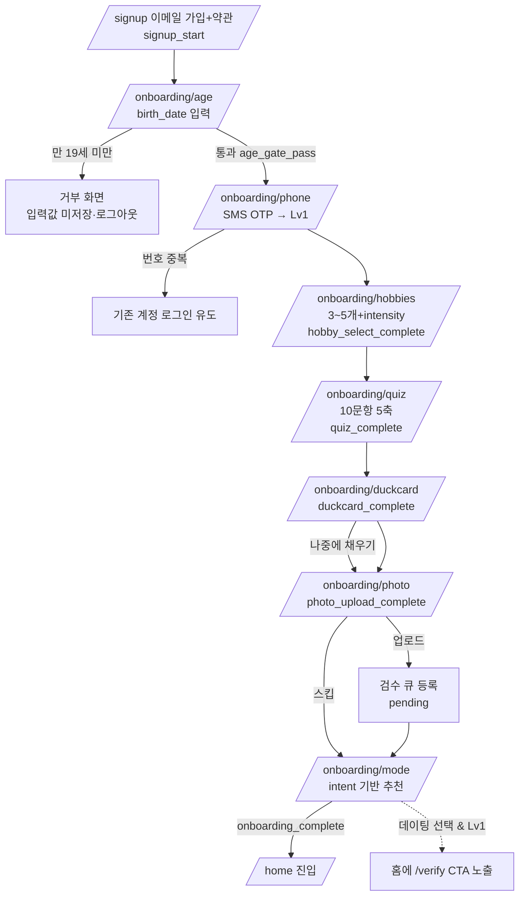
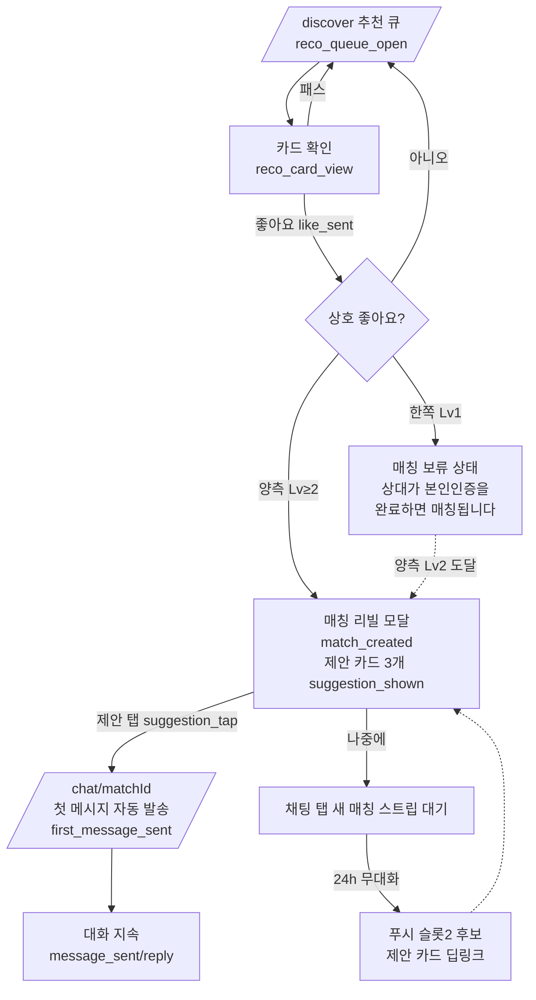

# C3 · 화면 플로우 (Screen Flows & IA)

> 작성: 서브에이전트 C3 (화면 플로우) · 기준일 2026-08-19
> 입력: `ORCHESTRATOR_SPEC.md` §1·§5·그룹 C3 정의 + 06_PRD(기능 ID·Phase) + 03_core_loop(일일 루프 S1~S5) + 05_trust_safety(verify_level 게이트·신고 택소노미) + 02_persona(이탈 지점).
> 본 문서의 **라우트 트리가 E1~E4·D8 구현의 단일 기준**이다. 화면마다 PRD 기능 ID(F-XXX-nn)를 매핑했다.

---

## 다음 에이전트에게 넘기는 결정사항

### 0. 확정 라우트 트리 (E그룹·D8은 이 경로명 그대로 폴더 생성 — 임의 개명 금지)

`apps/web/app/` 기준. Lv = 진입에 필요한 최소 `verify_level`(A5 §1.2 매트릭스 준수), Ph = 최초 구현 Phase. `—` = 비로그인 접근 가능.

```
app/
├─ (public)/                              # 비로그인 · noindex 대상 아님(공식 페이지)
│  ├─ page.tsx                /            랜딩(서비스 소개+안전 정책 전면 노출)   Lv—  Ph1
│  ├─ login/                  /login                                            Lv—  Ph1
│  ├─ signup/                 /signup      이메일 가입+약관 동의 [F-ONB-01]      Lv—  Ph1
│  └─ legal/[slug]/           /legal/terms|privacy|location|youth|community|refund
│                                          법적 페이지 6종 [F-LGL-01]            Lv—  Ph1
│
├─ onboarding/                            # 로그인 필수 · 전면 noindex · 순차 강제
│  ├─ age/                    /onboarding/age        연령확인(birth_date)        Lv0  Ph1
│  ├─ phone/                  /onboarding/phone      SMS OTP → Lv1 [F-ONB-02]    Lv0  Ph1
│  ├─ hobbies/                /onboarding/hobbies    취미 선택 [F-ONB-05]        Lv0  Ph1
│  ├─ quiz/                   /onboarding/quiz       궁합 퀴즈 10문항 [F-ONB-06] Lv0  Ph1
│  ├─ duckcard/               /onboarding/duckcard   덕질카드 작성 [F-ONB-07]    Lv0  Ph1
│  ├─ photo/                  /onboarding/photo      사진 업로드(스킵 가능) [F-ONB-08] Lv0 Ph1
│  └─ mode/                   /onboarding/mode       모드 선택 [F-ONB-09]        Lv0  Ph1
│
├─ (main)/                                # 하단 탭 레이아웃 · 전면 noindex
│  ├─ home/                   /home        홈(슬롯 구조) [F-DIS-01]              Lv1  Ph1
│  ├─ discover/               /discover    오늘의 추천 큐 [F-DIS-01~03,05]       Lv1  Ph1
│  │  └─ [profileId]/         /discover/[profileId]  상대 프로필 상세            Lv1  Ph1
│  ├─ likes/                  /likes       나를 좋아한 사람(무료 블러) [F-DIS-07] Lv1  Ph1
│  ├─ chat/                   /chat        매칭·대화 목록 [F-CHT-01,05]          Lv2  Ph1
│  │  └─ [matchId]/           /chat/[matchId]  대화방 [F-CHT-01~04]              Lv2  Ph1
│  ├─ me/                     /me          내 프로필 [F-PRF-01]                  Lv1  Ph1
│  │  ├─ duckcard/            /me/duckcard   덕질카드 편집                        Lv1  Ph1
│  │  └─ photos/              /me/photos     사진 관리(검수 상태) [F-ONB-08]      Lv1  Ph1
│  ├─ verify/                 /verify      본인인증(Lv1→2 승급) [F-ONB-03]       Lv1  Ph1
│  ├─ settings/               /settings    설정 허브 [F-PRF-02]                  Lv1  Ph1
│  │  ├─ mode/                /settings/mode          모드 전환                  Lv1  Ph1
│  │  ├─ notifications/       /settings/notifications 알림 설정 [F-NTF-01]       Lv1  Ph1
│  │  ├─ blocks/              /settings/blocks        차단 목록 [F-SAF-05]       Lv1  Ph1
│  │  ├─ subscription/        /settings/subscription  구독 관리 [F-PAY-06]       Lv2  Ph1(자리)→Ph3
│  │  ├─ data/                /settings/data          데이터 다운로드 [F-PRF-03] Lv1  Ph1
│  │  └─ delete/              /settings/delete        탈퇴 [F-PRF-03]            Lv1  Ph1
│  ├─ appeal/                 /appeal      이의제기 접수·조회 [F-SAF-07]          Lv0* Ph1 (*제재 중에도 진입 가능)
│  ├─ games/                  ── Phase 2 예약 ──
│  │  ├─ battle/              /games/battle           취향 배틀 [F-GAM-02]       Lv1  Ph2
│  │  └─ quiz/[sessionId]/    /games/quiz/[sessionId] 덕질 퀴즈 대전 [F-GAM-03]  Lv2  Ph2
│  ├─ events/                 /events      주간 취미 이벤트 [F-EVT-01]           Lv2  Ph5 예약
│  └─ ranking/                /ranking     취미 랭킹 [F-EVT-02]                  Lv1  Ph5 예약
│
├─ (admin)/                               # admin role 전용 · noindex + robots 차단
│  └─ admin/
│     ├─ page.tsx             /admin                지표 대시보드 [F-ADM-04]     admin Ph1
│     ├─ reports/             /admin/reports        신고 큐 [F-ADM-01]           admin Ph1
│     │  └─ [reportId]/       /admin/reports/[reportId]  신고 상세(evidence)     admin Ph1
│     ├─ photos/              /admin/photos         사진 검수 큐 [F-ADM-02]      admin Ph1
│     ├─ users/               /admin/users          유저 검색 [F-ADM-03]         admin Ph1
│     │  └─ [userId]/         /admin/users/[userId] 유저 상세·제재 부과          admin Ph1
│     ├─ appeals/             /admin/appeals        이의제기 큐 [F-SAF-07]       admin Ph1
│     └─ refunds/             /admin/refunds        환불 큐 [F-ADM-05]           admin Ph3 예약
│
└─ sanctioned/                /sanctioned  제재 안내 전용 화면(레벨 3~5)          Lv0  Ph1
```

### 1. 라우트 외 확정 사항

1. **하단 탭 4개 고정**: `홈(/home) · 탐색(/discover) · 채팅(/chat) · 프로필(/me)`. A3의 "매칭 탭"은 별도 탭이 아니라 **채팅 탭 상단의 "새 매칭" 가로 스트립**으로 구현한다(첫 메시지 없는 매칭이 대기하는 곳). `/likes`는 홈·탐색의 엔트리 카드에서 진입(탭 아님).
2. **모달 vs 라우트**: ① 매칭 리빌 [F-DIS-04] = 라우트 아님, 전역 모달(Zustand `revealQueue`) — Phase 2에서 스크래치 연출로 내부만 교체(M8, 홈과 동일한 슬롯 원칙). ② **신고 플로우 [F-SAF-01] = 바텀시트 모달**(라우트 없음, 어디서든 2탭 내 진입 — A5 부록). ③ 페이월(Phase 3) = 모달, `paywall_source` 5종 로깅(A4 §3). 라우트가 아니므로 E그룹은 전역 컴포넌트(`components/report-sheet`, `components/match-reveal`)로 구현.
3. **가드 구현 방식**: `middleware.ts` = 세션 유무만 판정(비로그인 → `/login`). 온보딩 완료 여부·`verify_level`·제재 상태는 **`(main)/layout.tsx` 서버 컴포넌트에서 판정**해 리다이렉트: 온보딩 미완 → `profiles.onboarding_step` 저장값의 스텝으로, `sanctions.level ≥ 3` 활성 → `/sanctioned`, 레벨 미달 라우트 접근 → `/verify` (컨텍스트 문구와 함께). 위 §0 표의 Lv 값이 단일 기준 — **UI 숨김이 아니라 서버 리다이렉트가 1차 방어**이고, 최종 방어는 RLS(D1)다.
4. **온보딩 재개 규칙**: `profiles.onboarding_step`(enum: `age→phone→hobbies→quiz→duckcard→photo→mode→done`)을 각 스텝 완료 시 서버 저장. 중도 이탈 후 재로그인하면 해당 스텝으로 복귀(입력값 보존). 스킵 가능 스텝은 **덕질카드('나중에 채우기')와 사진뿐** — 연령·휴대폰·취미·퀴즈·모드는 스킵 불가(PRD C그룹 지시 준수).
5. **취미 선택 개수 = 최소 3, 목표 5** (스펙 "5개 선택"과 A2 P2 "3개만 겨우 채움" 이탈 방지의 양립): CTA는 5개를 채우도록 유도하되 3개부터 다음 버튼 활성화. 3~4개로 통과 시 홈의 프로필 보완 퀘스트가 잔여분을 회수한다 [F-DIS-05 폴백과 연동].
6. **빈 화면 3원칙**(전 화면 공통): "추천 0명" 원문 노출 절대 금지(PRD §1-9) / 모든 빈 상태 화면은 다음 행동 CTA 1개 이상 / 죄책감·조바심 카피 금지(A3 §3.2). §8 엣지 케이스 화면 목록이 기준.
7. **퍼널 이벤트는 A3 §4.1 이름 그대로**: 본 문서 각 화면에 명기된 이벤트(`signup_start`, `age_gate_pass`, `reco_queue_open`…)를 E그룹이 해당 화면 마운트/액션 시점에 로깅한다.

---

## 1. 전체 정보 구조(IA) — 내비게이션 관점

```
비로그인 ──> / (랜딩) ──> /signup ──> [온보딩 7스텝] ──> /home
                └──> /login ─────────────────────────────┘ (온보딩 완료자)

(main) 탭 구조
  홈 /home ─┬─> /discover (추천 큐) ─> /discover/[id] (상세) ─> 좋아요 ─> [매칭 리빌 모달] ─> /chat/[matchId]
            ├─> /likes (블러 목록)
            └─> [Phase 2 카드 슬롯] ─> /games/battle
  채팅 /chat ─> /chat/[matchId] ─> [신고 시트] / 차단
  프로필 /me ─> /me/duckcard · /me/photos · /verify · /settings/*
```

- 신고 시트·매칭 리빌·페이월은 어느 화면 위에서도 뜨는 전역 오버레이.
- `/verify`는 게이트에 막힌 모든 지점(좋아요 4회째, 채팅 진입, 데이팅 모드 전환, 결제)에서 컨텍스트 문구와 함께 진입되는 **단일 승급 화면**이다(E1 중복 구현 금지).

---

## 2. 온보딩 플로우 상세 [F-ONB-01~10]

공통 프레임: 상단 진행률 바(7스텝, `n/7` + %), 뒤로가기(입력 보존), 스텝 완료마다 서버 저장(§결정-4). 목표 완주율 60%+, 최대 이탈 감시 구간 = 퀴즈(A3 §4.2 — 문항별 진행 props 계측).

### 2.1 /onboarding/age — 연령확인 [F-ONB-01] · 이벤트 `signup_start`(가입 화면)→`age_gate_pass`

```
┌──────────────────────────────┐
│ ●○○○○○○  1/7                 │
│                              │
│  만 19세 이상만 이용할 수     │
│  있어요                       │
│                              │
│  생년월일                     │
│  ┌────┐ ┌──┐ ┌──┐            │
│  │1999│ │03│ │21│  (YYYY/MM/DD)│
│  └────┘ └──┘ └──┘            │
│                              │
│  ⓘ 본인인증 시 실제 생년월일과 │
│    대조합니다. 다르면 이용이   │
│    제한돼요.                  │
│                              │
│  [        다음        ]      │
└──────────────────────────────┘
```

- 필드: `birth_date`(date, 필수). 검증: `birth_date <= current_date - interval '19 years'`(만 나이, M1). **미달 시 즉시 거부 화면 + 입력값 미저장**(A5 §1.3-1): "만 19세 이상부터 이용할 수 있어요" + [확인]→로그아웃. 재시도 폼 재노출 금지(같은 세션).
- 이탈 방지: 단일 입력·자동 포커스 이동. 스킵 불가. 3중 게이트 예고 문구로 허위 입력 동기 제거.

### 2.2 /onboarding/phone — 휴대폰 인증 [F-ONB-02] · Lv0→Lv1

```
┌──────────────────────────────┐        ┌──────────────────────────────┐
│ ●●○○○○○  2/7                 │        │ ●●○○○○○  2/7                 │
│  휴대폰 번호를 인증해요        │        │  인증번호 6자리를 입력하세요   │
│  (번호 1개 = 계정 1개)        │   →    │  010-1234-5678 로 발송됨      │
│  ┌──────────────────┐        │        │  ┌─┬─┬─┬─┬─┬─┐               │
│  │ 010-____-____    │        │        │  │ │ │ │ │ │ │  (03:00)     │
│  └──────────────────┘        │        │  └─┴─┴─┴─┴─┴─┘               │
│  [    인증번호 받기    ]      │        │  재전송 (60초 후 가능)        │
└──────────────────────────────┘        └──────────────────────────────┘
```

- 필드: `phone`(국내 010 형식, 필수) / OTP 6자리, 유효 3분. 검증: 재전송 60초 쿨다운, **입력 5회 실패 시 10분 잠금**, 번호당 1계정 — 중복 번호면 "이미 가입된 번호예요" + 기존 계정 로그인 유도(계정 존재 사실 외 정보 비노출).
- 스킵 불가(Lv1 없이는 탐색 자체가 불가). 이탈 방지: OTP 자동 읽기(WebOTP API), 실패 시 남은 횟수 표시.

### 2.3 /onboarding/hobbies — 취미 선택 [F-ONB-05] · 이벤트 `hobby_select_complete`

```
┌──────────────────────────────┐
│ ●●●○○○○  3/7                 │
│  좋아하는 걸 골라주세요 (3~5개)│
│  ┌─ 검색 🔍 ───────────────┐ │
│  └─────────────────────────┘ │
│  [게임] 카테고리              │
│   (발로란트)(원신)(스팀게임)… │
│  [애니/웹툰]                  │
│   (애니)(웹툰)(버튜버)…       │
│  [운동]  (러닝)(클라이밍)…    │
│  ─────────────────────────── │
│  선택: 클라이밍 ▾ 보드게임 ▾  │
│   └ 클라이밍  몰입도:         │
│     ①입문 ②관심 ③즐김 ④진심 ⑤덕후│
│  ─────────────────────────── │
│  ⓘ 찾는 게 없나요? [태그 요청]│
│  [   다음 (2개 더 고르면      │
│      추천이 정확해져요)   ]   │
└──────────────────────────────┘
```

- 필드: `profile_hobbies` 3~5개(§결정-5), 태그당 `intensity` 1~5 필수 — **①입문 ②관심 라벨 명시**(A2 P2 허들 완화, PRD C그룹 지시). 마이너 태그 신규 등록 요청 버튼(자유 입력 → 운영 큐, 즉시 임시 태그로 선택 반영).
- 검증: 3개 미만 시 다음 비활성. 이탈 방지: 3개 도달 시점부터 버튼 활성 + "2개 더 고르면 추천이 정확해져요" 유도 카피(강요 아님). 스킵 불가.

### 2.4 /onboarding/quiz — 궁합 퀴즈 10문항 [F-ONB-06] · 이벤트 `quiz_complete` (최대 이탈 감시 구간)

```
┌──────────────────────────────┐
│ ●●●●○○○  4/7    문항 3/10 ▓▓░│
│                              │
│  Q3. 취향 맞는 사람이 생기면  │
│      먼저 하고 싶은 건?       │
│                              │
│  ┌──────────────────────┐    │
│  │ 밤새 채팅으로 수다     │    │
│  ├──────────────────────┤    │
│  │ 일단 온라인으로 친해지기│    │
│  ├──────────────────────┤    │
│  │ 시간 맞으면 만나기     │    │
│  ├──────────────────────┤    │
│  │ 주말에 바로 만나기     │    │
│  └──────────────────────┘    │
│  ← 이전            (정답 없음)│
└──────────────────────────────┘
```

- 데이터: 5축×2문항(`immersion/meeting/tempo/explore/intent`), 4지선다 벡터 -1.0/-0.33/+0.33/+1.0 (A2 §4 — D1 시드와 일치). 선택 즉시 다음 문항 자동 전환(버튼 탭 1회 = 1문항).
- 검증: 문항별 스킵 불가, 이전으로 수정 가능. 이탈 방지: **문항별 진행 바 + "정답 없음·재미용" 상시 고지**(콘텐츠 정책 준수), 문항당 1탭 UX로 총 소요 60~90초 설계, 문항 인덱스별 이탈 props 계측(`duration_sec`).
- 완료 화면: "취향 분석 완료!" + intent 축 결과로 모드 기본값 미리 계산(2.7에서 사용).

### 2.5 /onboarding/duckcard — 덕질카드 작성 [F-ONB-07] · 이벤트 `duckcard_complete` · **'나중에 채우기' 허용**

```
┌──────────────────────────────┐
│ ●●●●●○○  5/7                 │
│  내 덕질카드 만들기            │
│  (상대에게 사진보다 먼저 보여요)│
│                              │
│  Top 3 (선택한 취미 중 순위)   │
│   1위 [클라이밍 ▾]            │
│   2위 [보드게임 ▾]            │
│   3위 [웹툰    ▾]            │
│                              │
│  최애 ✩                      │
│  ┌──────────────────────┐    │
│  │ 예: 최애 작품/선수/아이돌│   │
│  └──────────────────────┘    │
│  요즘 빠진 것 🔥              │
│  ┌──────────────────────┐    │
│  │                       │   │
│  └──────────────────────┘    │
│  [      카드 완성      ]      │
│      나중에 채우기            │
└──────────────────────────────┘
```

- 필드: `rank` 1~3(선택 취미 중 지정, 필수), `최애`(fav_note, 최대 40자), `요즘 빠진 것`(최대 80자). 최애·요즘 빠진 것은 개별 생략 가능.
- 검증: 민감정보(전화·이메일·실명·SNS ID) 패턴 입력 시 저장 거부 + 안내(정책 §민감정보 + R1~R3 프리체크). 이탈 방지: "나중에 채우기" 선택 시 **추천 품질 저하 안내**("카드를 채우면 궁합 이유가 풍부해져요") 후 통과 — 홈의 프로필 보완 퀘스트로 회수(A2 이탈표).

### 2.6 /onboarding/photo — 사진 업로드 [F-ONB-08] · 이벤트 `photo_upload_complete` · **스킵 가능(M6)**

```
┌──────────────────────────────┐
│ ●●●●●●○  6/7                 │
│  프로필 사진 (선택)            │
│                              │
│  ┌────┐ ┌────┐ ┌────┐        │
│  │ +  │ │ +  │ │ +  │        │
│  └────┘ └────┘ └────┘        │
│  ⓘ 업로드한 사진은 검수 후     │
│    공개돼요 (보통 24시간 이내) │
│    · 얼굴이 나온 사진 1장 이상  │
│      승인되면 인증 뱃지 ✓      │
│    · 타인 사진·AI 생성 사진은  │
│      반려돼요                 │
│                              │
│  [       다음       ]        │
│   사진 없이 시작하기           │
└──────────────────────────────┘
```

- 필드: 1~6장, jpg/png/webp, 장당 10MB 이하, 클라이언트 리사이즈 후 업로드. 업로드 즉시 `review_status=pending`.
- 검수 안내를 업로드 **전에** 노출(반려 시 배신감 방지). 스킵 시: "사진 없이도 Lv2까지 전 기능 이용 가능, 사진 승인은 인증 뱃지·우선 노출 조건"을 명시(M6 — P4 이탈 방지). 다크패턴 금지: "사진 없이 시작하기" 버튼은 다음 버튼 대비 70% 이상 크기(A4 §4·PRD 접근성).

### 2.7 /onboarding/mode — 모드 선택 [F-ONB-09] · 이벤트 `onboarding_complete`

```
┌──────────────────────────────┐
│ ●●●●●●●  7/7                 │
│  어떻게 시작할까요?            │
│                              │
│  ┌──────────────────────┐    │
│  │ 🤝 취미 친구 모드      │◄추천│
│  │ 성별 무관·가볍게 덕메  │    │
│  │ 찾기                  │    │
│  ├──────────────────────┤    │
│  │ 💘 데이팅 모드         │    │
│  │ 본인인증 회원끼리      │    │
│  │ (본인인증 후 열려요 🔒)│    │
│  └──────────────────────┘    │
│  ⓘ 언제든 설정에서 바꿀 수    │
│    있어요                     │
│  [    덕메이트 시작!    ]     │
└──────────────────────────────┘
```

- 기본값: 퀴즈 `intent` 축 결과로 추천 배지 표시(강제 아님 — A2 §4). 데이팅 모드 선택 + Lv<2이면 friend로 시작하고 `/verify` CTA를 홈에 노출(가입 흐름을 끊지 않음). 완료 → `/home` + 웰컴 토스트("오늘의 추천 5명이 준비됐어요").
- 데이팅 전환 CTA는 이후 **만족 신호(첫 대화 10턴 이상 등) 후에만** 재노출(A2 결정-2).

### 2.8 온보딩 전체 mermaid



---

## 3. 홈 / 탐색 / 매칭 [F-DIS-01~07]

### 3.1 /home — 홈 (슬롯 구조, A3 결정-1 / M8)

```
┌──────────────────────────────┐
│ 덕메이트          🔔  [친구모드]│
│ ┌──────────────────────────┐ │
│ │ ░░ 카드 슬롯 ░░           │ │  ← Phase 1: "오늘의 추천 5명 도착"
│ │ 오늘의 추천 5명 도착!      │ │     배너 (미확인 수 뱃지)
│ │ [ 추천 보러 가기 → ]      │ │  ← Phase 2: 오늘의 궁합 카드
│ └──────────────────────────┘ │     컴포넌트로 교체 [F-GAM-01]
│ ┌──────────────────────────┐ │
│ │ 💗 나를 좋아한 사람 3명    │ │  → /likes (N≥1일 때만 노출)
│ │ [블러 썸네일][블러][블러]   │ │
│ └──────────────────────────┘ │
│ ┌──────────────────────────┐ │
│ │ ✍ 프로필 보완 퀘스트       │ │  ← 덕질카드 미완성·사진 없음 시
│ │ 최애를 채우면 궁합 이유가  │ │     에만 노출 (죄책감 카피 금지)
│ │ 풍부해져요 [채우러 가기]   │ │
│ └──────────────────────────┘ │
│ ⓘ 본인인증하면 매칭·채팅이   │  ← Lv1일 때만 → /verify
│   열려요 [인증하기]           │
│──────────────────────────────│
│  🏠홈   🔍탐색   💬채팅   👤나 │
└──────────────────────────────┘
```

- 이벤트: `app_open`(source: push|organic|deeplink). 카드 슬롯은 **컴포넌트 교체만으로 Phase 2 전환**되도록 독립 슬롯 컴포넌트로(E2). 헤더에 현재 모드 표시(탭 → /settings/mode).

### 3.2 /discover — 오늘의 추천 큐 (카드 스택) · 이벤트 `reco_queue_open`, `reco_card_view`

```
┌──────────────────────────────┐
│ ← 오늘의 추천        3/5 남음 │
│ ┌──────────────────────────┐ │
│ │  🃏 덕질카드 (사진 아님!)  │ │
│ │  하늘 · 22 · 서울 [친구]   │ │
│ │  ────────────────────    │ │
│ │  Top3: 웹툰·발로란트·버튜버│ │
│ │  최애 ✩ ○○○ 작가         │ │
│ │  요즘 🔥 신작 정주행 중    │ │
│ │  ────────────────────    │ │
│ │  궁합 근거                │ │
│ │  · 웹툰 태그 3개 겹침      │ │
│ │  · 밤 시간대 활동 일치     │ │
│ │  · 소통 템포 비슷          │ │
│ │  [프로필 자세히 보기 →]    │ │
│ └──────────────────────────┘ │
│   ✕ 패스     ♥ 좋아요    ★   │
│              (슈퍼라이크 주1) │
└──────────────────────────────┘
```

- 카드 = **덕질카드가 전면, 사진은 상세에서**(§1 차별점). 궁합 근거 3줄 = `daily_recommendations.reasons`. Lv1은 좋아요 일 3회 — 4회째 탭 시 `/verify` 유도 시트("본인인증하면 제한 없이").
- 소진/재개: 미소진 카드는 당일 유지(`seen_at` null부터 재개, `resumed` props). 5명 소진 → §8.1 소진 화면. 되돌리기 버튼은 Phase 3까지 미노출(자리만 예약, F-DIS-08).

### 3.3 /discover/[profileId] — 상대 프로필 상세

```
┌──────────────────────────────┐
│ ←                        ⋮   │  ← ⋮ = 신고·차단 (2탭 이내, A5 부록)
│ ┌──────────────────────────┐ │
│ │ 덕질카드 (풀 버전)         │ │  ← 1순위: 카드
│ │ Top3 + intensity 게이지    │ │
│ │ 최애 ✩ / 요즘 빠진 것 🔥   │ │
│ │ 궁합 근거 3줄              │ │
│ └──────────────────────────┘ │
│ ┌──────────────────────────┐ │
│ │ 사진 (검수 승인분만)  ✓뱃지│ │  ← 2순위: 사진. 없으면 영역 비노출
│ └──────────────────────────┘ │
│ 활동 시간대: 평일 밤 · 주말 오후│
│ 소개: …                       │
│──────────────────────────────│
│   ✕ 패스          ♥ 좋아요    │
└──────────────────────────────┘
```

- 인증 상태 표기: Lv3 = ✓ 인증 뱃지, Lv1 상대는 "미인증" 표시 + 요약만(A5 §1.2). 사진 없는 프로필도 완결감 있게(카드가 주인공 — P4 보호).

### 3.4 매칭 리빌 (전역 모달) [F-DIS-04] · 이벤트 `match_created`, `suggestion_shown`

```
┌──────────────────────────────┐
│         ✨ 매칭! ✨           │
│   [내 카드]  ⇄  [상대 카드]   │
│   지우 ♥ 하늘 · 궁합 87%      │
│                              │
│  이런 얘기로 시작해보세요      │
│  ┌──────────────────────┐    │
│  │💬 웹툰 ○○○ 신작 어때요?│    │  ← 탭 = 첫 메시지 자동 발송
│  ├──────────────────────┤    │     → /chat/[matchId] 진입
│  │🎮 발로란트 한 판 어때요?│    │     (suggestion_tap)
│  ├──────────────────────┤    │
│  │📍 토요일 홍대 보드게임  │    │
│  │  카페 어때요?          │    │
│  └──────────────────────┘    │
│  ⓘ 금전 요구·외부 링크 유도는  │  ← 안전 안내 1줄 (A5 부록)
│    신고해 주세요               │
│        나중에 할래요           │
└──────────────────────────────┘
```

- 제안 3개 = `matches.first_suggestion`(서버 사전 생성, Phase 1은 hobby 소스만). "나중에" → 채팅 탭 새 매칭 스트립에 대기. Phase 1 = 단순 모달, Phase 2 = 스크래치 연출로 내부 교체(M8). 오프라인 활동 제안 카드에는 공공장소 권장 문구 자동 포함(A5 부록).

### 3.5 /likes — 나를 좋아한 사람 [F-DIS-07]

블러 그리드 + 실카운트 배지(무료), N=0이면 홈 엔트리 자체 비노출. 블러 탭 → Phase 3 페이월 자리(Phase 1은 "플러스에서 공개돼요" 안내만, 결제 버튼 없음 — F-PAY 코드 금지 준수).

### 3.6 매칭→첫 대화 mermaid



---

## 4. 채팅 [F-CHT-01~05]

### 4.1 /chat — 목록

```
┌──────────────────────────────┐
│ 채팅                          │
│ 새 매칭 ─────────────────────│
│ (하늘) (민준)  ← 첫 메시지 전 │  ← "매칭 탭" 역할 (§결정-1)
│  87%    76%      대기 스트립  │
│──────────────────────────────│
│ ● 지우      어제 팝업 다녀왔… │
│   서연      토요일 2시 어때요?│
│   민준 💤   (7일 무응답·하단) │  ← 조용히 하단 정렬, 재촉 없음
│    └ [제안 카드 다시 보내기]  │  ← 리믹스 [F-CHT-05]
└──────────────────────────────┘
```

### 4.2 /chat/[matchId] — 대화방

```
┌──────────────────────────────┐
│ ← 하늘 ✓     [카드요약 ▾]  ⋮ │  ← ⋮ 1탭 = [신고][차단] 2탭 (A5)
│ ┌──────────────────────────┐ │  ← 상단 고정: 상대 덕질카드 요약
│ │ Top3 웹툰·발로란트·버튜버 │ │
│ └──────────────────────────┘ │
│ ⓘ 연락처·링크는 매칭 3일 후   │  ← 마스킹 상태 바 (해제 조건: 72h
│   양측 인증 완료 시 열려요    │     +양측 Lv2, M4) 해제 시 문구 변경
│                              │
│      웹툰 ○○○ 신작 어때요? ▶│  ← 제안 카드 발 첫 메시지 표시
│ ◀ 오 저 정주행 중이에요!!    │
│      번호는 ●●●●●●● 로 🔒 ▶│  ← masked_body 렌더 (R1~R5)
│ ┌──────────────────────────┐ │
│ │⚠ 금전 요구는 스캠 신호예요│ │  ← 수신자 안전 카드 (PAT_MONEY
│ │  [신고하기]  [무시]        │ │     히트 시, WARN 단계) [F-SAF-06]
│ └──────────────────────────┘ │
│ [📷] ┌────────────────┐ [전송]│  ← 📷 양측 Lv≥2만 활성
└──────────────────────────────┘
```

- 클라이언트는 항상 `masked_body`만 수신(D4). 읽음 표시, 이미지(양측 Lv≥2, 비활성 시 사유 툴팁). 첫 오프라인 만남 제안엔 공공장소 권장 문구 자동 삽입. 자해 암시 감지 시 상담 리소스(109) 배너 [F-SAF-08].

---

## 5. 프로필 / 설정 [F-PRF-01~03]

### 5.1 /me — 내 프로필

```
┌──────────────────────────────┐
│ 내 프로필              ⚙설정 │
│ ┌──────────────────────────┐ │
│ │ 내 덕질카드 (미리보기)     │ │ → /me/duckcard 편집
│ │ 인증 Lv2 ─ 뱃지까지 1단계  │ │ → /verify 또는 /me/photos
│ └──────────────────────────┘ │
│ 사진 3장 · 1장 검수 중 ⏳     │ → /me/photos
│ 모드: 친구 [데이팅으로 전환]  │ → /settings/mode
│ 상대에게 보이는 화면 미리보기 │
└──────────────────────────────┘
```

### 5.2 /me/photos — 사진 관리 (검수 상태 노출)

```
┌──────────────────────────────┐
│ ← 사진 관리                   │
│ ┌────┐ ┌────┐ ┌────┐ ┌────┐  │
│ │대표 │ │ ✓ │ │ ⏳ │ │ ✕ │  │
│ │승인 │ │승인│ │검수중│ │반려│  │
│ └────┘ └────┘ └────┘ └────┘  │
│  ✕ 반려 사유: 얼굴 확인 불가  │
│    [다시 올리기]              │
│ ⓘ 승인 전 사진은 상대에게     │
│   보이지 않아요               │
└──────────────────────────────┘
```

- 상태 3종: `pending ⏳ / approved ✓ / rejected ✕(사유+재업로드)`. 전체 반려/삭제 시 Lv3→2 강등 안내(A5 §1.1).

### 5.3 /settings — 설정 허브 (탈퇴까지 **2뎁스 이내** — 다크패턴 금지)

```
┌──────────────────────────────┐
│ ← 설정                        │
│  모드 전환            친구 ›  │  1뎁스
│  알림 설정                 ›  │
│  차단 목록                 ›  │
│  구독 관리     (Phase 3 오픈)›│  ← Ph1: 자리+["무료 이용 중"]만
│  ──────────────────────────  │
│  내 데이터 다운로드         ›  │
│  탈퇴하기                  ›  │  ← 설정(1) → 탈퇴(2) = 2뎁스 끝
│  ──────────────────────────  │
│  약관·정책 / 문의             │
└──────────────────────────────┘
```

- **/settings/mode**: friend↔dating 토글. dating은 Lv2 필요 — 미달 시 /verify 유도. 전환 시 추천 큐 재계산 안내.
- **/settings/blocks**: 차단 목록 + 해제. 차단 상대에게 통지 없음 명시.
- **/settings/subscription**: Phase 1은 "무료 이용 중" 표시만(결제 코드 금지). Phase 3에 티어·잔액·다음 결제일·**해지 버튼 상시 노출(최대 2뎁스, F-PAY-06)**.
- **/settings/data**: 내 데이터 다운로드 신청 → 준비 완료 알림 → 다운로드(본인 발신분).
- **/settings/delete**: 화면 1장으로 종결 — ① 파기 안내(본인 발신분 지체 없이 파기, 신고 evidence는 법정 보존) ② 사유 선택(선택 사항, 응답 강요 금지) ③ [탈퇴하기] 버튼(확인 다이얼로그 1회). **만류 페이지·혜택 팝업·재확인 반복 금지**(A4 §4).

---

## 6. 신고 플로우 [F-SAF-01] — 전역 바텀시트 (라우트 없음, §결정-2)

진입점(모두 2탭 이내): 채팅방 ⋮ / 프로필 상세 ⋮ / 안전 카드 [신고하기].

```
① 사유 선택 (카테고리 9)         ② 세부 선택 (reason_code 18)
┌──────────────────────────┐    ┌──────────────────────────┐
│ 어떤 문제인가요?           │    │ 사기 — 조금 더 알려주세요  │
│  성희롱/성적 침해        › │    │ ◉ 금전 요구·대출·투자 권유 │
│  괴롭힘                 › │ →  │ ○ 로맨스 스캠             │
│  사기                   › │    │ ○ 피싱·외부 사이트 유도    │
│  프로필 위조             › │    └──────────────────────────┘
│  상업 행위 / 미성년 의심   │    ③ 상세 입력
│  오프라인 위해 / 부적절…  │    ┌──────────────────────────┐
│  기타                   › │    │ 상황 설명 (기타는 필수)    │
└──────────────────────────┘    │ ⓘ 대화 내용은 자동 첨부돼요│
                                │ [        접수하기       ] │
④ 접수 확인                     └──────────────────────────┘
┌──────────────────────────┐
│ ✓ 접수됐어요               │
│ 24시간 이내에 검토·조치하고 │   ← 24h SLA 안내 (A5 §6-①)
│ 결과를 알려드려요           │
│ 신고 사실은 상대에게 알리지 │
│ 않아요                     │
│ [이 상대 차단하기]  [닫기]  │   ← 자동 숨김 + 차단 원클릭
└──────────────────────────┘
```

- ①→②는 A5 §2 택소노미 2단 UI 그대로(18코드). `OTHER`는 detail 필수. `match_id` 있으면 evidence 스냅샷 자동 첨부 고지. 접수 즉시 해당 상대는 목록·큐에서 자동 숨김. `CONTENT_SELF_HARM` 선택 시 ④ 대신 보호 안내(109 상담) 분기 [F-SAF-08].

---

## 7. 어드민 (`/(admin)` — D8 상세 설계의 화면 골격)

- `/admin` 지표: 데일리 퍼널 5단계 막대 + D1/D7/D30 코호트 + 매칭→첫대화 전환율 + 푸시 오픈율, **신고율 교차 배치**(A3 §4.3).
- `/admin/reports`: P0 최상단, `sla_due_at` 카운트다운, 상태 칩(RECEIVED→…→NOTIFIED). 상세(`[reportId]`)에서 evidence 열람(서버 프록시, service role) + 제재 부과(레벨 5는 2인 승인 UI).
- `/admin/photos`: 검수 큐 카드(승인/반려+사유 — 반려 시 Lv 강등 자동 연동).
- `/admin/users/[userId]`: 프로필·제재 이력·신고 이력·감사로그. `/admin/appeals`: 4-eyes 배정(원 처리자 제외).

---

## 8. 상태별 엣지 케이스 화면 (E그룹 전 화면 공통 기준)

| # | 상태 | 화면 처리 (금지: "추천 0명"류 빈 화면·죄책감 카피) |
|---|---|---|
| 8.1 | **추천 큐 소진/0명** [F-DIS-05] | 소진 화면 = "내일 06:00 새 추천" 카운트다운 + 받은 좋아요 블러 티저(S5). **발행 자체가 0명이면**: 취미친구 후보 카드(모드 무관 폴백) → 그것도 없으면 프로필 보완 퀘스트 화면("최애를 채우면 더 잘 찾아드려요"). 절대 빈 리스트 노출 금지 |
| 8.2 | **사진 검수 대기 중** | /me·/me/photos에 ⏳ 배지 + "승인 전엔 상대에게 안 보여요". 상대 화면에는 해당 사진 슬롯 자체가 없음(깨진 이미지·자리 표시 금지) |
| 8.3 | **제재 상태** | Lv2 기능제한(72h): 앱 이용 가능 + 발신 시도 시 인라인 안내("일시적으로 제한됐어요 · 해제 [시각]"). Lv3~4 정지: 전 라우트 → `/sanctioned` 리다이렉트 — 위반 조항·기간·[이의제기] 버튼(→/appeal)만 있는 단일 화면. Lv5 영구정지: 동일 화면 + 재가입 불가 안내. 로그인 자체는 허용(이의제기 접근권 보장, A5 §3.3) |
| 8.4 | **네트워크 오류** | 화면별 스켈레톤 → 실패 시 인라인 재시도 카드("연결이 불안정해요 [다시 시도]"). 채팅 발신 실패 = 말풍선에 ⚠ + 탭 재전송(메시지 유실 금지, 로컬 큐 보존). 전면 오류 페이지는 앱 셸 로드 실패 시에만 |
| 8.5 | **Lv1 상호 좋아요 (매칭 보류)** | "상대가 본인인증을 완료하면 매칭됩니다" 대기 카드 + 내가 Lv1이면 /verify CTA (A5 §1.2) |
| 8.6 | **Lv1 좋아요 일 3회 소진** | 4회째 탭 → /verify 유도 시트("본인인증하면 제한 없이"). 결제 유도 아님(Lv 게이트는 페이월이 아니다) |
| 8.7 | **덕질카드 미완성 상대 열람** | 카드에 있는 필드만 렌더, 빈 필드 영역 미노출. 궁합 근거는 항상 3줄 보장(태그·시간대·템포로 채움, D3) |
| 8.8 | **검수 반려 후 재로그인** | 홈 상단 1회성 배너 "사진 1장이 반려됐어요 [사유 보기]" → /me/photos. 푸시로 보내지 않음(슬롯 낭비·수치심 방지) |
| 8.9 | **온보딩 중도 이탈 복귀** | `onboarding_step` 저장 스텝으로 즉시 복귀, 입력값 프리필(§결정-4) |
| 8.10 | **탈퇴 상대와의 대화방** | 방 유지 + "대화를 종료한 상대예요" 상태, 발신 비활성. 상대 프로필은 익명 처리 |

---

## 부록 A. 화면 ↔ 기능 ID 역인덱스 (E그룹 체크리스트)

| 라우트/컴포넌트 | 기능 ID |
|---|---|
| /signup, /onboarding/age | F-ONB-01, F-ONB-10 |
| /onboarding/phone | F-ONB-02 |
| /onboarding/hobbies · quiz · duckcard · photo · mode | F-ONB-05 · 06 · 07 · 08 · 09 |
| /verify | F-ONB-03 (스텁 UI, Phase 4에 F-ONB-04) |
| /home, /discover(+[profileId]), /likes | F-DIS-01~03, 05~07 |
| 매칭 리빌 모달 | F-DIS-04, F-CHT-02 |
| /chat(+[matchId]) | F-CHT-01~05, F-SAF-06·08·09 |
| 신고 시트 | F-SAF-01·05 |
| /me/*, /settings/* | F-PRF-01~03, F-PAY-06(Ph3), F-LGL-01 링크 |
| /appeal, /sanctioned | F-SAF-07, 제재 통보 |
| /(admin)/* | F-ADM-01~05 |
| Phase 2 예약: 홈 카드 슬롯, /games/* | F-GAM-01~04 |

## 부록 B. Phase 전환 시 화면 변경점 (마이그레이션 최소화 설계)

1. **Ph1→Ph2**: 홈 카드 슬롯 컴포넌트 교체(배너→궁합 카드), 리빌 모달 내부 교체(스크래치), 제안 카드 소스 `hobby`→`hobby|battle|quiz`, `/games/*` 오픈. 라우트 트리 변경 없음.
2. **Ph1→Ph3**: `/settings/subscription` 본 구현 + 페이월 모달 활성(5지점) + `/admin/refunds` 오픈. 라우트 추가 없음.
3. **Ph5**: `/events`, `/ranking` 오픈(예약 완료).
