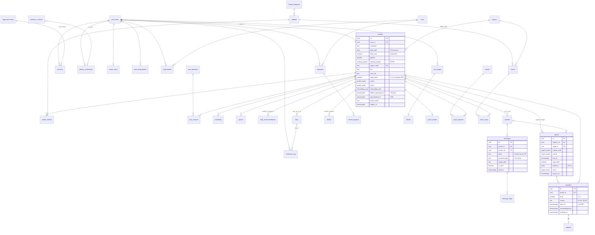

# 14 — DB 스키마 · 마이그레이션 · RLS (D1)

> 입력: `00_brief.md` §DB, `06_PRD.md` §0-36~38·§3.1 델타 24건, `05_trust_safety.md`, `07_legal_checklist.md` §0-11~17, `04_monetization.md`, `03_core_loop.md`, `12_flows.md` §11.
> 산출물: `supabase/config.toml`, `supabase/seed.sql`, `supabase/migrations/20260902000001~13_*.sql`, `packages/db/src/{types,constants,entitlements,index}.ts`.
> 기준일 2026-09-02. 로컬 Postgres 16 에 **실제 적용·동작 검증 완료**(§6).

## 다음 에이전트에게 넘기는 결정사항

### 공통 (D2~D8, E1~E6, F)
1. **enum 은 전부 Postgres 타입**(`0001`). TS 는 `packages/db/src/types.ts` 의 `Enums` 타입 + `constants.ts` 의 `*_STATUSES`/`*_CODES` 배열이 단일 소스(PRD 의 `enums.ts` 는 이 두 파일로 대체). `verify_level`(0~3)·`sanction_level`(1~6)은 enum 이 아니라 **smallint 도메인**.
2. **일일 경계 컬럼명은 `loop_date`**(브리프의 `date`). SQL `loop_date(ts)` = `(ts at KST − 7h)::date`, `week_start_loop_date(ts)` = 그 주 월요일. TS 는 `loopDate()`·`RESET_HOUR_KST=7`. 모든 배치·쿼터·푸시 예산은 이 두 함수만 쓴다.
3. **세션 헬퍼 = `current_profile_id()`** (auth.uid → profiles.id). 모든 RLS·RPC 는 user_id 가 아니라 **profile_id** 를 키로 쓴다. auth.users 를 직접 참조하는 테이블: `profiles.user_id`, `consents`, `identity_verifications`, `admin_users`, `subscriptions/payments/item_ledger/boosts/refund_requests`, `push_subscriptions`, `notification_log`, `inquiries`.
4. **역할 판정 = `app_role()`**: `auth.jwt()->'app_metadata'->>'role'` 우선, 없으면 `admin_users` 조회. `is_admin()` / `is_moderator()`(admin 포함). D8 이 `admin_users` insert 와 함께 `auth.admin.updateUserById(app_metadata.role)` 를 같이 해야 JWT 경로가 살아난다. service role 은 RLS 우회이므로 어드민 API 는 service role 로 호출하고 **모든 판정을 `audit_logs`** 에 남긴다.
5. **타인 프로필은 base 테이블이 아니라 `v_profile_public` 뷰**로만 읽는다. `profiles` select 정책은 본인 행 + moderator 뿐. 뷰는 `can_view_profile(viewer,target)` 통과 행만 노출하고 `birth_date`·`seeking_gender`·`phone_hash`·`hidden_*` 등은 제외, `age_band`('20_early'…'40_plus') 계산 제공.
6. **`can_view_profile(viewer,target)`** = 양쪽 L2+active AND 차단 없음 AND (활성 매칭 OR (대상 비노출 아님 AND 정지<3 AND 어제/오늘 `daily_recommendations` 에 있음)). `profile_hobbies`·`availability`·`photos(approved)`·storage `photos` 정책이 전부 이 함수를 쓴다.
7. **메시지 원문 `body` 는 컬럼 권한으로 authenticated 에게 차단**(테이블 권한 회수 후 컬럼 단위 재부여). 클라이언트는 **`v_messages` 뷰**(`display_body` = 본인이면 원문, 상대면 `masked_body`; `is_mine`)를 읽는다. `select *` from messages 는 권한 오류가 정상. Realtime(D4)은 `masked_body` 만 브로드캐스트(postgres_changes 는 컬럼 권한을 존중하므로 `body` 가 새지 않지만, D4 는 별도 채널로 `masked_body` 페이로드를 보내는 것을 권장).
8. **채팅 목록은 `v_my_matches` 뷰**(partner_id/닉네임/레벨, unread_count, last_masked_body, `contact_unmasked`=matched_at+72h AND 양쪽 L3). 차단자 화면에서는 방이 사라지고 피차단자에게는 `status='blocked'` 로 남는다(정책·뷰 모두).
9. **RLS insert 정책과 RPC 가 같은 판정 함수를 공유**: `can_like(from,to)`, `can_send_message(match,sender)`, `can_send_chat_image(match,sender)`. D3 `send_like`/D4 `send_message` 는 이 함수를 호출해 실패 시 `NOT_VERIFIED`/`SANCTIONED`/`NOT_ENTITLED` 로 매핑한다(정책은 최종 방어선).
10. **클라이언트 직접 쓰기 허용 범위**(C3 §0-20 과 일치): `profile_hobbies`·`quiz_answers`·`availability`(자기 행 CRUD), `profiles`(자기 행, 컬럼 제한: nickname·gender·seeking_gender·region_code·bio·now_into·onboarding_step·onboarding_completed_at·safety_modal_seen_at·last_active_at), `photos`(insert pending / is_primary·sort_order / delete), `consents`(insert), `daily_recommendations`(seen_at·acted_at·action), `messages.read_at`, `push_subscriptions`, `appeals`(insert), `inquiries`(insert), `analytics_events`(insert), `blocks`(insert/delete — 트리거가 매칭 종료·좋아요 삭제까지 처리). 그 외 전부 RPC/service role.
11. **`profiles.verify_level/status/mode/birth_date/hidden_*` 는 클라이언트 update 불가**(컬럼 권한). `create_profile`(D2)·`set_mode`(D2)·`request_delete/cancel_delete/pause_account`(D2/E5) 는 SECURITY DEFINER RPC 로 구현한다.
12. **`storage` 경로 규칙**: `photos/{profile_id}/{photo_id}.webp`, `chat-images/{match_id}/{message_id}.webp`, `evidence/{report_id}/{photo_id}.webp`. `photos.path`·`messages.image_path` 는 버킷 내 경로(버킷명 제외)이고 check 로 prefix 를 강제한다. TS 헬퍼 `storagePaths.*`.
13. **`app_settings`(service role 전용)** 의 `payments_enabled=false` 인 동안 `get_effective_tier()` 는 항상 `'free'`. Phase 3 에 D6 가 `true` 로 바꾸면 `subscriptions` 조회가 살아난다. 앱 코드에서 tier 를 직접 계산하지 말 것.
14. **`ENTITLEMENTS`** 는 `packages/db/src/entitlements.ts`(12키 + `DAILY_SUPERLIKE_CAP=5`, `UNDO_WINDOW_SEC=300`, `BOOST_DURATION_MIN=60`). Phase 1 은 `daily_reco_limit`·`weekly_superlike_quota` 만 읽는다.

### D2 (Auth·인증)
15. `auth.users` insert → `handle_new_user()` 가 `profiles` 기본 행 생성(verify_level 0, phone 확인 시 1, onboarding_step='basic'). OTP 확인(`phone_confirmed_at` 갱신) 시 `handle_user_phone_confirmed()` → `recompute_verify_level`. 따라서 **`create_profile` RPC 는 insert 가 아니라 update**(birth_date·consents·onboarding_step)이며 미성년이면 `status='age_blocked', age_blocked_at, phone_hash` 만 남기고 birth_date/nickname 은 저장하지 않는다(B1 §0-14).
16. **`recompute_verify_level(profile_id)` 만 레벨을 바꾼다**(service role 전용 grant). 사진 검수 결과·`identity_verifications` insert/update 시 **트리거가 자동 호출**하므로 D2/D8 은 별도 호출 불필요. L3→L2 강등 시 `mode='dating'` 을 자동으로 `friend` 로 되돌리고 `audit_logs(verify_level_recomputed)` 를 남긴다. 생년월일이 미성년이면 L2 이상 불가.
17. `identity_verifications`: 이름 미저장, `ci_hash = sha256(CI + IDENTITY_CI_SALT)`, 성공+`is_active` 인 `ci_hash` 부분 유니크(중복 가입 차단). `blocked_ci_hashes` 매치 시 `result='blocked_ci'` 로 실패 행을 남긴다. 탈퇴 시 `user_id set null`·`is_active=false`(1년/영구정지 5년 후 purge).
18. `consents` 는 update/delete 금지(철회 = 새 행 `agreed=false, withdrawn_at`). `key='reconsent'` 는 `document_key` 필수. 재동의 판정: `legal_documents.requires_reconsent=true` 버전 > 사용자의 최신 `consents.version`.

### D3 (추천·매칭)
19. `daily_recommendations` 유니크 `(profile_id, target_id, loop_date)`, `action` 과 `acted_at` 는 함께 null/not null(check). `is_from_liker`·`is_boosted` 는 배치 내부 플래그(카드에 표기 금지). 재노출 규칙은 이 표 + `blocks.created_at` 으로 계산.
20. `matches` 는 `a_id < b_id` check + unique(a_id,b_id) 로 무순서 유니크. `mode` 컬럼(매칭 당시 모드) 필수. 매칭 생성은 service/definer RPC 에서 `least/greatest` 로 정규화해 insert. `first_suggestion` jsonb = `[{id, template_id, title, body, kind}]`×3. `first_message_at/last_message_at` 은 `messages` insert 트리거가 갱신.
21. 슈퍼라이크 주간 쿼터 = `weekly_superlike_used(profile_id)` / `v_weekly_quota_used`(likes 카운트, `week_start_loop_date`). 잔액 ledger 는 Phase 3.

### D4 (채팅)
22. `messages.masked_body` **NOT NULL** — RPC 가 룰 평가 후 반드시 채운다(기본값으로 원문을 복사하지 않음: 마스킹 누락 시 insert 자체가 실패하도록). `is_held=true` 는 수신자에게 비노출(뷰·정책 모두). `message_flags(rule_id, matched, score)` 는 service role 전용.
23. 이미지 메시지는 `body null + image_path`, 정책이 `can_send_chat_image`(양쪽 L3 + matched_at+24h) 를 검사. storage `chat-images` insert 정책도 동일 함수.

### D5 (신고·차단·제재)
24. **`create_report(p_target_id, p_reason_code, p_detail, p_match_id, p_surface, p_reporter_id)`** — 사용자 JWT 로 호출(신고자 = current_profile_id) 또는 service role(자동 신고, `p_reporter_id` null 허용 → `surface='system'`). 한 트랜잭션에서: 24h 중복이면 `detail` append 후 `{deduped:true}` / 증거 스냅샷(A5 §5.1 schema 1: 최근 50개 메시지 원문+masked+image, 양측 프로필·취미, 사진 경로+`evidence_path`, 관계 타임스탬프, detector_hits, 누적) / priority(기본값 → 30일 내 신고자 3명↑이면 ≥P1, BW_VIOLENCE/ILLEGAL hit 이면 P0, 상향만) / `due_at` / 자동 조치(level 2 24h: ROMANCE_SCAM·THREAT_VIOLENCE·INAPPROPRIATE_PHOTO 즉시, SEXUAL_HARASSMENT·COMMERCIAL_SPAM 2건↑, 누적 3명↑; IMPERSONATION·INAPPROPRIATE_PHOTO → 사진 `held`; MINOR_SUSPECT → `profiles.hidden_at`; STALKING → 자동 차단; 5명/90일 → 비노출). 반환 `{report_id, deduped, priority, auto_actions}`.
25. **사진 파일의 evidence 버킷 복사는 SQL 이 못 한다** → D5 Edge Function 이 RPC 성공 직후 `evidence.target_photos[].evidence_path` 로 복사. 복사 실패 시 신고를 `need_info` 로 두고 재시도(스냅샷 jsonb 는 이미 트랜잭션 안에서 확정).
26. **`issue_sanction(profile_id, level, reason, duration, report_id, reason_code, issued_by)`**(service role 전용): level ≥3 은 `issued_by` 필수(자동 불가, 예외 reason `AUTO:MINOR_CONFIRMED`). 트리거가 level 5 → 매칭 `paused`, level 6 → `profiles.status='banned'` + `blocked_ci_hashes`(5년) 를 처리. 해제는 `revoked_at/revoked_by` 갱신(행 삭제 금지). `active_sanction_level(profile_id)` 가 현재 최고 레벨.
27. `apply_block(blocked_id)` / `remove_block(blocked_id)` RPC. `blocks` insert 트리거가 매칭 `blocked`·양방향 좋아요 삭제·오늘 추천 삭제를 idempotent 하게 수행하므로 D5 의 `block_user` 는 `apply_block` 을 그대로 호출하면 된다.
28. `reports` 종결(`confirmed|dismissed`) update 시 트리거가 `handled_at`·`expires_at`(180/90일, level 6 연결 시 5년) 계산. `legal_hold=true` 면 purge 배치가 건너뛴다(인덱스 `reports_expires_idx` 조건 포함).
29. `appeals` 는 `sanction_id` 유니크(1회), insert 정책이 level≥3·7일 이내·미성년 확정 제외를 강제. 판정은 service role.

### D7 (배치·스토리지·푸시)
30. 삭제 배치 기준 컬럼: `profiles.delete_requested_at`(+7일), `profiles.age_blocked_at`(+30일), `matches.ended_at`(+90일 → messages/matches), `reports.expires_at`(legal_hold=false), `identity_verifications.created_at`(is_active=false, +1년/5년), `blocked_ci_hashes.expires_at`, `audit_logs.created_at`(+2년), `inquiries`(+3년), `analytics_events`(+2년), `consents`(가명화 5년). 탈퇴 시 `consents.user_id→null, subject_hash=ci_hash`, `reports/sanctions.*_ci_hash` 채움.
31. 푸시: `push_subscriptions(slot_a/b/instant_enabled)` 는 서비스 알림 토글, **마케팅은 `consents(key='marketing_push')`** 로만 판단. `notification_log(loop_date, budget_consumed)` 로 일 2건 상한 계산(`notification_log_budget_idx`), 좋아요 알림은 `like_id` 필수(가짜 신호 금지).
32. storage 버킷 3개는 `0012` 가 `storage.buckets` 에 insert(10MiB, jpeg/png/webp). `evidence` 는 정책 없음 = service role 전용. 서명 URL 발급 전 `audit_logs(evidence_viewed)` 기록은 D8.

### D6 (Phase 3) / F (Phase 2·5)
33. `0006`·`0007` 은 **테이블만** 존재. Phase 3 전까지 `subscriptions/payments/item_ledger/boosts/refund_requests/skus` 쓰기 금지, Phase 2 전까지 `game_*/quests/quest_progress`, Phase 5 전까지 `events/event_rsvps` 쓰기 금지. 읽기 정책(본인 행)만 있고 쓰기 정책은 없다(service role 로만). `subscriptions_one_live_per_user`(status in active/past_due/canceled) 부분 유니크. `skus` 4행 시드(비활성), `rewind_3`/`card_refill_3` 는 미시드(후보).

### E 그룹
34. TanStack 키 ↔ 소스: `['me']` → `profiles`(본인) / `['reco', loopDate]` → `daily_recommendations` + `v_profile_public` / `['matches']` → `v_my_matches` / `['messages', matchId]` → `v_messages` / `['photos']` → `photos` / `['blocks']` → `blocks` join `v_profile_public`(차단 목록의 닉네임은 can_view 가 false 이므로 **차단 시점 닉네임을 UI 가 캐시하거나 D5 가 `blocks.blocked_nickname` 추가 요청** — 현재 미포함, E5 판단) / `['sanctions']` → `sanctions`(본인).
35. `photos` insert 시 `path` 는 반드시 `{내 profile_id}/{photo_id}.webp`(check 위반 시 400). 대표 1장 부분 유니크. 검수 컬럼은 클라이언트 update 불가.
36. 온보딩: `profiles.onboarding_step` 기본 `basic`, `onboarding_started_at` 자동, 완료 시 `onboarding_completed_at`. `safety_modal_seen_at` 은 본인 update 가능. 닉네임은 `lower(nickname)` 유니크(대소문자 무시 중복 금지) — 중복 시 23505.
37. `quiz_questions.options` = `[{value:1..4,label}]`, `quiz_answers.choice` 1~4. `availability.weekday` 는 ISO 1(월)~7(일).
38. 지역: `regions` 시드 = 수도권 66(서울 25·인천 10·경기 31 시 단위) + 시도 폴백 14(`XX000`, "○○ 전체"). 동 단위 없음. `REGION.sidoCodeOf(code)`.
39. 신고 화면: 14 사유 메타(`REPORT_REASONS`: 라벨·보조문구·priority·category)는 `constants.ts`. 2단 카테고리(C3 §7.2)는 `category` 필드로 그룹핑 가능(`report-categories.ts` 를 따로 만들 필요 없음).
40. 에러 코드 문자열은 RPC 가 `raise exception 'NOT_AUTHENTICATED'|'INVALID_TARGET: …'|'MANUAL_APPROVAL_REQUIRED: …'` 형태로 던진다. D 그룹 RPC 는 `constants.ts` 의 `ERROR_CODES` 접두어를 그대로 쓰고, E 는 message 의 첫 토큰으로 매핑한다.

---

## 1. 파일 구성

| 파일 | 내용 |
|---|---|
| `supabase/config.toml` | project_id `duckmate`, phone OTP 활성(이메일 가입 off), `site_url = env(SITE_URL)`, 테스트 OTP 5개(로컬 전용), 버킷 3개, DB major 17 |
| `supabase/seed.sql` | 로컬/스테이징 전용. 페르소나 4명(서윤·도현·민재·하은, 전원 L2, 민재 L3) + admin 1 + 오늘 추천 5행 + 동의 이력. E2E 계정 = 서윤(`821000000001`) ↔ 민재(`821000000003`) |
| `migrations/…0001_extensions_enums.sql` | pgcrypto, enum 39종, 도메인 2종(verify_level, sanction_level) |
| `…0002_core_profiles.sql` | app_settings, regions, admin_users, profiles, hobby_categories, hobbies, profile_hobbies, quiz_questions, quiz_answers, availability, photos, consents, legal_documents, identity_verifications, blocked_ci_hashes |
| `…0003_matching.sql` | daily_recommendations, likes, matches, blocks |
| `…0004_chat.sql` | messages, message_flags |
| `…0005_safety.sql` | reports, sanctions, appeals, audit_logs, inquiries |
| `…0006_payments_schema_only.sql` | skus, sku_price_history, subscriptions, payments, item_ledger, boosts, refund_requests — **Phase 3 전 쓰기 금지** |
| `…0007_game_schema_only.sql` | game_profiles, game_sessions, quests, quest_progress, events(capacity ≤ 8), event_rsvps — **Phase 2/5 전 쓰기 금지** |
| `…0008_push.sql` | push_subscriptions, notification_log, analytics_events |
| `…0009_functions.sql` | 함수 39개(트리거 함수 포함) + 트리거 20개 (§3) |
| `…0010_rls.sql` | 42개 테이블 RLS enable, 정책 62개, 컬럼 권한, 뷰 4개 |
| `…0011_indexes.sql` | 인덱스 62개(테이블 정의의 부분 유니크 3개 별도) |
| `…0012_storage.sql` | 버킷 3 + storage.objects 정책 9 |
| `…0013_seed_hobbies_quiz.sql` | regions 80, 대분류 12, 취미 60, 퀴즈 10, legal_documents 6, skus 4 (재실행 안전) |
| `packages/db/src/types.ts` | `Database`(Tables 42 Row/Insert/Update, Views 4, Functions 27, Enums), `Tables<>`/`Views<>` 헬퍼, `ReportEvidence`, `FirstSuggestion` |
| `packages/db/src/constants.ts` | RESET_HOUR_KST, VERIFY_LEVELS, ONBOARDING_STEPS, HOBBY_CATEGORIES, REGION, REPORT_REASONS(14), SANCTION_LEVELS, SLA/보존/푸시 상수, enum 배열, storagePaths |
| `packages/db/src/entitlements.ts` | ENTITLEMENTS[tier] 12키 + 공통 상수 |

## 2. ERD



## 3. 함수·트리거 시그니처

| 함수 | 권한 | 용도 |
|---|---|---|
| `loop_date(ts) → date`, `week_start_loop_date(ts) → date` | all | KST 07:00 경계 |
| `age_years_kst(date, ts) → int`, `is_adult(date, ts) → bool` | all | 만 나이(KST) |
| `current_profile_id() → uuid` | authenticated | 세션 프로필 |
| `app_role() → text`, `is_admin()`, `is_moderator()` | authenticated | JWT app_metadata.role → admin_users |
| `active_sanction_level(profile) → smallint` | authenticated | 현재 최고 제재 레벨(0=없음) |
| `are_blocked(a,b)`, `is_matched(a,b)`, `match_id_of(a,b)`, `is_match_participant(match, profile)`, `is_recommended_recently(viewer,target)` | authenticated | 관계 판정 |
| `can_view_profile(viewer,target)`, `can_like(from,to)`, `can_send_message(match,sender)`, `can_send_chat_image(match,sender)` | authenticated | RLS·RPC 공용 판정 |
| `recompute_verify_level(profile) → smallint` | **service_role** (+트리거 자동) | 레벨 산정 단일 지점, 강등 시 모드 복귀 |
| `get_effective_tier(user_id) → subscription_tier` | authenticated | Phase 1 항상 free |
| `weekly_superlike_used(profile) → int` | authenticated | 주간 쿼터 사용량 |
| `report_default_priority(reason)`, `report_sla_interval(priority)` | authenticated | 신고 분류 |
| `create_report(target, reason, detail, match, surface, reporter) → jsonb` | authenticated / service | §0-24 |
| `issue_sanction(profile, level, reason, duration, report, reason_code, issued_by) → uuid` | **service_role** | 제재 발급(+audit) |
| `apply_block(blocked)`, `remove_block(blocked)` | authenticated | 차단/해제 |
| `apply_block_internal(blocker, blocked)` | service_role | 자동 차단 |
| 트리거 | | `set_updated_at`(9 테이블), `on_auth_user_created`→`handle_new_user`, `on_auth_user_phone_confirmed`, `photos`/`identity_verifications` → recompute, `messages` → matches 타임스탬프, `blocks` → 매칭 종료·좋아요 삭제, `sanctions` → level5 paused / level6 banned+CI, `reports` → expires_at, `hobbies`/`hobby_categories` 상한(60/12), `profile_hobbies` 상한 5 |

## 4. 테이블별 RLS 요약

| 테이블 | anon | authenticated (본인) | authenticated (타인) | moderator/admin(JWT) | 비고 |
|---|---|---|---|---|---|
| app_settings, blocked_ci_hashes, message_flags, sku_price_history | — | — | — | — | service role 전용 |
| regions, hobby_categories, hobbies, quiz_questions, legal_documents | R | R | R | R | 공개 참조 |
| skus | R(active) | R(active) | R | R | |
| admin_users | — | R(자기) | — | admin R | |
| profiles | — | R / U(컬럼 제한) | **뷰 `v_profile_public`** | mod R | verify_level·status·mode·birth_date 등 RPC 전용 |
| profile_hobbies, availability | — | CRUD | R(can_view_profile) | mod R(hobbies) | |
| quiz_answers | — | CRUD | — | — | 점수 내부값 |
| photos | — | R / I(pending) / U(is_primary, sort_order) / D | R(approved ∧ can_view) | mod R | 검수 컬럼 service |
| consents | — | R / I | — | — | U/D 없음 |
| identity_verifications | — | R(해시·meta 제외 컬럼) | — | — | I/U service |
| daily_recommendations | — | R(차단 제외) / U(seen_at, acted_at, action) | — | — | 생성 service |
| likes | — | R(보낸 것) / I(can_like) | — | — | 받은 것 = Phase 3 `v_likers`(D6) |
| matches | — | R(당사자, 차단자 제외) | — | — | I/U service |
| blocks | — | CRUD(blocker) | — | — | 트리거 부수효과 |
| messages | — | R(컬럼 제한, held 제외) / I(can_send_*) / U(read_at, 수신자) | — | — | `body` 는 `v_messages` |
| reports | — | R(신고자, 상태 컬럼만) | — | mod R(같은 컬럼) | I = create_report; evidence 는 service |
| sanctions | — | R(컬럼 제한) / U(acknowledged_at) | — | mod R | I = issue_sanction |
| appeals | — | R / I(level≥3, 7일, 1회) | — | mod R | 판정 service |
| audit_logs | — | — | — | admin R | I service/definer |
| inquiries | I | R(자기) / I | — | mod R | |
| subscriptions, payments, item_ledger, boosts, refund_requests | — | R | — | — | 쓰기 Phase 3 service |
| game_profiles, quest_progress, event_rsvps | — | R | — | — | 쓰기 Phase 2/5 |
| game_sessions | — | R(participants 포함) | — | — | |
| quests, events | — | R(active / open·closed·done, L2) | — | — | |
| push_subscriptions | — | CRUD | — | — | |
| notification_log | — | R | — | — | |
| analytics_events | I | I | — | — | R 없음 |
| storage.objects `photos` | — | CRUD(prefix=profile_id) | R(approved ∧ can_view) | mod R | |
| storage.objects `chat-images` | — | I(can_send_chat_image) | R(당사자, held 제외) | mod R | |
| storage.objects `evidence` | — | — | — | — | service 전용 |

## 5. 적용 방법

```bash
# 로컬 (Docker 필요)
cd duckmate && supabase start
supabase db reset            # migrations 순서 적용 + seed.sql
supabase gen types typescript --local > /tmp/gen.ts   # 손 타입과 대조(선택)

# 프로덕션 (Supabase 프로젝트 생성 후, 리전 ap-northeast-2)
supabase link --project-ref <ref>
supabase db push             # migrations/ 만 적용. seed.sql 은 로컬 전용(db reset 에서만)
# 이후 마이그레이션 추가: supabase migration new <name> → 20260902000014 이후 타임스탬프
```
- `config.toml` 의 `[auth.sms.test_otp]` 는 로컬 전용. 프로덕션 SMS 프로바이더·`SITE_URL` 은 대시보드/secret.
- 프로덕션 admin 부여: `admin_users` insert + `auth.admin.updateUserById(id, {app_metadata:{role:'admin'}})` (D8).
- 배포마다 `DEPLOY_LOG.md` 에 적용한 마지막 마이그레이션 버전 기록.

## 6. 검증 결과 (2026-09-02)

**실행 환경**: 로컬 PostgreSQL 16.13 (`pg_ctlcluster 16 main`). Supabase 런타임(auth/storage 스키마, `auth.uid()/jwt()/role()`, `anon/authenticated/service_role/supabase_auth_admin` 롤, `storage.buckets/objects`, default privileges)은 검증용 셰임 SQL 로 재현(레포 미포함). Docker 가 없어 `supabase start` 는 미실행 — **실 Supabase 컨테이너 검증은 D7/오케스트레이터가 `supabase db reset` 으로 1회 재확인 필요**.

| 항목 | 결과 |
|---|---|
| 마이그레이션 13개 순서 적용 (`psql -v ON_ERROR_STOP=1`) | 전부 성공, 경고 0 |
| `seed.sql` 적용 + 시드 자체 검증(4명 L2, 민재 L3) | 성공 |
| RLS enable | 42/42 테이블 |
| 정책 수 | public 62, storage 9 |
| SECURITY DEFINER 함수 `search_path` 고정 | 누락 0 |
| 서윤(JWT sub) → `profiles` | 본인 1행만 |
| `v_profile_public` | 추천 대상 민재·도현만 보임, 하은(비추천) `can_view_profile=false` |
| 좋아요 insert 정책 | 추천 대상 OK, 비추천 대상 RLS 거부 |
| 메시지 insert 정책 | 텍스트 OK, 이미지(상대 L2/24h 미만) 거부 |
| `messages.body` 컬럼 | authenticated select → permission denied, `v_messages` 는 발신자 원문/수신자 masked |
| `v_my_matches` | partner·unread·last_masked_body·contact_unmasked 정상, 차단 후 차단자 화면에서 제거 |
| `create_report` STALKING | P0, due 1h, evidence.messages 1건, 자동 차단 → matches `blocked`, likes 삭제, 24h 재신고 dedupe(append) |
| `create_report` ROMANCE_SCAM (service, 자동 신고) | level 2 24h 자동 제재 + audit |
| `reports.evidence` | authenticated select → permission denied |
| `recompute_verify_level` | 대표 사진 삭제 → L3→L2, `mode dating→friend`, audit 기록 |
| `issue_sanction` level 6 | `profiles.status='banned'`, `blocked_ci_hashes` 1행; level≥3 무승인 자동 발급은 예외 발생 |
| 신고 종결 | `confirmed` → `expires_at = handled_at + 180d` |
| 취미 상한 | 61번째 insert 거부 |
| anon | `inquiries` insert OK, `profiles` 읽기 거부, `regions` 80행 읽기 |
| `supabase` CLI 2.116.0 | `config.toml` 파싱 OK(Docker 부재로 `status`/`gen types` 는 실행 불가) |
| `pnpm --filter @duckmate/db typecheck` | 통과 |
| `types.ts` ↔ DB 컬럼 대조(information_schema) | 46개 테이블+뷰 전부 일치 |
| 비밀값 grep(service_role 키·JWT·secret) | 없음 |

## 7. 미결·후속

- `blocks` 목록 화면의 닉네임 표시(§0-34): `v_profile_public` 은 차단 관계를 숨기므로 별도 뷰 `v_my_blocks`(닉네임만) 가 필요하면 D5 가 추가.
- `v_likers`(나를 좋아한 사람, 블러/공개) 는 Phase 3 D6.
- 수도권 외 시군구 세부 코드 시드는 확장 시 운영자 추가(현재 시도 폴백 행).
- `legal_documents.content_hash` 는 `pending:*` 플레이스홀더 — mdx 커밋 시 B2/E5 가 갱신 스크립트로 채운다.
- 이메일 해시(B1: `phone_hash` 30일) 계산의 salt 는 `IDENTITY_CI_SALT` 와 분리한 `PHONE_HASH_SALT` 를 D2 가 env 에 추가 권장.
