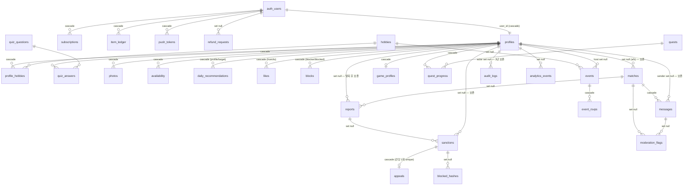

# D1 · DB 스키마 (Supabase Postgres)

> 작성: 서브에이전트 D1 (DB 스키마) · 기준일 2026-08-19
> 입력: ORCHESTRATOR_SPEC §4 + 06_PRD(M1·M7 중재) + 05_trust_safety + 04_monetization + 03_core_loop + 02_persona + 12_flows.
> 산출물: `supabase/migrations/00001~00005.sql` + `packages/db/src/types.ts`·`tier-limits.ts`.
> 테이블 30개 + 뷰 3개(`item_balances`, `my_reports`, `my_sanctions`) + 함수 15개.

---

## 다음 에이전트에게 넘기는 결정사항

### 판단 확정 (임무에서 위임된 결정)

| # | 쟁점 | 확정 | 근거 |
|---|---|---|---|
| D1-1 | `verify_level` enum vs smallint | **smallint + CHECK(0~3)** | A5 §→D1 명시 권고 + 게이트 로직의 본체가 `>= 2` 대소 비교 |
| D1-2 | admin 판정 방식 | **`profiles.role = 'admin'` 컬럼** (별도 admin_users 테이블·app_metadata 미채택) | 단일 테이블 유지가 라우트 가드(12_flows §결정-3)와 정합. `role` 은 클라이언트 UPDATE 컬럼 권한에서 제외 → service role 만 부여 가능해 권한 상승 불가 |
| D1-3 | admin 정책 범위 | admin RLS 는 **읽기 큐 한정**(reports·sanctions·moderation_flags·appeals·photos·audit_logs·analytics SELECT). **모든 어드민 변경(제재 부과·검수 확정·이의제기 결정)은 서버 라우트의 service role** | 4-eyes·감사로그 강제를 서버 한 곳으로 수렴 (D5/D8 규약) |
| D1-4 | `reason_code`/`rule_code`/`action` | **text + CHECK** (enum 아님) | A5 지시 — 코드 추가 시 enum alter 없이 CHECK 교체 |
| D1-5 | 탈퇴 파기 vs 증거 보존 충돌 | profiles 는 `auth.users` **cascade**. 단 reports/sanctions/appeals/moderation_flags/audit_logs 의 프로필 FK 는 전부 **on delete set null** → 행 보존. matches/messages(sender_id)도 set null → 상대 화면 대화방 유지(12_flows §8.10). 본인 발신분 본문 파기는 별도 파기 잡(D5/D7) | A5 §4.1 "탈퇴 이전에 복사" + §4.3 보존표 |
| D1-6 | 원장 멱등키 | `unique (user_id, ref)` (ref 단독 unique 아님) | 주간 지급 `weekly:2026-W34` 같은 ref 가 전 유저 공통이므로 유저 복합키가 옳다 (D6 주의) |
| D1-7 | messages 원문 보호 방식 | **컬럼 권한**: authenticated 는 `body`·`mask_rules` SELECT 불가, `masked_body` 등만 grant. `reports.evidence` 도 동일 수법으로 admin 포함 전 클라이언트 차단 | RLS 는 행 단위라서 열 보호는 grant 로만 가능 |
| D1-8 | RLS 헬퍼 함수 위치 | 정책이 참조하는 헬퍼 8개는 **00003 상단에 선행 정의** (00004 아님) | 마이그레이션 실행 순서 제약 (00003 이 00004 보다 먼저 실행) |
| D1-9 | 매칭 보류 해소 | `likes` insert 트리거 + **`verify_level` 2 도달 트리거** 양쪽에서 `try_create_match()` 호출 | 12_flows §8.5 "상대가 본인인증을 완료하면 매칭됩니다" 자동 성립 |
| D1-10 | 블랙리스트 | `blocked_hashes(hash_type ci/phone, hash)` 테이블 신설, 정책 0개(service role 전용) | A5 §3.1 level 5 재가입 차단 |

### 그룹별 필수 규약

- **D2 (Auth)**: ① `supabase.auth.signUp()` 의 `options.data` 에 `nickname`·`birth_date`(YYYY-MM-DD)·`gender`(m/f/n) 필수 — `handle_new_user()` 가 profiles 를 만들고, 만 19세 미만이면 예외로 **가입 트랜잭션 자체가 롤백**된다(auth.users 행도 안 남음). ② `verify_level`·`birth_date`·`status` 는 service role 로만 갱신(컬럼 권한). ③ Lv2 승급 update 만으로 보류 매칭이 자동 성립된다(D1-9 트리거). ④ Lv1 좋아요 일 3회 제한은 RLS 가 아닌 **서버 카운트**(`idx_likes_from_time` 사용) — RLS 는 자격(활성·비제재·비차단)만 방어.
- **D3 (매칭)**: `daily_recommendations` 발행/삭제는 service role 전용. `matches.first_suggestion` 은 트리거가 **null 로 생성** — 매칭 직후 D3 가 채운다(공통 취미 제안 3개). 후보 쿼리는 `idx_profiles_discover`(status, verify_level, mode, last_active_at) 기준. `profiles.boost_active_until` 로 부스트 가중.
- **D4 (채팅)**: 메시지 insert 는 **Edge Function(service role) 전용** — 클라이언트 INSERT 권한 자체가 없다. 원문 `body` → `masked_body`·`mask_rules` 생성 후 insert. 클라이언트/Realtime 은 `masked_body` 만 수신(컬럼 grant — Realtime(WALRUS)이 컬럼 권한을 반영하는지 G2 보안 리뷰에서 검증할 것). 읽음 처리만 클라이언트 UPDATE(read_at) 허용. 페이지네이션은 `(match_id, id desc)` keyset.
- **D5 (모더레이션)**: 신고 접수도 Edge Function — insert 시 `triage_report()` 트리거가 priority(P0 10코드/P1 5/P2 3)와 sla_due_at(P0 +1h, 그 외 +24h)을 자동 세팅하므로 **접수 직후 `create_report_snapshot(report_id)` 를 동기 호출**만 하면 된다(72h·200개 스냅샷 → `reports.evidence`). 이미지 evidence 버킷 복사는 함수가 못 하므로 Edge 가 수행 후 `evidence.images_copied` 병합. 본인 신고/제재 조회는 `my_reports`·`my_sanctions` 뷰.
- **D6 (결제)**: `TIER_LIMITS`·`ITEM_PRICES`·`TIER_PRICES` 는 `@duckmate/db` 의 `tier-limits.ts` 가 단일 진실. 원장 멱등키는 `(user_id, ref)`. `calc_refund()` 는 시그니처만 존재(호출 시 예외) — Phase 3 에서 payments 테이블과 함께 구현. 활성 구독 1개 제약은 `uq_subscriptions_active` partial unique.
- **D7 (알림)**: `push_tokens(platform web/ios/android)` 본인 CRUD 허용. 갱신 3일 전 스캔은 `idx_subscriptions_period_end`. KST 06:00 리셋 계열(`daily_recommendations.for_date`, `quest_progress.for_date`)의 **KST 변환 책임은 발행자(cron)** — DB 는 date 만 저장.
- **D8 (어드민)**: admin 클라이언트는 읽기 큐만 직접 조회 가능하며 `reports` 는 `select *` 가 아니라 **evidence 를 제외한 명시 컬럼**으로 조회해야 한다(컬럼 권한 위반 시 에러). evidence 열람·모든 변경은 서버 프록시(service role).
- **E그룹**: `profiles.onboarding_step` enum(`age→phone→hobbies→quiz→duckcard→photo→mode→done`)으로 재개. 클라이언트가 갱신 가능한 profiles 컬럼 = nickname, bio, region_code, mode, onboarding_step, fav_note, current_obsession, last_active_at 뿐.

---

## 1. ERD

## 2. 테이블 요약 (30개)

| 테이블 | 목적 | 핵심 컬럼/제약 |
|---|---|---|
| `profiles` | 회원 (auth.users 1:1) | **birth_date**(CHECK 만 19세 — 미성년 저장 자체 불가), verify_level smallint 0~3, status, mode, **role**(admin), **onboarding_step**, fav_note/current_obsession(덕질카드), boost_active_until |
| `hobbies` | 취미 마스터 | slug unique, category, is_active. 시드 77개 |
| `profile_hobbies` | 프로필×취미 | rank 1~3(=Top3, 프로필당 rank unique), intensity 1~5 |
| `quiz_questions` | 궁합 퀴즈 | category CHECK 5축, options jsonb 4지선다(CHECK length=4), weight(meeting·intent 1.2) |
| `quiz_answers` | 응답 | choice 0~3 = options 인덱스. 본인 외 비공개 |
| `photos` | 사진+검수 큐 | review_status pending/approved/rejected, 대표 1장 partial unique |
| `availability` | 활동 시간대 | (profile, weekday 0~6, slot 4구간) PK |
| `daily_recommendations` | 일일 추천 | (profile, target, for_date) unique, reasons jsonb, seen_at |
| `likes` | 좋아요 | (from,to) PK, type like/super |
| `matches` | 매칭 | a_id<b_id 정규화 + partial unique, first_suggestion jsonb, 탈퇴 시 set null |
| `messages` | 채팅 | **bigint identity**(keyset), body(비공개)/masked_body(공개)/mask_rules(비공개) |
| `blocks` | 차단 | (blocker, blocked) PK — is_blocked() 근거 |
| `reports` | 신고 | reason_code 18종 CHECK, evidence jsonb(전 클라이언트 차단), priority·sla_due_at(트리거 자동), 탈퇴 후 보존 |
| `sanctions` | 제재 | level 1~5, status, appeal_status, ends_at null=영구 |
| `moderation_flags` | 자동 탐지 로그 | rule_code PAT_* 7종, action 5단계 CHECK |
| `appeals` | 이의제기 | sanction_id **unique**(건당 1회), 4-eyes 는 D5/D8 집행 |
| `blocked_hashes` | CI/폰 해시 블랙리스트 | (hash_type, hash) PK. 원문 저장 금지 |
| `subscriptions` | 구독 | 상태 머신 enum 6종, **활성 1개 partial unique** |
| `item_ledger` | 아이템 원장 | append-only, **bucket + expires_at**, (user_id, ref) 멱등 unique, balance_after ≥ 0 |
| `game_profiles`/`game_sessions` | Phase 2 게임 | streak_days, participants jsonb |
| `quests`/`quest_progress` | 퀘스트 | 시드 8종 전부 is_active=false, for_date=KST 리셋일 |
| `events`/`event_rsvps` | Phase 5 이벤트 | host = Lv3 (RLS) |
| `audit_logs` | 감사로그 | actor set null, 3년 보존(파기 잡 D5) |
| `analytics_events` | 퍼널 이벤트 | name = A3 §4.1 고정, props jsonb |
| `push_tokens` | 푸시 구독 | **platform**(web/ios/android), (user, token) unique |
| `contact_messages` | 회사 사이트 문의 | anon insert 허용, 열람 service 전용 |
| `refund_requests` | 환불 큐(Phase 3) | status 4단계, 탈퇴 후 보존(set null) |

## 3. RLS 정책 매트릭스

`—` = 불가(service role 만). service role 은 항상 RLS 우회. ✎c = 컬럼 제한 쓰기.

| 테이블 | 본인 | 상대(매칭/탐색) | admin(클라이언트) | anon |
|---|---|---|---|---|
| profiles | R + U(✎c 화이트리스트) | R (can_view_profile: 활성·Lv1+·비차단·비제재) | R 전체 | — |
| hobbies / quiz_questions / quests | R(active) | R(active) | R | — |
| profile_hobbies / availability | CRUD | R (can_view_profile) | — | — |
| quiz_answers | CRUD | — | — | — |
| photos | C(✎c)/R/U(is_primary)/D | R (approved 만) | R (검수 큐) | — |
| daily_recommendations | R + U(seen_at) | — | — | — |
| likes | C(자격 검증) / R(보낸+받은) | — | — | — |
| matches | R + U(status·closed_at) — 차단 시 비노출 | 동일(참여자) | — | — |
| messages | R(✎c masked_body 만) + U(read_at) | 동일(참여자) | — | — |
| blocks | CRUD(blocker 본인) | — | — | — |
| reports | 뷰 `my_reports` 만 | — | R(✎c evidence 제외) | — |
| sanctions | 뷰 `my_sanctions` 만 | — | R | — |
| moderation_flags / audit_logs | — | — | R | — |
| appeals | C(30일 내·내 제재) + R | — | R | — |
| blocked_hashes | — | — | — | — |
| subscriptions / item_ledger | R | — | — | — |
| game_profiles / quest_progress | R | — | — | — |
| game_sessions | R(참여자) | 동일 | — | — |
| events | R(활성 회원) + 호스트 CUD(Lv3) | R | R | — |
| event_rsvps | C(Lv2)/R/D | 호스트 R | — | — |
| analytics_events | C(본인 명의) | — | R | — |
| push_tokens | CRUD | — | — | — |
| contact_messages | C | C | — | **C** |
| refund_requests | C + R | — | R | — |

**연령/제재 RLS 방어**: 모든 상호작용 정책이 `is_active_member()`(active + Lv1+ + `birth_date <= now-19y` + 활성 제재 Lv3+ 없음) 또는 `can_engage()`(추가로 Lv2 기능제한 없음)를 경유한다. `matches` 생성(트리거)은 **양측 Lv≥2** 를 함수 내부에서 재검증 — 미인증 유저 간 DM 불가가 DB 레벨에서 보장된다.

## 4. 인덱스 근거 (실쿼리 패턴)

| 인덱스 | 서비스 쿼리 |
|---|---|
| `idx_profiles_discover` (status, verify_level, mode, last_active_at) | D3 추천 후보 필터+정렬 |
| `idx_daily_recs_queue` (profile, for_date, score desc) | 오늘 추천 큐 열기·미소진 재개(S2) |
| `idx_daily_recs_seen` (profile, target) partial | 재노출 규칙 판정 |
| `idx_likes_to` (to_id, created_at desc) | "나를 좋아한 사람" 블러 카운트 + 상호 확인 |
| `idx_likes_from_time` (from_id, created_at desc) | Lv1 일 3회 서버 카운트 |
| `idx_messages_pagination` (match_id, id desc) | 채팅 keyset 페이지네이션(동률 안전) |
| `idx_messages_unread` partial (read_at null) | 안읽음 배지 |
| `idx_messages_created_at` (match_id, created_at) | 72h 스냅샷 범위 스캔 |
| `idx_reports_queue` (priority, sla_due_at) partial 미종결 | 어드민 신고 큐 P0 최상단·SLA 카운트다운 |
| `idx_reports_target` (target_id, created_at) | AUTO_3REPORTS 30일 집계 |
| `idx_photos_review_queue` partial pending | 미완료 검수 큐(오래된 순) |
| `idx_sanctions_active` partial ACTIVE | is_active_member()·라우트 가드 매 요청 판정 |
| `idx_modflags_profile` (profile, created_at) | AUTO_PATTERN_SCAM 24h 히트 |
| `idx_item_ledger_balance` (user, item, expires_at nulls last) | 차감 순서 = 만료 임박 우선 |
| `idx_subscriptions_period_end` partial active | 갱신 3일 전 고지 cron |
| `idx_analytics_name_time` (name, created_at) | D8 퍼널 집계 |
| `uq_matches_pair` / `uq_photos_primary` / `uq_profile_hobbies_rank` / `uq_subscriptions_active` | 무결성(쌍 유일·대표사진 1·Top3 유일·활성 구독 1) |

## 5. 함수/트리거 시그니처 (D2~D8 이 호출·의존하는 것)

| 함수 | 위치 | 성격 | 비고 |
|---|---|---|---|
| `calc_age(date) → int` | 00004 | stable | 만 나이 |
| `current_profile_id() → uuid` / `current_verify_level() → smallint` / `is_admin()` / `is_blocked(a,b)` / `is_active_member()` / `can_engage()` / `can_view_profile(t)` / `can_appeal(id)` | 00003 | definer, RLS 헬퍼 | authenticated 호출 가능 |
| `handle_new_user()` | 00004 | auth.users AFTER INSERT 트리거 | 미성년 = 가입 롤백 |
| `try_create_match(a,b) → uuid` | 00004 | definer, **service 전용** | 상호 좋아요+양측 Lv2+비차단+비제재 검증 후 matches 생성. null = 보류 |
| `check_mutual_like_and_match()` | 00004 | likes AFTER INSERT 트리거 | try_create_match 위임 |
| `resolve_pending_matches_on_verify()` | 00004 | profiles verify_level 2 도달 트리거 | 보류 매칭 자동 성립 |
| `triage_report()` | 00004 | reports BEFORE INSERT 트리거 | priority + sla_due_at 자동 |
| `create_report_snapshot(uuid) → jsonb` | 00004 | definer, **service 전용** | 72h·200개 evidence 기록. 이미지 복사는 Edge 후처리 |
| `calc_refund(text, timestamptz) → jsonb` | 00004 | **뼈대** — 호출 시 예외 | Phase 3 D6 구현 (계산식은 함수 주석) |
| `set_updated_at()` | 00002 | 공용 updated_at 트리거 | profiles·reports·sanctions·subscriptions·game_* |

## 6. 미결/후속

1. **payments 테이블 없음** — Phase 3 에서 D6 이 추가(calc_refund 와 동시). refund_requests·subscriptions·item_ledger 는 선확정 완료.
2. **파기 잡** — evidence(종결+1년)·audit(3년)·접속로그(3개월)·탈퇴자 메시지 본문 파기는 D5/D7 의 cron(Edge) 소관. 스키마는 set null 보존 구조로 준비됨.
3. **Realtime 컬럼 권한** — messages 의 body 차단이 Realtime(WALRUS) 페이로드에도 적용되는지 G2 보안 리뷰 항목으로 명시 요청.
4. **콜드스타트 취미 카테고리 최종 선정**(PRD 오픈이슈 9) — 시드는 A1 추천안 포함 12개 카테고리 77태그로 선반영, 소유자 확정 시 is_active 로 조정.
