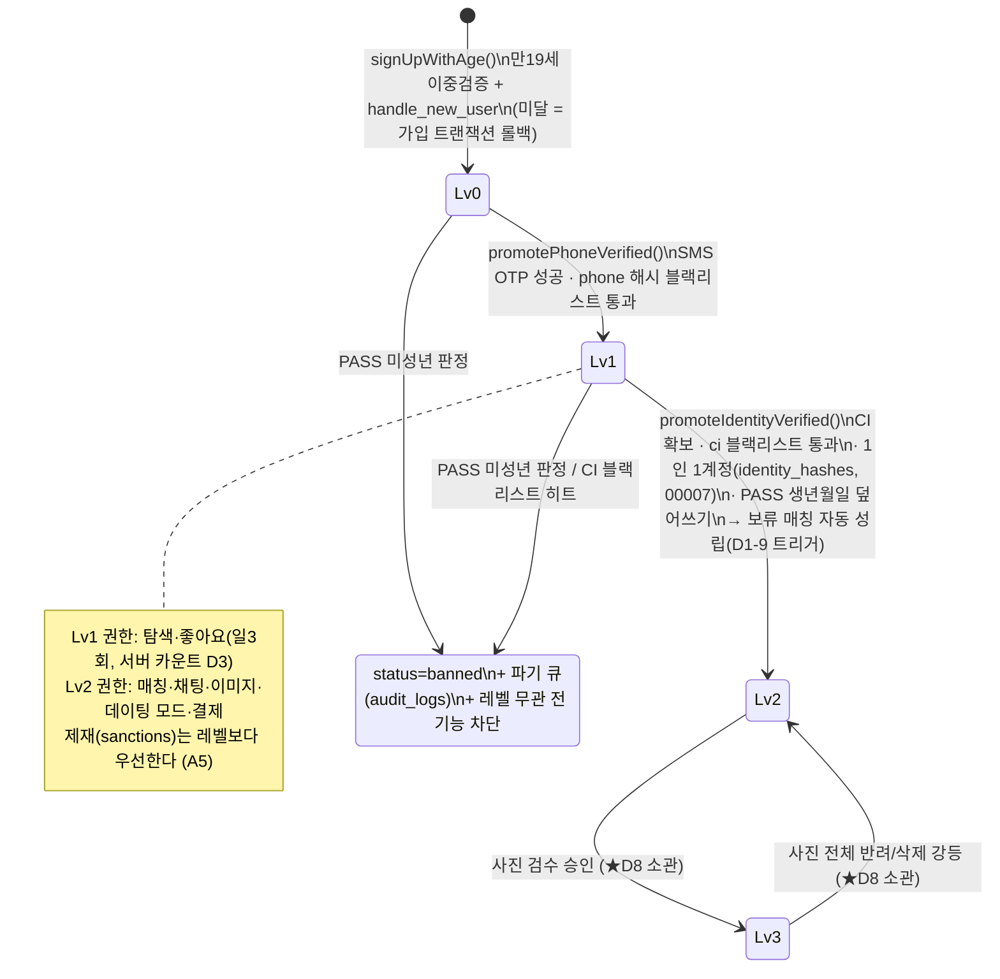

# D2 · Auth/인증 파이프라인

> 작성: 서브에이전트 D2 (Auth) · 기준일 2026-08-19
> 입력: 14_schema(D1 규약 5줄) + 05_trust_safety(verify_level·3중 게이트) + 09_store_policy(심사 바이패스) + 12_flows(온보딩 7스텝·3층 가드).
> 산출물: `apps/web/lib/auth/{actions,schemas,identity-verifier,verify,guards}.ts`,
> `apps/web/app/api/auth/verify-identity/route.ts`, `supabase/migrations/00006_storage.sql`.

---

## 다음 에이전트에게 넘기는 결정사항

### 판단 확정

| # | 쟁점 | 확정 | 근거 |
|---|---|---|---|
| D2-1 | 액션 에러 전달 방식 | throw 아닌 **`ActionResult` 반환** (`{ok:false, code, message}`) — 코드 목록은 `lib/auth/schemas.ts` `ActionErrorCode` | E그룹이 code 로 UI 분기(리다이렉트는 화면 몫). Server Action throw 는 Next 가 마스킹함 |
| D2-2 | Top3 rank 지정 시점 | **`saveHobbies` 에서 rank 1·2·3 각 1개 필수** (12_flows 는 duckcard 화면에서 지정하지만, 저장 계약상 rank 는 profile_hobbies 행이므로 hobbies 액션 소관). E1 duckcard 화면에서 순위를 바꾸면 `saveHobbies` 재호출로 반영 | rank 는 `profile_hobbies` 컬럼 — 한 액션이 테이블 하나를 완결 소유 |
| D2-3 | 스텝 순서 강제 규칙 | 각 액션은 `onboarding_step` 이 해당 스텝에 **도달**(진행 중 또는 이미 지남)했는지 검사. 진행 중이었다면 저장 성공 시 다음 스텝으로 전진, 이미 지났다면 유지(재편집 허용·되감기 금지). 스킵 전진(`advanceOnboardingStep`)은 **duckcard·photo 에서만** 허용 | 12_flows §결정-4 (스킵 가능 = 덕질카드·사진뿐) |
| D2-4 | `photos.path` 저장 형식 | **버킷 접두 포함** `photos/{profile_id}/{uuid}.webp` (Storage 객체 키는 `{profile_id}/{uuid}.webp`) | 00006 의 매칭 상대 열람 정책이 `'photos/' \|\| objects.name = photos.path` 조인에 의존 — D3/D4/D8 은 이 형식 그대로 사용 |
| D2-5 | 미성년/재가입 차단 시 계정 처리 | CI 블랙리스트 히트·PASS 미성년 판정 모두 **즉시 `status=banned`** + audit_logs 기록. 파기 실행은 D5/D7 파기 잡이 `action='verify.underage.purge_queued'` 로그를 큐로 소비 | A5 §1.3-2. birth_date CHECK 때문에 미성년 생년월일은 덮어쓰기 자체가 불가 → 덮어쓰기 전 판정 |
| D2-6 | stub 프로덕션 감시 | `IDENTITY_VERIFIER=stub` + `NODE_ENV=production` 이면 **경고 로그 1회** (기동 차단은 안 함 — 심사 기간 중 의도적 사용 가능성). 화이트리스트 바이패스 사용은 audit_logs `meta.bypass=true` 로 전량 추적 | B3 오픈이슈 6 (심사 바이패스 보안 통제) |
| D2-7 | 회원가입 직후 스텝 | `signUpWithAge` 성공(세션 발급) 시 `region_code` 저장 + `onboarding_step='phone'` 으로 전진 — 연령 스텝은 가입 폼에 통합돼 있으므로 별도 age 저장 액션 없음 | 12_flows §2.1 (age 는 가입 직후 첫 화면) |

### 미결 → 확정 이력

1. **CI 중복(1인 1계정) — 확정·구현 완료**: 오케스트레이터가 `identity_hashes` 테이블 신설(마이그레이션 **00007** — `profile_id pk → profiles cascade`, `ci_hash` unique, RLS enable + 정책 없음 + revoke all = **service role 전용**). `promoteIdentityVerified` 가 blocked_hashes 통과 후 `ci_hash` 중복을 조회해 **타 프로필에 이미 매핑된 CI 면 `CI_ALREADY_REGISTERED`(HTTP 409) 로 승급 거부**(audit `verify.ci.duplicate` 기록), 동일 프로필 재인증은 통과·upsert. `uq_identity_hashes_ci`(23505) 가 동시성 레이스의 최후 방어선.
2. **휴대폰 OTP 발송/검증 자체가 미구현 (미결 유지)**: Supabase Auth phone provider 또는 SMS 어댑터 선택이 필요(번호당 1계정 강제 포함). `promotePhoneVerified(userId, phone)` 는 "OTP 검증 성공 후" 호출되는 승급 함수만 제공 — OTP 플로우는 E1+오케스트레이터 결정 후 `app/api/auth/phone/**` 로 추가 예정.

### middleware.ts 변경 요청 (오케스트레이터 소유 — D2 는 수정하지 않았음)

1. ✅ **반영 완료(오케스트레이터)** — `PUBLIC_PATHS` 에 `/signup` 추가됨.
2. ✅ **반영 완료(오케스트레이터)** — `/api/**` 는 비로그인 시 `/login` 리다이렉트 대신 401 JSON 반환.
3. `/onboarding/age` 만 PUBLIC 인 현재 구성은 유지 가능 — 가입 폼이 연령을 포함하므로 `/onboarding/age` 화면은 사실상 사용되지 않을 수 있음(E1 판단).

### env 추가분 (.env.example 은 오케스트레이터 소유 — 추가 요청)

```
IDENTITY_VERIFIER=            # "stub" 이면 StubVerifier 활성 (개발/E2E). 미설정 = PortOne
REVIEW_BYPASS_EMAILS=         # 심사용 바이패스 이메일 쉼표 구분 (B3 R2). 프로덕션에서도 Stub 경로
```

---

## 1. 인증 레벨 상태 머신



- 레벨은 **단조 증가가 아니다**: 3→2 강등 존재(D8), 제재가 레벨 위에 겹친다.
- Lv2 승급 update 하나로 `trg_profiles_verify_match` 가 보류 매칭을 자동 성립시킨다 — **D3/E2 는 승급 후 매칭 생성 API 를 따로 부르지 말 것**.

## 2. Server Actions 시그니처 (`lib/auth/actions.ts` — 전부 `ActionResult` 반환)

| 액션 | 입력 (zod: `lib/auth/schemas.ts`) | 성공 데이터 | 스텝 강제 | 주요 에러 코드 |
|---|---|---|---|---|
| `signUpWithAge` | `{email, password, nickname(2~12), birthDate(YYYY-MM-DD), gender(m/f/n), regionCode}` | `{userId}` | — (성공 시 step→`phone`) | `UNDERAGE` `EMAIL_TAKEN` `AUTH_FAILED` |
| `signIn` | `{email, password}` | `{userId}` | — | `AUTH_FAILED` |
| `signOut` | — | — | — | — |
| `saveHobbies` | `{hobbies: [{hobbyId, intensity 1~5, rank 1\|2\|3\|null}] (3~5개, rank 1·2·3 각 1개)}` | — | `hobbies` | `STEP_ORDER` `INVALID_INPUT` |
| `saveQuizAnswers` | `{answers: [{questionId, choice 0~3}] (정확히 10, 중복 금지)}` | — | `quiz` | `STEP_ORDER` `INVALID_INPUT` |
| `saveDuckCard` | `{favNote ≤40 \| null, currentObsession ≤80 \| null}` | — | `duckcard` | `CONTACT_INFO_BLOCKED` |
| `savePhoto` | `{path: "photos/{내 profile_id}/{uuid}.webp", isPrimary}` | `{photoId}` | `photo` | `INVALID_INPUT` (경로 규약/타인 폴더) |
| `saveMode` | `{mode: friend\|dating}` | — | `mode` (성공 시 step→`done`) | `VERIFY_LEVEL_REQUIRED` (dating & Lv<2) |
| `advanceOnboardingStep` | — | `{step}` | `duckcard`/`photo` 에서만 스킵 전진 | `STEP_ORDER` |

E1 사용 규칙:
- `VERIFY_LEVEL_REQUIRED` 를 받으면 friend 로 재호출 + 홈에 `/verify` CTA (12_flows §2.7 — 가입 흐름을 끊지 않는다).
- `STEP_ORDER` 를 받으면 message 의 현재 스텝으로 라우팅 (`/onboarding/{step}`).
- `savePhoto` 는 Storage 업로드(아래 §5) **성공 후** 호출한다. `review_status` 는 서버 기본값 pending — 클라이언트가 만질 수 없다.

## 3. IdentityVerifier 어댑터 계약 (`lib/auth/identity-verifier.ts` — 서버 전용)

```ts
interface IdentityVerifier {
  name: "portone" | "stub";
  requestVerification(userId): Promise<{ redirectUrl?: string; token?: string }>;
  confirmVerification(userId, payload): Promise<{ ok, ci?, birthDate?, phone?, reason? }>;
}
```

| 구현 | 활성 조건 | 동작 |
|---|---|---|
| `PortOneVerifier` | 기본값 | PORTONE_* env 없으면 `IDENTITY_VERIFIER_NOT_CONFIGURED` 에러. **실연동은 Phase 4** — 지금은 어댑터 뼈대만 |
| `StubVerifier` | `IDENTITY_VERIFIER=stub` **또는** 이메일이 `REVIEW_BYPASS_EMAILS` 화이트리스트에 있음 | 항상 성공. 결정적 CI `STUB-CI-{userId}` · birthDate `1995-01-01`. 프로덕션 + env stub 이면 경고 로그 |

- 선택은 `getIdentityVerifier(email?)` 팩토리 한 곳 — 직접 `new` 금지.
- **CI 원문은 어디에도 저장 금지**: `verify.ts` 가 sha256 해시 후 즉시 폐기(audit·blocked_hashes 는 해시만).
- 승급 함수(`promotePhoneVerified`/`promoteIdentityVerified`)는 `lib/auth/verify.ts` — service role 전용, 클라이언트 import 시 런타임 예외.

## 4. E1(온보딩 UI)이 호출할 API 목록

| 호출 | 방식 | 용도 |
|---|---|---|
| `signUpWithAge` / `signIn` / `signOut` | Server Action | /signup·/login |
| `saveHobbies` `saveQuizAnswers` `saveDuckCard` `savePhoto` `saveMode` `advanceOnboardingStep` | Server Action | /onboarding/* 각 스텝 |
| `POST /api/auth/verify-identity` `{action:"request"}` | fetch | /verify 진입 시 인증 세션 시작 → `redirectUrl`(PortOne) 또는 `token`(stub) |
| `POST /api/auth/verify-identity` `{action:"confirm", payload}` | fetch | 인증 결과 확정 → 성공 시 Lv2 승급 완료 응답 `{ok:true, verifyLevel}` |
| `GET /api/auth/verify-identity?token=…` | 브라우저 이동 | stub/E2E 콜백 — 처리 후 `/verify?status=success\|<code>` 복귀 |
| `requireUser` `requireOnboardingDone` `requireVerifyLevel(n)` `requireAdmin` (`lib/auth/guards.ts`) | 서버 컴포넌트(레이아웃) | 3층 가드의 2층. `(main)/layout`→`requireOnboardingDone`, chat 계열→`requireVerifyLevel(2)`, `(admin)/layout`→`requireAdmin` |

confirm 에러 코드: `VERIFY_FAILED`(400) `CI_BLOCKED`/`UNDERAGE`/`PHONE_BLOCKED`(403) `CI_ALREADY_REGISTERED`(409 — 기존 계정 로그인 안내, 12_flows §2.2 와 동일하게 계정 존재 사실 외 정보 비노출) `VERIFIER_NOT_CONFIGURED`(503).

## 5. 스토리지 경로 규약 (00006_storage.sql)

| 버킷 | 객체 키 | `path` 컬럼 저장값 | 업로드 | 열람(signed URL 발급 가능자) |
|---|---|---|---|---|
| `photos` (비공개, webp only, 10MB) | `{profile_id}/{uuid}.webp` | `photos/{profile_id}/{uuid}.webp` | 본인 폴더만 | 본인(전체) · admin(검수 큐) · **매칭 상대(approved 만)**. 탐색 카드 사진은 D3/E2 서버가 service role 로 발급 |
| `chat-images` (비공개, webp only, 10MB) | `{match_id}/{uuid}.webp` | messages.image_path 에 `chat-images/{match_id}/{uuid}.webp` 권장(D4 확정) | 해당 매칭 참여자 + 본인 Lv≥2 + `can_engage()` | 매칭 참여자만. 증거 복사는 D5 가 service role 로 evidence/ 버킷에 수행 |

- 파일명은 **항상 새 uuid** — 덮어쓰기(update) 정책 없음(검수 우회 방지). 반려 후 재업로드 = 새 객체 + `savePhoto` 재호출.
- `evidence/` 버킷은 D5 가 별도 마이그레이션으로 생성한다(전 클라이언트 차단).

## 6. D3~D8 관련 규약 요약

- **D3**: Lv2 승급은 트리거가 보류 매칭을 만든다 — D3 는 `matches.first_suggestion` 채우기만. Lv1 좋아요 일 3회 카운트는 D3 서버 몫(D1 규약 ④).
- **D4**: 이미지 업로드 게이트는 00006 정책이 1차 방어(Lv≥2 + can_engage). 메시지 insert 시 image_path 규약은 §5.
- **D5/D7**: `audit_logs.action='verify.underage.purge_queued'` 가 파기 큐 신호. phone/ci 해시는 `hashIdentity`(sha256, trim 후) — 블랙리스트 등록(D5 제재 집행)도 동일 함수 규약으로 해시할 것.
- **D8**: Lv3 승급/강등은 사진 검수 확정 라우트에서 함께 처리(verify.ts 주석 참조). 심사 바이패스 계정 생성 시 `REVIEW_BYPASS_EMAILS` 등록 + 프로덕션 시드(B3 §4.2).
