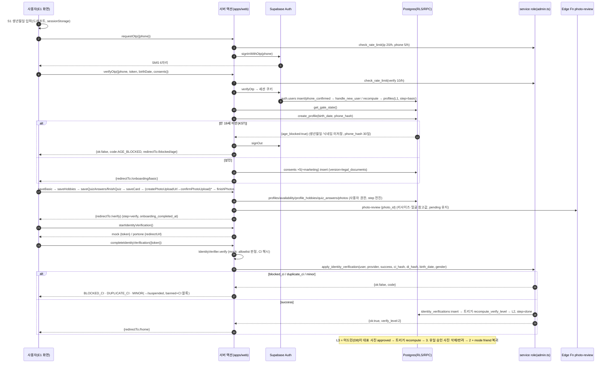

# 15 — Auth · 인증 파이프라인 (D2)

> 입력: `14_schema.md`(D1 결정 40개), `05_trust_safety.md`, `12_flows.md`(게이트 순서·라우트·온보딩 저장 규칙·4xx 매핑), `07_legal_checklist.md`(동의 키), `08_legal_docs.md`(재동의 MAJOR), `06_PRD.md`(§0-1~3·19·39, F-001/002/010/011/038).
> 산출물: `supabase/migrations/20260902000014_auth_pipeline.sql`, `apps/web/{middleware.ts, lib/env.ts, lib/supabase/*, lib/auth/*, lib/onboarding/*, lib/account/actions.ts, lib/identity/*, lib/photos/*, app/(auth)/actions.ts, app/api/{health,auth/callback,identity/callback}/route.ts}`, `supabase/functions/{_shared,photo-review,identity-webhook}`, `packages/db/src/auth.ts`(+types/constants 델타), `.env.example`.
> **UI 없음**(E1 담당). 기준일 2026-09-02, 로컬 PostgreSQL 16 에 마이그레이션 14개 적용·RPC 시나리오 검증 완료(§7).

## 다음 에이전트에게 넘기는 결정사항

### E1 (온보딩·인증 게이트 UI) — 서버 액션 시그니처·에러·리다이렉트
1. **모든 서버 액션은 throw 하지 않고 `ActionResult<T>`** (`{ok:true,data}` | `{ok:false,code,message,field?,retryAfterSec?,redirectTo?}`) 를 반환한다(`lib/auth/errors.ts`). 클라이언트 처리 규칙: `redirectTo` 가 있으면 **무조건 그리로 이동**, `field` 가 있으면 인라인 오류, `RATE_LIMITED` 면 토스트 + `retryAfterSec`. `message` 는 그대로 보여도 되는 문구(내부 정보 없음).
2. **S2 OTP**: `requestOtp({phone})` → `{phone:E.164, resendAfterSec:30}`. 번호는 어떤 형식(010-…/+82…)이든 서버가 E.164 로 정규화. 한도: 번호 5회/h(발송)·IP 20회/h·검증 10회/h — 초과 시 `RATE_LIMITED`(문구 "요청이 많아요. 1시간 후 다시 시도해 주세요").
3. **가입 = `verifyOtp({phone, token, birthDate:"YYYY-MM-DD", consents:{terms,privacy,youthPolicy,evidenceSnapshot,marketingPush?}})`**. 재방문 로그인은 `birthDate/consents` 없이 같은 액션. 응답 `{redirectTo, isNew}` — 신규 `/onboarding/basic`, 기존 회원은 게이트가 정한 곳(`/home` `/verify` `/onboarding/{step}` …). `AGE_BLOCKED` 실패는 서버가 이미 로그아웃한 상태이며 `redirectTo:"/blocked/age"`.
4. **연령 재계산은 서버(KST 만 나이, `is_adult`)**. 클라이언트 S1 계산은 UX 용. 미성년은 `create_profile` 이 `status='age_blocked'` + `phone_hash` 만 남기고 **생년월일·닉네임을 저장하지 않는다**(B1 §0-14). `/blocked/age` 는 세션 없이도 렌더 가능해야 한다(가입 직후 로그아웃됨) — 30일 내 같은 번호로 재로그인하면 게이트 ②가 다시 `/blocked/age` 로 보낸다.
5. **드래프트 없이 OTP 만 한 재방문자**(`has_birth_date=false`) → `verifyOtp` 가 `redirectTo:"/onboarding/age"` 를 준다. 그 화면에서 로그인 상태면 `submitBirthDate({birthDate, consents?})` 를 호출한다(동의 이력이 없으면 `consents` 필수 → `INVALID_INPUT field=consents`).
6. **동의 저장 키 6개**: `age_19`·`terms`·`privacy`·`evidence_snapshot`·**`youth_policy`(0014 신설)** 필수 + `marketing_push` 선택. 체크박스는 C3 S2 대로 3개(약관·개인정보·청소년보호)여도 되지만 `evidenceSnapshot` 은 약관 요약 3줄 노출 후 **같이 true 로 보내야** 한다(B1 §0-18 설명의무). 필수는 사전 체크 금지. version 은 `legal_documents` 현재 버전을 서버가 채운다.
7. **온보딩 저장 액션(`lib/onboarding/actions.ts`)과 step 전이**: `saveBasic` basic→hobbies / `saveHobbies` hobbies→quiz / `saveQuizAnswers`(upsert, 전이 없음) + `finishQuiz({skipped})` quiz→card / `saveCard` card→photos / `finishPhotos({skipped})` photos→**verify**(+`onboarding_completed_at`). 응답 `{nextStep, redirectTo, advanced}` — `router.replace(redirectTo)`.
8. **step 은 앞으로만 간다.** 이미 지난 화면은 다시 열어 저장 가능(값만 갱신, `advanced:false`, `redirectTo` = 현재 step 화면). 아직 안 온 화면의 액션은 `ONBOARDING_INCOMPLETE` + `redirectTo` = 현재 step. 프리필은 `getOnboardingSnapshot()`.
9. **`onboarding_step` 값 의미**: `basic..photos` = 다음에 보여줄 온보딩 화면 / **`verify` = 6화면 완료·본인인증 전** / `done` = L2 달성. `verify`·`done` 모두 "온보딩 완료"로 취급되어 `/me`·`/settings`(L1 라우트) 접근 가능 → `/verify` 의 [프로필 먼저 다듬기] 가 동작한다. `done` 전이는 `apply_identity_verification` 이 자동 수행.
10. **본인인증**: `startIdentityVerification()` → mock 이면 `{kind:"token", token}` 을 받아 **곧바로** `completeIdentityVerification({token})` → `{code:"OK", verifyLevel:2, redirectTo:"/home"}`. portone(Phase 4)은 `{kind:"redirect", redirectUrl}` → `window.location`. 실패 코드 → 문구: `NOT_ALLOWLISTED` "지금은 초대된 번호만 인증할 수 있어요" / `DUPLICATE_CI` "이미 가입된 정보예요" / `BLOCKED_CI` "이 정보로는 가입할 수 없어요" / `IDENTITY_FAILED` 재시도 / `MINOR` → `redirectTo:"/suspended"`(세션 유지, 영구정지 화면; C3 의 "로그아웃" 대신 게이트 ③이 모든 라우트를 `/suspended` 로 보낸다). 개발 환경에서는 `completeIdentityVerification({token, simulate:"fail"|"minor"|"duplicate"})` 로 실패 경로를 재현할 수 있다(프로덕션에서는 무시).
11. **사진**: `createPhotoUploadUrl({contentType, sizeBytes})` → `{photoId, path, token, signedUrl}` → 클라이언트 `supabase.storage.from("photos").uploadToSignedUrl(path, token, file, {contentType})` → `confirmPhotoUpload({photoId})` → `{isPrimary, reviewStatus:"pending"}`. 첫 장 자동 대표. 5MB·jpeg/png/webp·6장. 삭제 `deletePhoto`, 대표 지정 `setPrimaryPhoto`(승인 사진만). 검수 카피는 "24시간 안에 확인해요"(자동 승인 없음).
12. **닉네임은 2~10자**(DB check·`NICKNAME_MAX`; 오케스트레이터 지시의 12자는 기각 — D1 스키마 우선). 허용 문자 `가-힣 a-z A-Z 0-9 _ .`. 연락처/금칙어는 `INVALID_INPUT field=nickname` + 문구 "연락처처럼 보이는 닉네임은 쓸 수 없어요" / "사용할 수 없는 닉네임이에요". 중복은 `CONFLICT` "이미 사용 중인 닉네임이에요".
13. **입력 스키마는 `lib/onboarding/schemas.ts` 를 그대로 import** 해 폼 검증에 쓴다(서버와 동일 규칙·문구). `ageYearsKst()`/`kstToday()` 도 여기.

### E2~E5 (앱 화면) · D3~D8 (서버)
14. **layout 게이트**: `(app)/layout.tsx` → `await requireProfile(minLevel)` (1 = `/me`·`/settings`, 2 = `/home`·`/reco`·`/chat`), `(onboarding)/…/layout.tsx` → `await requireGate({kind:"onboarding", step})`, `/verify` → `requireGate({kind:"verify"})`, `(admin)` → `requireAdmin("moderator"|"admin")`(실패 = `/404`). 전부 `lib/auth/session.ts`. 미들웨어는 같은 `evaluateGate()` 로 1차 리다이렉트만 하고 **layout 이 항상 DB 를 다시 본다**.
15. **게이트 순서는 `lib/auth/gate.ts evaluateGate()` 단일 함수**(C3 §0-3 ①~⑦ + `has_birth_date` 검사 ⑤-a). 상태 소스는 RPC `get_gate_state()` 1회 조회(`parseGateState` → `GateState`, `@duckmate/db`). 클라이언트는 이 순서를 재구현하지 않는다.
16. **`session` 슬라이스 hydrate 값** = `GateState` (`profileId, status, onboardingStep, verifyLevel, mode, sanctionLevel, role`). `requireProfile()` 이 `{user, state, profile}` 을 주므로 layout 에서 props 로 내려준다. `verify_level/mode/status` 는 클라이언트가 바꾸지 않는다(§0-16 C3).
17. **서버 액션 작성 규칙(D3~D8 공통)**: `const ctx = await requireProfileForAction(minLevel)` → `ctx.supabase`(사용자 권한, RLS) 로 쓰기 → 필요 시 `createAdminClient()`(service role, `server-only`) 로 RPC → 상태를 바꿨으면 `await invalidateGateCache()` → `try/catch` 에서 `toActionFailure(e)`. RPC 의 `raise exception 'CODE: …'` 는 `fromDbError()` 가 첫 토큰으로 `AuthError` 매핑(28000→NOT_AUTHENTICATED, 42501→FORBIDDEN, 23505→CONFLICT, 23514→INVALID_INPUT).
18. **service role 클라이언트는 `lib/supabase/admin.ts` 하나**(`import "server-only"`). 클라이언트 컴포넌트/`"use client"` 파일에서 import 하면 빌드 실패. 사용처는 반드시 호출자 검증 뒤 + 판정을 `audit_logs` 에 남긴다. `serverEnv()`(`lib/env.ts`) 도 서버 전용, `publicEnv()` 만 클라이언트 가능.
19. **0014 RPC 목록**: `get_gate_state()`, `create_profile(p_birth_date, p_phone_hash)`, `set_mode(p_mode, p_seeking_gender)`, `request_delete()`, `cancel_delete()`, `pause_account()`, `resume_account()` (authenticated) / `apply_identity_verification(…)`, `check_rate_limit(p_key, p_limit, p_window)` (service role). 타입은 `Database["public"]["Functions"]` 에 추가됨.
20. **모드 전환(D2 소관)**: E5 는 `setMode({mode, seekingGender?, previewViewed})`(`lib/account/actions.ts`) 만 호출. dating 은 L3 + `seeking_gender` + 미리보기 완료 → 아니면 `NOT_ENTITLED`(문구 "본인인증 + 승인된 대표 사진 1장이 필요해요", `redirectTo:"/settings/verify"`). 성공 시 `consents(dating_mode_public)` 기록 + `audit_logs(mode_changed)`. `profiles.mode` 직접 update 는 컬럼 권한으로 불가.
21. **탈퇴/휴면(E5)**: `requestDelete()`(→ `status=deleting`, 7일 유예, 로그아웃, `redirectTo:"/"`) / `cancelDelete()`(`/account/restore` 에서, → `/home`) / `pauseAccount()`(로그아웃) / 재로그인 시 `verifyOtp` 가 `resume_account` 를 자동 호출(C3 §6.4 "재로그인 시 즉시 해제"). 실제 삭제는 D7 `purge_daily`(`delete_requested_at + 7d`, 파일은 `removeProfilePhotoObjects` 재사용).
22. **재동의(E5 홈 배너)**: `pendingReconsents(supabase, userId)`(`lib/auth/consents.ts`) → `[{documentKey, version}]`. 규칙 = `legal_documents.requires_reconsent=true` **AND** `major(현재) > major(사용자 최신 동의)`(08_legal_docs §0-9). 동의 저장은 `recordConsent(…, "reconsent", true, "banner", ctx, documentKey)`.
23. **레이트리밋 공용**: `enforceRateLimit(admin, key, limit, windowSec)` (`lib/auth/otp.ts`) — DB 고정 윈도우(`rate_limits` 테이블), 키는 항상 해시(`rateLimitKey(scope, raw)`). D3 좋아요·D4 메시지 분당 30건도 이걸 쓰면 된다. 저장소 장애 시 **fail-closed**. D7: `rate_limits.updated_at < now()-1 day` 삭제를 `purge_daily` 에 추가.
24. **사진 검수(D8)**: 업로드 직후 `photos.review_status='pending'` 그대로, Edge Function `photo-review` 가 1080px WebP 재인코딩(EXIF 제거) + `face_count/face_confidence/auto_flags` 참고값만 기록. **자동 승인·반려 없음**(A5 §8). 어드민 승인/반려 → 트리거가 `recompute_verify_level`. `auto_flags.face ∈ unknown|none|one|many` 를 큐 화면에 표시하면 된다.
25. **D5/D8 주의**: `apply_identity_verification` 은 생년 불일치(둘 다 성인) 시 `create_report(MINOR_SUSPECT, surface=system)` 를 만들고 그 자동 조치(`profile_hidden_reverify`)는 **인증 성인 확인으로 즉시 복구**한다(A5 §7.5). 신고 자체는 P0 큐에 남으므로 사람이 판정한다. `hidden_reason='MINOR_SUSPECT'` 인 프로필은 성인 인증 성공 시 자동 복구된다(다른 사유는 유지).
26. **미성년 확정(인증 생년월일 < 만 19세)**: `identity_verifications(result='minor')` + `blocked_ci_hashes(MINOR_CONFIRMED, 무기한)` + `issue_sanction(6,'AUTO:MINOR_CONFIRMED')`(트리거 → `banned`·매칭 `paused`) + 사진 행·파일 삭제 + `profiles.birth_date=null`. 이의신청 불가(RLS). D7 purge: `identity_verifications` 5년.

### D1 스키마 델타 (0014) — 손 타입 갱신 완료
27. `consent_key` enum + `youth_policy`. `photos.auto_flags jsonb`. `rate_limits(key, window_start, count, updated_at)`(RLS 정책 없음 = service 전용). `REQUIRED_ONBOARDING_CONSENTS` 5개, `ERROR_CODES` 에 `AGE_BLOCKED ONBOARDING_INCOMPLETE DELETING INVALID_INPUT NOT_FOUND FORBIDDEN` 추가.
28. **함수 권한 회수 재적용**: Supabase 기본 default privileges 는 새 함수 execute 를 `authenticated` 에도 부여한다. 0009 의 `revoke … from public, anon` 만으로는 `recompute_verify_level`·`issue_sanction`·`apply_block_internal` 이 authenticated 에서 호출 가능했다(로컬 셰임에서 재현) → 0014 가 셋을 `authenticated` 에서도 명시 회수. **이후 service 전용 함수를 만드는 에이전트(D3~D8)는 반드시 `revoke execute … from public, anon, authenticated` 를 같이 쓴다.**

### G2 (보안 리뷰 포인트)
29. service role 키: `lib/supabase/admin.ts`(server-only) 외 참조 없음. 빌드 산출물 `.next/static` grep `SUPABASE_SERVICE_ROLE_KEY|service_role|IDENTITY_CI_SALT|PHONE_HASH_SALT` = 0.
30. 세션 판정은 `auth.getUser()`(서버 검증)만. `getSession()` 쿠키값은 어디서도 신뢰하지 않는다.
31. 게이트 캐시 쿠키 `dm_gate`: httpOnly·sameSite=lax·60s·HMAC-SHA256(`AUTH_GATE_SECRET` → 없으면 service role 키로 대체, 둘 다 없으면 캐시 비활성). 사용자 ID 불일치·만료·서명 불일치 시 무시. 위조해도 layout 이 DB 를 다시 본다.
32. 원문 미저장: 전화(`phone_hash`=sha256+`PHONE_HASH_SALT`), IP/UA(`CONSENT_HASH_SALT`), CI/DI(`IDENTITY_CI_SALT`), 이름(어댑터 결과에서 버림, 로그 금지), 레이트리밋 키(sha256). `audit_logs` 의 생년 불일치 기록은 **연도만**.
33. 오픈 리다이렉트: `/api/auth/callback?next=` 는 같은 오리진 경로(`/` 시작, `//` 제외)만. 미들웨어 `?next=` 도 pathname 만 싣는다.
34. mock 인증: 프로덕션(`NODE_ENV=production`) + `IDENTITY_MOCK_ALLOWLIST` 미포함 = 무조건 실패. 개발용 `simulate` 페이로드는 프로덕션에서 제거된 뒤 어댑터에 전달. 토큰은 HMAC 서명·15분·profileId 바인딩.
35. Edge Function 인증: `photo-review` 는 `Authorization: Bearer <service role>` 또는 `x-webhook-secret`(`PHOTO_REVIEW_WEBHOOK_SECRET`) 만 통과. `identity-webhook` 은 Standard Webhooks HMAC(`PORTONE_WEBHOOK_SECRET`) + 5분 타임스탬프 허용치, 개인정보 미기록.

---

## 1. 시퀀스 (가입 → OTP → 온보딩 → 본인인증 → L2/L3)

## 2. 레벨 전이표

| 전이 | 트리거 | 수행 주체 | 부수효과 |
|---|---|---|---|
| — → L0 | `auth.users` insert(phone 미확인) | `handle_new_user` | `profiles(step=basic)` |
| L0/— → L1 | OTP 확인(`phone_confirmed_at`) | `handle_user_phone_confirmed` → `recompute_verify_level` | — |
| L1 → L2 | `identity_verifications(success, is_active)` insert | `apply_identity_verification`(service) → 트리거 | `onboarding_step verify→done`, `hidden_reason='MINOR_SUSPECT'` 복구, 생년 불일치 시 birth_date 덮어쓰기 + `MINOR_SUSPECT` 신고 |
| L2 → L3 | 대표 사진 `approved` | D8 어드민 → 트리거 | 데이팅 모드 전환 가능 |
| L3 → L2 | 유일 승인 대표 사진 삭제·반려·`held` | 트리거 | `mode dating→friend`, `audit_logs(verify_level_recomputed)` |
| L2 → L1 | 인증 행 `is_active=false`(재인증 실패·CI 블록) | service | — |
| 어떤 레벨 → ≤1 | `profiles.birth_date` 미성년 | `recompute_verify_level` 선행 조건 | status 처리는 `create_profile`/`apply_identity_verification` |
| 어떤 레벨 → banned | 인증 생년월일 미성년 | `apply_identity_verification` → `issue_sanction(6)` | `blocked_ci_hashes`, 매칭 `paused`, 사진 삭제 |

## 3. 게이트 (미들웨어 ↔ layout)

| 단계 | 판정 | 리다이렉트 | 코드 |
|---|---|---|---|
| ① | 세션 없음 (public/auth 라우트는 통과) | `/login?next=` | `NOT_AUTHENTICATED` |
| admin | `app_role() ∉ {admin, moderator}` | `/404`(rewrite) | `FORBIDDEN` |
| ② | `status='age_blocked'` | `/blocked/age` | `AGE_BLOCKED` |
| ③ | `banned` 또는 `sanction_level ≥ 3` (`/suspended`·`/appeal` 통과) | `/suspended` | `SANCTIONED` |
| ④ | `deleting` (`/account/restore` 통과) | `/account/restore` | `DELETING` |
| ⑤-a | `birth_date` 없음 | `/onboarding/age` | `ONBOARDING_INCOMPLETE` |
| ⑤-b | `step ∈ basic..photos` (현재 step 이하 온보딩 화면은 통과) | `/onboarding/{step}` | `ONBOARDING_INCOMPLETE` |
| ⑥ | `verify_level < 2` ∧ L2 라우트 | `/verify` | `NOT_VERIFIED` |
| ⑦ | 통과. 완료자가 `/login`·`/onboarding/*`·`/verify(L2+)`·`/suspended` 등 접근 | 있어야 할 곳(`homeFor`) | `REDIRECT` |

- 미들웨어 matcher 는 `_next/static|_next/image|api/|정적 파일` 제외. 응답 헤더 `x-dm-gate: allow|<code>` 로 디버그.
- `get_gate_state()` 는 프로필 1행 + `active_sanction_level` + `app_role` 를 한 번에 돌려준다(60s 쿠키 캐시, 상태 변경 액션이 삭제).

## 4. env 표

| 키 | 위치 | 필수 | 용도 |
|---|---|---|---|
| `NEXT_PUBLIC_SUPABASE_URL` / `NEXT_PUBLIC_SUPABASE_ANON_KEY` | web (public) | O | 브라우저·서버 사용자 클라이언트 |
| `SUPABASE_SERVICE_ROLE_KEY` | web (server) | O | `admin.ts` 만. Edge Function 은 자동 주입 |
| `IDENTITY_VERIFIER` | web | O(`mock`) | `mock` \| `portone` |
| `IDENTITY_MOCK_ALLOWLIST` | web | 프로덕션 mock 시 | `sha256(E.164 숫자)` hex 쉼표 목록 |
| `IDENTITY_CI_SALT` | web | O(프로덕션) | `ci_hash`·mock 토큰 서명. **회전 금지** |
| `PHONE_HASH_SALT` | web | 권장 | `profiles.phone_hash` |
| `CONSENT_HASH_SALT` | web | 권장 | `consents.ip_hash/ua_hash` |
| `AUTH_GATE_SECRET` | web | 선택 | 게이트 캐시 HMAC(없으면 service role 키 대체) |
| `PORTONE_API_KEY` / `PORTONE_API_SECRET` | web | Phase 4 | PortOneVerifier |
| `PORTONE_WEBHOOK_SECRET` | Edge secrets | Phase 4 | identity-webhook 서명 |
| `FACE_API_URL` / `FACE_API_KEY` | Edge secrets | 선택 | 얼굴 검사 외부 API(없으면 detector=none) |
| `PHOTO_REVIEW_WEBHOOK_SECRET` | Edge secrets | 선택 | Storage 웹훅 → photo-review |
| `NEXT_PUBLIC_SITE_URL` | web (public) | O | 포트원 returnUrl(`/api/identity/callback`) |

검증은 `lib/env.ts` 가 **호출 시점**에 zod 로 수행(빌드 시 env 없어도 통과). `publicEnv()` 는 클라이언트 가능, `serverEnv()` 는 서버 전용.

## 5. mock allowlist 운용

1. 초대할 소유자/테스터 번호를 E.164 숫자로 준비: `821012345678`.
2. 해시: `printf '821012345678' | sha256sum | cut -d' ' -f1` (솔트 없음, 소문자 hex).
3. Vercel env `IDENTITY_MOCK_ALLOWLIST=<hash1>,<hash2>` → 재배포. `IDENTITY_VERIFIER=mock` 유지.
4. 프로덕션 mock 의 "인증 생년월일" = 자기신고 `birth_date` → 미성년 경로는 발생하지 않는다(allowlist 는 성인 소유자만). `ci_hash` 는 번호 결정적(`sha256("mock-ci:"+digits+IDENTITY_CI_SALT)`) → 같은 번호 재가입 시 `DUPLICATE_CI`/블록 판정이 실제처럼 동작.
5. 로컬/E2E: `NODE_ENV≠production` 이면 전원 성공. `config.toml` test OTP(`821000000001` → `000001`) + 시드 계정 사용. 실패 재현은 `simulate` 페이로드.
6. Phase 4: `IDENTITY_VERIFIER=portone` + 키 설정 → allowlist 폐기. 기존 mock `ci_hash` 는 실 CI 해시와 다르므로 소유자 계정은 재인증 1회 필요(이전 활성 행은 `is_active=false` 로 자동 비활성).

## 6. 파일 구성

| 경로 | 내용 |
|---|---|
| `supabase/migrations/20260902000014_auth_pipeline.sql` | enum/컬럼 델타, `rate_limits`, RPC 9개, 권한 |
| `apps/web/middleware.ts` | 세션 리프레시 + 경량 게이트 + 캐시 쿠키 + admin 404 |
| `apps/web/lib/env.ts` | zod env(lazy), `publicEnv/serverEnv/gateCacheSecret` |
| `apps/web/lib/supabase/{client,server,middleware,admin}.ts` | @supabase/ssr 표준 3종 + service role(server-only) |
| `apps/web/lib/auth/routes.ts` | `ROUTE_MIN_LEVEL`, `classifyRoute`, `ROUTES` |
| `apps/web/lib/auth/gate.ts` | `evaluateGate`(순수), `homeFor`, `checkActionAccess`, 캐시 쿠키 encode/decode |
| `apps/web/lib/auth/session.ts` | `getSession/getGateState/getProfile/requireGate/requireProfile/requireProfileForAction/requireAdmin/invalidateGateCache` |
| `apps/web/lib/auth/errors.ts` | `AuthError`, `ActionResult`, `fromDbError`, `toActionFailure`, 문구·HTTP 매핑 |
| `apps/web/lib/auth/otp.ts` | 번호 정규화, 해시, 한도, `enforceRateLimit` |
| `apps/web/lib/auth/consents.ts` | 가입 동의 기록, 단일 동의, 재동의 판정(MAJOR) |
| `apps/web/lib/auth/hash.ts` | sha256/HMAC/base64url (Web Crypto) |
| `apps/web/app/(auth)/actions.ts` | `requestOtp/verifyOtp/submitBirthDate/signOut` |
| `apps/web/lib/onboarding/{schemas,actions,text-rules}.ts` | zod 스키마, 단계별 액션, CT/BW 최소 검사 |
| `apps/web/lib/account/actions.ts` | `setMode/requestDelete/cancelDelete/pauseAccount/resumeAccount` |
| `apps/web/lib/identity/{types,mock,portone,index,service,actions}.ts` | 어댑터 인터페이스·mock·portone stub·처리 코어·액션 |
| `apps/web/lib/photos/{upload,actions}.ts` | 경로/용량 규칙·admin storage 헬퍼, 서명 URL·확인·삭제·대표 |
| `apps/web/app/api/{health,auth/callback,identity/callback}/route.ts` | 헬스, PKCE 콜백, 포트원 리다이렉트 수신 |
| `supabase/functions/photo-review/{index.ts,lib/face.ts}` | 리사이즈(1080 WebP)·얼굴 참고값·auto_flags |
| `supabase/functions/identity-webhook/index.ts` | 포트원 웹훅 stub(서명 검증) |
| `supabase/functions/_shared/{supabase,cors}.ts` | service role 클라이언트·호출자 검증·CORS |
| `packages/db/src/auth.ts` | `GateState/GateResult/RouteTarget/IdentityApplyResult`, `parseGateState`, `isOnboardingComplete` |
| `apps/web/lib/auth/gate.test.ts` | 게이트 순서·라우트 분류·쿠키·번호·나이·텍스트 룰 14 테스트 |

## 7. 검증 결과 (2026-09-02)

| 항목 | 결과 |
|---|---|
| 로컬 PostgreSQL 16.13 + 셰임(auth/storage/롤/default privileges) → 마이그레이션 **14개** 순서 적용 + `seed.sql` | 전부 성공, 경고 0 |
| `create_profile` 미성년 | `status=age_blocked`, `birth_date=null`, `nickname=null`, `phone_hash` 저장, `hidden_at` 설정, audit |
| `create_profile` 성인 / 재호출 | `birth_date` 저장 / `already_set:true`(멱등) |
| authenticated 가 `profiles.verify_level` update | permission denied |
| `check_rate_limit` 2회 한도 | 3번째 `allowed:false, retry_after_sec` |
| authenticated/anon 이 `check_rate_limit`·`apply_identity_verification`·`get_gate_state`·`create_profile` 호출 | service 전용 2종·anon 전부 거부 |
| `apply_identity_verification` failed / success(생년 불일치) | failed 행 / L2, `birth_date` 인증값, `step=done`, `MINOR_SUSPECT` P0 신고(surface=system, reporter null), 비노출 자동 복구, audit 2건 |
| 재인증(같은 CI) | 이전 성공 행 `is_active=false`, 활성 1행 유지 |
| 다른 유저가 같은 CI | `DUPLICATE_CI` |
| `blocked_ci_hashes` 매치 | `BLOCKED_CI` 행 + audit |
| 인증 생년월일 미성년 | `MINOR`: `status=banned`, `level=1`, `birth_date=null`, `blocked_ci_hashes(MINOR_CONFIRMED)`, `sanctions(6, AUTO:MINOR_CONFIRMED)`; 이후 재시도 `SANCTIONED: banned` |
| `set_mode` dating @L1/L2 | `ONBOARDING_INCOMPLETE` / `NOT_ENTITLED`; 민재(L3) dating+female 성공, gate 반영 |
| `request_delete → cancel_delete → pause → resume` | 상태·`get_gate_state` 전이 정상 |
| `pnpm --filter @duckmate/db typecheck` | 통과 |
| `pnpm --filter @duckmate/web typecheck` (빌드 후 `.next/types` 포함) | 통과 |
| `pnpm --filter @duckmate/web build` (env 미설정) | 성공: `/`, `/api/health`, `/api/auth/callback`, `/api/identity/callback`, Middleware 110 kB |
| `.next/static` grep `SUPABASE_SERVICE_ROLE_KEY|service_role|IDENTITY_CI_SALT|PHONE_HASH_SALT` | 0 |
| `"use client"` 파일에서 admin/serverEnv import | 0 |
| `vitest run` (`lib/auth/gate.test.ts` 14 + D6 payments 90) | 104 통과 |
| 비밀값 하드코딩 grep | 없음 (`.env.example` 키만) |

미실행: Supabase 컨테이너(Docker 없음)·SMS 실발송·Storage 서명 URL·Edge Function(Deno 바이너리 없음, deno.land 프록시 차단으로 ImageScript API 미확인 — `encodeWEBP` 실패 시 원본 유지 폴백 코드로 방어). **D7/오케스트레이터가 `supabase start` + `db reset` + `functions serve photo-review` 로 1회 재확인 필요.**

## 8. 미결·후속

- `lib/onboarding/text-rules.ts` 는 D4 `safety-rules.ts` 도입 시 import 로 교체(단일 소스).
- `rate_limits` 정리·`age_blocked` 30일 purge·미성년 확정 사진 파일 재삭제는 D7 `purge_daily`.
- C3 §0-4 의 `packages/db/src/permissions.ts` 위치 대신 `apps/web/lib/auth/routes.ts` 에 `ROUTE_MIN_LEVEL` 을 두었다(오케스트레이터 지시). E 그룹 `can(action, profile)` UX 헬퍼가 필요하면 `GateState` 기반으로 `packages/db` 에 추가.
- `/blocked/age`·`/suspended` 세션 처리 차이(§0-4·§0-10)는 C3 문구와 다른 부분이므로 E1 이 화면 카피로 흡수.
- PortOne 실연동(Phase 4): `portone.ts` TODO 4단계, `identity-webhook` 이벤트 매핑.
