# 17. 채팅 / Realtime (D4)

> 덕메이트(DuckMate) 채팅 계층 확정본. 마스킹(A5 §5.3) · 자동 탐지 조치(A5 §5.2) ·
> Realtime 전송 방식 · 대화방 목록/페이지네이션 계약을 담는다.
> 산출물: `supabase/functions/send-message/**`, `supabase/migrations/00009_chat.sql`,
> `apps/web/lib/chat/{queries,realtime,suggestion}.ts`.

---

## 다음 에이전트에게 넘기는 결정사항

### 판단 확정

| # | 쟁점 | 확정 | 근거 |
|---|---|---|---|
| **D4-1** | Realtime 전송 방식 | **postgres_changes 미사용.** `messages` 는 `supabase_realtime` 퍼블리케이션에 **등록하지 않는다.** DB 트리거가 `realtime.send()` 로 **화이트리스트 페이로드만** broadcast | 14_schema 미결 3 — "컬럼 grant 가 WALRUS 페이로드에 반영되는가"는 Realtime 버전/설정 종속. 그 가정에 원문 `body` 노출을 걸 수 없다 (§4 상세) |
| **D4-2** | 채널 토픽·인가 | topic = `match:{match_id}`, `private: true`. `realtime.messages` 에 **SELECT 정책만** 생성(`can_access_match_topic`) — **INSERT 정책 없음 = 클라이언트 broadcast 불가** | 참여자가 `new_message`/`safety_card` 를 위조해 상대에게 쏘는 경로를 원천 차단. 대신 Phase 1 은 타이핑 인디케이터 미제공 |
| **D4-3** | 메시지 발신 경로 | **`send-message` Edge Function 이 유일**. 웹/앱 어디서도 `messages` INSERT 권한이 없다. `lib/chat/queries.ts:sendMessage` 는 유저 JWT 로 그 함수를 호출하는 래퍼 | 14_schema D1 규약 ④. 마스킹·탐지·flags 기록이 한 트랜잭션 경로에만 존재해야 우회가 불가능 |
| **D4-4** | 읽음 처리 | `mark_read(match_id)` RPC(security definer)로 일괄 갱신. 문장 트리거가 `message_read` broadcast **1회**만 발사 | 행 단위 트리거면 30건 읽음 → 30번 broadcast. 참여자·차단 검증도 RPC 안에서 끝낸다 |
| **D4-5** | 대화방 목록 | `chat_rooms` 뷰(`security_invoker = on`) — 마지막 메시지·안읽음 수·상대 프로필·`contact_unlocked`·`sort_at` | 뷰가 RLS/컬럼 권한을 그대로 상속 → 목록 전용 우회 경로가 생기지 않는다. 상대 탈퇴·차단 시 `partner_*` 가 null 로 내려와 12_flows §8.10 익명 처리와 일치 |
| **D4-6** | 페이지네이션 | `(match_id, id desc)` **keyset**. `getMessages(before)` = 과거 방향, `getMessagesSince(afterId)` = 재연결 갭 복구 | `idx_messages_pagination`. offset 은 실시간 삽입 중 경계가 밀린다 |
| **D4-7** | 마스킹 해제 판정 위치 | **서버 단독**(Edge Function 이 `matches.matched_at + 72h && 양측 verify_level ≥ 2` 계산). 클라이언트의 `contact_unlocked` 는 **안내 바 문구용 표시값** | 클라이언트 판정은 위조 가능. `masked_body` 는 이미 마스킹된 결과이므로 화면이 되돌릴 수 없다 |
| **D4-8** | 마스킹 정규식 보강 4건 | A5 §5.3 원문에 **오탐 방지 lookbehind/제외 규칙**을 추가(§2 표의 ★ 표시). 스펙 대비 "덜 잡는" 변경은 없음 — 오탐만 줄인다 | 계좌번호 조각의 전화번호 오인, "온라인→라인", "카카오뱅크→카카오" 오탐이 정상 대화를 깨뜨린다 |
| **D4-9** | 제안 카드 발신 | 본문이 아니라 **카드 인덱스**로 발신(`sendSuggestion(matchId, index)`). 오프라인 뉘앙스 카드는 서버가 공공장소 권장 문구를 자동 부착 | 문구 위조 방지 + A5 부록/12_flows §4.2 안전 문구 보장을 클라이언트에 맡기지 않는다 |
| **D4-10** | 낙관적 UI | 발신 중 말풍선에 **로컬 원문을 그대로 남기지 말 것**. 응답의 `message.maskedBody` 로 교체 | 마스킹 결과와 화면이 어긋나면 "내 화면엔 번호가 보인다" = 유출로 오인 |

### 미결 → 다음 담당자에게 에스컬레이션

1. **성적 금칙어 사전 (→ D5)** — A5 는 "사전은 운영 DB 관리, 코드 하드코딩 금지"를 요구한다. 현재 `moderation.ts` 는 A5 가 본문에 명시한 성매매 은어(`조건만남`/`만남비`)만 최소 구현. 사전 테이블(예: `moderation_terms`)과 로딩 캐시는 D5 소관 — 신설되면 `decideModeration` 의 `reSexualSlang` 을 사전 조회로 교체한다.
2. **자해 암시 배너 [F-SAF-08] (→ D5/E3)** — 12_flows §4.2 의 상담 리소스(109) 배너는 `PAT_*` 룰에 없다. 탐지 룰 코드가 `moderation_flags.rule_code` CHECK 에 없어 지금은 기록 자체가 불가 → 룰 코드 추가는 D1/D5 합의 사항.
3. **신고 시 대화 스냅샷 (→ D5)** — `create_report_snapshot` 은 D5 소유. 스냅샷은 **원문 `body`** 를 담아야 하며(A5 §4.2), service role 로만 접근 가능하다. `messages.mask_rules` 의 offset 은 **원문 기준**이므로 어드민 화면이 마스킹 구간을 하이라이트할 수 있다.
4. **푸시 연동 (→ D7)** — `new_message` broadcast 는 앱이 떠 있을 때만 도달한다. 오프라인 수신자 푸시는 `push-dispatch` 가 담당하며, 트리거를 추가하려면 `00011` 계열에서 `messages` AFTER INSERT 를 하나 더 붙이는 방식이 안전하다(00009 의 broadcast 트리거와 독립).
5. **타이핑 인디케이터 / 온라인 표시** — D4-2 로 클라이언트 broadcast 를 막았기 때문에 현재 구조로는 불가. 필요해지면 `realtime.messages` 에 **event 화이트리스트 INSERT 정책**(`typing` 만 허용)을 추가하는 형태로 열 것 — 무조건 열면 이벤트 위조가 가능해진다.

### 다른 에이전트 파일 변경 요청 (D4 는 수정하지 않았음)

- **`packages/db/src/types.ts` (D1 소유)** — `chat_rooms` 뷰 행 타입(`ChatRoomView`) 추가 요청. 현재는 `lib/chat/queries.ts` 가 로컬 인터페이스로 들고 있다.
- **`.env.example` (오케스트레이터 소유)** — 추가 필요 없음. `sendMessage` 는 기존 `NEXT_PUBLIC_SUPABASE_URL` / `NEXT_PUBLIC_SUPABASE_ANON_KEY` 만 사용한다.

---

## 1. 구성 요소 지도

| 레이어 | 파일 | 역할 |
|---|---|---|
| Edge | `supabase/functions/send-message/index.ts` | 발신 파이프라인 전체(인증→검증→마스킹→탐지→insert→flags→안전카드) |
| Edge | `supabase/functions/send-message/masking.ts` | R1~R5 마스킹 (`maskMessage`) |
| Edge | `supabase/functions/send-message/moderation.ts` | 조치 5단계 판정 (`decideModeration`) |
| DB | `supabase/migrations/00009_chat.sql` | broadcast 트리거 2개, `mark_read()`, `chat_rooms` 뷰, private 채널 인가 |
| Web(서버) | `apps/web/lib/chat/queries.ts` | 목록·페이지네이션·발신 래퍼·읽음 (ActionResult) |
| Web(클라) | `apps/web/lib/chat/realtime.ts` | `"use client"` 구독 헬퍼 + 재연결 |
| Web(서버) | `apps/web/lib/chat/suggestion.ts` | `first_suggestion` 파싱 + 제안 발신 |

---

## 2. 마스킹 룰 구현표 (A5 §5.3 → 코드)

적용 위치: `send-message` Edge Function. `body`(원문) → `masked_body`(클라이언트가 보는 유일한 본문) + `mask_rules`(`[{rule,start,end}]`, **원문 offset 기준**).
치환 토큰: `●●●●`. 겹치는 구간은 **먼저 수집된 룰 우선**으로 병합한다.

**해제 조건**: `now() >= matches.matched_at + interval '72 hours'` **AND 양측 `verify_level >= 2`** → **R1·R2 만** 해제. **R3·R4·R5 는 기간 무관 상시 마스킹.**

**전처리(길이 보존)**: `normalizeDigits()` 가 한글 숫자/전각/`O`→숫자로 **1글자↔1글자** 치환한다. 길이가 보존되므로 정규화 텍스트에서 얻은 매치 offset을 원문에 그대로 적용할 수 있다 — "공일공-일이삼사-…" 우회가 R1 로 잡힌다.

| 룰 | 대상 | 해제 | 구현 정규식 (`masking.ts`) | 스펙 대비 |
|---|---|---|---|---|
| **R1** | 전화번호 | 72h+Lv2 시 해제 | `/(?<!\d[-–.·]?)0[17]\s*[-–.·]?\s*[0-9O공영일이삼사오육칠팔구]{1,2}(?:\s*[-–.·]?\s*[0-9O공영일이삼사오육칠팔구]){6,8}/giu` | ★ `(?<!\d[-–.·]?)` 추가 — 계좌번호(`3333-01-…`) 내부의 `01-…` 조각을 전화번호로 오인하는 것 차단 |
| **R2** | 메신저 ID (키워드+식별자 결합 시에만) | 72h+Lv2 시 해제 | `/(?<![가-힣A-Za-z0-9])(카톡\|카카오(?:톡)?(?!뱅크\|페이)\|카까오\|ㅋㅌ\|kakao\s*(?:talk)?\|라인\|line\|텔레(?:그램)?\|telegram\|인스타(?:그램)?\|insta(?:gram)?\|디엠\|DM)\s*(?:아이디\|ID\|id\|계정)?\s*[:：은는]?\s*@?[A-Za-z0-9._-]{3,30}/giu` | ★ 앞 문자 한글/영숫자 금지 lookbehind("온라인"의 "라인" 오탐 차단) + "카카오뱅크·카카오페이" 제외 |
| **R2-kw** | 키워드 단독 (마스킹 안 함, `LOG` 만) | — | `/(?<![가-힣A-Za-z0-9])(카톡\|카카오(?:톡)?(?!뱅크\|페이)\|…\|DM)(?![A-Za-z])/giu` | A5 "키워드 단독 언급은 LOG만" 구현 |
| **R3** | 이메일 | **상시** | `/[A-Za-z0-9._%+-]+\s*(?:@\|＠\|골뱅이)\s*[A-Za-z0-9.-]+\s*(?:\.\|닷)\s*[A-Za-z]{2,}/giu` | 스펙 원문 그대로 |
| **R4** | URL/외부 링크 | **상시** | `/(?:https?:\/\/\|www\.)[^\s]+\|(?:open\.kakao\.com\|bit\.ly\|t\.me\|toss\.me\|qr\.kakaopay\.com)[^\s]*/gi` | 스펙 원문 그대로. 화이트리스트 도메인 = 빈 배열(초기값) |
| **R4-hi** | 고위험 링크 → `QUEUE` 병행 | **상시** | `/(open\.kakao\.com\|bit\.ly\|t\.me\|toss\.me\|qr\.kakaopay\.com)/i` | 단축 URL·오픈채팅·송금 링크 |
| **R5** | 계좌번호 (숫자열+은행명) | **상시** | 정방향 `` `(\d[\d\- ]{9,16}\d)\s*(?:\(|\s)*${BANK}` `` / 역방향 `` `${BANK}\s*(?:은행)?\s*[:：]?\s*(\d[\d\- ]{9,16}\d)` `` , `BANK = (?:국민\|신한\|농협\|카카오뱅크\|케이뱅크\|토스뱅크\|SC\|씨티\|우체국\|(?:우리\|하나\|기업\|새마을)\s*은행)` | ★ ①R1 로 이미 매치된 숫자열은 계좌로 재분류하지 않음 ②동음이의 은행명(우리/하나/기업/새마을)은 "은행" 접미 필수 ③역방향("국민 1234-…") 추가 |

R5 는 **원문과 정규화 텍스트 양쪽**에서 탐지해 합집합을 쓴다 — 은행명에 숫자 음절이 들어 있어("카카**오**", "우체**국**") 정규화 텍스트만으로는 은행명이 깨지고, 원문만으로는 한글 숫자 계좌 우회를 놓치기 때문이다.

### 2.1 조치 5단계 매핑 (A5 §5.2 → `moderation.ts`)

| 단계 | 조치 | 트리거 조건 (구현) |
|---|---|---|
| 1 | `LOG` | R2 키워드 단독(`r2KeywordOnly`), 해제 후 R3 히트, `PAT_OFFPLATFORM_PUSH` |
| 2 | `MASK` | 해제 전 R1/R2/R3 히트 → `PAT_CONTACT_EARLY` / 일반 URL → `PAT_EXTERNAL_LINK` |
| 3 | `WARN` | `PAT_MONEY` 1회(금전 키워드 또는 R5), `PAT_INVEST` 1회 → 발신자 일반 배너 + **수신자 안전 카드** |
| 4 | `QUEUE` | 24h 내 기존 MONEY/INVEST 히트 존재 시 승급, `PAT_SCRIPT_DUP`(24h 내 서로 다른 매칭 3곳 이상 동일 본문), `PAT_SEXUAL`, 고위험 링크 |
| 5 | `BLOCK_SEND` | **R5(계좌) + 금전 요구 키워드 결합** → insert 없이 `moderation_flags` 만 기록, 422 `MESSAGE_BLOCKED` |

수신자 보호 원칙(A5 §5.2): 발신자 문구는 **탐지 로직을 특정하지 않는 일반 문구**(우회 학습 방지), 수신자에게는 `safety_card` broadcast 로 명시적 안내.

---

## 3. 발신 파이프라인

```mermaid
flowchart TD
  C[클라이언트<br/>Server Action] -->|sendMessage| Q[lib/chat/queries.ts<br/>길이·이미지 경로 규약 검증]
  Q -->|POST /functions/v1/send-message<br/>유저 JWT| E1[① JWT 인증]
  E1 --> E2[② 발신자 프로필<br/>active · 만19세 · Lv≥2<br/>활성 제재 level≥2 없음]
  E2 --> E3[③ 매칭 참여자 검증<br/>status=active · 상대 존재 · 차단 아님]
  E3 --> E4[④ 이미지 첨부 검증<br/>양측 Lv≥2 + chat-images/&#123;match_id&#125;/&#123;uuid&#125;.webp<br/>Storage 실존 확인]
  E4 --> E5[⑤ 마스킹 R1~R5<br/>해제: matched_at+72h && 양측 Lv≥2 → R1·R2만]
  E5 --> E6{⑥ 조치 판정<br/>decideModeration}
  E6 -->|BLOCK_SEND| X[flags 만 기록<br/>422 MESSAGE_BLOCKED<br/>메시지 저장 없음]
  E6 -->|통과| E7[⑦ service role INSERT<br/>body · masked_body · mask_rules]
  E7 --> T[trg_messages_broadcast_insert<br/>realtime.send new_message<br/>화이트리스트 7컬럼만]
  E7 --> E8[⑧ moderation_flags 기록]
  E8 --> E9{⑨ WARN/QUEUE?}
  E9 -->|yes| S[safety_card broadcast<br/>수신자 대상 · best-effort]
  E9 -->|no| R[200 ok<br/>message + warn]
  S --> R
  T -.->|match:&#123;id&#125; private 채널| U[상대 클라이언트<br/>lib/chat/realtime.ts]
```



읽음 경로는 별도다: `markRead` → `mark_read(match_id)` RPC → `messages.read_at` 일괄 UPDATE → **문장 트리거** `trg_messages_broadcast_read` → `message_read` broadcast 1회.

---

## 4. Realtime 보안 결정 근거 (D4-1 / D4-2 상세)

### 4.1 왜 postgres_changes 를 쓰지 않는가

`00003` 은 컬럼 권한으로 원문을 막았다.

```sql
revoke select, insert, update, delete on public.messages from anon, authenticated;
grant select (id, match_id, sender_id, masked_body, image_path, read_at, created_at)
  on public.messages to authenticated;
```

그러나 `postgres_changes`(WALRUS)는 **PostgREST 가 아니라 WAL 을 읽는 별도 경로**다. 컬럼 권한을 페이로드에 반영하는지는 Realtime 서버 버전·설정에 종속되며, 14_schema 미결 3 도 이 지점을 G2 보안 리뷰 항목으로 남겨 두었다. 여기서 "반영된다"에 베팅하면 **한 번의 버전 회귀로 모든 대화의 원문 `body` 와 `mask_rules` 가 상대 클라이언트에 그대로 흘러간다** — 마스킹 파이프라인 전체가 무의미해진다.

**확정: 거부 기본값.** `messages` 는 퍼블리케이션에 넣지 않고, 무엇이 나갈지를 트리거의 `jsonb_build_object` 가 명시적으로 결정한다.

```sql
perform public.chat_broadcast(new.match_id, 'new_message', jsonb_build_object(
  'id', new.id, 'match_id', new.match_id, 'sender_id', new.sender_id,
  'masked_body', new.masked_body,      -- body 는 어떤 경로로도 포함되지 않는다
  'image_path', new.image_path, 'read_at', new.read_at, 'created_at', new.created_at));
```

부수 효과로 안전 장치가 하나 더 생긴다: 00009 는 마이그레이션 시점에 `supabase_realtime` 에 `public.messages` 가 (대시보드 토글 등으로) 들어가 있으면 **자동으로 제거**한다.

### 4.2 채널 인가

- topic = `match:{match_id}`, `private: true` (클라이언트는 `supabase.realtime.setAuth()` 후 구독).
- 인가 = `realtime.messages` 의 RLS. `can_access_match_topic(topic)` 이 `matches_select_participant` 와 **동일한 조건**(참여자 + 차단 시 불가시)을 재사용한다.
- **INSERT 정책을 만들지 않았다** → 클라이언트는 이 채널로 아무것도 보낼 수 없다. 즉 수신 payload 는 항상 서버(트리거 또는 Edge Function service role)가 만든 것이므로 신뢰할 수 있다. 참여자가 가짜 `new_message`/`safety_card` 를 상대에게 쏘는 시나리오가 구조적으로 불가능하다.

### 4.3 전달 보증과 재연결

broadcast 는 **at-most-once** 다 — 소켓이 끊긴 동안의 이벤트는 재생되지 않는다.
`lib/chat/realtime.ts` 는 `CHANNEL_ERROR`/`TIMED_OUT`/`CLOSED` 에 지수 백오프(1s→15s, ±20% 지터)로 재구독하고, `online`·`visibilitychange` 에는 즉시 재시도한다. **재구독 성공 시 `onResync()` 를 호출**하므로, 화면은 반드시 `getMessagesSince(matchId, lastSeenId)` 로 갭을 메워야 한다. (DB 가 단일 진실, broadcast 는 가속기일 뿐이다.)

### 4.4 남은 보안 확인 항목 (→ G2)

1. `realtime.messages` 정책이 실제 Supabase 프로젝트에 적용됐는지 (마이그레이션이 권한 부족 시 `raise warning` 후 건너뛴다 — 로그 확인 필수).
2. 대시보드에서 Realtime 을 테이블 단위로 다시 켜지 않았는지 (`pg_publication_tables` 점검을 배포 체크리스트에 포함).
3. `chat_rooms` 뷰가 `security_invoker = on` 을 유지하는지 (off 로 바뀌면 뷰 소유자 권한으로 RLS 를 우회한다).

---

## 5. DB 계약 (00009)

| 객체 | 종류 | 계약 |
|---|---|---|
| `public.chat_broadcast(uuid, text, jsonb)` | function (service role 전용) | `realtime.send()` 래퍼. **실패해도 메시지 저장을 롤백시키지 않는다**(warning 후 계속) |
| `trg_messages_broadcast_insert` | AFTER INSERT ROW | `new_message` broadcast |
| `trg_messages_broadcast_read` | AFTER UPDATE **STATEMENT** (transition table) | `read_at` null→값 전이 행만 집계해 매칭별 `message_read` 1회 |
| `public.can_access_match_topic(text)` | function (authenticated) | private 채널 인가 판정 |
| `public.mark_read(uuid)` | function (authenticated) | 상대 발신 미읽음 일괄 처리, 반환 = 건수. 비참여자·차단 → `DUCKMATE_MATCH_NOT_FOUND` |
| `public.chat_rooms` | view (`security_invoker = on`) | 아래 컬럼. 원문 `body`/`mask_rules` 는 어떤 컬럼으로도 노출하지 않는다 |

`chat_rooms` 컬럼: `match_id, status, matched_at, closed_at, first_suggestion, my_profile_id, partner_id, partner_nickname, partner_verify_level, partner_fav_note, partner_current_obsession, partner_mode, partner_region_code, last_message_id, last_message_body, last_message_sender_id, last_message_image_path, last_message_at, unread_count, sort_at, contact_unlocked`

---

## 6. E3(채팅 화면)가 쓰는 API 목록

### 6.1 서버 (`@/lib/chat/queries` — Server Component / Server Action 전용)

| 함수 | 시그니처 | 성공 데이터 | 비고 |
|---|---|---|---|
| `getChatRooms` | `(profileId)` | `ChatRoom[]` | 활성 방 우선 + `sortAt` 내림차순 정렬 완료. `isNew === true` = 12_flows §4.1 "새 매칭" 스트립 |
| `getChatRoom` | `(matchId, profileId)` | `ChatRoom` | 방 헤더(상대 카드 요약·`contactUnlocked` 안내 바) |
| `getMessages` | `(matchId, profileId, {before?, limit?})` | `{messages, hasMore, nextCursor}` | `messages` 는 **오름차순**. 과거 더 불러오기 = `before: nextCursor` |
| `getMessagesSince` | `(matchId, profileId, afterId)` | `ChatMessage[]` | **재연결 직후 필수 호출** (§4.3) |
| `sendMessage` | `({matchId, body?, imagePath?}, profileId)` | `{message, warn}` | 발신 유일 경로. `warn` 이 있으면 발신자 배너 |
| `sendSuggestion` | `(matchId, index, profileId)` — `@/lib/chat/suggestion` | `{message, warn}` | 제안 카드 클릭 발신 |
| `getFirstSuggestions` | `(matchId, profileId)` — `@/lib/chat/suggestion` | `{matchId, cards, chatStarted}` | 리빌 모달 / 리믹스 [F-CHT-05] |
| `markRead` | `(matchId, profileId)` | `number`(건수) | 방 진입 1회 + 포커스 복귀 1회 |
| `getUnreadTotal` | `(profileId)` | `number` | 하단 탭 배지 |

전부 **ActionResult**: `{ok:true, data}` 또는 `{ok:false, code, message}` (15_auth D2-1).

### 6.2 클라이언트 (`@/lib/chat/realtime` — `"use client"`)

```ts
const off = subscribeToMatch(matchId, {
  onMessage: (e) => …,      // NewMessageEvent  (masked_body 만 온다)
  onRead:    (e) => …,      // MessageReadEvent (up_to_id 이하 내 메시지 = 읽음)
  onSafetyCard: (e) => …,   // SafetyCardEvent  (e.for_profile_id === 나 일 때만 표시)
  onStatus:  (s) => …,      // "connecting" | "subscribed" | "reconnecting" | "closed"
  onResync:  ()  => …,      // 재구독 성공 → getMessagesSince 로 갭 복구
});
return off;                 // useEffect cleanup
```

`subscribeToMatches(matchIds, handlers)` = 목록 화면용 다중 구독(대화방 진입 시에는 단일 구독으로 좁힐 것).

### 6.3 에러 코드 → UI 분기 (`ChatErrorCode`)

| 코드 | 화면 처리 |
|---|---|
| `AUTH_REQUIRED` | `/login` |
| `VERIFY_LEVEL_REQUIRED` | `/verify` CTA 시트 (결제 유도 아님 — 12_flows §8.6) |
| `SANCTIONED` | 인라인 안내 "일시적으로 제한됐어요 · 해제 [시각]" (12_flows §8.3) |
| `MATCH_NOT_FOUND` | 목록으로 back + 토스트 (차단/비참여 여부를 구분해 노출하지 말 것) |
| `MATCH_CLOSED` / `PARTNER_LEFT` | 입력창 비활성 + "대화를 종료한 상대예요" (§8.10) |
| `BLOCKED` | 일반 실패 문구만 — **차단 사실을 노출하지 않는다** |
| `IMAGE_NOT_FOUND` | 업로드 재시도 |
| `MESSAGE_BLOCKED` | 말풍선 실패 표시 + **재전송 버튼 없음**(내용 자체가 거부됨) |
| `EDGE_UNAVAILABLE` / `DB_ERROR` | ⚠ + 탭 재전송, 로컬 큐 보존 (12_flows §8.4) |
| `INVALID_INPUT` / `PROFILE_MISMATCH` | 입력 검증 문구 / 버그 (재현 시 로깅) |

### 6.4 화면 구현 시 반드시 지킬 것

1. **`masked_body` 만 렌더** — 원문은 클라이언트에 존재하지 않는다. 낙관적 말풍선도 응답으로 교체(D4-10).
2. **마스킹 안내 바** — `contactUnlocked === false` 면 "연락처·링크는 매칭 3일 후 양측 인증 완료 시 열려요", true 면 해제 문구로 교체(12_flows §4.2).
3. **`safety_card` 는 `for_profile_id` 가 나일 때만** 표시. 발신자에게 띄우면 탐지 로직이 노출된다(A5 §5.2).
4. **이미지 버튼**은 `내 verifyLevel >= 2 && partner.verifyLevel >= 2` 일 때만 활성 — 비활성 시 사유 툴팁.
5. **7일 무응답 방**은 조용히 하단 정렬 + "제안 카드 다시 보내기". 재촉 카피 금지(12_flows §4.1).
