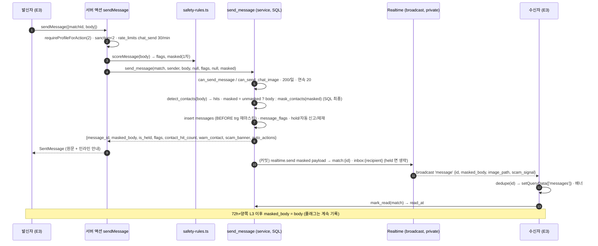

# 17 — 채팅 · Realtime · 마스킹 · 탐지 룰 (D4)

> 입력: `14_schema.md`(D1 §0-7·8·9·22·23), `15_auth.md`(D2 §0-17·18·23·28), `05_trust_safety.md`(A5 §7·§10), `12_flows.md`(C3 §5), `06_PRD.md`(§4.4, 채팅 P95 ≤ 1s).
> 산출물: `supabase/migrations/20260902000030_chat.sql`, `packages/db/src/safety-rules.ts`(+`.test.ts`, `index.ts` export 1줄), `apps/web/lib/chat/{types,rpc,actions,queries,images,realtime}.ts`(+`chat.test.ts`), 이 문서.
> 기준일 2026-09-02. 로컬 PostgreSQL 16 에 0001~0014 + 0030 적용·시나리오 검증(§6). **UI 없음**(E3 담당). git commit 없음.

## 다음 에이전트에게 넘기는 결정사항

### E3 (채팅 UI) — 액션·구독·표시 규칙
1. **전송 = `sendMessage({matchId, body})`** (`lib/chat/actions.ts`, `ActionResult<SentMessage>`). 서버가 TS 룰(`scoreMessage`) 1차 평가 → `send_message` RPC(service role) → SQL 재마스킹·플래그·자동 조치까지 한 트랜잭션. 응답 `SentMessage{id, body(발신자 렌더용 원문, NFKC), maskedBody, isHeld, createdAt, contactMasked, warnContact, warnRules, offlineMeeting}`. 낙관적 UI 는 응답의 `id/createdAt` 로 확정한다(서버 id 가 Realtime 페이로드 id 와 같으므로 중복 제거 가능).
2. **클라이언트는 messages 테이블에 insert 하지 않는다**(0030 이 authenticated insert grant 회수). 직접 `supabase.from("messages").insert` 는 42501. RPC `send_message` 도 authenticated 에서 호출 불가(service 전용).
3. **읽기**: 목록 `getChatList()` → `ChatListItem[]`(TanStack `['matches']`), 방 헤더 `getChatRoom(matchId)` → `ChatRoom`(같은 행 + `first_suggestion`), 메시지 `getMessages(matchId, {before?, limit=50})` → `{items(시간 오름차순), nextBefore}` — `v_messages` 뷰(`display_body` 렌더, `is_mine`). 전부 `lib/chat/queries.ts`.
4. **마스킹 표시 규칙**: 수신 메시지는 항상 `display_body`(= `masked_body`). 발신자 화면은 `display_body`(= 원문). `SentMessage.contactMasked=true` 면 그 말풍선 아래 인라인 안내(A5 §10.4 "연락처·링크는 매칭 3일 후부터 보낼 수 있어요. 상대에게는 `[연락처 숨김]` 으로 보여요"). placeholder 3종: `[연락처 숨김]` `[링크 숨김]` `[계좌 숨김]` (`PLACEHOLDER`, `@duckmate/db/safety-rules`).
5. **마스킹 안내 배너**(방 상단, 조건부): `ChatRoom.contact_unmasked=false` 일 때 노출. 문구의 시각 = `unmask_at`(matched_at+72h). `both_l3=false` 면 "양쪽 사진인증 후" 로 교체(C3 §5.2). `my_contact_hits ≥ 3` 또는 `SentMessage.warnContact` → "연락처 공유 시도가 반복되면 자동으로 신고돼요".
6. **금칙어 인라인 경고**: `SentMessage.warnRules` 에 `BW_SEXUAL|BW_HATE|CT_LURE|MN_SCHOOL` 이 있으면 발신자에게 1회 경고 토스트("커뮤니티 가이드에 맞지 않는 표현이 있어요"). `isHeld=true` 면 발신자 화면에는 보이되 "검토 중이라 상대에게 전달되지 않았어요" 표시(수신자는 뷰·Realtime 모두에서 못 본다).
7. **스캠 배너(A5 §10.3)**: `ChatRoom.partner_scam_banner` (상대의 SC_MONEY/SC_INVEST hit 7일) 또는 Realtime 페이로드 `scam_signal=true` 수신 시 상단 배너 + [신고하기]. D5 `partner_risk_banner(match_id)` 와 OR 로 합쳐도 된다.
8. **오프라인 만남 배너(A5 §10.2)**: `SentMessage.offlineMeeting` 또는 클라이언트에서 `OFFLINE_MEETING_RE.test(text)` — 매칭당 1회(`chat.safetyBannerShownMatchIds`).
9. **Realtime**: `subscribeToMatch(matchId, {onMessage, onStatus, onResync, onMatchStatus})` / `subscribeToInbox(profileId, {onEvent, onStatus, onResync})` (`lib/chat/realtime.ts`, `"use client"`). 페이로드는 `RealtimeMessagePayload`(**원문 body 없음**, `masked_body`·`image_path`·`scam_signal`). 같은 id 중복은 헬퍼가 제거. `onStatus('polling')` 이면 5초 폴링(`getMessages`), `onResync` 는 재연결 직후 1회 → `invalidateQueries(['messages', matchId])`. 목록 화면은 inbox 이벤트(`inbox`: 새 메시지 프리뷰, `match_status`: blocked/left/paused)로 `['matches']` 무효화.
10. **읽음**: 방 포커스/새 메시지 수신 시 `markRead({matchId})` → `{marked}`. 읽음 표시(✓)는 Phase 3(F-078) — 페이로드에 read 이벤트 없음.
11. **종료 상태**: `ChatRoom.status ∈ blocked|left|paused` 또는 Realtime `match_status` → 입력창 대신 "대화가 종료되었습니다" 바, 열람 가능, 헤더 신고 유지. 차단자 본인 화면에서는 방이 목록·`getChatRoom` 모두에서 사라진다(NOT_FOUND). 나가기 = `leaveMatch({matchId})`(status `left`, 상대에게 `match_status` 브로드캐스트).
12. **에러 코드 → 문구**(`ActionFailure.message` 그대로 써도 됨): `NOT_ENTITLED` + `MATCH_LEFT|MATCH_BLOCKED|MATCH_PAUSED|BLOCKED` "대화가 종료되었어요" / `IMAGE_NOT_ALLOWED` "이미지는 매칭 24시간 후, 양쪽 사진인증부터 보낼 수 있어요" / `RATE_LIMITED` + `DAILY_CAP`(매칭당 200/일) "오늘은 이 대화에 더 보낼 수 없어요" · `WAIT_FOR_REPLY`(미응답 상대에게 연속 20개) "상대의 답장을 기다려 주세요" · 분당 30건 초과는 `retryAfterSec` / `SANCTIONED` "채팅이 24시간 제한됐어요"(입력 비활성, 읽기 가능) / `NOT_VERIFIED` → `redirectTo:/verify` / `INVALID_INPUT field=body`(빈 값·2000자 초과). 상수 `CHAT_ERROR_DETAILS`(`lib/chat/types.ts`).
13. **이미지**: 버튼 활성 조건 = `ChatRoom.image_allowed`(양쪽 L3 AND matched_at+24h; 비활성 사유 시각 `image_allowed_at`). 흐름 `createChatImageUploadUrl({matchId, contentType, sizeBytes})` → `supabase.storage.from("chat-images").uploadToSignedUrl(path, token, file, {contentType})` → `sendImageMessage({matchId, messageId})` → `SentMessage(imagePath)`. 수신 렌더는 `getChatImageUrl({path})` → 서명 URL 1h(사용자 권한, storage RLS). 블러 + [보기] 는 클라이언트 상태. 5MB · jpeg/png/webp. 이미지 메시지의 `masked_body='[사진]'`.
14. **신고 화면 미리보기**: `getReportContext({matchId})` → 최근 5개 `{id, sender_id, is_mine, display_body, has_image, created_at}`. 50개 스냅샷은 `create_report`(D1/D5) 가 저장한다 — E3/E5 는 RPC 1회만.
15. **클라이언트 프리체크(UX)**: `import { maskContacts, OFFLINE_MEETING_RE } from "@duckmate/db/safety-rules"` (런타임 의존성 0, 번들 안전). 전송 전 "연락처는 매칭 3일 후에" 힌트용이며 보안 근거 아님.

### D5 (신고·제재) — `message_flags` 구조·자동 신고
16. `message_flags(message_id, rule_id, matched, score)` 는 **메시지당 rule_id 1행**(dedupe). `rule_id` = `CT_EMAIL|CT_URL|CT_PHONE|CT_ACCOUNT|CT_KAKAO|CT_TELEGRAM_LINE|CT_INSTA|CT_LURE|BW_SEXUAL|BW_HATE|BW_VIOLENCE|BW_ILLEGAL|BW_ADULT_BIZ|SC_MONEY|SC_INVEST|SC_URGENT|SC_FAST_LOVE|SC_OFFAPP|SC_TEMPLATE|MN_SCHOOL|MN_AGE`. `score` 는 SC_* 만 >0(A5 §7.3 점수표 `SCAM_SCORES`), 나머지 0 → D5 `scam_signal_weights` 폴백과 호환. `matched` = 원문 조각(≤120자, 증거용). `SC_MASS_LIKE` 는 D3 소관(좋아요 경로).
17. **마스킹된 연락처 히트 판별** = `messages.body is distinct from messages.masked_body` 인 메시지의 CT_* 플래그. 72h+L3 해제 후에도 플래그는 기록되지만(증거) 자동 신고 카운트에는 들어가지 않는다.
18. **D4 가 만드는 자동 신고**(`create_report(…, surface='system', reporter null)`, 대상당 사유당 24h 1회 `auto_report_once`): `OFF_PLATFORM_LURE`(같은 매칭 CT 3·6·9회, P2) / `THREAT_VIOLENCE`(BW_VIOLENCE 즉시, create_report 가 24h 제한) / `OTHER` detail `AUTO:BW_ILLEGAL …`(hold, 스냅샷 hit 로 P0 승격) / `COMMERCIAL_SPAM`(BW_ADULT_BIZ, hold) / `SEXUAL_HARASSMENT`(BW_SEXUAL 같은 매칭 2회 → hold, 또는 상대 직전 3개에 거절 표현 → 즉시 + `issue_sanction(2, 'AUTO:BW_SEXUAL_REFUSED', 24h)`) / `HATE_SPEECH`(BW_HATE 2회, hold) / `MINOR_SUSPECT`(MN_AGE 단독 또는 MN 2종 → create_report 비노출 + `issue_sanction(2,'AUTO:MN_AGE',24h)`) / `ROMANCE_SCAM`(발신자 7일 SC 점수 ≥5 → 신고(+create_report 24h 제한), ≥8 → `profiles.hidden_reason='SCAM_SCORE'`). D5 `reports.auto_actions` 와 `sanctions.reason` 접두어 `AUTO:` 규칙 준수.
19. `v_rule_hit_stats`(D5 0040) 는 그대로 동작한다(플래그 rule_id 위 목록). 오탐률 20% 초과 룰의 `warn_only` 강등은 `BANNED_RULES[].action` 을 바꾸는 코드 변경(Phase 1 은 설정 테이블 없음).

### D7 (푸시·배치)
20. **"새 메시지" 알림 훅** = Realtime 이 아니라 DB: `messages` insert 시 `matches.last_message_at` 갱신(D1 트리거) + 0030 트리거가 `inbox:{recipient}` 브로드캐스트. 푸시 배치는 `messages where read_at is null and not is_held and created_at > last_push_at` 로 수신자별 미읽음을 집계하면 된다(원문 금지, `masked_body` 프리뷰 80자 = `left(masked_body,80)` 또는 `[사진]`). held 메시지는 알림 금지. 브로드캐스트 트리거는 `realtime.send` 실패를 warning 으로 삼켜 insert 를 막지 않는다.
21. `rate_limits` 키 `chat_send:<sha256(profile_id)>` (분당 30, D2 `enforceRateLimit`) — `purge_daily` 가 이미 1일 후 정리. 인덱스 추가: `messages_sender_created_idx (sender_id, created_at desc)`(7일 스캠 점수·템플릿 탐지).
22. 채팅 이미지 EXIF 제거·WebP 재인코딩은 D7 파이프라인 미구현 상태(현재 원본이 `.webp` 이름으로 저장됨). 도입 시 `chat-images` 객체를 in-place 재인코딩하면 경로·DB 변경 없음.

### D3 (매칭·첫 메시지)
23. `send_first_message(match_id, suggestion_id)` 는 **service/definer 로 `public.send_message(p_match_id, p_sender_id, p_body, null, '[]', null, null, p_suggestion_template_id)` 를 호출**하거나 직접 insert 해도 된다 — 어느 경로든 `trg_messages_before_insert` 가 재마스킹하고 `trg_messages_broadcast` 가 Realtime 을 보낸다. `masked_body` 는 반드시 채운다(NULL 이면 insert 실패, D1 §0-22 유지).

### G2 (보안 리뷰 포인트)
24. **원문 누출 경로 0**: `messages.body` 컬럼 권한(D1) + `v_messages` + Realtime 은 postgres_changes 미사용(publication 미등록) → 트리거가 만든 명시적 페이로드에 `body` 키 없음(§4 판정). 신고 스냅샷만 service 로 원문 저장.
25. `send_message` 는 `auth.role()='service_role'` 검사 + execute 권한 service 전용(이중). `p_flags` 는 서버 액션이 계산한 값이며 클라이언트 입력이 아니다(클라이언트 → RPC 직접 호출 불가).
26. private 채널 RLS(`realtime.messages` 정책 `dm_chat_topics_read`): `match:{uuid}` 는 `is_match_participant`, `inbox:{uuid}` 는 본인만. 토픽 정규식으로 uuid 형식 강제(캐스팅 에러 방지). JWT 는 `realtime.setAuth` 로 전달.
27. 이미지: 업로드 URL 발급 전 `can_send_chat_image` RPC(사용자 권한) + `send_message` 재검사 + storage insert 정책(D1) 3중. 실패 시 업로드 객체 삭제. 다운로드 URL 은 사용자 권한 `createSignedUrl`(storage select 정책: 당사자·held 제외).
28. 상한: 매칭당 200/일(`loop_date`), 미응답 연속 20, 분당 30(DB 카운터 fail-closed). 본문 2000자.

### 오케스트레이터 병합 요청
29. `packages/db/src/types.ts` `Database.Functions` 에 D4 RPC 타입 추가: `send_message(p_match_id, p_sender_id, p_body?, p_image_path?, p_flags?, p_message_id?, p_client_masked?, p_suggestion_template_id?) → Json`, `mark_read(p_match_id) → Json`, `leave_match(p_match_id) → Json`, `get_chat_list(p_match_id?) → Json`, `get_report_context(p_match_id) → Json`, `mask_contacts(p_text) → string`, `detect_contacts(p_text) → Json`, `contact_unmasked(p_match_id) → boolean`. 병합 후 `lib/chat/rpc.ts` 의 `callRpc` 를 `supabase.rpc(...)` 로 치환.
30. `apps/web/lib/onboarding/text-rules.ts` → `checkProfileText()`(`@duckmate/db/safety-rules`) 로 교체(D2 §8 예정 사항; `gate.test.ts` 의 `checkText` 4건은 `checkProfileText` 로 바꾸면 그대로 통과). env·의존성 추가 없음(`@supabase/supabase-js` Realtime 은 기존 의존성).

---

## 1. 시퀀스 — 전송 → 마스킹 → 저장 → Realtime → 읽음

## 2. 룰 표 (A5 §7 → 구현)

| rule_id | 종류 | 탐지 | 조치(TS `action`) | SQL 누적 조치 |
|---|---|---|---|---|
| `CT_EMAIL` | 정규식 | 표준 + `골뱅이`·`(at)`·`닷`·`(dot)` | `[연락처 숨김]` | 같은 매칭 3·6·9회 → `OFF_PLATFORM_LURE`; 매칭 24h 내 2회↑ → `SC_OFFAPP`(2) |
| `CT_URL` | 정규식 | `https?://`·`www.`·도메인.TLD(30종) | `[링크 숨김]` | 〃 |
| `CT_PHONE` | 정규식 | `010-1234-5678`·공백/기호 삽입·`공일공`·`o1o`·전각·`+82` | `[연락처 숨김]` | 〃 |
| `CT_ACCOUNT` | 정규식 | 은행명/계좌 + 10~14자리 | `[계좌 숨김]` + `SC_MONEY`(3) | 〃 |
| `CT_KAKAO` | 정규식 | 카톡/카카오/ㅋㅌ/오픈채팅 + 12자 내 영숫자 ID(4~20) | `[연락처 숨김]` | 〃 |
| `CT_TELEGRAM_LINE` | 정규식 | 텔레/telegram/tg/t.me/·라인 아이디·line id + ID | `[연락처 숨김]` | 〃 |
| `CT_INSTA` | 정규식 | 인스타/insta/ig/인별 + ID, `@handle` | `[연락처 숨김]` | 〃 |
| `CT_LURE` | 사전 37 | 번호줘·카톡으로·디엠·다른앱·옮기자… | warn | — |
| `BW_SEXUAL` | 사전 40 | 초성 `ㅅㅅ`·`s.e.x` 포함 | warn | 같은 매칭 2회 → hold + `SEXUAL_HARASSMENT`; 상대 직전 3개에 거절 표현 → 즉시 신고 + 24h 제한 |
| `BW_HATE` | 사전 36 | 성별·지역·장애·성적지향 비하 | warn | 2회 → hold + `HATE_SPEECH` |
| `BW_VIOLENCE` | 사전 26 | 살해·폭행 협박 | report | 즉시 `THREAT_VIOLENCE`(P0, create_report 가 24h 제한) |
| `BW_ILLEGAL` | 사전 28 | 마약 은어·불법촬영물·도박 | hold | 즉시 `OTHER(AUTO:BW_ILLEGAL)` + hold, 스냅샷 hit 로 P0 |
| `BW_ADULT_BIZ` | 사전 30 | 조건·스폰·업소 | hold | hold + `COMMERCIAL_SPAM` |
| `SC_MONEY` 3 / `SC_INVEST` 3 / `SC_URGENT` 2 / `SC_FAST_LOVE` 1 | 사전 32/26/18/10 | 점수 | score(+배너: MONEY/INVEST) | 7일 롤링 ≥5 → `ROMANCE_SCAM`, ≥8 → 비노출 |
| `SC_OFFAPP` 2 / `SC_TEMPLATE` 3 | SQL 행동형 | 24h 내 CT 2회 / 30자↑ 동일 문장 3매칭 | — | 점수 합산 |
| `MN_SCHOOL` | 사전 26 (교사·강사·근무·졸업·학부모 맥락 제외) | 고딩·야자·수능… | warn | MN 2종 동시 → `MINOR_SUSPECT` |
| `MN_AGE` | 사전 8 + 정규식(`1[0-8]살`, 기준일 계산 `0X|1X|2X년생`) | | report | 단독 → `MINOR_SUSPECT`(비노출) + 24h 제한 |

정규화(`normalizeText`): NFKC → 소문자 → zero-width 제거 → 호환 자모→첫가끝 자모 → 음절 NFD 분해 → `[a-z0-9 자모]` 외 제거. 초성만 친 `ㅅㅂ` 은 초성 자모, 음절 종성은 종성 자모라서 "옷방" 이 `ㅅㅂ` 에 오탐되지 않는다.

**TS ↔ SQL 동일성**: `CONTACT_RULES[].pattern` 문자열이 `contact_rule_patterns()`(0030) 에 그대로 들어 있다. JS·ARE 공통 부분집합만 사용(lookbehind ✗, `\b` ✗ → `(^|[^…])` 접두 그룹, `\w` ✗, 비탐욕 ✗, `.` 대신 `[^\n]`). 변경 시 양쪽을 같이 고치고 §6 의 대조 스크립트로 확인.

## 3. SQL 객체 (0030)

| 객체 | 권한 | 용도 |
|---|---|---|
| `contact_unmasked(match)` | authenticated, service | matched_at+72h AND 양쪽 L3 |
| `contact_rule_patterns()`, `safety_preprocess(text)` | service | 룰 표·전처리 |
| `detect_contacts(text) → {masked, hits}`, `mask_contacts(text)` | authenticated, service | SQL 마스킹(최종 방어) |
| `trg_messages_before_insert` (BEFORE INSERT) | — | `masked_body` 재마스킹/해제(모든 insert 경로). NULL 이면 그대로 두어 NOT NULL 로 실패 |
| `trg_messages_broadcast` (AFTER INSERT, **deferred constraint trigger**) | — | 커밋 직전 `realtime.send`: `match:{id}` `message`, `inbox:{recipient}` `inbox`. held 제외 |
| `trg_matches_status_broadcast` (AFTER UPDATE OF status) | — | `match_status` → `match:{id}` + 양쪽 inbox |
| `realtime_send_safe(payload, event, topic)` | service | `realtime.send` 래퍼(예외 → warning) |
| `dm_chat_topics_read` (policy on `realtime.messages`) | authenticated | private 채널 join 권한. `realtime.messages` 가 없으면(로컬 PG) 건너뜀 |
| `auto_report_once(target, reason, match, detail)` | service | 24h 1회 `create_report(system)` |
| `send_message(match, sender, body?, image_path?, flags?, message_id?, client_masked?, suggestion_template_id?)` | **service** | §1 |
| `mark_read(match)`, `leave_match(match)` | authenticated, service | 읽음 / 나가기(`left`, audit `match_left`) |
| `get_chat_list(match?)` | authenticated, service | 목록·방 헤더(`v_my_matches` 가시성 + 파생값) |
| `get_report_context(match)` | authenticated, service | 최근 5개 (비당사자 null) |
| `revoke insert on messages from authenticated` | | 전송 경로 단일화 |
| `messages_sender_created_idx` | | 7일 스캠·템플릿 스캔 |

## 4. Realtime 보안 판정

| 방식 | 판정 | 근거 |
|---|---|---|
| `alter publication supabase_realtime add table messages` + `postgres_changes` | **채택 안 함** | (1) WALRUS 가 컬럼 권한을 존중해 `body` 를 제거하긴 하지만 "허용 목록" 이 아니라 "권한 표에 의존" 이라 이후 grant/정책 변경 한 번에 원문이 새는 구조. (2) 변경마다 구독자 수만큼 RLS 를 평가(N×M) → 채팅 P95 ≤ 1s 에 불리, Supabase 도 대규모에는 Broadcast 권장. (3) `is_held` 행 필터·차단 조건이 정책 평가에 묶여 트리거보다 검증이 어렵다. |
| **Broadcast from Database** (`realtime.send`, private 채널 + `realtime.messages` RLS) | **채택** | 페이로드를 트리거가 명시 구성(`masked_body`·`image_path`·`scam_signal` 만, `body` 키 없음 — §6 검증). 채널 권한은 `is_match_participant` 1회 판정. held 는 애초에 보내지 않는다. 트리거를 deferred 로 두어 같은 트랜잭션의 `message_flags` 를 읽어 `scam_signal` 을 실을 수 있다. `realtime.send` 부재/실패는 warning 으로 격리(insert 성공 유지). |
| `messages_public` 테이블/뷰 복제 | 기각 | 쓰기 2배·정합성 부담, Broadcast 로 충분 |

한계: 로컬 PG 에는 `realtime` 스키마가 없어 셰임으로 검증했다(§6). **실 Supabase 에서 1회 확인 필요**: `realtime.send` 시그니처(`payload jsonb, event text, topic text, private boolean`), `realtime.messages` 정책 적용, 클라이언트 `channel(topic, {config:{private:true}})` join. Realtime 장애 시 클라이언트는 5초 폴링(PRD §5.5).

## 5. 파일 구성

| 경로 | 내용 |
|---|---|
| `packages/db/src/safety-rules.ts` | CT 7 정규식(문자열) · 사전 12 룰 · `normalizeText/maskContacts/detectContacts/detectBanned/scoreMessage/checkProfileText/minorAgeRegex` · `PLACEHOLDER/SCAM_SCORES/OFFLINE_MEETING_RE/REFUSAL_WORDS` |
| `packages/db/src/safety-rules.test.ts` | 우회 표기 38 · 오탐 0 문장 14 · 정규화 · 사전 · 점수 (70 테스트) |
| `supabase/migrations/20260902000030_chat.sql` | §3 |
| `apps/web/lib/chat/types.ts` | 상수·타입·에러 문구 매핑·경로 |
| `apps/web/lib/chat/rpc.ts` | `callRpc`(타입 병합 전 임시) |
| `apps/web/lib/chat/actions.ts` | `sendMessage/markRead/leaveMatch/getReportContext` |
| `apps/web/lib/chat/queries.ts` | `getChatList/getChatRoom/getMessages` |
| `apps/web/lib/chat/images.ts` | `createChatImageUploadUrl/sendImageMessage/getChatImageUrl` |
| `apps/web/lib/chat/realtime.ts` | `subscribeToMatch/subscribeToInbox/createDeduper/createStatusTracker` |
| `apps/web/lib/chat/chat.test.ts` | 문구 매핑·dedupe·재연결 resync (5 테스트) |

## 6. 검증 결과 (2026-09-02)

환경: 로컬 PostgreSQL 16.13 + D1 셰임(auth/storage/롤) + **Realtime 셰임**(`realtime.messages` 테이블·`realtime.send()`·`realtime.topic()`, 레포 미포함) → 0001~0014 + 0030 + `seed.sql` 적용(경고 0). 시나리오 스크립트는 스크래치(레포 미포함).

| 항목 | 결과 |
|---|---|
| `pnpm --filter @duckmate/db test` | safety-rules 70/70 통과 (우회 38, 오탐 0 문장 14, 정규화·사전·점수) |
| `pnpm --filter @duckmate/db typecheck` | 통과 |
| `pnpm --filter @duckmate/web typecheck` | `lib/chat/**` 오류 0 (`.next/types` 미생성 TS6053 만 — 빌드 전 기존 상태, D2 §7 동일) |
| `pnpm --filter @duckmate/web test` | `lib/chat/chat.test.ts` 5/5 통과 (실패 2건은 `lib/push/templates.test.ts` — D7 경로) |
| TS `maskContacts` ↔ SQL `mask_contacts` 대조 (우회·오탐·혼합 69 문장) | **69/69 동일** |
| T1 서비스 `send_message` (전화+카톡) | `masked_body` 2곳 치환, `message_flags` CT_PHONE·CT_KAKAO(matched 원문 조각), Realtime `match:`·`inbox:` 2건, **페이로드에 `body` 키 없음** |
| T2 수신자(서윤) | `messages.body` select → permission denied / 직접 insert → permission denied / `send_message` → permission denied / `v_messages` masked / `get_chat_list` unread 1·preview masked·age_band / `get_report_context` 1행 / `mark_read` marked 1 → unread 0 |
| T3 비당사자(도현) | `get_chat_list(A)` `[]`, `get_report_context` null, `mark_read` FORBIDDEN, `v_messages` 0행 |
| T9 이미지 | 상대 L2·24h 미만 → `NOT_ENTITLED: IMAGE_NOT_ALLOWED`; 양쪽 L3 + 25h → 성공, `masked_body='[사진]'` |
| T4 해제 | 73h + 서윤 L2 → 여전히 마스킹; 73h + 양쪽 L3 → `masked_body = body`, 플래그는 기록 |
| T5 우회 3회 | 3번째 → `warn_contact=true`, `OFF_PLATFORM_LURE`(surface system, reporter null, P2) 자동 신고; 4번째 → 24h dedupe 로 신고 1건 유지 |
| T6 상한 | 미응답 연속 20 → `RATE_LIMITED: WAIT_FOR_REPLY`, 상대 답장 후 재전송 OK; 200/일 → `RATE_LIMITED: DAILY_CAP` |
| T7 금칙어 | BW_ADULT_BIZ → `is_held` + `COMMERCIAL_SPAM`, 수신자 뷰·Realtime 모두 미노출; BW_SEXUAL 1회 warn → 2회 hold + `SEXUAL_HARASSMENT`; SC 5점 → `ROMANCE_SCAM` + 24h 제한(create_report) → 이후 전송 `SANCTIONED`; BW_VIOLENCE → `THREAT_VIOLENCE`; 상대 `partner_scam_banner=true` |
| T8 종료 | `leave_match` → `left` + `match_status` 브로드캐스트, 이후 전송 `NOT_ENTITLED: MATCH_LEFT`; 차단 → 차단자 목록에서 제거, 피차단자 `status=blocked`, 전송 `NOT_ENTITLED: MATCH_BLOCKED` |
| T10 채널 RLS | 서윤: `match:A`·`inbox:서윤` 읽힘 / 도현: 둘 다 0행 |
| T11 트리거 최종 방어 | service 가 `masked_body=원문` 으로 insert → 트리거가 재마스킹; `masked_body` NULL → NOT NULL 위반 |
| T12 권한 | `send_message/auto_report_once/realtime_send_safe` = service 만, 나머지 authenticated+service, anon 없음; `messages` insert grant(authenticated)=false; `supabase_realtime` publication 에 messages 없음; SECURITY DEFINER `search_path` 누락 0 |
| 비밀값 grep | 없음 |

## 7. 미결·후속

- 실 Supabase: `realtime.send`/private 채널/`realtime.messages` 정책 1회 확인(§4). Docker 부재로 `supabase start` 미실행.
- `SC_MASS_LIKE`(D3), `MN_PROFILE_MISMATCH`(D8 사진 검수 플래그) 는 D4 범위 밖.
- 금칙어 사전은 Phase 1 최소 규모(카테고리당 20~40). 운영 데이터로 확장 시 `BANNED_RULES` 만 수정(SQL 변경 불필요 — BW/SC/MN 은 TS 가 평가하고 SQL 은 이력·조치만 담당).
- CT 패턴 오탐 후보: `카톡 … <영문 단어>`(12자 창), `인스타 <영문>`, `ig <영문>` — A5 §7.1 "근처 영숫자 ID" 규정에 따른 의도적 보수 판정. 오탐률 20% 초과 시 창을 줄이거나 `아이디|id|:|@` 동반을 요구.
