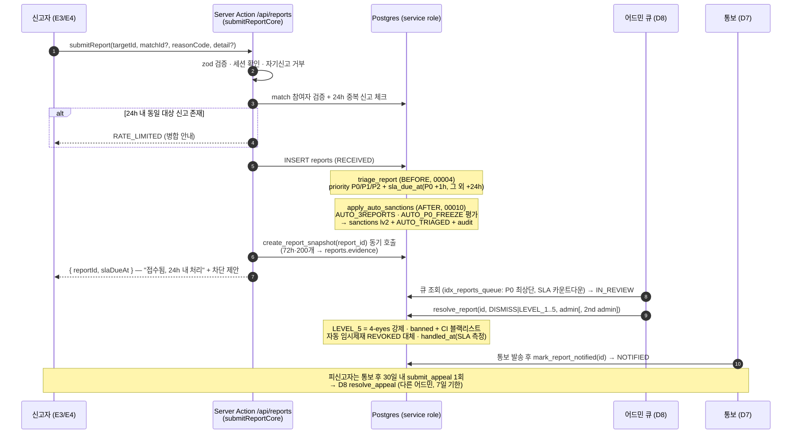

# D5 · 신고/제재/모더레이션 파이프라인

> 작성: 서브에이전트 D5 (모더레이션) · 기준일 2026-08-19
> 입력: 05_trust_safety(A5 §2/§3/§4/§6) + 14_schema(D1 규약) + 15_auth(ActionResult 패턴).
> 산출물: `supabase/migrations/00010_moderation.sql`,
> `apps/web/lib/moderation/{schemas,service,actions}.ts`, `apps/web/app/api/reports/route.ts`.

---

## 다음 에이전트에게 넘기는 결정사항

### 판단 확정

| # | 쟁점 | 확정 | 근거 |
|---|---|---|---|
| D5-1 | 자동 제재 실행 위치 | Edge Function 이 아닌 **DB 트리거** (`apply_auto_sanctions` — reports AFTER INSERT, BEFORE 인 `triage_report` 다음 순서 보장) | 접수 경로가 액션/route 둘이어도 룰이 한 곳에서 무조건 실행. "접수 즉시(동기)" SLA(A5 §6-②) 충족 |
| D5-2 | AUTO_P0_FREEZE 의 "임시조치" 구현 | **sanctions level 2 (기능 제한, ends_at +72h, created_by null=시스템)**. 매칭 단위 발신 정지 스키마가 없으므로 대상자 전체 발신 정지로 상향 적용 — `can_engage()`(00003)가 즉시 집행한다 | A5 §3.2 "채팅 발신 정지(대상자만)" + "자동 조치는 level 3 이상 불가". 1h 는 잠금 지속시간이 아니라 **어드민 확인 SLA**(sla_due_at=+1h, triage 가 세팅) |
| D5-3 | 자동 제재 reason 문구 | 피신고자에게 `my_sanctions` 뷰로 노출되므로 **일반화 문구 고정** — 룰 ID·신고 수·reason_code 는 `audit_logs.meta` (service role 전용)에만 | 신고자 비노출 원칙(A5 §6). 아래 §5 검토 참조 |
| D5-4 | 자동 제재 중복 방지 | 대상에게 **활성 level≥2 제재가 이미 있으면 새 자동 제재를 만들지 않는다** (룰 구분 없이 — 발신 정지 효과가 이미 걸려 있음) | 제재 스태킹 방지. 사람 확정 시 `resolve_report` 가 같은 report 의 자동 제재를 REVOKED 로 대체 |
| D5-5 | NOTIFIED 전이 분리 | `resolve_report` 는 ACTIONED/DISMISSED + handled_at(SLA 측정점)까지. **NOTIFIED 는 별도 `mark_report_notified()`** — 통보 발송(D7 푸시/알림) 성공 후 호출 | 통보 실패가 조치 확정을 롤백하면 안 됨. SLA 측정은 `handled_at - created_at` (A5 §6) |
| D5-6 | 이의제기 접수 경로 | 클라이언트 직접 insert(00003 RLS 허용) 대신 **`submit_appeal()` RPC 를 정식 경로로** — `sanctions.appeal_status='PENDING'` 동기화 + audit 를 원자 수행 | RLS insert 만으로는 appeal_status 동기화 불가(sanctions 는 클라이언트 UPDATE 불가) |
| D5-7 | 에러 코드 타입 | `lib/auth/schemas.ts` 의 `ActionErrorCode` 를 수정하지 않고(파일 소유권) **`ModerationErrorCode` 도메인 유니온 신설** — `ModerationResult` 형태는 ActionResult 와 동일 | 15_auth D2-1 패턴 유지 + 소유권 준수 |
| D5-8 | 신고 레이트 리밋 | 동일 신고자→동일 대상 **24h 1회, 초과분은 새 행을 만들지 않고 병합 안내** (`RATE_LIMITED`/HTTP 429). DB 테이블 추가 없이 `reports` 집계(idx_reports_reporter) | A5 §2 "동일 신고자→동일 대상 중복 신고는 병합" |

### → D8 (어드민) — 호출 계약

- **모든 변경은 service role** 로 아래 DB 함수만 호출 (클라이언트 execute 전부 revoke 됨). admin 세션은 큐 "읽기"만 (00003 — reports 는 evidence 제외 명시 컬럼으로 SELECT).
- `resolve_report(p_report_id, p_action, p_admin_id, p_reason?, p_second_admin_id?)` — p_action ∈ `'DISMISS'|'LEVEL_1'..'LEVEL_5'`. **LEVEL_5 는 p_second_admin_id(다른 활성 admin) 필수**(4-eyes). LEVEL_5 부수효과: `profiles.status=banned` + `identity_hashes` 의 CI 해시 → `blocked_hashes` 자동 등록. **phone 해시는 DB 저장처가 없으므로 D8 서버가 보유 시 `hashIdentity()`(lib/auth/verify.ts 규약)로 직접 등록할 것.** `p_reason` 은 피신고자에게 노출되는 문구다(위반 조항 서술, 신고자 정보 금지).
- `mark_report_notified(p_report_id)` — 신고자/피신고자 통보 발송 후 호출 (ACTIONED/DISMISSED → NOTIFIED).
- `resolve_appeal(p_appeal_id, 'ACCEPTED'|'REJECTED', p_admin_id, p_reason?)` — **원 제재 처리자(created_by)와 같은 admin 이면 예외**(4-eyes). ACCEPTED: 제재 REVOKED + level 5 면 계정 복구·blocked_hashes 해제. 반환 jsonb 의 `deadline_met`(7일)과 audit meta 의 `subscription_compensation_needed` 를 대시보드/정산에 사용.
- 큐 쿼리: 신고 = `idx_reports_queue`(미종결, priority·sla_due_at 순), 이의제기 = `idx_appeals_queue`(PENDING, created_at 순 — 7일 기한). 신고 남용 판정(30일 기각 5건 → 신고 기능 30일 제한)은 **미구현** — D8 이 DISMISS 시 집계해 집행(후속).

### → E3 (채팅 UI) / E4 (마이페이지·제재 화면)

- Server Actions (`@/lib/moderation/actions`): `submitReport({targetId, matchId?, reasonCode, detail?})` → `{reportId, slaDueAt}` / `blockUser({targetId})` / `unblockUser({targetId})` / `getMyReports()` → `MyReport[]` / `submitAppeal({sanctionId, body})` → `{appealId}`. 전부 `ModerationResult` — code 로 분기, throw 없음.
- fetch 경로가 필요하면 `POST /api/reports` (동일 코어, 201/4xx/429). reasonCode 목록은 `@duckmate/db` 의 `REASON_CODES` 를 그대로 렌더(2단 선택 UI 는 prefix 로 카테고리 유도).
- 필수 UX (A5): 신고 성공 → "접수됐어요. 24시간 내 처리돼요" + **차단 원클릭 제안**(blockUser). `CONTENT_SELF_HARM` 선택 시 접수와 함께 자살예방상담 109 안내 배너(보호 프로토콜). 제재 안내 화면(`my_sanctions`)에서 신고 출처를 암시하는 문구 금지 — §5.
- 이의제기 버튼 노출 조건: `my_sanctions` 행의 `appeal_status='NONE'` && `created_at + 30일 > now`. 에러코드 `APPEAL_WINDOW_EXPIRED`/`APPEAL_DUPLICATE` 는 그대로 안내문 매핑.

### → D7 (알림/cron) — 미결 이관

1. **통보 발송**: ACTIONED/DISMISSED 신고의 신고자·피신고자 알림 발송 후 `mark_report_notified()` 호출 (A5 §6-⑤ 문구 규칙: 신고자에겐 "조치 완료" 요약만, 피신고자에겐 위반 조항+기간+이의제기 안내).
2. **evidence 이미지 복사**: `create_report_snapshot` 은 DB 만 기록 — `evidence/` 버킷 생성 + 스냅샷 메시지의 image_path 복사 + `evidence.images_copied` 병합은 Storage API 가 필요한 Edge/서버 잡 소관 (00006 주석과 일치, 버킷은 아직 미생성).
3. **만료/파기 잡**: sanctions 만료는 `ends_at` 비교로 이미 무효화되므로(RLS) `status='EXPIRED'` 전환은 정리용 cron. SLA 임박(–4h) 에스컬레이션 푸시, evidence 종결+1년 파기(A5 §4.3)도 cron 몫.

---

## 1. 신고 파이프라인 전체 시퀀스

## 2. 자동 제재 룰 확정표 (00010 `apply_auto_sanctions`)

| 룰 | 발동 조건 (신고 insert 시점 평가) | 자동 조치 | 중복 방지 | 사람 확인 |
|---|---|---|---|---|
| `AUTO_3REPORTS` | 동일 대상에 대해 30일 내 **서로 다른 신고자 3인 이상** (reporter distinct, DISMISSED 신고 제외, 탈퇴 신고자 제외) | sanctions **level 2** (기능 제한, ends_at +72h, created_by null) + 신고 `AUTO_TRIAGED` + **P2→P1 승급** | 대상에 활성 level≥2 제재 존재 시 skip | 24h 내 (sla_due_at) — resolve_report 로 확정/기각 |
| `AUTO_P0_FREEZE` | **P0 신고 1건** (triage 가 P0 판정한 10개 reason_code) | sanctions **level 2** 즉시 (발신 정지 — can_engage 가 실시간 집행) + `AUTO_TRIAGED` | 동일 | **1h 내** (P0 sla_due_at) |
| (제외) `CONTENT_SELF_HARM` | P0 이지만 보호 프로토콜 대상 (A5 §2) | 자동 제재 **없음** — 큐 P0 만. E그룹이 109 안내 | — | 1h 내 |
| (미구현) `AUTO_PATTERN_SCAM` | 스캠 패턴 3회/24h (moderation_flags) | — **D4 채팅 파이프라인 소관** (flags 를 쓰는 쪽). idx_modflags_profile 준비됨 | — | — |
| (미구현) `AUTO_MASS_LIKE` | 좋아요 속도 이상 | — 제재 아닌 rate limit. **D3 소관** | — | — |

불변식: 자동 조치는 **level 2 를 절대 넘지 않는다**. level 3+ 와 영구정지는 `resolve_report` 를 통한 사람 결정만 가능하고, level 5 는 2인 승인(4-eyes)이 DB 에서 강제된다.

## 3. 파일/함수 소유 맵

| 산출물 | 내용 |
|---|---|
| `supabase/migrations/00010_moderation.sql` | `apply_auto_sanctions()`+트리거, `resolve_report()`, `mark_report_notified()`, `submit_appeal()`(authenticated RPC), `resolve_appeal()`, `idx_sanctions_report` |
| `apps/web/lib/moderation/schemas.ts` | zod 3종 + `ModerationResult`/`ModerationErrorCode` |
| `apps/web/lib/moderation/service.ts` | `submitReportCore()` — 액션·route 공용 (service role, 서버 전용 가드) |
| `apps/web/lib/moderation/actions.ts` | `submitReport` `blockUser` `unblockUser` `getMyReports` `submitAppeal` |
| `apps/web/app/api/reports/route.ts` | POST 접수 (코어 공유 + HTTP 상태 매핑, 429 레이트 리밋) |

## 4. 상태 전이 요약

- reports: `RECEIVED` →(자동 룰 발동 시)→ `AUTO_TRIAGED` →(D8 착수)→ `IN_REVIEW` →(resolve_report)→ `ACTIONED` | `DISMISSED` →(mark_report_notified)→ `NOTIFIED`. SLA = handled_at − created_at (P95 ≤ 24h, D8 지표).
- sanctions: `ACTIVE` →(만료: ends_at 경과 — RLS 는 즉시 무효 취급, EXPIRED 전환은 cron)→ `EXPIRED` / →(이의 인용·확정 대체)→ `REVOKED`. appeal_status: `NONE`→`PENDING`→`ACCEPTED`|`REJECTED`.
- appeals: `PENDING` →(resolve_appeal, 7일 기한·처리 중 제재 유지)→ `ACCEPTED`|`REJECTED`.

## 5. 신고자 비노출 보장 검토 (A5 §6 "익명" 요구)

| 채널 | 피신고자가 볼 수 있는가 | 근거 |
|---|---|---|
| `reports` 행 | ✕ | 클라이언트 SELECT 는 admin 정책 + `my_reports`(reporter 본인 스코프) 뿐 (00003) — 피신고자 스코프 정책이 존재하지 않음 |
| `reports.evidence` | ✕ (admin 포함 전 클라이언트) | 컬럼 grant 제외 (D1-7) |
| `my_sanctions.reason` | ○ — 그래서 자동 제재는 **일반화 문구 고정**, 사람 제재는 `p_reason` 에 위반 조항만 적는 규약(D8) | 신고자·신고 수·reason_code 는 audit_logs.meta 로 격리 |
| `audit_logs` / `moderation_flags` | ✕ (admin 읽기 + service) | 00003 |
| 타이밍 부채널 | △ — P0 즉시 제재는 "직전 대화 직후"라는 시점으로 유추 가능. 안전>성장(A5 §0-3)상 즉시성 우선, 통보 문구 일반화로 완화. 신고 직후 상대 자동 숨김(E3)도 유추 소지가 있으나 차단과 동일하게 **무통지·양방향 비노출**이므로 "차단인지 신고인지" 구분 불가 | 수용 리스크로 기록 |

## 6. 미결/후속

1. `evidence/` Storage 버킷 미생성 + 이미지 복사 잡 — D7/후속 마이그레이션 (§→D7-2).
2. 신고 남용 제한(30일 기각 5건 → 신고 기능 30일 제한) — D8 이 DISMISS 집계로 집행.
3. 이의 인용 시 구독 보상 집행 — audit meta `subscription_compensation_needed` 신호만 존재, 계산·지급은 D6/D8 (Phase 3).
4. sanctions EXPIRED 전환·SLA 에스컬레이션·evidence 1년 파기 cron — D7.
