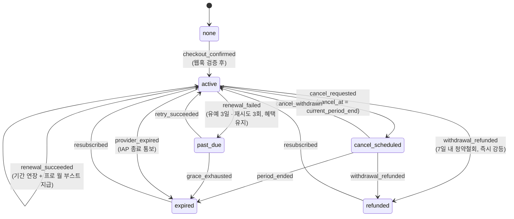

# D6 · 결제/구독 — Phase 3 인터페이스 선확정

> 작성: 서브에이전트 D6 (결제/구독) · 기준일 2026-08-19
> 입력: 04_monetization(티어·원장·환불 계산식) + 09_store_policy(B3 P-1~P-6) + 07_legal_checklist(L2·L7) + 14_schema/00002(실스키마) + tier-limits.ts.
> **⚠️ Phase 1 게이트 전 — 본 산출물은 스키마·인터페이스·상태 머신만 확정한다. Toss/RevenueCat 실연동 코드 없음.** 스텁은 전부 `NotImplementedError("Phase 3"/"Phase 4")`.

산출물:

| 파일 | 내용 |
|---|---|
| `packages/db/src/payments/provider.ts` | 상품 카탈로그·에러 코드·상태 머신·원장 규약·`PaymentProvider`/`ClientPaymentAdapter` 계약·`TossPaymentsProvider`/`IapProvider` 스텁 |
| `packages/db/src/payments/index.ts` | 배럴 (`@duckmate/db/payments`) |
| `packages/db/package.json` | exports 에 `"./payments"` 추가 |
| `supabase/migrations/00012_payments.sql` | `payments`·`payment_events` 신설 + `subscriptions.provider` CHECK |

---

## 다음 에이전트에게 넘기는 결정사항

| # | 결정 | 근거/영향 |
|---|---|---|
| **P6-1** | **상품 키 = `dm_plus_monthly` / `dm_pro_monthly` / `dm_superlike_5` / `dm_boost_1`** (B3 P-3 + 04 §6.1 확정 키 채택). 오케스트레이터 초안의 `dm_sub_plus`·`dm_item_*` 표기는 **폐기** — 원장 `ref`·RevenueCat 등록·이벤트 로깅·`payments.product_key` CHECK 전부 이 4키만 사용. 가격은 키에 넣지 않는다 | 키가 갈라지면 Phase 4 채널 정합 붕괴. `PRODUCT_CATALOG` 가 단일 소스, 가격은 `TIER_PRICES`/`ITEM_PRICES` 참조만 |
| **P6-2** | **결제 채널 enum = `toss` \| `apple` \| `google`** (B3 P-4). 00002 주석의 `'revenuecat'` 표기는 폐기 — RevenueCat 은 게이트웨이일 뿐 채널이 아니다. 00012 가 `subscriptions.provider` 에 CHECK 를 추가함 | D7·E4·D8 은 `PaymentChannel` 타입만 사용. `IapProvider` 는 생성자에서 apple/google 지정 |
| **P6-3** | **`payments` 테이블을 Phase 1 스키마에 선확정** (14_schema §6-1 의 "Phase 3 추가" 를 앞당김). 갱신 회차 포함 결제 1건 = 1행, `paid_at` = 청약철회 7일 기산점, 탈퇴 후에도 보존(user_id set null). `refund_requests.payment_ref` = `payments.id`, 원장 지급 ref = `payment:{payments.id}` | `calc_refund(payment_ref)` 시그니처가 이제 실참조 가능. Phase 3 은 함수 본문만 채우면 됨 |
| **P6-4** | **웹훅 멱등 = `payment_events` (provider, event_id) unique.** 지급·상태 전이는 이 테이블 insert 에 성공한 이벤트에 대해서만 수행하고, unique 충돌(재전송) 시 재처리 없이 200 — `item_ledger (user_id, ref)` 멱등과 2중 방어 | B3 P-5 공통 파이프라인의 입구. RevenueCat 웹훅도 같은 테이블 사용 |
| **P6-5** | **상태 전이는 `SUBSCRIPTION_TRANSITION_TABLE` 밖 전이 금지** — 전이 표에 없는 요청은 `INVALID_STATE_TRANSITION`(409). `cancel_scheduled → active`(해지 철회) 전이를 허용으로 확정(다크패턴 아님 — 유저에게 유리) | 구현부는 `canTransitionSubscription()` 통과분만 UPDATE |
| **P6-6** | **에러 코드·HTTP 매핑 확정**: `MAIL_ORDER_NO_MISSING`=503(L2), `SUB_CHANNEL_CONFLICT`=409, `AMOUNT_MISMATCH`=400, `WEBHOOK_SIGNATURE_INVALID`=401, `INSUFFICIENT_BALANCE`=402, `IDEMPOTENT_REPLAY`=200(원 결과 재반환) 등 — `PAYMENT_ERROR_HTTP_STATUS` 가 단일 소스. E4 는 코드→문구 매핑만 담당(채널명 언급 금지, W-5) | Edge Function 응답 규격 통일 |
| **P6-7** | **E4/훅의 import 규칙**: UI 는 `@duckmate/db/payments` 의 `ClientPaymentAdapter`·`Product`·`PaymentErrorCode` 만 알며, `TossPaymentsProvider` 직접 import 금지(B3 P-1). 팩토리는 Phase 3 에 `apps/web/lib/payments/index.ts` 로 신설 | Phase 4 IAP 전환 시 화면 무수정 |
| **P6-8** | **`payment_events` 는 클라이언트 정책 0개(service 전용)**, `payments` 는 본인 SELECT 만. 어드민 환불 큐의 결제·이벤트 열람은 전부 서버 프록시(service role) — D1-3 원칙 유지 | 페이로드에 PG 식별자 포함 — 노출 금지 |

---

## 1. 구독 상태 머신 (A4 §4 → 타입/상수 확정)

`SubscriptionStatus` = `none | active | cancel_scheduled | past_due | expired | refunded` (00001 enum 그대로).



- 코드 대응물: `SUBSCRIPTION_TRANSITIONS`(상태→허용 목록), `SUBSCRIPTION_TRANSITION_TABLE`(전이×트리거), `canTransitionSubscription()`.
- `past_due → refunded` 는 **없음**: 갱신 실패 상태에서 환불할 신규 결제가 없다(직전 결제는 7일 창 밖).
- 혜택 판정: `active | cancel_scheduled | past_due` = 티어 혜택 유지(`uq_subscriptions_active` partial unique 의 상태 집합과 동일). `expired | refunded | none` = free.

## 2. 웹훅 검증·멱등 설계 (B3 P-5 공통 파이프라인)

```
수신(rawBody, signature)
 → provider.verifyWebhook()          — 서명 검증 + 공통 이벤트 정규화 (부수효과 금지)
   실패 → 401 WEBHOOK_SIGNATURE_INVALID (지급/전이 절대 금지, 원문 로깅)
 → payment_events insert (provider, event_id) unique
   충돌 → 200 (재전송 — 재처리 없음)
 → 이벤트 타입별 처리 (canTransitionSubscription 검증 + 원장 커맨드)
   payment.confirmed          → payments confirmed + 구독 활성/소모성 지급(bucket=purchase, ref=payment:{id})
   subscription.renewed       → 기간 연장 (+ pro 는 monthly_boost:{period} 지급)
   subscription.renewal_failed→ past_due
   subscription.expired       → expired
   refund.completed           → 원장 회수 확정 + refunded/partial_refunded 전이
   refund.failed              → 보상 트랜잭션 (원장 회수 롤백)
 → payment_events.status = processed / failed(error 기록, cron 재시도)
```

멱등 2중 구조: **이벤트 레벨** `payment_events (provider, event_id)` + **원장 레벨** `item_ledger (user_id, ref)` (D1-6). 지급은 반드시 웹훅(또는 서버-투-서버 승인 실검증) 통과 후 — 클라이언트 요청 단독 지급 금지(A4 §2.2). L2 주의: `MAIL_ORDER_NO_MISSING` 503 은 **결제 세션 생성에만** 적용, 웹훅 핸들러는 항상 동작(기존 구독 정산 보호).

## 3. 환불 플로우 (calc_refund 연계, L7)

```
E4 환불 신청 폼 → [사전 표시] calc_refund(payment_id) 로 예상 환불액 노출 (신청 전)
 → refund_requests insert (status=requested)
 → D8 어드민 큐: 같은 calc_refund 결과(일할·아이템 차감 근거) 표시 → 승인
 → 원장: 미사용분 음수 행 회수 (ref=refund:{refund_request_id})
 → provider.processRefund() → PG 부분취소 호출
 → refund.completed 웹훅 확인 후에만 원장 확정 + payments/subscriptions 전이
   (refund.failed 시 보상 트랜잭션으로 회수 행 되돌림)
 → audit_logs 기록 · SLA 영업일 3일 (idx_refund_requests_queue)
```

- 계산식은 `calc_refund()` **서버 단일 구현**(00004 뼈대의 주석 = A4 §5.2/5.3 그대로): 구독 `max(0, 월요금 − 월요금×d/30 − grant_sub 사용×정가단가)`, 팩 `결제액×미사용/총수`, 부스트 사용 전 전액/후 0. TS 미러 타입 = `RefundCalcResult`.
- 7일 판정 = `payments.paid_at + interval '7 days'` 서버 시각. 경과 시 `REFUND_WINDOW_EXPIRED`(422) — 해지 예약만 안내.
- 서비스 귀책(`serviceFault: true`) = 기간·사용분 무관 전액. 제재 유저도 미사용분 환불(몰수 금지). 구독 환불 확정 시 `refunded` 전이 + 잔여 grant_sub 전량 회수 + 즉시 free 강등.
- IAP 환불(Phase 4)은 스토어 위임 — `calc_refund` 는 웹(toss) 결제 전용, E4 는 `capabilities.canRefundInApp` 으로 폼 노출 분기(B3 E-3).

## 4. E4 구독 관리 화면 조회 API 계약 (Phase 3 구현 대상)

전부 GET(Edge Function 또는 RLS 직조회), 반환 타입은 `@duckmate/db`/`@duckmate/db/payments` 의 것만 사용.

| 조회 | 소스 | 반환 | 비고 |
|---|---|---|---|
| 내 구독 | `subscriptions` RLS 본인 SELECT | `Subscription` | `status`·`current_period_end`·`cancel_at` 로 "다음 결제일/해지 예정일" 렌더. 자동갱신 문구는 결제 버튼 **위** 고정(A4 다크패턴 #1) |
| 아이템 잔액 | `item_balances` 뷰 | `ItemBalance[]` | 만료 예정 고지는 `item_ledger` 본인 SELECT 로 `expires_at` 최근접 행 병기(다크패턴 #9) |
| 결제 내역 | `payments` RLS 본인 SELECT (`idx_payments_user`) | `PaymentRow[]` | 7일 창 내 건에만 "환불 신청" 버튼 |
| 예상 환불액 | Edge `GET /payments/refund-preview?payment_id=` → `calc_refund` | `RefundCalcResult` | 신청 전 표시 의무(A4 §5.4-2). 어드민과 동일 함수 |
| 환불 신청 상태 | `refund_requests` RLS 본인 SELECT | `RefundRequest[]` | 접수 확인 자동 발송(다크패턴 #10) |
| 상품/가격 | `provider.getProducts()` | `Product[]` | 가격 표시는 이 결과만(B3 P-6). CTA 활성화 전 `MAIL_ORDER_NO_MISSING` 검사(서버가 최종 방어선) |

에러 안내 문구 규칙: `SUB_CHANNEL_CONFLICT` → "이미 이용 중인 구독이 있어요. 기간 종료 후 변경할 수 있어요" (**채널명 언급 금지**, B3 W-5).

## 5. Phase 3 구현 체크리스트 (파일 단위 — 무엇을 채우면 되는가)

| # | 파일 | 할 일 |
|---|---|---|
| 1 | `packages/db/src/payments/provider.ts` | `TossPaymentsProvider` 6개 메서드 본문 구현 (빌링키 발급·결제 승인 서버-투-서버 실검증·부분취소·웹훅 서명 검증). 타입 변경 금지 — 계약은 동결 |
| 2 | `apps/web/lib/payments/index.ts` (신설) | `getRuntime()` 기반 provider 선택 팩토리 + `ClientPaymentAdapter` 웹 구현 (B3 §5.3 배치 그대로) |
| 3 | `supabase/functions/payments-checkout/` (신설) | 세션 생성: ①`ECOMMERCE_REG_NO` 검사(없으면 503 `MAIL_ORDER_NO_MISSING`) ②채널 충돌 검사(`SUB_CHANNEL_CONFLICT`) ③카탈로그 금액 재계산 ④`payments` ready 행 선생성 |
| 4 | `supabase/functions/payments-webhook/` (신설) | §2 파이프라인: verifyWebhook → payment_events 멱등 insert → 전이/지급 → processed 마킹. 실패 재시도 cron 포함 |
| 5 | `supabase/migrations/000NN_calc_refund_impl.sql` (신설) | `calc_refund()` 본문 구현 (00004 뼈대 교체, `payments`·`item_ledger` 조인) + 원장 지급/차감 Postgres 함수(FOR UPDATE/advisory lock, `BUCKET_CONSUME_ORDER` = expires_at asc nulls last) |
| 6 | `supabase/functions/payments-refund/` (신설) | 환불 신청 접수·`refund-preview`·어드민 승인 처리(§3 플로우), audit_logs 기록 |
| 7 | E4 (`apps/web/app/(main)/settings/subscription/…`) | §4 계약 화면: 페이월 진입 5지점(`paywall_source` 로깅), 2뎁스 해지, 결제 전 §13 고지 4종, 예상 환불액 표시 |
| 8 | D7 cron | 주간 grant_sub 지급(+이전 주 `weekly_reset:` 소멸 행), 프로 `monthly_boost:` 지급, 갱신 3일 전 고지, past_due 재시도 3회/3일 |
| 9 | G1 E2E | "결제→7일 내 철회→환불액 검증" + "결제 화면이 provider 팩토리 경유" 스모크 + 해지 3탭 이내 |
| 10 | 게이트 확인 | 통신판매업 신고번호 실값 입력·B2 환불 약관 문안과 `calc_refund` diff 검증(L7) — Phase 3 게이트 체크리스트 |

## 6. 미결/후속

1. **업/다운그레이드 플로우 미정의** — v1 은 해지 후 재구독으로 갈음할지, 즉시 전환+차액 처리로 할지 소유자 결정 필요(다크패턴 #8 확인 화면 요건만 확정됨). 결정 전까지 `ALREADY_SUBSCRIBED`(409) 로 차단.
2. `refund_requests.payment_ref` 는 text — `payments.id` FK 로 조이는 마이그레이션은 Phase 3 에서 데이터 없음을 확인하고 D1 협의 후 진행(선택).
3. Toss 빌링키 자동 갱신 트리거(자체 cron 과금 vs Toss 정기결제) 방식은 Phase 3 계약 시 확정 — 상태 머신·이벤트 타입은 양쪽 모두 수용 가능하게 설계됨.
