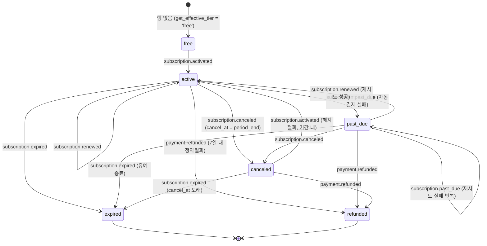
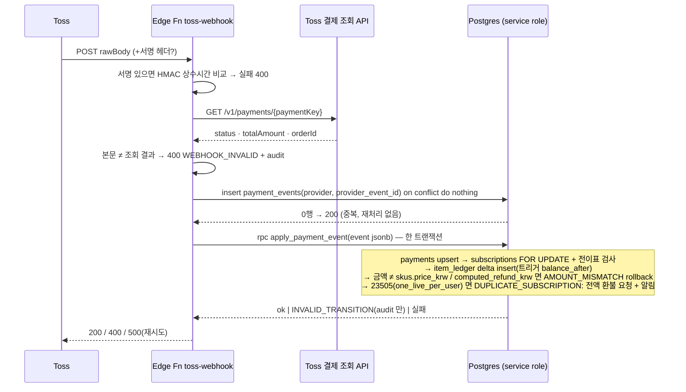

# 19 — 결제/구독 (D6, Phase 1 = 인터페이스·상태 머신·문서만)

> 담당: D6 결제/구독(Toss) · 입력: `04_monetization.md`(A4), `09_store_policy.md`(B3), `07_legal_checklist.md`(B1 §6), `08_legal_docs.md`(B2, refund-policy), `14_schema.md`(D1 0006).
> 산출물: `apps/web/lib/payments/**`(types·errors·state-machine·refund·entitlements·native·providers/*), `apps/web/vitest.config.ts`, `supabase/functions/toss-webhook/index.ts`(501 stub), 이 문서.
> **Phase 1 규칙: 결제 로직 없음.** provider 는 전부 stub 이며 `PAYMENTS_ENABLED !== 'true'` 이면 `DisabledPaymentProvider` 만 반환된다. 스키마는 D1 `0006` 을 그대로 쓰고 SQL 은 한 줄도 추가하지 않았다.

## 다음 에이전트에게 넘기는 결정사항

### E4 (구독 관리·상점 UI, Phase 1 에서 보여줄 것)
1. **Phase 1 `/settings/subscription` 은 "준비 중" 배지 + 티어표(무료/플러스/프로 12키, `ENTITLEMENTS` 에서 렌더) + 결제 버튼 없음**. 판정은 서버 컴포넌트에서 `isPaymentsEnabled()`(`@/lib/payments`) 1곳. 가격 숫자는 코드에 두지 말고 `skus`(`is_active=false` 시드 4행) 를 읽되 Phase 1 은 표시 문자열도 "준비 중"으로 — `getDisplayPrice()` 가 아직 throw 하기 때문.
2. **티어 비교 금지, 키 비교만**: `getEntitlements(tier).undo === true`. 수치 한도 `-1` 은 "전체"로 표기(`UNLIMITED`). 무료 열은 긍정 표기("5명/일")이고 X 아이콘은 실제 `false` 항목만(A4 §5-16).
3. **`isNativeApp()` 은 `@/lib/payments/native` 단일 소스**(B3 의 `packages/db/src/platform.ts` 제안은 db 패키지 런타임 의존성 0 원칙 때문에 apps/web 으로 옮김). `<WebOnly>` 컴포넌트는 E4 가 `WebOnlyProps` 타입으로 구현: native 면 children 렌더 0, `fallback` 만.
4. **결제 시트 고정 요소(Phase 3)**: 결제 버튼 **위** "매월 {일}에 ₩{금액} 자동 결제 · 언제든 해지" + `auto_renew` 체크(사전 선택 금지, 미체크 시 버튼 비활성) + 아이템은 `digital_no_withdrawal` 체크 + 환불정책 링크 + 사업자 정보 축약 블록. 금액·주기 값은 provider `DisplayPrice` 에서만(B3 §0-23). §7 다크패턴 수용 기준을 PR 체크리스트로 쓴다.
5. **환불 요청 화면은 `computeRefund()` 로 예상액을 즉시 표시**하되 "예상"임을 명시하고, 접수 시 서버 `compute_refund` 결과를 `refund_requests` 에 저장한다. provider 가 apple/google 이면 `refundPath()` 의 스토어 링크로 대체.
6. **해지 = 2탭 + 확인 1회**, 확인 문구는 "혜택은 {`current_period_end`}까지 유지돼요" 만. `cancelSubscription(id, 'period_end')` 만 호출 — `'now'` 는 환불 승인 플로우 내부 전용.

### D2 (에러 코드 통합)
7. D6 는 `@/lib/payments/errors` 에 자체 상수 `PAYMENT_ERROR_CODES` 를 뒀다. `NOT_ENTITLED` 문자열은 `@duckmate/db` `ERROR_CODES` 와 동일. D2 의 공용 에러 클래스가 확정되면 `PaymentError` 가 그것을 extends 하도록 바꾸되 **코드 문자열과 message 포맷 `"${code}: ${detail}"`(RPC raise 규칙 14 §0-40 과 동일) 은 유지**. `LIMIT_REACHED`·`NO_SUPERLIKE`·`PRIORITY_WINDOW`·`EXPIRED`·`PAYMENTS_DISABLED` 는 db `ERROR_CODES` 에 추가 요청.
8. `.env.example` 에 `PAYMENTS_ENABLED=false` 한 줄 추가 필요(D6 경로 밖이라 미수정). `NEXT_PUBLIC_` 접두어 **없이** — 클라이언트 번들에 플래그를 노출하지 않고 서버 컴포넌트/액션에서만 판정.

### D1 / D6 Phase 3 마이그레이션 (0014 는 D2 auth_pipeline 이 사용 → 0015~)
9. **idempotency 키는 `payments.provider_event_id` 컬럼이 아니라 `payment_events(provider, provider_event_id) unique` 테이블로 확정** — 결제 1건에 이벤트가 N개(paid → partial refund → refund) 오므로 단일 컬럼으로는 두 번째 이벤트를 기록할 수 없다. `payments(provider, provider_payment_id)` unique 는 결제 dedupe 로 그대로 사용.
10. `skus` 에 `apple_product_id`·`google_product_id` 컬럼 추가(B3 §0-8). `rewind_3`/`card_refill_3` 시드는 A4 후보 확정 후.
11. **SQL `compute_refund(payment_id, requested_at)` 은 `apps/web/lib/payments/refund.ts` 와 같은 입력에 같은 출력**이어야 한다(§4.3 대조표 고정값 ₩8,910/₩2,940/₩0 + 경계 케이스). `round(numeric)` 사용(double 금지). 사용일수 = KST 달력일 차 + 1, 달 일수 = 결제일(KST) 달, 7일 창 = `requested_at - paid_at <= interval '7 days'`, card_refill 당일 = `loop_date()` 동일.
12. `item_ledger.balance_after` 는 **트리거가 계산**(§5). 앱 코드는 delta 만 insert. 잔액 조회는 `SUM(delta)` + `pg_advisory_xact_lock(hashtext(user_id||item_type))`.
13. `subscriptions_one_live_per_user` 는 이미 `status in (active, past_due, canceled)` 로 존재(0006). B3 §0-24 의 `(active, past_due)` 안보다 넓은 D1 안을 유지 — canceled 도 혜택이 살아있으므로 두 번째 행이 생기면 안 된다. B3 §4.2 "canceled 상태에서 앱 구독" 은 **기존 행 expired 후** 새 행으로 처리(시작일 = `current_period_end`).
14. **`refund_requests` 보존 3년 → 5년으로 통일**(B1 §0-16 은 분쟁 3년, A4/refund-policy §7-5 는 스냅샷 5년). 더 긴 쪽으로 `RETENTION_DAYS.paymentsYears=5` 준용.

### D6 Phase 3 구현 체크리스트
15. `TossPaymentProvider` 실구현(billingKey 정기결제·결제창·취소 API) — `toss.stub.ts` 상단 메모 순서대로. `getPaymentProvider()` 선택 로직은 이미 있으므로 stub 본문만 교체.
16. `toss-webhook` Edge Function: 서명(있으면) + **결제 조회 API 재확인 필수** + `payment_events` idempotency + 금액 서버 재계산 + RPC `apply_payment_event(jsonb)` 한 트랜잭션. §3 시퀀스.
17. 갱신 배치(D7 협업): `current_period_end - 7d` 알림 1회(전자상거래법·A4 §5-1), `cancel_at` 있으면 청구 스킵 → `subscription.expired`, 결제 실패 → `past_due` + 유예(기본 3일, 스토어 grace 와 동일) 후 `expired`.
18. `app_settings.payments_enabled=true` 와 env `PAYMENTS_ENABLED=true` 는 **같은 배포에서 함께** 켠다. 둘 중 하나만 켜지면 UI 는 결제 버튼을 보이는데 tier 는 free 이거나 그 반대가 된다. 사업자 정보(`COMPANY_NAME`·`ECOMMERCE_REG_NUMBER`) 미입력 시 `companyInfoComplete=false` 로 강제 off.
19. `v_likers` 뷰(A4 §2.3 #3, `see_likers='blur'` 마스킹)와 `undo_last_pass`·`send_super_like` 잔액 경로 — `ENTITLEMENT_CHECKPOINTS` 표의 Phase 3 항목.
20. 가격 변경은 `sku_price_history` insert + 활성 구독자 30일 전 통지 + 갱신 시 재동의(미동의 → 해지, 인상가 자동 청구 금지, B1 §6).

### G2 보안 리뷰 포인트
21. **웹훅 서명·조회**: 서명 헤더 유무와 무관하게 결제 조회 API 재확인이 있는가. 비교는 상수시간인가. rawBody 를 파싱 전에 검증하는가.
22. **idempotency**: `payment_events` insert 가 트랜잭션 **첫 문장**인가(on conflict do nothing → 0행이면 200 즉시). 재시도가 ledger 이중 적립을 만들 수 없는가.
23. **금액 서버 재계산**: `createCheckout` 이 클라이언트 금액을 받지 않는가. 웹훅 totalAmount ≠ `skus.price_krw` / cancelAmount ≠ `computed_refund_krw` 이면 처리 중단하는가.
24. **RLS**: `subscriptions/payments/item_ledger/boosts/refund_requests` 는 본인 select 만, 모든 쓰기는 service role RPC — 클라이언트 키로 insert 가 거부되는 E2E 가 있는가. `app_settings` 는 클라이언트 읽기 불가 유지.
25. **상태 머신 우회**: 웹훅 핸들러가 `select ... for update` 후 전이표를 검사하고 INVALID_TRANSITION 을 조용히 덮어쓰지 않는가(§2). `canceled + renewed` 가 절대 청구로 이어지지 않는가.
26. **환불 실행 경로 단일화**: `payments.refunded_amount_krw` 갱신은 웹훅(`payment.refunded`)만, `refund()` 호출 직후 직접 갱신하지 않는가. 위반 정지(level≥3 confirmed) 유저 환불 거부는 SQL 이 아니라 접수 단계 정책 검사로 분리돼 있는가.
27. **비밀값**: `TOSS_SECRET_KEY`·`TOSS_WEBHOOK_SECRET`·service role 이 클라이언트 번들·로그·audit 에 없는가. 로그 필드는 paymentKey/orderId/eventType 만.

---

## 1. 파일 구성

| 파일 | 내용 |
|---|---|
| `apps/web/lib/payments/types.ts` | `PaymentProviderId`(toss/apple/google) · SKU 타입 · `LedgerRef` · 이벤트 유니온 9종 · `PaymentProvider` 인터페이스(7 메서드) |
| `…/errors.ts` | `PAYMENT_ERROR_CODES`(13) · HTTP 매핑 · `PaymentError` · `paymentsDisabledError()` |
| `…/state-machine.ts` | `SUBSCRIPTION_TRANSITIONS` 표 · `transition()`(Error 반환, throw 안 함) · `LIVE_STATES`/`TERMINAL_STATES` |
| `…/refund.ts` | `computeRefund()` 순수 함수 + `RefundFormulaSnapshot`(= `refund_requests.formula_snapshot`) |
| `…/entitlements.ts` | `getEntitlements`·`isEntitled`·`assertEntitled`·`ENTITLEMENT_CHECKPOINTS`(8곳) |
| `…/native.ts` | `isNativeApp()`(항상 false, Phase 4 교체 지점) · `buildTarget()` · `WebOnlyProps` 타입 |
| `…/providers/{disabled,toss.stub,revenuecat.stub,index}.ts` | stub 3종 + `getPaymentProvider()`/`isPaymentsEnabled()` |
| `…/*.test.ts` (4) | 상태×이벤트 전수 54셀, 환불 예시 3건 + 경계, 권한, provider 게이트 — 90 tests |
| `apps/web/vitest.config.ts` | node 환경, `**/*.test.ts` |
| `supabase/functions/toss-webhook/index.ts` | POST → 501 `PAYMENTS_DISABLED: Phase 3`. 처리 설계 주석 7단계 |

인터페이스 요약:

```ts
interface PaymentProvider {
  readonly id: 'toss' | 'apple' | 'google' | 'disabled';
  createCheckout(sku, userId): Promise<{ redirectUrl }>;          // 금액은 서버가 skus 에서
  verifyWebhook(rawBody, signature | null): Promise<ProviderEvent>; // 서명 + 조회 API 재확인
  cancelSubscription(providerSubId, 'period_end' | 'now');
  refund(providerPaymentId, amountKrw /* compute_refund 결과만 */, reason);
  getDisplayPrice(sku): Promise<{ display, amountKrw | null, terms }>; // B3 §0-8
  manageSubscriptionUrl(userId): Promise<string | null>;           // B3 §0-5
  refundPath(providerPaymentId): { kind:'in_app' } | { kind:'store', url, label };
}
```
B3 §0-5 의 `{listSkus, purchase, restore, manageSubscriptionUrl, refundPath}` 와의 대응: `listSkus`→`skus` 테이블 + `getDisplayPrice`, `purchase`→`createCheckout`, `restore`→Phase 4 RevenueCat 전용이라 인터페이스 밖(SDK 직접 호출), 나머지 동일.

## 2. 구독 상태 머신



- `free` 는 가상 상태. 만료/환불 뒤 재구독 = **새 행**(`free` 에서 재시작). `subscriptions_one_live_per_user` 가 active/past_due/canceled 동시 2행을 막는다.
- **불변식**: `canceled + renewed` 는 에러(해지 = 갱신 중단). 종단(`expired`/`refunded`)은 어떤 이벤트도 받지 않는다. `free` 로 돌아가는 전이는 없다.
- `payment.succeeded`/`payment.failed`/`item.granted` 는 구독 상태를 직접 바꾸지 않는다 — Toss 어댑터가 자동결제 결과를 `subscription.renewed`/`subscription.past_due` 로 번역한다.
- 중복 이벤트(active+activated 등)는 에러. 재전송은 상태 머신이 아니라 §3 의 idempotency 가 흡수한다. Phase 3 SQL 은 같은 전이표를 `case` 문으로 옮기고 `state-machine.test.ts` 의 54셀과 대조한다.

## 3. 웹훅 처리 시퀀스 (Phase 3)



- **응답 규칙**: 처리 성공·중복·INVALID_TRANSITION(무시) = 200, 검증 실패 = 400(재시도 무의미), 내부 오류 = 500(재시도 유도, idempotency 로 안전).
- 유저 매핑: Toss `customerKey` = auth `user_id`. 매핑 실패 이벤트는 `payment_events.unmapped=true` 로 남기고 운영 큐.
- RevenueCat(Phase 4) 은 `store_webhook` 함수로 분리하되 4단계 `apply_payment_event` 를 **그대로 재사용**(provider 만 다름).

## 4. 청약철회(환불) 플로우

### 4.1 사용자 플로우
1. 설정 > 결제 내역 > [환불 요청] (A4 §5-14: 앱 내 버튼, 이메일 접수 금지).
2. 화면이 `computeRefund()` 로 **예상 환불액 즉시 표시** + 사유 5종 선택(`change_of_mind`/`service_fault`/`duplicate_charge`/`minor`/`other`, refund-policy §7 순서).
3. 접수 → 서버 `compute_refund(payment_id, requested_at)` → `refund_requests(status='requested', formula_snapshot)` insert.
4. 운영 승인(`approved`) → `provider.refund(paymentKey, computed_refund_krw, reason)` → Toss 부분취소.
5. 웹훅 `payment.refunded` → `payments.refunded_amount_krw`, 구독이면 `subscriptions.status='refunded'`(즉시 free), 아이템이면 `item_ledger` `refund_reversal:{refund_id}` 로 미사용분 회수 → `refund_requests.status='executed'`.
6. 법정 기한 **3영업일**(전자상거래법 §18②). `requested_at + 3 영업일` 초과 미처리 건은 운영 대시보드 경고.

### 4.2 규칙 (refund.ts = 진실, A4 §6.1)
| 종류 | 7일 내 | 7일 후 | 사용 개시 |
|---|---|---|---|
| 구독 | `F − round(F×U/D)`, U = KST 달력일 차+1(당일 1일), D = 결제일 달 일수 | 불가(혜택 유지) | 결제 완료 시 |
| 아이템(superlike·rewind) | `F − round(F/Q × u)`; 잔액 < 미사용분이면 `round(F/Q × 회수가능)` | 불가 | 1개 사용 시 |
| 부스트 | 미발동 전액 / **발동 후 0** | 불가 | 발동 버튼 |
| 카드 리필 | 미사용 + 구매 당일(`loop_date` 동일) 전액 / 1장 사용 시 0 | — | 1장 뽑기 |
| 예외 사유 `service_fault`·`duplicate_charge`·`minor` | **전액**, 창·차감 미적용 | 전액 | 무관 |

### 4.3 SQL `compute_refund` 대조표 (Phase 3 에 SQL 테스트로 옮길 고정값)
| 케이스 | 입력 | 차감 | 환불 |
|---|---|---|---|
| 예시 1 | subscription 9,900 / 9/1 10:00 → 9/3 09:00 (U=3, D=30) | 990 | **8,910** |
| 예시 2 | item 4,900 / Q=5, u=2 | 1,960 | **2,940** |
| 예시 3 | boost 3,900 / 발동 후 40분 | 3,900 | **0** (service_fault → 3,900) |
| 당일 | subscription 9,900 / 같은 날 | 330 | 9,570 |
| 창 경계 | 결제 +168h 00m 00s = 공식 / +168h 00m 01s = 불가 | — | — |
| 10월 | subscription 19,900 / 10/1→10/2 (D=31) | 1,284 | 18,616 |
| 반올림 | item 1,900 / Q=3, u=1 | 633 | 1,267 |
| 회수 제한 | item 4,900 / Q=5, u=2, 회수 가능 1 | 3,920 | 980 |
| 카드 리필 | 20:00 구매 → 익일 06:59 전액 / 07:00 불가 | — | 1,500 / 0 |

`formula_snapshot` = `RefundFormulaSnapshot`(version 1) 그대로 저장, 5년 보존. 위반 정지(level≥3 confirmed) 유저의 환불 거부는 계산식이 아니라 **접수 단계 정책 검사**(변호사 검토 항목, B1 §7).

## 5. 원장(item_ledger) 불변 규칙 — Phase 3 SQL 명세

1. **delta 만 insert, update/delete 금지**(테이블에 update/delete 정책·grant 없음, service role 도 RPC 를 통해서만). 만료·회수도 음수 delta 행.
2. `balance_after` 는 앱이 넣지 않는다. `before insert` 트리거가 `pg_advisory_xact_lock(hashtext(user_id::text || item_type::text))` 획득 후 `coalesce(sum(delta),0) + new.delta` 를 계산해 채우고, **결과가 음수면 raise `NO_SUPERLIKE`/`INSUFFICIENT_BALANCE`** 로 insert 자체를 거부한다.
3. 잔액의 진실은 항상 `SUM(delta)`. `balance_after` 는 감사·디버그 참고값이며 두 값이 어긋나면 배치가 알림(일 1회 정합성 검사).
4. `ref` 접두어 고정(`LedgerRef` 타입): `purchase:{payment_id}` / `sub_grant:{subscription_id}:{period}` / `quest:{quest_progress_id}` / `use:{like_id|boost_id|…}` / `expire:{원 purchase ref}` / `refund_reversal:{refund_id}` / `admin:{audit_log_id}`. check 제약으로 강제.
5. 차감 순서(FIFO by `expires_at` nulls last → 퀘스트분 → 구매분)는 소비 RPC 가 결정하고 `ref='use:…'` 1행만 남긴다(묶음별 분할 행 없음). 환불 회수 가능 수량은 `purchase:{payment_id}` 잔여 = 구매 delta − 해당 구매에서 소비된 수량으로 계산.
6. 주간 슈퍼라이크 쿼터는 ledger 에 넣지 않는다(`weekly_superlike_used()` 뷰). 사용 순서 = 쿼터 먼저, 잔액 나중.
7. 부스트: 보유 1개 = ledger, 발동 = `boosts` insert + ledger `-1`(`use:{boost_id}`) 같은 트랜잭션. 활성 중 재발동 금지(`boosts` 활성 행 exists 검사).
8. IAP 구매분(provider apple/google)은 `expires_at = null` 고정(B3 §2.4 만료 불가). 웹 구매 boost 는 +90일, card_refill 은 다음 `loop_date` 07:00.
9. 탈퇴 시 `user_id set null`, 행 삭제 없음(5년 보존).

## 6. Phase 1 → 3 게이트 요약

| 게이트 | Phase 1 값 | Phase 3 |
|---|---|---|
| env `PAYMENTS_ENABLED` | 미설정(=false) → `DisabledPaymentProvider` | `true` |
| `app_settings.payments_enabled` | `false` → `get_effective_tier` 항상 free | `true` (같은 배포) |
| `skus.is_active` | 4행 전부 false | 판매 SKU 만 true |
| `companyInfoComplete` | E4 가 company config 로 주입, 비면 강제 off | true |
| `toss-webhook` | 501 | 실구현 + Toss 대시보드 URL 등록 |

## 7. 다크패턴 금지 → UI 수용 기준 (A4 §5 + B1 §6 6유형)

| # | 금지 | 수용 기준(E4 PR 체크) |
|---|---|---|
| 1 | 숨은 자동갱신 | 결제 버튼 **바로 위** 고정 문구 "매월 {일} ₩{금액} 자동 결제 · 언제든 해지"; `auto_renew` 체크 미선택 시 버튼 disabled; D-7 알림 1회 |
| 2 | 해지 방해 | 설정 → 구독 관리 → 해지 = 2탭 + 확인 1회. 확인 화면은 종료일만. 만류 오퍼·설문 필수화 없음(설문은 건너뛰기 가능) |
| 3 | 공포·긴급 카피 | "내일 5명 더 와요" 류 사실 문장만. 카운트다운 애니메이션 0. 할인은 종료 일시 정확 표기 |
| 4 | 가짜 신호 | 좋아요 알림은 `like_id` 필수. 블러 카운트 = DB 실제 수 |
| 5 | 순차공개 가격 | 부가세 포함 최종가 1곳. 일 환산은 회색 보조 표기만 |
| 6 | 사전 선택 | 기본 선택 SKU 없음, "함께 구매" 체크 기본 off, 필수 동의 사전 체크 없음 |
| 7 | 잘못된 계층구조 | "닫기"(헤더 X + 하단 텍스트) 와 "구매" 터치 영역 ≥44pt, 시각 위계 동일 |
| 8 | 반복 간섭 | 상점 시트 자동 재노출 세션당 1회. 패스 후 되돌리기 스낵바 5초 1회 |
| 9 | 응답 유료 가림 | 채팅 본문 전부 열람. 유료는 읽음 표시뿐 |
| 10 | shadow throttle | 노출 가중치는 부스트(고지)·`liker_priority` 만. 배치 코드 리뷰 항목 |
| 11 | 환불 경로 차단 | 결제 내역에 [환불 요청] 버튼 + 예상액 즉시 표시. 스토어 결제는 스토어 딥링크 |
| 12 | 무료 열 폄하 | 무료 열 긍정 표기, X 는 실제 false 만 |
| 13 | 웹 유도(앱) | 웹 결제 문구·Toss UI 는 `<WebOnly>` 안에만. `STORE_COPY_FORBIDDEN_WORDS` grep 가드 |
| 14 | 조용한 혜택 축소 | `ENTITLEMENTS` 변경 PR 은 A4 문서 개정 + 30일 전 공지 + grandfathering |

## 8. 검증 결과 (2026-09-02)

| 항목 | 결과 |
|---|---|
| `tsc --noEmit -p apps/web/tsconfig.json` | 오류 0 (D2 동시 작업 경로 포함 전체) |
| `vitest run` (apps/web) | 4 파일 90 tests 통과 — 상태 머신 54셀 전수 + 불변식 7, 환불 20, 권한 5, provider 3 |
| git commit | 없음(지시) |
| D2 경로(`lib/supabase|auth|onboarding|identity|photos`) | 미접촉 |
