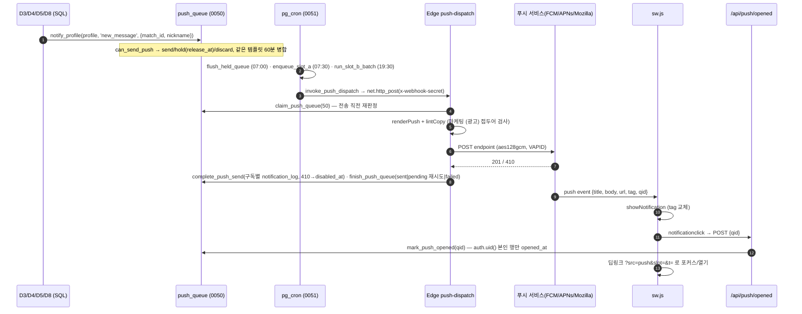

# 20 — 알림 · 스케줄러 · Web Push (D7)

> 입력: `14_schema.md`(push_subscriptions·notification_log·loop_date·함수 권한), `15_auth.md`(ActionResult·admin 클라이언트·env lazy·consents), `03_core_loop.md` §7(푸시 예산), `07_legal_checklist.md` §0-20/23/24(광고성 정보), `10_brand.md` §4.3/4.4/4.5(#33·#34), `06_PRD.md` §4.8·부록 B.
> 산출물: `supabase/migrations/20260902000050_push_core.sql`, `…0051_push_scheduler.sql`, `supabase/functions/{push-send,push-dispatch}/**`, `apps/web/lib/push/**`, `apps/web/app/api/push/**`, `apps/web/public/{sw.js,manifest.webmanifest}`.
> 기준일 2026-09-02. 로컬 PostgreSQL 16(셰임) 마이그레이션 적용 + SQL 시나리오 18개, vitest 44개 통과(§7). Docker/Deno 없음 → Edge Function 실행·실제 Web Push 전송은 미검증(G3 절차 §6).

## 다음 에이전트에게 넘기는 결정사항

### E4 (설정 > 알림 화면) · E5 (푸시 권한 배너·분석)
1. **서버 액션 4개(`apps/web/lib/push/actions.ts`, 전부 `ActionResult`)**: `subscribePush({subscription, kinds?, userAgent?})` → `{subscriptionId, prefs}` / `unsubscribePush({endpoint})` / `updatePushPrefs({service?, slots?:{slotA,slotB,instant}, marketing?, quiet_hours?:{start:"HH:MM",end:"HH:MM"}|null})` → `PushPrefsView` / `getPushPrefs()` → `PushPrefsView`(초기값). 입력 스키마·`PushPrefsView` 타입은 `lib/push/schemas.ts`.
2. **화면 구조는 B1 §0-20 그대로 두 섹션**: (a) 서비스 알림 — 마스터 토글(`service`) + 슬롯 3개(아침 추천 `slotA` / 저녁 1건 `slotB` / 매칭·답장 `instant`) + 방해금지 시간(`quiet_hours`, KST, 시스템 야간 23~07 은 항상 적용이라 안내만) (b) 마케팅 수신 — 토글(`marketing`) 옆 "동의일 `marketing.agreedAt`" + "수신 동의는 2년마다 확인해요"(`marketing.recheckDueAt`). **마케팅 토글은 consents 새 행**(철회 = `agreed=false, withdrawn_at`)이고 서비스 토글은 `push_subscriptions`/`push_prefs` 다. 권한 허용 ≠ 마케팅 동의(B1 §4).
3. **클라이언트 헬퍼 `lib/push/client.ts`** (서버 import 없음): `enablePush()` 한 번에 sw 등록 → 권한 → 구독 → `{status, subscription}`; 성공이면 곧바로 `subscribePush({subscription})`. 낱개: `registerServiceWorker` `requestPermission` `getSubscription` `subscribeBrowser(vapidKey)` `unsubscribeBrowser()`(반환 endpoint → `unsubscribePush`). `getPermissionState()` 가 `"unsupported"` 면 알림 섹션을 숨기고 안내 1줄. VAPID 공개키는 `NEXT_PUBLIC_VAPID_PUBLIC_KEY`(`vapidPublicKeyFromEnv()`); 없으면 `enablePush` 가 `reason:"no_vapid_key"` → 기능 비노출.
4. **권한 요청 타이밍(E1/E2)**: 브라우저 프롬프트는 반드시 **버튼 클릭 핸들러 안**에서. 순서 = 온보딩 6화면·본인인증 후 첫 `/home` 진입(또는 루프 끝 화면) → 소프트 배너(C1 #34 "새 추천이 오면 알려드릴까요? / 하루 최대 2번, 밤에는 보내지 않아요") → [알림 켜기] 클릭 시 `enablePush()`. 배너는 **loop_date 당 1회**(`shouldShowPermissionBanner(loopDate)` / `markPermissionBannerShown`), `denied` 면 다시 묻지 않고 인앱 배너만(PRD §4.8). 온보딩 안(S1~S6)에서는 묻지 않는다.
5. **분석 이벤트(E5)**: 알림 클릭 딥링크에 `?src=push&slot=A|B|instant&t=<template>` 가 붙는다 → `app_opened{source:"push", push_slot}` 로 기록. `push_opened` 는 sw 가 `/api/push/opened` 로 서버에 직접 남기므로(`notification_log.opened_at`) 클라이언트가 또 보낼 필요 없음. `push_permission_prompted/granted{attempt_no}` 는 E5 가 배너/`enablePush` 결과에서 기록.
6. **서비스워커 등록은 `client.ts` 가 필요할 때 한다**(`/sw.js`, scope `/`). `app/layout.tsx` 에 `<link rel="manifest" href="/manifest.webmanifest">` 와 `theme-color` 메타 추가는 **병합 요청**(§6). 아이콘 파일 `public/icons/{icon-192,icon-512,badge-72}.png` 는 C2/E5 가 브랜드 자산으로 추가(없어도 알림은 뜨고 아이콘만 비어 보임).
7. **`manifest.webmanifest` 의 `name`/`short_name` 은 "덕메이트" 리터럴**(매니페스트는 정적 파일이라 `{{SERVICE_NAME}}` 바인딩 불가). 서비스명 확정 시 이 파일 + `templates.ts` 의 `DEFAULT_SERVICE_NAME` 두 곳만 바꾼다. `apps/web/config/site.ts` 가 생기면 `renderPush(key, params, {serviceName})` 로 주입하고 Edge 는 secret `SERVICE_NAME` 으로 받는다.

### D3 (추천·매칭) · D4 (채팅) · D8 (어드민) — 훅 호출법
8. **훅은 SQL 함수 하나: `public.notify_profile(p_profile_id uuid, p_template_key text, p_params jsonb)`** (service 전용, `authenticated` 실행 불가). 정책(`can_send_push`)을 통과한 것만 `push_queue` 에 넣고 `{queued, queue_id, action:'send'|'hold'|'discard', reason, merged?}` 를 돌려준다. 호출 측은 반환값을 **무시해도 된다**(예외 없음, 프로필 없음/구독 없음은 `queued:false`). Edge Function 을 직접 부를 필요 없음 — `push-dispatch` 가 5분마다 큐를 비운다.
9. **D3 매칭 생성 시** (매칭 RPC 트랜잭션 안, 양쪽 각각): `perform public.notify_profile(<상대 profile_id>, 'new_match', jsonb_build_object('match_id', m.id, 'nickname', <내 닉네임>, 'like_id', <상대가 받은 like.id>));` — `like_id` 는 `notification_log.like_id` 로 옮겨져 "실제 좋아요 행이 있는 신호"를 증명한다(D1 §0-31). 슬롯 A(`daily_reco_ready`)는 D7 배치가 `daily_recommendations.loop_date` 로 직접 만들므로 D3 는 호출하지 않는다(D3 의 `pg_notify('duckmate_reco')` 는 미사용).
10. **D4 메시지 insert 시**(수신자에게): `notify_profile(<수신자>, 'new_message', jsonb_build_object('match_id', match_id, 'nickname', <발신자 닉네임>))`. 제안 카드로 자동 전송된 첫 메시지(`suggestion_template_id` not null)는 `'suggestion_reply'`. **본문 원문은 params 에 넣지 않는다**(카피가 원문을 쓰지 않음 + PRD §4.8). `is_held=true` 메시지는 호출하지 않는다. 같은 템플릿은 60분 창에서 자동 병합("새 메시지 3개") — 호출 측 dedupe 불필요.
11. **D8 사진 검수 결과**: `notify_profile(profile_id, 'photo_reviewed', jsonb_build_object('status', 'approved'|'rejected'))`. 슬롯 B 템플릿이라 **즉시 가지 않고 당일 19:30~21:00 창에 예약**되며 우선순위 ③(미확인 매칭·미답장이 있으면 그것으로 대체됨, F-054). 반려 사유 코드는 params 에 넣어도 카피에 노출하지 않는다(C1 "탈락/거절" 금지 → "이 사진은 대표 사진으로 쓸 수 없어요. 다시 올려 주세요").
12. **D5 는 이미 둔 stub 그대로**: `notify_user(profile_id, kind, payload, report_id, sanction_id)` / `notify_admin(kind, payload, …)` 가 `moderation_notifications` 에 insert 하면 D7 cron `drain_moderation_notifications()`(5분)가 kind → 템플릿(`report_resolved` `sanction_issued` `sanction_lifted` `appeal_decided`)으로 `notify_profile`, admin 행은 `notify_admin_push` 로 위임하고 `delivered_at/delivery` 를 채운다. 매핑 없는 kind 는 `delivery.ok=false, error:'NO_TEMPLATE_FOR_KIND'` 로 남으니 새 kind 는 D7 템플릿 추가 후 사용. `sanction_issued` payload 권장 키: `level`, `reason_category`(카테고리 라벨), `duration_label`("24시간"/"7일"), 신고자 정보 금지.
13. **`notify_admin_push(kind, payload, source_id)`** = `admin_notifications` insert + `admin_users` 전원의 구독으로 `admin_alert`(야간에도 전송, 60분 뭉침). D8 어드민 알림함은 `admin_notifications`(service role) 를 읽고 `read_at/read_by` 를 갱신한다. **병합 요청(D5)**: `notify_admin` stub 본문을 `return public.notify_admin_push(p_kind, p_payload || jsonb_build_object('report_id', p_report_id, 'sanction_id', p_sanction_id))` 로 바꾸면 drain 없이 즉시 큐잉된다(현재는 drain 경유로도 동작).
14. **D8 지표 뷰(service role)**: `v_push_metrics_daily(loop_date, slot, kind, template, sent, failed, opened, open_rate, users, budget_consumed)` — 목표 슬롯 A 오픈율 ≥ 15%(PRD §6). `v_push_queue_daily(loop_date, template, status, reason, items, merged_events)` — 보류/폐기 사유 분포(`BUDGET_EXCEEDED` 가 많으면 슬롯 B 후보가 과다, `NO_SUBSCRIPTION` 은 권한 미허용 비율). "푸시 일 2건 상한 로그 검증"(PRD §8 게이트)은 `select user_id, loop_date, count(*) from notification_log where budget_consumed and error is null group by 1,2 having count(*) > 2` = 0행.
15. **D8 운영 툴**: 특정 유저 즉시 발송 테스트는 Edge `push-send` (`POST {profile_id, template_key, params}`, Bearer service role). 큐 상태 확인은 `push_queue`(status·hold_reason·discard_reason·attempts). 수동 재시도 = `update push_queue set status='pending', scheduled_at=now() where id=…`.

### D1/D2 스키마·타입 델타 (병합 요청 §6)
16. 새 테이블 5: `push_templates`(메타), `push_prefs`(본인 CRUD RLS), `push_queue`, `admin_notifications`, `consent_rechecks`(뒤 3개 service 전용). `notification_log.queue_id` 컬럼 추가. enum `push_queue_status`. `app_settings('push_policy')` 행. 타입은 D1 파일을 손대지 않고 `apps/web/lib/push/db-types.ts` 의 `PushDatabase` 로 확장 캐스팅(`withPushSchema(supabase)`) — `packages/db/src/types.ts` 에 반영되면 이 파일 삭제.
17. **`consents` 에 `source='recheck'` 행은 "미응답 → 마케팅 OFF" 때만 생긴다**(`agreed=false, withdrawn_at`). B1 §0-23 은 "안내 시 recheck 행 추가 + 동의 유지"였으나, 안내 자체는 동의 의사표시가 아니므로 `consent_rechecks` 에 두고, 730일 미응답은 오케스트레이터 지시대로 OFF 로 판정(법 최소요건보다 보수적 — 소유자 확인 항목 §8).

### G3 (배포) — VAPID · Edge secrets · cron
18. **키 생성**: `node apps/web/lib/push/scripts/gen-vapid.mjs` (Node 내장 crypto, web-push 호환 base64url). 출력의 `NEXT_PUBLIC_VAPID_PUBLIC_KEY` → Vercel(web), `VAPID_PUBLIC_KEY`·`VAPID_PRIVATE_KEY`·`VAPID_SUBJECT`(`mailto:` 또는 `https://` 도메인) + `PUSH_DISPATCH_SECRET`(32바이트 무작위) → `supabase secrets set`. 키는 레포·`.env.example` 값에 절대 넣지 않는다. **회전 = 전 구독 무효**(sw `pushsubscriptionchange` 가 재구독을 시도하지만 브라우저 지원이 고르지 않음 → 회전 후 소프트 배너로 재구독 유도 필요).
19. **Edge 배포**: `supabase functions deploy push-send push-dispatch` (`_shared/` 와 `push-send/lib/` 를 `push-dispatch` 가 상대경로로 import — 함께 번들됨). `verify_jwt` 는 기본값 유지: 호출자 검증은 함수 안 `isTrustedCaller`(Bearer service role 또는 `x-webhook-secret`).
20. **cron 활성화 절차**: ① 대시보드 Database → Extensions 에서 `pg_cron`, `pg_net` 활성 ② Vault 에 secret `push_dispatch_secret` = `PUSH_DISPATCH_SECRET` ③ `insert into app_settings(key,value) values ('push_dispatch', '{"url":"https://<ref>.functions.supabase.co/push-dispatch"}')` ④ `select public.schedule_push_jobs();` (마이그레이션이 이미 시도하지만 확장이 늦게 켜졌으면 재실행, 멱등) ⑤ `select jobname, schedule from cron.job where jobname like 'push_%'` 6개 확인 ⑥ `select public.invoke_push_dispatch()` 가 `{invoked:true}` 인지. 슬롯 시각은 §4 표(UTC 로 변환됨, DST 없음).
21. **큐가 비면 dispatch 호출을 건너뛴다**(`invoke_push_dispatch` 가 due 행 없으면 `QUEUE_EMPTY`) → pg_net 요청은 실제 발송 있을 때만.
22. **아이콘·매니페스트**: `public/icons/*.png` 3종 없으면 알림 아이콘만 공백. `next.config.ts` 에 `sw.js` 는 정적 서빙이라 추가 설정 불필요(`Service-Worker-Allowed` 헤더도 기본 scope `/` 로 충분).

### 정책 상수 (전 에이전트)
23. **야간 보류 = 23:00~07:00 KST**(PRD §0-45·`constants.PUSH_QUIET_HOURS_KST`). 오케스트레이터 지시의 "21:00~08:00 보류·08:00 flush"는 **기각** — 슬롯 A 07:30 이 잘리고 슬롯 B 20:30 이 야간이 되어 A3 §7 과 모순. 보류분은 07:00 KST `flush_held_queue` 로 풀려 07:00~07:30 사이에 나가고, 슬롯 A 는 07:30 에 따로 나간다(둘 다 야간 아님). 사용자 방해금지(`push_prefs.quiet_*`)는 추가 창.
24. **마케팅은 08:00~21:00 KST 하드코딩(함수 상수, 설정 불가)** + `consents(marketing_push)` 최신 행 `agreed ∧ withdrawn_at is null` + 제목 `(광고)` 접두어 + 본문에 전송자 명칭·"설정 > 알림에서 해제". 창 밖은 **보류가 아니라 폐기**(`MARKETING_NIGHT`; 다음 마케팅 배치가 새로 만든다). Phase 1 마케팅 발송 배치는 없다 — 템플릿 2개(`marketing_event/benefit`)와 정책만 준비.
25. **예산 2건/loop_date 는 `notification_log.budget_consumed ∧ error is null`** 로 센다. 구독이 여러 개여도 큐 항목당 첫 성공 1행만 `budget_consumed=true`. transactional(매칭·답장·제안·신고/제재 통보)은 예산 미소비. 슬롯 B 는 하루 1건 추가 제약(`SLOT_B_USED`).
26. **D3/D7 리마인더는 서비스 알림으로 판정**: 카피가 "새 추천 N명이 준비돼 있어요"(사실·시각) 뿐이고 혜택·유료 유도·이벤트 언급이 없어 정보통신망법 §50 의 "영리 목적 광고성 정보"가 아니다(B1 §7 표 "서비스 알림 … 광고성 아님"). 조건: 리마인더 카피에 유료·혜택 문구를 넣는 순간 `marketing` 으로 재분류해야 한다(`templates.test.ts` 가 결제 압박 사전으로 1차 방어). 스팸 상한 = 30일 내 리마인더 2건(`reminder_cap_30d`), 각 1회(`last_active_at` 날짜 dedupe), 슬롯 B 시각·예산 소비.
27. **큐 재시도 3회(5·10 분 백오프) 후 `failed`**, 404/410 은 구독 `disabled_at`. `push-dispatch` 는 20초 시간 예산 안에서 50건씩 반복.
28. **카피 lint 는 전송 직전에도 돈다**(Edge `send.ts`): 닉네임 등 동적 값에 금지어가 섞이면 그 알림은 `COPY_LINT:<단어>` 로 폐기된다(전송보다 브랜드 규칙 우선). 닉네임 정책(D2 §0-12)이 금칙어를 막지만 사전이 더 넓다.

---

## 1. 파일 구성

| 경로 | 내용 |
|---|---|
| `supabase/migrations/20260902000050_push_core.sql` | enum·테이블 5·`notification_log.queue_id`·KST 헬퍼·`can_send_push`·`enqueue_push`·`notify_profile`·`notify_admin_push`·`claim/complete/finish`·`mark_push_opened`·권한 |
| `…0051_push_scheduler.sql` | `enqueue_slot_a/b`·`slot_b_candidate`·`enqueue_reminders`·`run_slot_b_batch`·`consent_recheck`·`drain_moderation_notifications`·`invoke_push_dispatch`·뷰 2·`schedule_push_jobs` + pg_cron 등록(가드) |
| `supabase/functions/push-send/index.ts` | 단건 즉시 발송(service role): `notify_profile` → 해당 행만 dispatch |
| `supabase/functions/push-send/lib/webpush.ts` | RFC 8291 aes128gcm + RFC 8292 VAPID, WebCrypto 직접 구현 |
| `supabase/functions/push-send/lib/send.ts` | claim → 렌더·lint → 구독별 전송 → `complete_push_send` → `finish_push_queue` |
| `supabase/functions/push-send/lib/templates.ts` | `apps/web/lib/push/templates.ts` 의 바이트 동일 복사본(테스트가 검사) |
| `supabase/functions/push-dispatch/index.ts` | cron 큐 소비자(5분, 20s 예산, 50건/라운드) |
| `apps/web/lib/push/templates.ts` | 템플릿 메타 18개·카피·`lintCopy`·`buildPayload`(의존성 0) |
| `apps/web/lib/push/policy.ts` | SQL 정책 TS 미러(`decidePush`, KST 창, 슬롯 B 우선순위, 리마인더 상한) |
| `apps/web/lib/push/{schemas,db-types,actions,client}.ts` | zod 입력·타입 확장·서버 액션 4·브라우저 헬퍼 |
| `apps/web/lib/push/scripts/gen-vapid.mjs` | VAPID 키 생성(Node crypto) |
| `apps/web/lib/push/{templates,policy}.test.ts` | vitest 44 |
| `apps/web/app/api/push/subscribe/route.ts` | sw 재구독(POST)·해제(DELETE) — 쿠키 세션 |
| `apps/web/app/api/push/opened/route.ts` | 알림 클릭 → `mark_push_opened(qid)` (본인 행만) |
| `apps/web/public/sw.js` | push 표시 / notificationclick 딥링크+보고 / pushsubscriptionchange 재구독 |
| `apps/web/public/manifest.webmanifest` | PWA 매니페스트(이름 리터럴 "덕메이트", §0-7) |

## 2. 정책 결정표 (kind × 시간 × 예산)

| 템플릿 | kind | slot | 예산 | 뭉침 | 야간(23~07) | 마케팅 창(08~21) | 동의 | 우선순위(B) |
|---|---|---|---|---|---|---|---|---|
| `daily_reco_ready` | service | A | 소비 | — | 보류(07:30 이라 해당 없음) | — | — | — |
| `unseen_match` / `unreplied_message` / `photo_reviewed` / `reco_remaining` | service | B | 소비 | — | 보류 | — | — | 1 / 2 / 3 / 4 |
| `reminder_d3` / `reminder_d7` | service | B | 소비 | — | 보류 | — | — | 5 (+30일 2건 상한) |
| `new_match` / `new_message` / `suggestion_reply` | transactional | instant | **미소비** | 60분 | 보류 → 07:00 | — | — | — |
| `report_resolved` / `sanction_issued` / `sanction_lifted` / `appeal_decided` | transactional | instant | 미소비 | — | 보류 | — | — | — (paused/banned 도 전송) |
| `reconsent_needed` | service | instant | 미소비 | — | 보류 | — | (안내 자체는 동의 불요) | — |
| `marketing_event` / `marketing_benefit` | marketing | B | 소비 | — | **폐기** | 밖이면 폐기 | 필수 | — |
| `admin_alert` | transactional | instant | 미소비 | 60분 | **전송** | — | — | — |

판정 순서(`can_send_push`): 프로필 상태 → 구독 존재 → 슬롯 토글/서비스 마스터 → (마케팅) 동의·창 → 예산 → 야간/방해금지 → 뭉침. 반환 `{action: send|hold|discard, reason, release_at}`. 사유 코드: `NO_PROFILE PROFILE_INACTIVE PROFILE_PAUSED PROFILE_BANNED NO_SUBSCRIPTION SLOT_OFF SERVICE_OFF NO_MARKETING_CONSENT MARKETING_NIGHT BUDGET_EXCEEDED QUIET_HOURS USER_QUIET BUNDLE SLOT_B_USED SLOT_B_LOWER_PRIORITY`.

## 3. 템플릿 카피 (요약 — 원문은 `templates.ts`)

| key | 제목 | 본문 | 딥링크 |
|---|---|---|---|
| daily_reco_ready | 새 추천 {n}명 도착 | 결과 기다리는 중 {pending}건 (있을 때만) / 취미가 겹치는 순서예요. 내일 07:00에 또 와요. | /reco |
| new_match | 매칭됐어요 · (뭉침) 새 매칭 {count}건 | {nickname} · 서로 좋아요예요. 첫 대화 카드가 준비돼 있어요. | /match/{id} · /chat |
| new_message | 새 메시지 · 새 메시지 {count}개 | {nickname}에게서 답장이 왔어요. | /chat/{id} · /chat |
| reco_remaining | 오늘 추천 {n}명이 남아 있어요 | 내일 07:00에 새 추천으로 바뀌어요. | /reco |
| reminder_d3 | 새 추천이 매일 07:00에 와요 | 오늘 추천 {n}명이 준비돼 있어요. | /home |
| photo_reviewed | 사진을 확인했어요 | 대표 사진으로 쓸 수 있어요. / 이 사진은 대표 사진으로 쓸 수 없어요. 다시 올려 주세요. | /me/photos |
| sanction_issued | 계정 이용이 제한됐어요 | {category} 사유예요. {duration} 동안 제한돼요. (L3+) 이의신청은 7일 안에 할 수 있어요. | /suspended · /home |
| reconsent_needed | 혜택·이벤트 알림 수신 확인 | {서비스명}에서 보내요. {동의일}에 동의한 수신 설정을 2년마다 확인해요. 설정 > 알림에서 해제할 수 있어요. | /settings/notifications |
| marketing_* | (광고) {title} | {body} {서비스명} · 설정 > 알림에서 해제 | /home |

## 4. 스케줄 (KST / UTC)

| job (`cron.job.jobname`) | KST | UTC cron | 함수 | 비고 |
|---|---|---|---|---|
| `push_flush_held` | 07:00 | `0 22 * * *` | `flush_held_queue()` | 야간 보류분 해제(전날 UTC) |
| `push_slot_a` | 07:30 | `30 22 * * *` | `enqueue_slot_a()` | D3 `reco_generate`(06:50) 이후 |
| `push_slot_b` | 19:30 | `30 10 * * *` | `run_slot_b_batch()` | 유저별 19:30/20:30 예약 → dispatch 가 시각에 전송 |
| `push_consent_recheck` | 03:30 | `30 18 * * *` | `consent_recheck()` | D-30 안내 + 만료 처리 |
| `push_drain_moderation` | 5분 | `*/5 * * * *` | `drain_moderation_notifications()` | D5 큐 → 푸시 큐 |
| `push_dispatch` | 5분 | `*/5 * * * *` | `invoke_push_dispatch()` → Edge | due 행 없으면 호출 생략 |

## 5. 시퀀스

Web Push 구현 판정: **npm:web-push 미사용, WebCrypto 직접 구현**(`webpush.ts` ~150줄). 근거: Edge 런타임에 ECDH/HKDF/AES-GCM/ECDSA 가 전부 있고, npm 패키지는 Node `crypto`/`https` 폴리필 의존이 커서 콜드스타트·번들 리스크가 큼. 표준(RFC 8291/8292) 벡터로 검증하는 vitest 는 Deno 전용 파일이라 미포함 — G3 가 실기기 1회 수신으로 확인(§7).

## 6. 병합 요청 (공용 파일 — D7 은 수정하지 않음)

| 파일 | 요청 | 담당 |
|---|---|---|
| `.env.example` | `VAPID_SUBJECT=` 추가(주석: `mailto:` 또는 `https://` 도메인, Edge secrets) + `PUSH_DISPATCH_SECRET=`(Edge secrets) + Edge 측 `VAPID_PUBLIC_KEY`(web 의 NEXT_PUBLIC 과 같은 값) 주석. `NEXT_PUBLIC_VAPID_PUBLIC_KEY`·`VAPID_PRIVATE_KEY` 는 이미 있음(`lib/env.ts` 도 이미 optionalString) | G3/오케스트레이터 |
| `apps/web/app/layout.tsx` | `metadata.manifest = "/manifest.webmanifest"`, `viewport.themeColor = "#5B3BCF"` | E5 |
| `apps/web/public/icons/{icon-192,icon-512,badge-72}.png` | 브랜드 아이콘(badge 는 단색) | C2/E5 |
| `packages/db/src/types.ts` | `push_prefs` `push_templates` `push_queue` `admin_notifications` `consent_rechecks` Row/Insert/Update, `notification_log.queue_id`, Functions `has_marketing_consent` `mark_push_opened` `notify_profile` `can_send_push` `notify_admin_push`, enum `push_queue_status` — 반영 후 `lib/push/db-types.ts` 삭제 | D1 |
| `supabase/migrations/…0040` `notify_admin` | 본문을 `notify_admin_push` 위임으로 교체(§0-13; 현 상태로도 drain 경유 동작) | D5 |
| `apps/web/config/site.ts` | `SERVICE_NAME` 생성 시 `renderPush(...,{serviceName})`·Edge secret `SERVICE_NAME` 연결 | E5 |
| `package.json`(web) | 추가 의존성 **없음**(zod·supabase-js 만 사용) | — |

## 7. 검증 결과 (2026-09-02)

환경: 로컬 PostgreSQL 16.13 + Supabase 셰임(auth/storage/롤/default privileges, D1·D5 와 동일 파일) → 마이그레이션 0001~0014·0020·0021·0040~0043·0050·0051·0060 순서 적용 + `seed.sql`. pg_cron/pg_net/vault 없음 → 가드 경로 통과 확인.

| # | 시나리오 | 결과 |
|---|---|---|
| T1 | 구독 없음 | `NO_SUBSCRIPTION` |
| T2 | 10:00 KST 서비스 | `send` |
| T3 | 23:30 KST transactional | `hold QUIET_HOURS`, `release_at` = 익일 07:00 KST |
| T3b | 06:59 / 07:00 KST | `hold` / `send` (경계) |
| T4 | 예산 2건 소비 후 | service `BUDGET_EXCEEDED`, `new_match` `send`(미소비) |
| T5 | 마케팅 | 미동의 `NO_MARKETING_CONSENT`; 동의+10:00 `send`; 21:30·07:59 `MARKETING_NIGHT` |
| T6 | `notify_profile('new_match')` ×2 | 1행 `merged_count=2`, `params.count=2`; 10분 전 전송 이력 → `hold BUNDLE` (+50분) |
| T7 | 슬롯 B 우선순위 | `photo_reviewed` 큐(19:30 예약) → `enqueue_slot_b` 가 `unseen_match`(rank 1)로 대체; 추천 열고 남은 하은 `reco_remaining`; 후보 없는 도현 미발송(`no_candidate:1`) |
| T7b | `slot_b_time_for` | night 만 → 20:30, 그 외 19:30 |
| T8 | 리마인더 | 3.5일 미접속 → `reminder_d3` 큐; 30일 내 2건 이력 유저 → `capped:1` |
| T9 | claim → complete → finish | 3행 `sending(attempts 1)`; 201 → `sent` + `notification_log(budget_consumed)`; 410 → `pending` 재시도 + 구독 `disabled_at` |
| T9b | 구독 2개 | log 2행, `budget_consumed` 1행만 |
| T10 | `consent_recheck` | 701일 동의 → `notified:1` + `reconsent_needed` 큐, 재실행 멱등; due 경과 → `expired`, `consents(agreed=false, source=recheck)`, `has_marketing_consent=false` |
| T11 | D5 stub 위임 | `notify_user(report_resolved)`·`notify_admin(sla_overdue)` → `drain` `delivered:2`, `push_queue(report_resolved)`, `admin_notifications` 1행(admin 구독 없어 `admin_alert` 는 `NO_SUBSCRIPTION` 폐기 기록) |
| T12 | authenticated 가 `notify_profile` | `permission denied` |
| T12b | `mark_push_opened` | 본인 2행(구독 2개 log) 갱신 / 타인 0행; `push_prefs` 본인 insert·조회 1행; `push_queue` select 권한 없음 |
| T13 | 방해금지 22~08 설정 후 22:30 | `hold USER_QUIET` |
| T15 | `enqueue_slot_a` 07:30 | 추천 있는 유저 중 7일 내 접속 2명 큐(`{n, pending}`), 7.5일 미접속 제외(수요일) |
| T16 | 뷰 | `v_push_metrics_daily`(sent/failed/budget) · `v_push_queue_daily`(사유 분포) |
| T17 | 확장 없음 | `schedule_push_jobs → NO_PG_CRON`, `invoke_push_dispatch → NO_URL` (마이그레이션 실패 없음) |
| T18 | 함수 권한 | service 전용 15종 `authenticated/anon` execute = false; `has_marketing_consent`·`mark_push_opened` 만 authenticated |
| vitest | `lib/push/templates.test.ts` + `policy.test.ts` | **44/44** (금지어·이모지·해요체, kind/예산 분류, (광고) 표기, KST 경계, 예산·뭉침·야간·마케팅 판정, 슬롯 B 우선순위, 리마인더 상한, Deno 복사본 동일) |
| `pnpm --filter @duckmate/web typecheck` | | 통과(0 오류) |
| `pnpm --filter @duckmate/web test` | 전체 | 통과(D7 외 기존 테스트 포함) |
| 비밀값 grep | D7 경로에 키·JWT·private key 리터럴 | 없음(env 이름만) |

미실행: Supabase 컨테이너(pg_cron/pg_net 실동작), Deno 타입체크·Edge 실행, 실제 FCM/APNs 전송·브라우저 수신, `sw.js` 실기기. **G3 절차(§0-20) 뒤 `push-send` 로 소유자 프로필에 `daily_reco_ready` 1건 보내 수신·클릭 → `notification_log.opened_at` 까지 1회 확인 필요.**

## 8. 미결 · 판정 근거

- **야간 창 21~08 vs 23~07**: §0-23. PRD 부록 B·A3 §7·`constants.ts` 세 소스가 23:00~07:00 으로 일치하므로 지시 문구는 마케팅 창(08~21)과 혼동으로 판단. 오케스트레이터가 정말 21~08 을 원하면 `app_settings('push_policy').quiet_start/quiet_end` 값만 바꾸면 되고 코드 변경은 없다(단 슬롯 B `slot_b_late` 20:30 도 20:00 이전으로 옮겨야 함).
- **미응답 시 마케팅 OFF**(§0-17): B1 §0-23 "동의 유지" 보다 강함. 사용자에게 불리하지 않고(광고가 줄 뿐) 법 위반도 아니지만 매출 관점 결정이므로 소유자 확인. 되돌리려면 `consent_recheck` 의 `expired` 분기에서 consents insert 를 제거.
- **리마인더의 광고성 여부**(§0-26): 카피 고정 + lint 로 유지. 변호사 검토 항목에 추가 권장.
- **슬롯 A "30일 미접속은 월요일만"**: 7일 초과 미접속 전체를 월요일로 감축했다(7~30일 구간은 D7 리마인더가 커버). PRD 문구를 문자 그대로(7~30일도 매일) 원하면 `enqueue_slot_a` 의 `interval '7 days'` 를 `'30 days'` 로.
- **D3 `pg_notify('duckmate_reco')` 미사용**: 슬롯 A 는 배치가 테이블을 직접 읽는 편이 실패 복구(온디맨드 생성 포함)에 강함. 온디맨드로 07:30 이후 생성된 유저는 그날 슬롯 A 를 받지 않는다(다음날부터).
- **Phase 4 네이티브(FCM/APNs, F-083)**: `push_subscriptions.keys` 에 `{"fcm_token": …}` 형태를 허용하려면 `push_keys_shape` check 완화 + `send.ts` 에 어댑터 분기 필요. 정책·큐·템플릿은 그대로 재사용.
- **`v_reco_daily_summary`(D3)** 를 슬롯 A/B 가 직접 쓰지 않고 `daily_recommendations` 를 집계한다(뷰 정의 변경에 결합되지 않게). 지표 대조는 D8.
