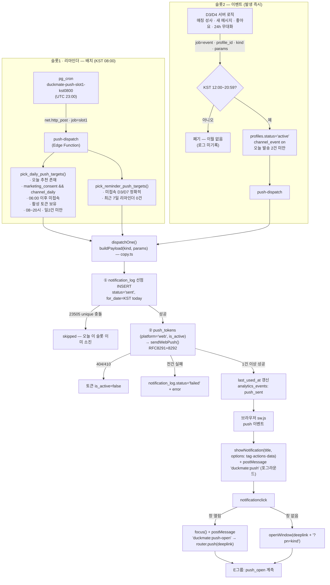

# D7 · 알림/스케줄러 (푸시 슬롯제 · 발송 파이프라인)

> 작성: 서브에이전트 D7 (알림/스케줄러) · 기준일 2026-08-19
> 입력: 03_core_loop §3(슬롯제·카피 금지목록) + 07_legal_checklist L6·§6(기능성/광고성 분리,
> 야간 하드 가드) + 09_store_policy §5.1·§5.2(딥링크·PushAdapter) + 10_brand §4(톤) + 14_schema(D1 규약).
> 산출물: `supabase/migrations/00011_notifications.sql`,
> `supabase/functions/push-dispatch/{index,webpush,copy}.ts`,
> `apps/web/lib/notifications/{schemas,adapter,subscribe,actions}.ts`,
> `apps/web/app/api/push/route.ts`, `apps/web/public/sw.js`.

---

## 다음 에이전트에게 넘기는 결정사항

### 판단 확정

| # | 쟁점 | 확정 | 근거 |
|---|---|---|---|
| D7-1 | 광고성 수신동의 저장처 | B1 이 예고한 `consents.kind='marketing_push'` 대신 **`notification_prefs.marketing_consent`** (동의 시각은 트리거가 `marketing_consent_at` 에 기록, 클라이언트 쓰기 불가) | 발송 대상 선정 SQL 이 채널 토글과 동의를 **한 조인**으로 판정해야 함. `consents` 를 정본으로 쓰려면 E1 가입 동의와 이중 기록이 필요 → 단일 소스로 통일. E1 의 "선택: 광고성 알림" 체크박스는 이 컬럼에 쓴다 |
| D7-2 | 슬롯2 창 밖 발생 건 | **즉시 폐기**(로그도 남기지 않음). 03 §3.1 의 "다음 창 시작 시 최신 1건 발송"은 **미구현** | 이월 큐 테이블 + 창 시작 cron 이 추가로 필요. "이월 금지" 원칙 자체는 폐기로 이미 충족되므로 Phase 1 은 축소 구현, §7-①로 이관 |
| D7-3 | "하루"의 정의 | `notification_log.for_date` = **KST 달력일**. 서비스 리셋은 06:00 이지만 발송 창이 08:00~21:00 이라 달력일과 리셋일이 일치 | 14_schema D7 규약(KST 변환 책임은 발행자). 일 2건 상한·슬롯 중복 판정 단위 |
| D7-4 | 일 2건 상한의 최종 방어선 | 애플리케이션 카운트가 아니라 **DB partial unique** `uq_notification_log_slot_per_day (profile_id, for_date, slot) where status='sent'`. 발송은 "로그 선점 insert → 발송 → 실패 시 status 갱신" 순서 | cron 재시도·동시 이벤트 호출이 겹쳐도 unique 충돌로 자동 탈락. slot `system`(제재·결제 고지)은 인덱스에서 제외 = 상한 무관 |
| D7-5 | 미접속 리마인더 상한 | 미접속 **정확히 3일/7일**인 날만 대상 + "최근 7일 내 리마인더 없음" 이중 가드. D7 이후 무반응은 **전면 중단**(다이제스트 강등 미구현) | 구조적으로 주 1회 이하 보장. 03 §3.1 스팸 상한 |
| D7-6 | Web Push 구현체 | `npm:web-push` 대신 **WebCrypto 순정 구현**(`webpush.ts` — RFC 8291 aes128gcm + RFC 8292 VAPID, 외부 의존성 0) | Deno Node 호환 계층에서 web-push 의 ECDH 레거시 경로가 깨진 전례. Phase 4 FCM 전환 시 이 파일만 교체(정책 계층 무수정 — B3 §5.2) |
| D7-7 | 푸시 클릭 라우팅 | 열린 창 있음 → `focus()` + `postMessage("duckmate:push-open")` (SW 가 직접 navigate 하지 않음, SPA 상태 보존). 열린 창 없음 → `openWindow(deeplink + "?pn=<kind>")` | 딥링크는 경로 기반 유지(B3 §5.1). `pn` 은 **계측 마커**일 뿐 화면 전환 수단이 아니므로 규약 위배 아님 |
| D7-8 | `/api/push` 인가 | 미들웨어 401 위에 **프로필 게이트**(행 존재 + `status='active'`)를 POST 에만 적용. **DELETE(해제)는 게이트 없음** | 정지·차단 계정의 재구독 차단 vs. "수신거부는 무료·즉시"(정보통신망법 §50) 를 동시에 만족 |
| D7-9 | `push_open` 계측 주체 | 서버는 `push_sent` 만 기록. **`push_open` 은 E그룹(클라이언트)이 발화** — SW 는 postMessage/`?pn=` 로 신호만 준다 | 서비스워커에는 세션이 없어 `analytics_events` insert 불가(RLS). A3 §4.1 이벤트명·props 는 아래 §4 계약대로 고정 |
| D7-10 | sw.js 의 성격 | **푸시 전용 워커 — `fetch` 핸들러 없음**(오프라인 캐싱 미도입). `public/sw.js` 로 서빙되어 scope `/` | 캐싱을 넣는 순간 배포마다 stale 자산 리스크. 오프라인은 Phase 4 Capacitor 때 재검토 |

### → 오케스트레이터 / D2 (파일 소유권 밖 · 배포 전 필수)

1. **`middleware.ts` 의 `PUBLIC_PATHS` 에 `/sw.js` 추가 필요.** 현재 matcher 는 `.js` 를 제외하지
   않아 비로그인 상태의 `/sw.js` 요청이 `/login` 으로 리다이렉트된다 → 브라우저의 워커 업데이트
   체크가 HTML 을 받아 실패한다. (등록 자체는 로그인 후에만 일어나므로 치명적이진 않으나,
   업데이트 경로가 조용히 죽는다. D7 은 middleware 수정 금지라 이관.)
2. **cron 등록**: `00011` 의 `cron.schedule` 2건은 `{{SUPABASE_PROJECT_URL}}` /
   `{{SUPABASE_SERVICE_ROLE_KEY}}` 플레이스홀더가 치환된 경우에만 등록된다. 배포 파이프라인에서
   치환하거나 대시보드에서 직접 등록할 것 (미치환이면 notice 만 남기고 조용히 건너뜀).
3. **VAPID 키 발급**: `.env.example` 의 `NEXT_PUBLIC_VAPID_PUBLIC_KEY` / `VAPID_PRIVATE_KEY` /
   `VAPID_SUBJECT`. Edge Function 쪽은 `supabase secrets set` 으로 동일 값 주입(공개키는 웹과 동일).
   키 미설정 시 push-dispatch 는 **503** 을 반환하고 아무것도 발송하지 않는다.
4. **알림 아이콘 2종 미배치**: `apps/web/public/icons/notification-192.png`,
   `.../badge-72.png` (C2/E6 소관). 없으면 브라우저 기본 아이콘으로 폴백 — 동작은 정상.

---

## 1. 슬롯 정책 (확정표)

| 슬롯 | `slot` | 발송 시각 | 내용(`kind`) | 분류 | 동의 요건 | 상한 |
|---|---|---|---|---|---|---|
| 슬롯1 데일리 앵커 | `daily` | **KST 08:00** cron 고정 | `daily_card` — "오늘의 추천 N명 도착" | **광고성** | `marketing_consent` && `channel_daily` | 1일 1건. 당일 06:00 이후 이미 접속했으면 **생략(소멸)** — 슬롯2 로 전용 금지 |
| 슬롯2 이벤트성 | `event` | 발생 즉시, **12:00~20:59** 창 안에서만 | ① `match_created` ② `new_message` ③ `like_received` ④ `match_no_chat_24h` | 기능성 | 동의 불요, `channel_event` 만 | 1일 1건(우선순위 최상위 1건). 창 밖 발생 = **폐기**(이월·기록 없음) |
| 미접속 리마인더 | `reminder` | 08:00 cron (슬롯1 **대체**) | `reminder_d3` / `reminder_d7` | **광고성** | `marketing_consent` && `channel_reminder` | 미접속 정확히 D3·D7 만 + 최근 7일 내 리마인더 0건. D7 이후 무반응 = 전면 중단 |
| 시스템 고지 | `system` | 발생 즉시 | `renewal_notice` / `consent_recheck` / `system` (제재·결제·법정 고지) | 기능성(법정) | **끌 수 없음** | 상한 제외(unique 인덱스 밖). Phase 3/D5·D8 발화 — **현재 미구현** |

**전역 상한**: `profile_id` × `for_date`(KST 달력일) 기준 `status='sent'` 인 `daily|event|reminder`
합계 **최대 2건**. 세 곳에서 중복 방어한다 — ① `pick_*_push_targets()` SQL 조건 ②
`push-dispatch` 의 event 잡 카운트 ③ partial unique 인덱스(최종).

**야간 가드(21:00~08:00 금지)** 는 cron 시각 하나에 의존하지 않고 **3중**이다:
① cron 이 08:00 에만 실행 ② `pick_*` 함수가 `extract(hour from kst_now()) between 8 and 20`
③ event 잡이 `hour < 12 || hour >= 21` 이면 폐기. (재시도·지연이 야간에 걸리는 사고 방지 — 07 §6-③b)

**카피 금지 목록(실험 대상 제외 · 고정 제약)**: 죄책감·조바심·손실공포("끊겨요", "사라져요",
"기다리다 지쳤어요"), 스트릭 단절 언급, 내 무응답에 대한 재촉, 제목 이모지, 가짜/부풀린 수치.

---

## 2. 발송 파이프라인



**페이로드 스키마 v1** (`copy.ts` `PushPayloadV1` ↔ `sw.js` 가 유일하게 신뢰하는 형태):

```jsonc
{
  "v": 1,
  "kind": "match_created",          // 카피/계측 키
  "slot": "event",                  // daily | event | reminder | system
  "title": "매칭이 성사됐어요",       // 광고성이면 "(광고) " 접두가 이미 붙어 있음
  "body":  "OO님과 취향이 통했어요. 첫 대화 제안 카드를 준비해뒀어요.",
  "deeplink": "/chat/{matchId}",    // 반드시 "/" 로 시작하는 내부 경로 (sw.js 가 검증·차단)
  "tag": "duckmate-event",          // 같은 슬롯 알림은 최신 1건으로 대체
  "unsubscribePath": "/settings/notifications"  // 광고성일 때만 존재 = is_marketing 판별자
}
```

---

## 3. 카피 템플릿 (`push-dispatch/copy.ts` 실내용)

`(광고)` 접두와 수신거부 액션은 `buildPayload()` 가 **자동** 부착한다 — 카피에 직접 쓰지 말 것.

| `kind` | 슬롯 | 광고성 | 제목 | 본문 | 딥링크 |
|---|---|---|---|---|---|
| `daily_card` | daily | ✅ | `오늘의 추천 {N}명이 도착했어요` | 취향이 겹치는 분들을 준비해뒀어요. 편할 때 확인해보세요. | `/home` |
| `match_created` | event | — | `매칭이 성사됐어요` | `{닉네임}님과 취향이 통했어요. 첫 대화 제안 카드를 준비해뒀어요.` (닉네임 없으면 "취향이 통하는 분과 매칭됐어요…") | `/chat/{matchId}` → 없으면 `/matches` |
| `new_message` | event | — | `새 메시지가 도착했어요` | `{닉네임}님이 메시지를 보냈어요.` | `/chat/{matchId}` → 없으면 `/chat` |
| `like_received` | event | — | `새 관심이 도착했어요` | 누군가 회원님의 덕질카드에 좋아요를 보냈어요. | `/likes` |
| `match_no_chat_24h` | event | — | `첫 대화 제안 카드가 열려 있어요` | `{닉네임}님과의 공통 취미 이야기를 시작해보세요.` | `/chat/{matchId}` → 없으면 `/matches` |
| `reminder_d3` | reminder | ✅ | `새 추천이 쌓여 있어요` | 며칠 사이 도착한 추천이 기다리고 있어요. 편할 때 확인해보세요. | `/home` |
| `reminder_d7` | reminder | ✅ | `이번 주 추천이 모여 있어요` | 일주일 동안의 새 추천이 도착해 있어요. 편할 때 확인해보세요. | `/home` |

톤 규칙(10_brand §4): 해요체 고정 / 제목 이모지 0개·본문 최대 1개(현재 전부 0개) /
"~해보세요"(초대) OK, "~해야 해요"(의무) 금지 / `new_message` 는 "상대가 보냈다" 팩트만
(미응답 상대를 대신한 재촉 금지) / `like_received` 는 실수신 1건 팩트만(부풀림 금지).
Phase 2 전환 시 `daily_card` 카피만 "오늘의 궁합 카드가 도착했어요"로 교체한다(03 §7).

---

## 4. E그룹이 쓸 API 계약

### 4.1 클라이언트 모듈 (`apps/web/lib/notifications/`)

| 함수 | 파일 | 용도 |
|---|---|---|
| `getPushPermission(): PushPermission` | `subscribe.ts` | `granted \| denied \| default \| unsupported`. **프라이머 노출 여부 판단용** |
| `subscribeToPush(): Promise<SubscribeResult>` | `subscribe.ts` | 권한 요청 → PushManager 구독 → `POST /api/push`. `{status: subscribed\|unsupported\|denied\|dismissed\|error}` |
| `unsubscribeFromPush()` | `subscribe.ts` | 브라우저 구독 취소 + `DELETE /api/push` |
| `isPushSubscribed(): Promise<boolean>` | `subscribe.ts` | 토글 초기값(브라우저 기준) |
| `getPushAdapter()` | `adapter.ts` | `PushAdapter`(B3 §5.2). Phase 4 FCM 전환 시 화면 무수정 — **직접 `new` 금지** |
| `getNotificationPrefs()` / `saveNotificationPrefs(input)` | `actions.ts` (Server Action) | E4 알림 설정 화면. `ActionResult` 반환(throw 없음) |
| `registerPushToken` / `unregisterPushToken` | `actions.ts` (Server Action) | 서버 컴포넌트/액션에서 직접 쓸 때. fetch 경로가 필요하면 `/api/push` |

### 4.2 HTTP (`/api/push`) — 미인증은 미들웨어가 401

| 메서드 | 요청 | 성공 | 실패 코드 |
|---|---|---|---|
| `POST` | `{ subscription: PushSubscription.toJSON() }` | `201 { ok:true, data:{ tokenId } }` | `400 INVALID_INPUT` / `401 AUTH_REQUIRED\|PROFILE_NOT_FOUND` / `403 PROFILE_NOT_ACTIVE` / `500 DB_ERROR` |
| `DELETE` | `{ endpoint: string }` | `200 { ok:true }` | `400 INVALID_INPUT` / `401` / `500` |
| `GET` | — | `200 { ok:true, data:{ subscribed, count } }` | `401` / `500` |

### 4.3 서비스워커 ↔ 페이지 메시지 규약 (**E1/E2 가 루트 레이아웃에 리스너 필수 등록**)

```ts
navigator.serviceWorker.addEventListener("message", (e) => {
  switch (e.data?.type) {
    case "duckmate:push":            // 포그라운드 수신 — 인앱 토스트/뱃지 갱신용
      // e.data.payload = PushPayloadV1
      break;
    case "duckmate:push-open":       // ★ 알림 클릭(앱이 이미 열려 있음)
      // e.data.payload = { kind, slot, deeplink, action: "open" | "unsubscribe" }
      router.push(e.data.payload.deeplink);          // ← 이동 책임은 앱에 있다
      track("push_open", { slot: e.data.payload.slot, copy_variant: e.data.payload.kind });
      break;
    case "duckmate:push-resubscribe":// 구독 갱신 실패 — subscribeToPush() 재호출 권장
      break;
  }
});
```

**콜드 스타트 경로**: 앱이 닫혀 있었으면 SW 가 `deeplink?pn=<kind>` 로 새 창을 연다.
진입 화면은 `pn` 을 읽어 `push_open` 을 1회 발화한 뒤 `history.replaceState` 로 즉시 제거할 것
(쿼리가 화면 상태로 남으면 B3 §5.1 위배).

### 4.4 화면 요구 (E1 / E4)

- **프라이머 필수**: OS 권한 팝업 전에 "매칭·궁합 카드 소식을 알려드릴까요?" 화면을 먼저 띄우고
  수락한 경우에만 `subscribeToPush()` 호출. 첫 실행 즉시 요청 금지(B3 R11).
- **거부(denied) 이후 재요청 팝업 금지.** 설정 화면에서 "브라우저 알림 설정에서 허용으로 바꿀 수
  있어요" 안내 + OS 설정 딥링크 버튼만.
- **브라우저 푸시 권한 ≠ 광고성 수신동의.** 광고성 동의는 알림 설정의 별도 토글
  (`saveNotificationPrefs({ marketingConsent })`)로만 수집한다(07 §6-③ E1).
- 알림 설정은 **기능성/광고성 분리 표시**. 안전·법적 고지(신고 결과·제재·결제)는 끌 수 없음을 명시.
- 수신거부 딥링크 목적지는 `/settings/notifications` 로 **고정**(`copy.ts` `UNSUBSCRIBE_PATH`).
  이 경로가 없으면 광고성 푸시의 법정 수신거부 경로가 깨진다 — E4 가 반드시 만들 것.

### 4.5 서버 발화자 (D3 / D4 / D5) — 슬롯2 호출 계약

```
POST {SUPABASE_URL}/functions/v1/push-dispatch
Authorization: Bearer {SERVICE_ROLE_KEY}      ← service role 전용, 클라이언트 호출 금지(403)
{ "job": "event", "profile_id": "<uuid>", "kind": "match_created",
  "params": { "nickname": "...", "matchId": "..." } }
```

응답은 항상 200 계열이며 `outcome ∈ sent | skipped | failed | discarded` 로 결과를 알린다
(창 밖·상한 초과는 **에러가 아니라** `discarded`). `new_message` 의 "방별 하루 1회" 집계는
**발화자(D4) 책임** — dispatch 는 슬롯 단위 상한만 본다.

---

## 5. 데이터 모델 요약

| 테이블/함수 | 소유 | 요점 |
|---|---|---|
| `notification_prefs` | 유저(RLS 자기 행) | `channel_daily/event/reminder`, `marketing_consent`, `timezone`. `marketing_consent_at`·`updated_at` 은 **트리거 전용**(컬럼 권한 revoke). 행 부재 = 광고성 미동의 |
| `notification_log` | **service role 전용**(정책 없음) | 일 2건 상한·중복 판정·`push_sent` 원천. `uq_notification_log_slot_per_day` 가 최종 방어선 |
| `push_tokens` (00002) | 유저 CRUD | `platform ∈ web|ios|android`, `token` = 구독 JSON 문자열, `(user_id, token)` unique → 등록 멱등 |
| `kst_now()` / `kst_today()` | — | 모든 시각 판정의 단일 기준 |
| `pick_daily_push_targets()` / `pick_reminder_push_targets()` | security definer, execute revoke | 대상 선정 = 정책의 실질 구현체. 클라이언트 호출 불가 |

---

## 6. 법적 체크 대응 (07 L6 / §6-③)

| 요건 | 구현 위치 |
|---|---|
| 기능성/광고성 2종 분리 저장 | `notification_prefs.channel_event`(기능성) vs `channel_daily`·`channel_reminder` + `marketing_consent`(광고성) |
| 광고성 야간(21~08시) 발송 코드 레벨 차단 | `pick_*` 함수 SQL 조건 + event 잡 시간 가드 + cron 시각 (3중) |
| "(광고)" 표기 | `buildPayload()` 가 광고성 제목에 자동 접두 — 우회 경로 없음 |
| 수신거부 경로 | 페이로드 `unsubscribePath` + 알림의 "알림 설정" 액션 버튼(`sw.js`) → `/settings/notifications` |
| 동의/철회 시각 보존 | `marketing_consent_at` 트리거 기록 (분쟁 입증용) |
| 발송 이력의 광고성 플래그 | `notification_log.is_marketing` |

---

## 7. 미구현 / 후속 (인수인계)

1. **슬롯2 이월 큐** — 창 밖(21:00~11:59) 발생 이벤트를 다음 창 시작(12:00)에 최신 1건만 발송하는
   03 §3.1 원안. 현재는 폐기. 도입하려면 대기 테이블 + 12:00 cron 이 필요하다(D7-2).
2. **`push_open` 계측** — 서버는 `push_sent` 만 넣는다. 클라이언트 발화(§4.3)가 붙기 전까지
   "슬롯1 오픈율 15%+"(03 §4.2) KPI 는 측정 불가.
3. **2년 주기 수신동의 재확인 cron** (`consent_recheck` kind 는 스키마에만 존재) — 07 §6-③c.
   `marketing_consent_at + 2년` 경과 대상 선정 함수 + 08:00 배치 미작성.
4. **시스템 고지 발송 경로** (`slot='system'`) — D5 의 신고 처리 결과·제재 통보
   (`mark_report_notified()` 선행), D-결제의 갱신 고지(`renewal_notice`). kind 값만 예약된 상태.
5. **D7 이후 무반응 유저의 주 1회 다이제스트 강등** — 현재는 전면 중단으로만 구현(D7-5).
6. **네이티브 푸시(FCM/APNs)** — `NativePushAdapter` 는 throw 하는 스텁. Phase 4 Capacitor 전환 시
   `getPushAdapter()` 분기 1곳 + `webpush.ts` → `FcmSender` 교체로 끝나도록 격리해 뒀다.
7. **오프라인/캐싱 서비스워커** — 미도입(D7-10). 도입 시 `sw.js` 에 `fetch` 핸들러가 생기므로
   배포마다 stale 자산 정책(버전 캐시 키)을 함께 설계할 것.
8. **`middleware.ts` PUBLIC_PATHS 에 `/sw.js`** — 위 "오케스트레이터" 항목 1. 배포 전 필수.
9. **알림 아이콘 2종**(`/icons/notification-192.png`, `/icons/badge-72.png`) 미배치.
10. **E2E**: 실 브라우저 푸시 검증은 Playwright 로 자동화하기 어렵다 — VAPID 키 세팅 후
    `{job:"event"}` 수동 호출 + 실기기 확인 절차를 배포 체크리스트에 넣을 것.
