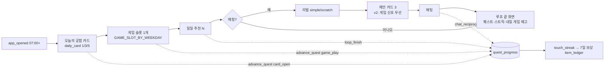
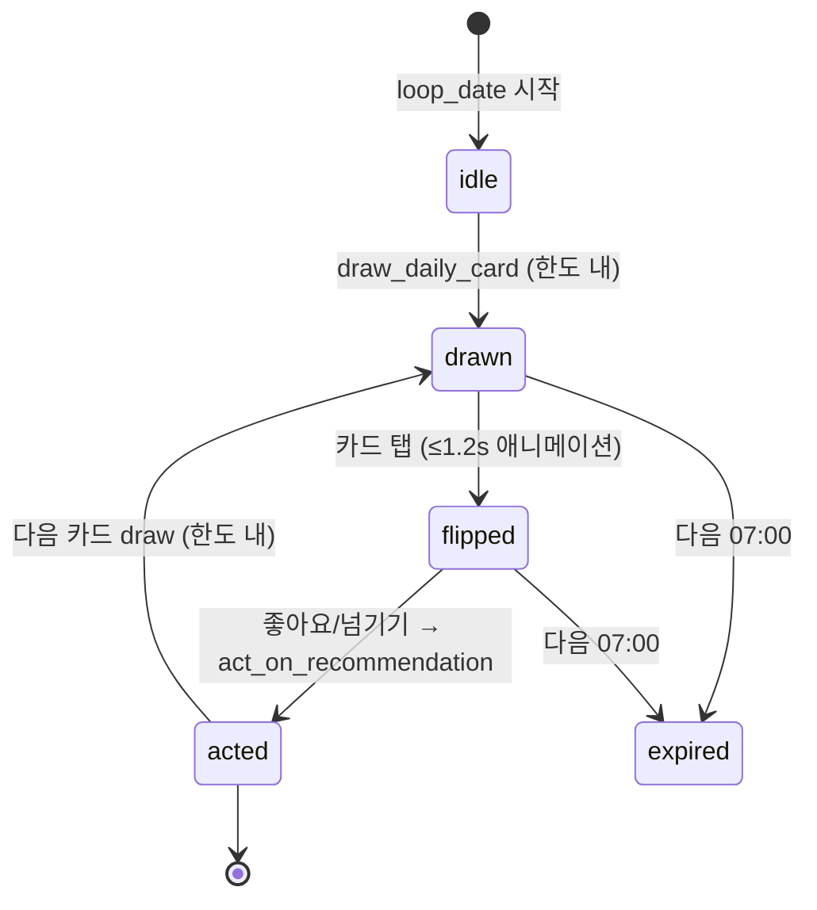
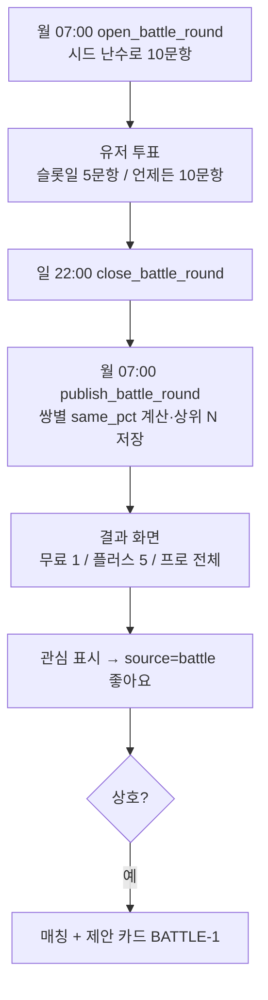
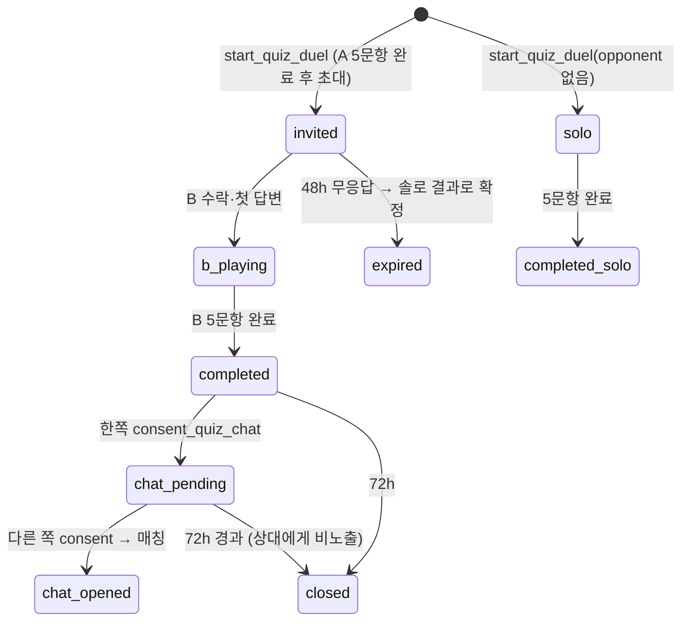
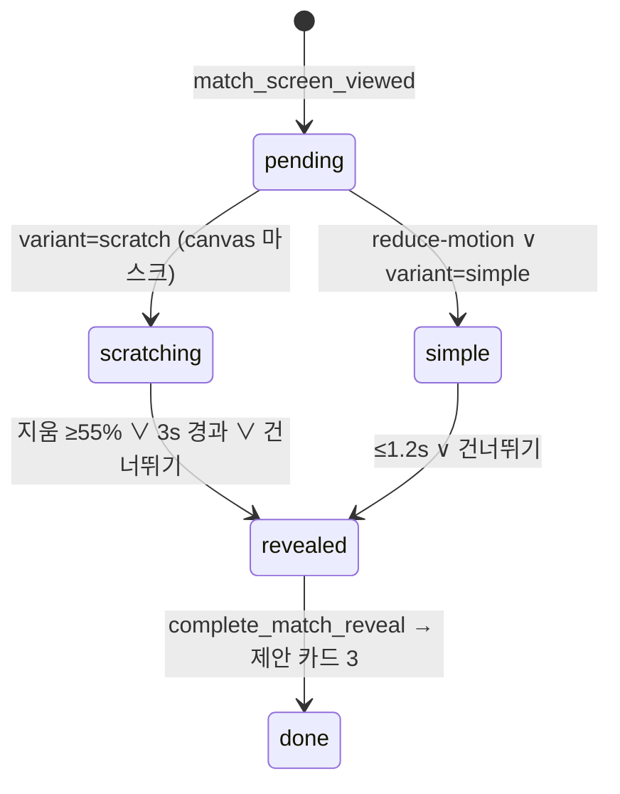
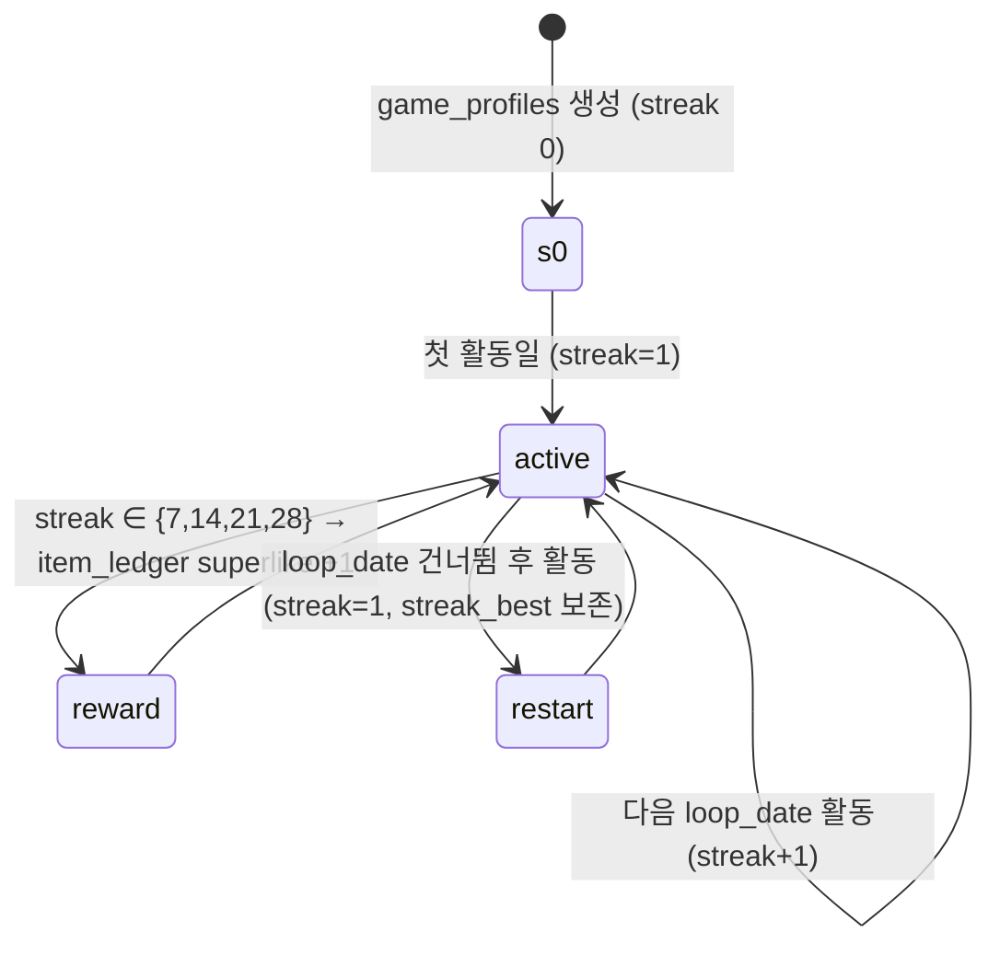
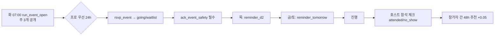

# 28 — 게임 & 리텐션 시스템 설계 (F1)

> 입력: `00_brief.md` §게임 & 리텐션(8요소·KPI), `06_PRD.md`(F-060~066·090·091, Phase 2→3 게이트), `03_core_loop.md`(일일/주간 루프·게임 슬롯·푸시 예산), `04_monetization.md`(티어별 카드 수·배틀 상세·ledger·다크패턴 16항), `02_persona.md`(페르소나별 반응·금지 20항), `10_brand.md`(§4.4 금지 표현·§4.5 #31·§7.3 리빌), `11_design_system.md`(`MatchReveal scratch`·`StreakBadge` 스텁), `14_schema.md`(0007 게임 스키마·`loop_date`·RLS), `16_matching.md`(`reco_candidates`·`act_on_recommendation`·`match_suggestion_input`·제안 카드 TS), `20_notifications.md`(`notify_profile`·슬롯·예산), `05_trust_safety.md`(레벨 권한표·NO_SHOW·차단 가시성).
> **문서만.** 코드·마이그레이션·타입 파일 없음(Phase 1 게이트 미통과 — 브리프 절대 규칙 1). 아래 SQL/TS 는 F2·F3 가 게이트 통과 후 옮기는 **스니펫**이다. 마이그레이션 번호 `20260902000080~0089` 예약. 기준일 2026-09-02.

## 다음 에이전트에게 넘기는 결정사항

### 공통 원칙 · 모듈 경계 (F2·F3·D1·D7·E2)
1. **`packages/game-engine` 는 3층으로 분리**: ① `core/`(순수 함수·상태 머신·시드 난수, 의존성 0, DB·React 금지) ② `server/`(Supabase RPC 이름·인자·반환 타입 선언 + `callGameRpc()` 얇은 어댑터, `apps/web/lib/matching/rpc.ts` 와 같은 패턴) ③ UI 는 `packages/ui/src/components/game/`(§4.3)에 두고 엔진은 UI 를 import 하지 않는다. 앱(`apps/web/app/(app)/play/*`)은 ②③ 만 import.
2. **모든 판정·보상은 서버(SQL SECURITY DEFINER RPC)가 최종**. `core/` 의 순수 함수는 SQL 과 **동일 수식의 TS 미러**(D3 `score.ts` 방식)이며 클라이언트는 미리보기·낙관적 UI 에만 쓴다. 클라이언트가 계산한 점수·보상·스트릭을 서버에 보내는 RPC 는 만들지 않는다.
3. **게임발(發) 좋아요는 전부 `daily_recommendations` 행을 경유**한다. 궁합 카드·배틀 관심 표시·퀴즈 대화 동의는 대상이 오늘 추천에 없으면 `source='daily_card'|'battle'|'quiz'` 행을 **추가 insert**(일일 한도 미소비, `is_extra=true`)한 뒤 기존 `act_on_recommendation` 을 호출한다. 재노출·중복·매칭 생성·제안 카드가 **단일 진실**로 유지되고, A3 §9 의 열린 질문("카드에서 좋아요하면 추천 카드도 acted")이 자동 해결된다. `daily_recommendations.source` 컬럼 추가(§3.2 델타, D1).
4. **일일 경계는 `loop_date()`·주간 경계는 `week_start_loop_date()`** 만 쓴다(07:00 KST / 월 07:00 KST). 스트릭·퀘스트·배틀 마감·랭킹 리셋 전부 이 두 함수. 자정 기준 계산 코드 금지.
5. **원장 규칙**: `game_ledger`(신설, append-only, `kind in ('xp','coin')`) 가 진실이고 `game_profiles.xp/coins` 는 트리거로 갱신되는 **캐시**다. update/delete 정책 없음(service 도 insert 만, 정정은 역분개 행). 슈퍼라이크 보상은 `item_ledger`(A4 §3) 에 `ref='streak:{profile_id}:{loop_date}'` 로 적립 — A4 ref 목록에 `streak:` 접두어 추가 요청(D6). `ref` 유니크 부분 인덱스로 멱등.
6. **`item_ledger` 는 Phase 2 에서 `item_type='superlike'` 에 한해 쓰기 개방**(D1 §0-33 "Phase 3 전 쓰기 금지" 의 유일한 예외). 근거: 브리프 "7일 = 슈퍼라이크 1개" 는 Phase 2 요소이고 A4 원칙 4 는 게임 보상과 구매분이 같은 ledger 를 쓰라고 한다. `act_on_recommendation` 의 `NO_SUPERLIKE` 분기 직전에 "쿼터 0 → ledger 잔액 차감"(D3 §0-25) 을 Phase 2 에 활성화. 결제·구매·환불 코드는 여전히 Phase 3. 소유자 확인 항목(§6).
7. **코인은 Phase 2 에서 적립만 하고 노출·사용하지 않는다**(`coins` 항상 0, UI 없음). 코인으로 살 것이 없는데 숫자만 보여주면 그라인딩 유도 = 다크패턴. XP·레벨만 노출(레벨은 장식이며 추천·노출·랭킹에 영향 없음).
8. **티어 게이팅 키는 기존 12키 중 3개만 사용**: `daily_card_limit`(1/3/5), `battle_detail_top`(1/5/−1), `event_priority`(false/false/true). **추가 키 0개.** 퀴즈 대전·스트릭·퀘스트·랭킹·리빌은 티어 무관(대화 시작 기능을 유료로 가르지 않는다, A4 §5-12 정신). 서버 체크는 D3 `entitlement_value(tier,key)` 에 세 키를 미러(현재 5키만 있음 → 0084 에서 추가).
9. **Phase 2 에 새 다크패턴 0**: 스트릭 프리즈 판매·스트릭 위기 푸시·카운트다운·"N명이 당신과 같은 답" 허수·랭킹 유료 부스트·리빌 앞뒤 광고 전부 금지. 게임 카피는 `copy-lint.json`(E5) 사전을 통과해야 하며 §2.x 의 "안전/다크패턴 체크" 표를 F2·F3 PR 체크리스트로 쓴다.
10. **광고**: 무료 티어 결과형 화면(궁합 카드 결과·배틀 결과·퀴즈 결과) **하단 1슬롯만** `AdSlot` allowlist 에 추가(`/play/card/result`, `/play/battle/result`, `/play/quiz/[id]/result`). 입력 화면·리빌·이벤트·랭킹은 금지. Phase 2 는 빈 컴포넌트(F-067 Phase 3).

### 게임별 상태 머신 · 규칙 (F2)
11. **오늘의 궁합 카드** = `game_sessions(game_type='daily_card')` 프로필당 `loop_date` 1행(`owner_id` 유니크). 상태 `idle → drawn → flipped → acted`, 카드 배열은 `state.cards[]` 로 티어 한도(1/3/5)만큼 순차 draw. 후보 = `reco_candidates()` 재사용 → **오늘 추천 목록에 없는 최고 점수 1명 우선**, 풀 부족 시 오늘 추천 1위(중복 허용). draw 시 `daily_recommendations(source='daily_card', is_extra)` 행 생성. 뒤집기 총 ≤ 1.2s(앞면 티저 → `flip-card` 320ms → 게이지 200ms). 카드 위 좋아요/넘기기 = 결정 3.
12. **취향 배틀** = 주간 라운드 `battle_rounds`(월 07:00 개시, 일 22:00 마감, 월 07:00 결과 공개) + 개인 투표 `battle_votes`(익명). 라운드 문항 10개 = 풀 60개(카테고리 12 × 5)에서 **시드 난수(`seed = iso_week`)** 로 카테고리당 ≤1개 뽑되 최근 3주 출제 문항 제외. 요일 슬롯(§2.2)에 5문항씩 노출, `/play/battle` 에서 언제든 10문항 전부 가능. 결과 "같은 선택 %" = `round(100 × same / co_answered)`, **`co_answered ≥ 5` 미만은 결과 목록 제외**, 문항별 전체 분포는 **표본 `n ≥ 20` 일 때만** 노출("63%가 이쪽을 골랐어요"), 미만이면 "아직 집계 중". 결과 목록 상위 N = `battle_detail_top`. 관심 표시 = 결정 3(`source='battle'`).
13. **덕질 퀴즈 대전** = `game_sessions(game_type='fandom_quiz')` 2인, **비동기 우선**: A 가 5문항을 풀고 초대 → B 는 48h 안에 같은 5문항 → 양쪽 완료 시 결과. 상대는 시스템이 고른다(오늘 추천 중 같은 카테고리 Top3 보유자, 없으면 솔로 모드 = 상대 없이 "오늘의 5문항"). 완료 화면의 **[대화해 볼래요]** 는 양측 모두 눌러야 매칭(= 결정 3 의 `source='quiz'` 좋아요 상호 성립). 한쪽만 누른 사실은 상대에게 **표시하지 않는다**(가짜 신호·압박 금지).
14. **매칭 리빌 스크래치** = `MatchReveal variant='scratch'`: canvas 마스크(덕질 카드 위 회색 레이어, 포인터 이동으로 지움), 지운 비율 ≥ 55% 또는 3초 경과 시 자동 공개(brand §7.3), 전체 시퀀스 ≤ 5초, 언제든 탭/버튼으로 건너뛰기, `prefers-reduced-motion` 이면 `simple` 로 강등(스크래치 없이 정지 이미지). 세션은 `game_sessions(game_type='match_reveal')` 매칭당 1행(양쪽 완료 시각·스킵 여부). 리빌은 **제안 카드 3장 앞에** 오고 뒤에 광고·결제 없음.
15. **스트릭** = `game_profiles.streak_days` + `streak_last_loop_date`. 규칙: 한 `loop_date` 에 데일리 퀘스트 1개 이상 완료 → 그날 "활동일". 연속 활동일 = 스트릭. 하루 건너뛰면 **0 이 아니라 1부터 재시작**(재시작 당일이 1일). 7·14·21·28일 도달 시 슈퍼라이크 1개(결정 5), 월 상한 4개. 스트릭 프리즈·복구 상품 없음. 끊김 카피 = brand #31 원문 고정.
16. **퀘스트 4종 고정**(`quests` 시드): `card_open`(일, 오늘 카드 1장 열기, xp 10) / `game_play`(일, 게임 슬롯 1판, xp 15) / `loop_finish`(일, 오늘 추천 전부 판단 = `daily_reco_exhausted`, xp 15) / `chat_reciprocate`(주, 이번 주 매칭 중 24h 내 왕복 대화 1건, xp 40). 보상은 XP 뿐(아이템 없음). 진행은 **클라이언트가 올리지 않고** 각 RPC(`draw_daily_card`·`complete_game_round`·`act_on_recommendation`·D4 메시지 트리거)가 `advance_quest()` 내부 호출로 올린다.
17. **주간 취미 이벤트** = `events.kind in ('online','offline')`. Phase 2 = **온라인 템플릿 12개**(카테고리당 1, §2.6) 로 운영팀이 주 3개 생성(화 07:00 공개). 오프라인은 Phase 5(F-090) 이나 스키마·RPC 는 지금 설계: 호스트 **L3 + 가입 30일 + 활성 제재 없음**(A5 §2), 운영팀 계정 외 유저 호스트는 `app_settings.event_user_host_enabled=false` 뒤. 정원 `capacity ≤ 8`(0007 check 유지) + 대기열 ≤ 8, 유저당 동시 RSVP ≤ 2. 프로 우선 24h(`event_priority`, A4 체크포인트 7).
18. **취미 랭킹** = 카테고리별 주간 "활발한 덕후" Top 10, `ranking_snapshots` 에 월 07:00 스냅샷 후 리셋. 점수식 §2.7(게임·대화 지속·이벤트 참석·스트릭 — **좋아요 수·받은 좋아요·사진·조회수 0 가중**). 기본 표시 = **익명**("보드게임 덕후 #3"), 닉네임 노출은 `game_profiles.ranking_visibility='nickname'` 옵트인. 랭킹 행 탭 → 프로필 이동 **없음**(추천 파이프라인 우회 탐색 차단).
19. **첫 대화 제안 카드 v2**: D3 `match_suggestion_input` 반환 jsonb 에 `game_signals{battle:{same_pct, sample_question}, quiz:{category, my_score, their_score, missed_question}}` 를 추가(0084)하고 `suggestions.ts` 에 템플릿 `BATTLE-1`·`QUIZ-1`(talk) 추가. 게임 신호가 있으면 **c1 = 게임 카드**로 우선(온라인/오프라인 규칙은 c2·c3 에 적용). 제안 카드 3장·서로 다른 template_id 규칙 유지.

### 스키마 델타 · RPC · 이벤트 · 푸시 · 어드민 (D1·D7·D8·E5)
20. **마이그레이션 예약**: `0080_game_core`(game_profiles 컬럼·game_ledger·game_sessions 컬럼·daily_recommendations.source) / `0081_battle_quiz`(game_questions·battle_rounds·battle_votes·통계 뷰) / `0082_quests_streak_ranking`(quests 시드 4·quest_progress.id·ranking_snapshots) / `0083_events_delta`(events·event_rsvps 컬럼) / `0084_game_rpc_rls`(RPC 전부·정책·`entitlement_value` 3키·`match_suggestion_input` 확장) / `0085_game_cron`(pg_cron 6잡) / `0086_game_metrics`(D8 지표 함수·뷰). 전체 델타 표 §3.2.
21. **RPC 시그니처(authenticated, 본인만)**: `draw_daily_card() → jsonb` · `act_on_daily_card(p_session_id, p_card_idx, p_action reco_action) → jsonb` · `get_battle_round(p_week_start date default null) → jsonb` · `submit_battle_vote(p_round_id, p_question_id, p_choice smallint) → jsonb` · `get_battle_result(p_week_start) → jsonb` · `express_battle_interest(p_week_start, p_target_id) → jsonb` · `start_quiz_duel(p_category_id smallint, p_opponent_id uuid default null) → jsonb` · `answer_quiz(p_session_id, p_question_id, p_choice, p_elapsed_ms) → jsonb` · `consent_quiz_chat(p_session_id) → jsonb` · `complete_match_reveal(p_match_id, p_variant text, p_skipped bool, p_duration_ms int) → jsonb` · `game_home_summary() → jsonb` · `set_ranking_visibility(p_mode text) → jsonb` · `get_ranking(p_category_id, p_week_start default null) → jsonb` · `rsvp_event(p_event_id) → jsonb` · `cancel_rsvp(p_event_id) → jsonb` · `ack_event_safety(p_event_id) → jsonb`. 에러 코드는 D1 `ERROR_CODES` 재사용 + 신규 `LIMIT_REACHED`·`ROUND_CLOSED`·`SESSION_EXPIRED`·`PRIORITY_WINDOW`·`EVENT_FULL`·`NOT_HOST_ELIGIBLE`(`constants.ts` 에 추가).
22. **RPC(service_role 전용)**: `advance_quest(p_profile_id, p_quest_key, p_delta int default 1) → jsonb`(내부 호출) · `touch_streak(p_profile_id, p_loop_date) → jsonb` · `grant_streak_reward(p_profile_id, p_loop_date) → jsonb` · `open_battle_round(p_week_start) → uuid` · `close_battle_round(p_week_start) → jsonb` · `publish_battle_round(p_week_start) → jsonb` · `snapshot_ranking(p_week_start) → jsonb` · `expire_game_sessions() → int` · `admin_upsert_game_question(jsonb) → smallint` · `admin_retire_game_question(p_id, p_reason) → void` · `run_event_open(p_week_start) → jsonb`. 전부 `revoke … from public, anon, authenticated` + `g2_trusted_caller()` 검사(0070 규칙).
23. **`game_sessions.state` 는 게임별 JSON Schema(§3.3) 로 검증**: `state_version` 컬럼 + 트리거 `assert_game_state(game_type, state)` (jsonb 키 존재·타입 검사, `pg_jsonschema` 확장 있으면 사용, 없으면 plpgsql 수동 검사). 클라이언트는 `state` 를 **직접 update 할 수 없다**(RLS select 만, 0010 유지).
24. **RLS 추가**: `battle_votes` 는 본인 행 select 만(타인 투표는 어떤 뷰로도 노출 금지, 집계는 RPC 반환값). `game_questions` 는 `is_active` 행 select(정답 컬럼 `answer_idx` 는 컬럼 권한으로 authenticated 차단 — 채점은 서버). `ranking_snapshots` 는 authenticated select(익명 행은 `profile_id` 대신 `display_label` 만 담긴 뷰 `v_ranking_public`). `game_ledger` 본인 select. `events` 는 0010 정책 유지 + `venue_detail` 은 RSVP `going` 이면서 D-1 이후에만 RPC 로.
25. **분석 이벤트(`track()` union 추가, E5 병합)**: `daily_card_drawn{card_index, is_extra}` · `daily_card_opened{card_index, score_bucket}` · `daily_card_acted{action}` · `game_round_started/completed{game_type, question_count, duration_ms, mode(solo/duel)}` · `battle_vote_submitted{round_week, question_id, position}` · `battle_result_viewed{round_week, sample_ok, detail_top}` · `battle_interest_sent{same_pct_bucket}` · `quiz_duel_started{category, opponent(system/none)}` · `quiz_duel_completed{my_score, their_score, elapsed_ms}` · `quiz_chat_consented{both}` · `match_reveal_completed{variant, skipped, duration_ms, reduced_motion}` · `quest_completed{quest_key, kind}` · `streak_advanced{days}` · `streak_reward_granted{days}` · `streak_reset{prev_days}` · `event_viewed{kind, category}` · `event_rsvp_submitted{status, priority_window}` · `event_rsvp_canceled` · `event_attended` · `ranking_viewed{category, visibility}` · `ranking_visibility_changed{to}`. 공통 속성은 `track()` 자동. `suggestion_shown` 에 `sources[3]`('rule'|'battle'|'quiz') 속성 추가.
26. **푸시 템플릿 키(D7 `templates.ts` 추가, 카피 §2.x)**: `daily_reco_ready` 에 선택 파라미터 `card_count` 추가(슬롯 A 본문 1줄 "궁합 카드 {n}장도 준비돼 있어요" — 별도 푸시 없음) · `battle_result_ready`(슬롯 B, 월, 예산 소비, 우선순위 ③ = D7 표의 `photo_reviewed` 와 동순위 → 최근 것 우선) · `battle_closing_today`(슬롯 B, 일, **최근 2주 내 배틀 참여자 중 이번 주 미참여자만**) · `quiz_duel_invited`·`quiz_duel_completed`(transactional, instant, 60분 뭉침, `session_id` 필수 = 실제 세션 있을 때만) · `event_open`(슬롯 B, 화, 관심 취미 일치자만) · `event_reminder_d2`·`event_reminder_tomorrow`(슬롯 B, RSVP going 만). **스트릭·퀘스트·랭킹은 푸시 없음**(인앱만). 모두 야간 보류·예산 규칙 D7 그대로.
27. **어드민(D8·E6)**: `/admin/game/questions`(풀 CRUD·카테고리별 잔여·출제 이력·폐기) · `/admin/game/battle`(라운드 상태·표본 n·문항 분포·강제 마감/재공개) · `/admin/game/abuse`(§2.9 신호) · `/admin/events`(생성·정원·RSVP·노쇼 표기) · `/admin/metrics` 에 게임 탭. 지표 함수 `admin_metrics_game(p_days)`·뷰 `v_game_metrics_daily`·`v_battle_round_stats`·`v_game_abuse_signals`(service/moderator 전용, 0086).
28. **문항 풀 콘텐츠 규칙**: 배틀 60·퀴즈 60(카테고리 12 × 5) 초안 §2.2·§2.3. 실제 인물·작품의 **사실 정보·선호 질문만**(가사·대사 인용, 외모·연애 관련, 특정 팬덤 비하 금지). 문항 텍스트 ≤ 40자, 선택지 2(배틀)/4(퀴즈), 정답 출처 메모(`source_note`, 내부용). 운영자 추가만(사용자 제출 없음).
29. **cron(0085, D7 스케줄러와 같은 패턴)**: `game_battle_open` 월 07:00(UTC `0 22 * * 0`) → `open_battle_round` · `game_battle_close` 일 22:00(`0 13 * * 0`) → `close_battle_round` · `game_battle_publish` 월 07:00(`0 22 * * 0`, open 직전) → `publish_battle_round` · `game_ranking_snapshot` 월 06:55(`55 21 * * 0`) · `game_sessions_expire` 매시 · `game_event_open` 화 07:00(`0 22 * * 1`). 배틀 publish → ranking snapshot → battle open 순서를 하나의 `run_weekly_game_batch()` 로 묶어 의존 순서 보장.
30. **`packages/ui` 추가 컴포넌트(C2 규칙 준수, 서비스명 리터럴 금지)**: `DailyCard`·`BattleQuestion`·`BattleResultRow`·`QuizQuestion`·`QuizScoreboard`·`ScratchMask`(canvas)·`StreakBadge`(스텁 본문 채움)·`QuestList`·`RankingList`·`EventCard`·`EventSafetyAck`·`GameSlotBanner`(§4.3). `MatchReveal` 의 `scratch` 분기 구현.
31. **Phase 2 게이트 증빙 "실제 유저 7일 스트릭 1건"** = 소유자 allowlist 계정으로 7 연속 `loop_date` 활동 → `game_profiles.streak_days=7` + `item_ledger(ref='streak:…')` 1행 + `analytics_events(streak_reward_granted)` 1행 + 슈퍼라이크 잔여 UI 스크린샷 → `DEPLOY_LOG.md` 기록. 절차 §5.1.
32. **테스트 게이트(F2·F3 PR 필수)**: `core/` 전이표 전수 테스트(상태×이벤트 표 100%), 30일×1,000명 시뮬레이션(스트릭 보상 분포·랭킹 캡·배틀 표본), SQL↔TS 수식 동일성(점수·같은 선택 %·랭킹), 카피 lint, 푸시 예산 회귀(게임 푸시 추가 후에도 `budget_consumed` 일 ≤ 2).
33. **게임 슬롯 요일표는 상수 `GAME_SLOT_BY_WEEKDAY`**(ISO 1~7): 월 `taste_battle`(새 라운드) · 화 `fandom_quiz` · 수 `fandom_quiz` · 목 `taste_battle` · 금 `fandom_quiz` · 토 `fandom_quiz` · 일 `taste_battle`(마감일). A3 §3(수 퀴즈·목 배틀)과 일치. 슬롯은 "오늘의 게임 1개" 배너이며 다른 게임도 `/play` 에서 항상 가능.
34. **Realtime 미사용**: 퀴즈 대전·배틀 결과는 비동기(폴링/재진입) 로 충분. Realtime 채널은 D4 채팅에만 둔다(비용·복잡도).
35. **삭제·보존**: 탈퇴 시 `game_*`·`quest_progress`·`battle_votes`·`event_rsvps` 즉시 삭제(A5 §11.1), `ranking_snapshots` 는 `profile_id → null` + `display_label='탈퇴한 덕후'` 로 가명화, `game_ledger` 는 cascade. D7 `purge_daily` 에 `game_sessions.created_at < now()-90d` 삭제 추가.
36. **레이트리밋(D2 `rate_limits` 재사용)**: `submit_battle_vote` 60/분, `answer_quiz` 30/분, `draw_daily_card` 10/분, `express_battle_interest` 10/일, `start_quiz_duel` 5/일(솔로 포함 10/일).
37. **KPI 소유**: 카드 열람률·카드→좋아요(F1), 배틀 참여율·결과 열람률·관심→매칭(F1), 퀴즈 완료율·대화 동의율(F2), 스트릭 분포·7일 도달률·퀘스트 완료율(F3), 이벤트 RSVP 충원율·노쇼율·랭킹 옵트인율(F3). 정의 §5.2.

---

## 1. 전체 구조

### 1.1 일일 루프 안의 게임 위치 (A3 §2 완성형)



### 1.2 모듈 경계

| 층 | 위치 | 내용 | 금지 |
|---|---|---|---|
| core | `packages/game-engine/src/core/**` | 순수 함수·상태 머신·시드 난수·JSON Schema 상수 | import supabase/react/dom, `Date.now()` 직접 호출(주입) |
| server | `packages/game-engine/src/server/**` | RPC 이름·Args·Returns 타입, `callGameRpc(client, name, args)`, 에러 매핑 | 비즈니스 계산 |
| SQL | `supabase/migrations/0080~0086` | 판정·보상·원장·cron | 카피 문자열(TS 에 둔다) |
| UI | `packages/ui/src/components/game/**` | 표시 컴포넌트(props 만) | fetching·상태 저장 |
| app | `apps/web/app/(app)/play/**`, `lib/game/**` | 서버 액션(`ActionResult`)·TanStack 쿼리·`track()` | 점수 계산 |

---

## 2. 8요소 상세 스펙

### 2.1 오늘의 궁합 카드 (`daily_card`, F-061)

**목적**: "내일 다시 올 이유" 1순위. 07:00 마다 **한 사람을 고르는 작은 의식** — 추천 5명보다 먼저, 30초 안에 끝난다. 티어 업셀은 카드 수(1/3/5)뿐.



**규칙·수치**
| 항목 | 값 |
|---|---|
| 한도 | `daily_card_limit` 1/3/5, Phase 3 `card_refill_3` +3(일 1회) |
| 후보 선정 | `reco_candidates(profile, loop_date)` → `pair_features` 점수 상위 순회 → **오늘 `daily_recommendations` 에 없는 첫 후보**(미노출 우선) → 없으면 오늘 추천 최고 점수(중복 허용) → 그것도 없으면 `NO_CANDIDATE`("오늘은 새 카드가 없어요 · 내일 07:00") |
| 추천 행 | 미노출 후보면 `daily_recommendations(source='daily_card', is_extra=true, score, reasons)` insert; 중복이면 기존 행 재사용 |
| 앞면 | 궁합 % 티저(`scorePercent`)·겹치는 취미 개수·카테고리 아바타. 사진 없음 |
| 뒷면 | `DuckCard compact` + `reasons[0..1]` + 좋아요/넘기기 |
| 애니메이션 | 티저 페이드 200ms → `flip-card` 320ms → `CompatGauge` 200ms, 총 ≤ 1.2s. reduce-motion 은 즉시 교체 |
| seen 처리 | 뒤집는 순간 `seen_at`(추천 목록 규칙과 동일) |
| 퀘스트 | flipped 전이 시 `advance_quest('card_open')` |
| 슈퍼라이크 | 카드에서도 가능(쿼터·ledger 순서 D3) |

**티어 게이팅**: `draw_daily_card` 가 `entitlement_value(tier,'daily_card_limit')` 초과면 `LIMIT_REACHED`("오늘 카드는 여기까지예요 · 내일 07:00에 새 카드"). 플러스/프로 안내는 `PAYMENTS_ENABLED` 일 때만 사실형 1줄.

**안전/다크패턴 체크**: 카드 상대에게 "당신을 카드로 봤다" 알림 없음 · 미노출 후보도 `can_view_profile` 통과 필수(추천 행이 생기므로 자동) · 카드 결과 화면 광고는 무료 하단 1개 · "지금 안 열면" 카피 금지 · 카드 수 0 상태에서 유료 안내 반복 노출 금지(1회, 닫기 가능).

**분석**: `daily_card_drawn`·`daily_card_opened`·`daily_card_acted`. **어드민**: 열람률·카드→좋아요 전환·미노출 후보 비율.

### 2.2 취향 배틀 (`taste_battle`, F-062)

**목적**: 대화 시작 핑계 ①. "87% 같은 선택" 은 취미 겹침과 다른 축(가치관·취향)으로 **말 걸 이유**를 준다. 월요일 결과 공개 = 주간 재방문 앵커.



**규칙·수치**
| 항목 | 값 |
|---|---|
| 문항 풀 | `game_questions(kind='battle')` 60 = 카테고리 12 × 5, 2지선다 |
| 라운드 | `battle_rounds(week_start, question_ids[10], status draft→open→closed→published→archived)` |
| 출제 | `drawBattleRound(pool, seed=isoWeek, excludeRecent=3주)`: 카테고리당 ≤1, 유저 Top3 카테고리 문항이 5문항 슬롯에 우선 배치(개인화는 **순서만**, 문항 집합은 전원 동일) |
| 투표 | `battle_votes(round_id, question_id, profile_id, choice 1|2)` upsert(마감 전 변경 가능), **익명** — 타인 투표 행은 어떤 경로로도 비노출 |
| 같은 선택 % | `same_pct = round(100 × |{q: a.choice = b.choice}| / |co_answered|)`, `co_answered = 양쪽 모두 답한 문항`, **`co_answered ≥ 5` 필수** |
| 결과 대상 | 같은 `mode`, 양쪽 L2+active, 차단·매칭·신고 관계 없음, 제재 <3 — `reco_candidates` 의 제외 규칙 재사용 |
| 정렬 | `same_pct desc, co_answered desc, pair_score desc`(D3 점수로 동률 해소) |
| 문항 분포 | `n = 해당 문항 총 투표 수`, **`n ≥ 20`** 이면 "n명 중 63%가 이쪽" 노출, 미만이면 "아직 집계 중이에요" |
| 결과 상세 | `battle_detail_top` 1/5/−1 행만 RPC 가 반환(A4 체크포인트 6). 무료도 **1명은 항상** 보여 결과가 빈 화면이 되지 않게 |
| 관심 표시 | `express_battle_interest` → 결정 3 → `act_on_recommendation(like)`. 하루 10회 상한. 상대에게 "배틀에서 관심 받음" 표시 없음(매칭 시에만 "서로 좋아요") |
| 퀘스트 | 슬롯일 5문항 완료 시 `advance_quest('game_play')`; 다른 날 투표는 XP 만 |
| 결과 보관 | 라운드 `archived` 는 4주 보관 후 `battle_votes` 삭제(쌍 결과는 `state` 에 남지 않음) |

**문항 풀 초안 (60 중 24 예시, 카테고리당 2 — 나머지 36 은 같은 형식으로 운영자 작성, 문항 ≤ 40자)**
| 카테고리 | 문항 | A | B |
|---|---|---|---|
| performance | 콘서트 자리, 고른다면 | 스탠딩 앞줄 | 지정석 뷰 좋은 곳 |
| performance | 컴백 첫날 나는 | 스밍 돌리기 | 무대 영상 정주행 |
| boardgame | 보드게임 밤, 선호는 | 전략 3시간 | 파티 게임 여러 판 |
| boardgame | 새 게임 룰은 | 설명서 정독 | 하면서 배우기 |
| fitness | 러닝은 | 새벽 한강 | 퇴근 후 야간 |
| fitness | 클라이밍 목표는 | 난이도 올리기 | 오래 즐기기 |
| anime | 신작은 | 매주 본방 | 완결 후 정주행 |
| anime | 굿즈는 | 아크릴·포카 | 화집·설정집 |
| gaming | 협동 게임에서 나는 | 딜러 | 서포터 |
| gaming | 신작 출시일엔 | 밤새 플레이 | 리뷰 보고 결정 |
| cafe | 카페 고를 때 | 디저트 맛 | 공간·조명 |
| cafe | 주문은 | 시그니처 | 늘 마시던 것 |
| reading | 책은 | 종이책 | 전자책 |
| reading | 북클럽에서 | 해석 토론 | 취향 공유 |
| photo | 사진은 | 필름 | 디지털 |
| photo | 전시는 | 혼자 천천히 | 같이 이야기하며 |
| coding | 사이드 프로젝트는 | 완성까지 | 배우면 끝 |
| coding | 새 언어는 | 튜토리얼 | 바로 만들어보기 |
| travel | 여행 계획은 | 분 단위 | 대충 방향만 |
| travel | 캠핑은 | 장비 풀세팅 | 최소 짐 |
| music | 음악은 | 공연장 | 이어폰 |
| music | 악기 연습은 | 매일 20분 | 주말 몰아서 |
| pets | 반려동물 사진 | 매일 찍기 | 가끔 특별할 때 |
| pets | 식물은 | 많이 키우기 | 하나 정성껏 |

**티어 게이팅**: 투표·참여·결과 1위는 전원. 상세 5/전체만 유료. 결과 화면 유료 안내는 "플러스는 상위 5명까지 볼 수 있어요" 사실형 1줄, `PAYMENTS_ENABLED=false` 면 미노출.

**안전/다크패턴**: 투표 익명(집계만) · `n<20` 분포 비노출(소수 표본에서 개인 추정 방지) · 결과 목록은 `can_view_profile` 통과자만 · 관심 표시 일방 사실 비노출 · "마감 임박" 카운트다운 금지(마감 시각 텍스트만) · 배틀 결과로 "궁합 낮음" 표기 금지(상위만 보여주고 하위는 생략) · 문항에 외모·성적·정치·종교·소득 금지.

**분석**: `battle_vote_submitted`·`battle_result_viewed`·`battle_interest_sent`. **어드민**: 라운드별 투표 유저 수·문항별 n·`n<20` 문항 수·결과 열람률·관심→매칭 전환·폐기 문항.

### 2.3 덕질 퀴즈 대전 (`fandom_quiz`, F-063)

**목적**: 대화 시작 핑계 ②(P1 몰입형·P4 온라인형). "같은 걸 아는 사람" 을 5문항으로 확인하고, 양쪽이 원할 때만 대화가 열린다.



**규칙·수치**
| 항목 | 값 |
|---|---|
| 문항 풀 | `game_questions(kind='fandom')` 60 = 카테고리 12 × 5, 4지선다, `answer_idx` 서버 전용, `difficulty 1~3` |
| 세트 | 카테고리 1개 · 5문항 · 시드 = `sha256(session_id)` 로 난수 순서, 최근 4주 내 본인이 푼 문항 제외 |
| 상대 선정 | 오늘 `daily_recommendations` 중 해당 카테고리가 Top3 인 사람 1명(점수순) → 없으면 솔로 |
| 채점 | 정답 20점 × 5 = 100, 동점 시 총 `elapsed_ms` 작은 쪽. 시간 제한 없음(비동기), 문항당 `elapsed_ms` 는 참고 지표 |
| 결과 | 양쪽 점수·문항별 정오(상대의 오답 문항 텍스트는 보여주되 **상대 선택지는 비노출**) |
| 대화 오픈 | 양쪽 `consent_quiz_chat` → 결정 3 (`source='quiz'` 좋아요 상호) → `matches` + 제안 카드 `QUIZ-1` |
| 퀘스트 | 슬롯일 완료 시 `game_play`; XP 정답당 3 |
| 만료 | `game_sessions.expires_at` = 초대 +48h; `expire_game_sessions()` 매시 |

**문항 초안 20 (12 카테고리, 정답은 `answer_idx` — 문서엔 ★ 표기)**
| # | 카테고리 | 문항 | 선택지 |
|---|---|---|---|
| 1 | performance | 스탠딩 공연에서 '티켓팅 이후 자리 배정 순서' 를 뜻하는 말은 | 페스타 / ★입장 순번 / 앵콜 / 브릿지 |
| 2 | performance | 팬 사인회 응모 방식으로 흔한 것은 | ★앨범 구매 응모 | 추첨 없음 / 선착순 댓글 / 방청 신청 |
| 3 | boardgame | '카탄' 에서 자원이 아닌 것은 | 양 / 벽돌 / ★금 / 나무 |
| 4 | boardgame | TRPG 에서 진행자를 부르는 말은 | ★GM | 딜러 / 리더 / 캡틴 |
| 5 | fitness | 풀코스 마라톤 거리는 | 21.1km / ★42.195km / 30km / 50km |
| 6 | fitness | 볼더링 난이도 표기 중 하나는 | ★V 등급 | BPM / ISO / RPM |
| 7 | anime | 분기(쿨) 애니 한 시즌은 보통 몇 화 | 6 / ★12~13 / 24 / 50 |
| 8 | anime | 웹툰 '완결 후 정주행' 을 뜻하는 은어는 | ★몰아보기 | 스밍 / 앵콜 / 리메이크 |
| 9 | gaming | 리듬게임에서 '풀콤보' 는 | 한 곡 만점 / ★놓친 노트 0 / 최고 난이도 / 클리어 |
| 10 | gaming | 협동 던전에서 '탱커' 역할은 | 원거리 딜 / ★적 어그로 담당 / 회복 / 버프 |
| 11 | cafe | '핸드드립' 과 같은 뜻은 | 에스프레소 / ★푸어오버 / 콜드브루 / 더치 |
| 12 | cafe | 마카롱 겉의 주름 부분을 부르는 말은 | ★삐에 | 크러스트 / 필링 / 글레이즈 |
| 13 | reading | '북클럽' 에서 한 권을 나눠 읽는 단위는 | ★챕터 | 페이지 / 목차 / 장정 |
| 14 | reading | 전자책 파일 형식 중 하나는 | ★EPUB | MP4 / PSD / ZIP |
| 15 | photo | 조리개를 '열면' 생기는 효과는 | 심도 깊어짐 / ★배경 흐림 | 흑백 / 노이즈 감소 |
| 16 | photo | 전시 관람 예약 시 '도슨트' 는 | 티켓 / ★해설 안내 | 굿즈 / 포토존 |
| 17 | coding | Git 에서 브랜치를 합치는 명령은 | push / ★merge / clone / init |
| 18 | travel | 백패킹에서 '베이스 웨이트' 는 | 총 무게 | ★소모품 제외 장비 무게 / 배낭만 / 물 무게 |
| 19 | music | 4분의 4박자에서 한 마디 박 수는 | 2 / 3 / ★4 / 8 |
| 20 | pets | 고양이가 '꾹꾹이' 를 하는 흔한 이유는 | 배고픔 / ★편안함 표현 / 화남 / 사냥 |

(선택지 4개 미만 행은 운영자가 4개로 채움. 정답 출처는 `source_note`.)

**티어 게이팅**: 없음. **안전/다크패턴**: 상대는 이미 `can_view_profile` 통과자(오늘 추천) · 초대 푸시는 실제 세션이 있을 때만(`session_id` 필수) · 한쪽 동의 사실 비노출 · 점수 낮음을 비하하는 카피 금지("아쉬워요" 대신 "다음 세트는 {카테고리}") · 대화 오픈 후 첫 화면은 안전 모달(A5 §10.1) 동일 적용 · 상대 답변 시간·접속 패턴 비노출.

**분석**: `quiz_duel_started/completed`·`quiz_chat_consented`. **어드민**: 완료율(초대→B 완료)·솔로 비율·동의율(양측)·문항 정답률(너무 쉬움/어려움 폐기 기준: 정답률 >95% 또는 <15%, n≥50).

### 2.4 매칭 리빌 스크래치 (`match_reveal`, F-064)

**목적**: 매칭 순간을 **3초의 손동작**으로 기억에 남기기. 리텐션 요소라기보다 "매칭 → 첫 메시지 70%" 전환의 감정 보조.



**규칙**: canvas 는 `DuckCard compact` 위 오버레이(`globalCompositeOperation='destination-out'`, 브러시 반경 28px, `pointermove` 스로틀 16ms), 지운 픽셀 비율은 64×64 다운샘플로 계산(성능). 총 시퀀스 ≤ 5초(스크래치 ≤3s + 태그 점등 260ms + 헤드라인 200ms). 건너뛰기 버튼 항상 44pt. 햅틱 1회(`navigator.vibrate(20)`, 지원 시)·소리 없음. 결과는 매칭당 `game_sessions(match_reveal)` 1행 `state.a/b{variant,skipped,duration_ms}`. 광고·결제·레벨업 토스트 등 **리빌 전후 어떤 오버레이도 금지**.

**티어 게이팅**: 없음(variant 는 A/B 실험 플래그 `app_settings.match_reveal_variant`). **안전**: 스크래치 아래 내용은 이미 매칭된 상대의 덕질 카드(사진 아님). **분석**: `match_reveal_completed`. **어드민**: 스킵률·평균 duration·variant 별 첫 메시지 전환.

### 2.5 스트릭 & 데일리 퀘스트 (F-065)

**목적**: "내일 다시 올 이유" 를 **보상이 아니라 습관 표시**로 만든다. 보상은 7일마다 슈퍼라이크 1개뿐이며 잃는 것은 없다.



**규칙·수치**
| 항목 | 값 |
|---|---|
| 활동일 | 해당 `loop_date` 에 데일리 퀘스트(`card_open`/`game_play`/`loop_finish`) 중 1개 이상 완료 |
| 전이 | `touch_streak(profile, loop_date)`: `last = streak_last_loop_date`; `loop_date = last` → 무변화 / `= last+1` → +1 / 그 외 → 1. 트랜잭션 `select … for update` |
| 보상 | 7·14·21·28 → `grant_streak_reward`: `item_ledger(item_type='superlike', delta=+1, ref='streak:{profile}:{loop_date}')`(유니크) + `analytics(streak_reward_granted)` + 인앱 토스트 "슈퍼라이크 1개가 생겼어요". 월 상한 4(자연 상한) |
| 표시 | `StreakBadge{days, todayDone, broken}` 홈 상단·루프 끝 화면. `broken` 은 **당일 첫 진입 1회만** brand #31 카피("오늘 카드 1장 준비돼 있어요 / 스트릭은 다시 1일부터. 지난 기록은 사라지지 않아요") |
| 퀘스트 리셋 | daily: 매 07:00 새 `loop_date` 행 / weekly: 월 07:00(`quest_progress.loop_date = week_start`) |
| XP | 퀘스트 `reward.xp`, `game_ledger(kind='xp')` append → 레벨 = `floor(sqrt(xp/100))+1`(장식) |

**퀘스트 4종 (`quests` 시드)**
| id | key | kind | title | 목표 | reward |
|---|---|---|---|---|---|
| 1 | `card_open` | daily | 오늘 카드 열기 | 1 | `{"xp":10}` |
| 2 | `game_play` | daily | 오늘의 게임 1판 | 1 | `{"xp":15}` |
| 3 | `loop_finish` | daily | 오늘 추천 다 보기 | 1 | `{"xp":15}` |
| 4 | `chat_reciprocate` | weekly | 이번 주 대화 이어가기 | 1 | `{"xp":40}` |

**티어 게이팅**: 없음. **안전/다크패턴**: 스트릭 위기 푸시 금지(푸시 템플릿 자체를 만들지 않음) · 프리즈/복구 상품 금지 · `streak_best` 를 "잃은 기록" 으로 표기 금지(최고 기록으로만) · 퀘스트에 "좋아요 N개 보내기"·"사진 올리기" 같은 **행동 강요형 금지**(스팸 좋아요·사진 압박) · 보상 화면에 결제 버튼 금지 · 시간대 07:00 KST 표기 고정(자정 오해 방지 "오늘 07:00~내일 07:00").

**분석**: `quest_completed`·`streak_advanced`·`streak_reward_granted`·`streak_reset`. **어드민**: 스트릭 분포(1/3/7/14+), 7일 도달률, 퀘스트별 완료율, 보상 지급 건수 = ledger 건수 대조.

### 2.6 주간 취미 이벤트 (F-090, 온라인은 Phase 2 · 오프라인 Phase 5)

**목적**: "같이 하는 활동" 을 앱이 직접 만든다(P3 오프모임형·P2 입문형). 화요일 공개 → 주말 진행 = 주간 앵커.



**온라인 템플릿 12 (`events.template_key`, 카테고리당 1)**
| 카테고리 | key | 제목 | 진행 방식(운영팀 호스트) |
|---|---|---|---|
| performance | `watch_party` | 무대 영상 같이 보기 | 공식 유튜브 링크 동시 재생 + 앱 내 이벤트 채팅 |
| boardgame | `online_board` | 온라인 보드게임 밤 | BGA 방 코드 공유(공식 서비스만) |
| fitness | `run_together` | 같은 시간 각자 5k | 시작 시각 맞춰 각자 뛰고 기록 인증 사진(러닝앱 캡처) |
| anime | `ep_sync` | 신작 1화 동시 시청 | 공식 OTT 동시 재생 |
| gaming | `coop_night` | 협동 게임 한 판 | 게임·모드 공지, 파티 코드 |
| cafe | `home_cafe` | 홈카페 레시피 챌린지 | 같은 레시피로 만들고 사진 |
| reading | `book_hour` | 60분 같이 읽기 | 침묵 독서 + 마지막 10분 소감 |
| photo | `theme_shot` | 주제 사진 1장 | 주제 발표 → 24h 내 1장 |
| coding | `mini_hack` | 2시간 미니 해커톤 | 주제 1개, 결과 링크 공유 |
| travel | `plan_swap` | 주말 산책 코스 교환 | 코스 사진·지도(구 단위) 공유 |
| music | `playlist_jam` | 플레이리스트 교환 | 테마 플리 1개씩 |
| pets | `pet_hour` | 반려 사진 시간 | 주제별 사진 1장 |

**규칙·수치**: 주 3개(상위 카테고리 3개, 지역은 온라인이라 전국) · `capacity ≤ 8` + `waitlist_capacity ≤ 8` · 유저당 진행 중 RSVP ≤ 2 · L2 이상 RSVP(A5 §2) · 프로 우선 `priority_until = rsvp_opens_at + 24h`, 그 전 비프로 RSVP 는 `PRIORITY_WINDOW`(남은 자리 실제 값만 표시, 없으면 미표시) · 취소는 시작 6h 전까지 자유, 이후 취소는 `no_show` 가 아니라 `canceled_late` 로 기록(제재 없음) · 참가자 목록은 닉네임+카테고리 아바타만, 차단 관계는 서로 비노출(호스트에게는 표시) · 이벤트 채팅은 D4 채팅 재사용이 아니라 **공지 전용**(호스트 → 참가자 단방향, Phase 2), 참가자 간 DM 은 매칭을 통해서만 · 종료 후 참가자 상호 추천 점수 +0.05(48h) 는 D3 `pair_features` 에 `event_bonus` 항 추가 요청 · 노쇼 3회/90일 → 이벤트 참가 제한 30일(A5) 은 `sanctions` 가 아니라 `game_profiles.event_restricted_until` 로(제재 레벨 오염 방지).

**오프라인(Phase 5 설계 선반영)**: `kind='offline'`, 호스트 L3+30일+무제재(운영팀 또는 플래그 후 유저), `region_code` 시/군/구, `venue_hint`(공개 장소 유형: 카페/암장/공원 등)만 공개, 상세 주소는 `going` 확정자에게 D-1 RPC 로, 시작 시각 07:00~21:00 사이만, `ack_event_safety` 문구 = A5 §10.2 4줄 그대로, 호스트 노쇼는 호스트 자격 90일 정지.

**티어 게이팅**: `event_priority`(프로 24h) 만. **안전/다크패턴**: "자리 N개 남음" 은 실제 값·0 이면 미표시 · 우선 접수 안내는 사실형 · 이벤트 화면 광고 금지(A4 §9) · 참가자 사진 비노출 · 이벤트 종료 후 "만났어요?" 류 만남 압박 카피 금지.

**분석**: `event_viewed`·`event_rsvp_submitted`·`event_rsvp_canceled`·`event_attended`. **어드민**: 충원율(going/capacity)·대기열 전환·노쇼율·이벤트 후 매칭 수.

### 2.7 취미 랭킹 (F-091)

**목적**: "이 카테고리에 사람이 살아 있다" 를 보여주는 **활동 지표**. 외모·인기 지표 0. 월요일 07:00 스냅샷 = 주간 앵커 ③.

**점수식(주간, `week_start` 기준, SQL↔TS 미러)**
```
activity_score =
    10 × min(game_rounds_completed, 3/일)          -- 궁합카드 제외, 배틀·퀴즈
  + 15 × battle_slot_days(≤ 3)                      -- 슬롯일 5문항 완료 일수
  + 20 × min(conversations_reciprocated_24h, 3)     -- 매칭 후 24h 내 왕복(D4 conversation_reciprocated)
  + 25 × events_attended(≤ 2)
  +  5 × streak_days_in_week(≤ 7)
가중 0: 좋아요 보냄/받음 · 슈퍼라이크 · 사진 · 프로필 조회 · 결제 · 매칭 수
```
카테고리 귀속 = `profile_hobbies rank 1` 의 카테고리(주 시작 시점 스냅샷). 동점 = `conversations` 많은 순 → `created_at` 오래된 순(신규 가입 어뷰즈 억제). 표시 Top 10, 본인 순위는 Top 10 밖이어도 "내 순위 23위" 로 본인에게만.

**표시·익명**: `ranking_visibility` 기본 `'anonymous'` → "게임 덕후 #3" + 카테고리 아바타(해시 기반, 개인 식별 불가). `'nickname'` 옵트인 시 닉네임 + `VerifyBadge`. 사진·나이·지역 절대 미표시. 행 탭 무반응(프로필 진입 없음). 스냅샷은 4주 보관·탈퇴 시 가명화(결정 35).

**티어 게이팅**: 없음(유료 부스트 금지). **안전/다크패턴**: 좋아요 수 미포함 검증 테스트(Phase 5 게이트 항목) · "인기 회원"·"상위 N%" 표현 금지(brand §4.4) — "이번 주 활발한 덕후" 만 · 랭킹 진입 유도 푸시 없음 · 어뷰즈: 솔로 퀴즈 하루 3판 캡, 같은 상대 반복 대화 카운트 1회, 이벤트 출석은 호스트 체크만.

**분석**: `ranking_viewed`·`ranking_visibility_changed`. **어드민**: 옵트인율·카테고리별 Top10 점수 분포·이상치(일 캡 도달 연속 7일 → `v_game_abuse_signals`).

### 2.8 첫 대화 제안 카드 v2

Phase 1 규칙(A3 §5·D3 §5) 유지 + **소스 2개 추가**. `match_suggestion_input` 이 매칭 쌍의 최근 4주 배틀 `same_pct`(co_answered ≥5)·같은 답 문항 1개 텍스트, 완료된 퀴즈 대전 세션(점수·양쪽이 틀린 문항 1개)을 `game_signals` 로 반환하면 `buildSuggestions()` 가:

| ID | requires | kind | 제목 | 본문 |
|---|---|---|---|---|
| BATTLE-1 | `game_signals.battle.same_pct ≥ 60` | talk | 취향 배틀 | 취향 배틀에서 {same_pct}% 같은 선택이었어요. "{question}" 도 같은 쪽이던데, 왜 그쪽이에요? |
| BATTLE-2 | `battle` 있고 same_pct < 60 | talk | 다른 취향 | 취향 배틀 "{question}" 에서 서로 다른 쪽을 골랐더라고요. 이유가 궁금해요! |
| QUIZ-1 | `game_signals.quiz` | talk | 퀴즈 대전 | {category} 퀴즈 {my_score}:{their_score}였죠. "{missed_question}" 은 저도 헷갈렸어요. 어떻게 아셨어요? |

우선순위: 게임 카드 → c1, 나머지 2장은 기존 규칙(온라인/오프라인/범용). 금지 규칙(외모·장소 특정·연락처·시간 확정) 동일, 단위 테스트에 "점수 낮은 쪽 비하 없음" 추가. `suggestion_shown.sources[]` 로 채택률을 소스별 비교(F1 KPI: 게임 소스 카드 채택률 ≥ 기존 40%).

### 2.9 부정행위·운영 (전 요소 공통)

| 신호 | 탐지(뷰 `v_game_abuse_signals`) | 조치 |
|---|---|---|
| 배틀 투표 봇 | 1분 내 10문항 전부·동일 choice 패턴이 7일 연속 | 라운드 결과에서 제외(`battle_votes.excluded=true`), 랭킹 제외 |
| 퀴즈 정답 공유 | 카테고리 정답률 100% + `elapsed_ms` 중앙값 < 1.5s, n≥3세트 | 문항 순서 재시드 + 랭킹 제외, 제재 없음 |
| 관심 표시 스팸 | `express_battle_interest` 일 10 도달 5일 연속 | 상한 5 로 감축(프로필 단위 설정) |
| 이벤트 노쇼 | `no_show` 3회/90일 | `event_restricted_until` 30일 |
| 스트릭 자동화 | 매일 07:00:00~07:00:30 활동 30일 | 모니터링만(보상 상한이 이미 월 4) |

문항 운영: `/admin/game/questions` 에서 카테고리별 활성 문항 수 ≥ 5 유지 알림, 폐기 시 `retired_at`(삭제 금지, 과거 결과 참조), 정답률 이상치 자동 플래그.

---

## 3. 데이터 모델

### 3.1 0007 테이블 사용 방식

| 테이블 | 사용 | 비고 |
|---|---|---|
| `game_profiles` | 프로필당 1행, 첫 게임 RPC 호출 시 `ensure_game_profile()` 로 생성 | `xp/coins` 캐시, `streak_*`, `ranking_visibility`, `event_restricted_until` |
| `game_sessions` | `daily_card`(owner 1일 1행) · `fandom_quiz`(2인 또는 솔로) · `match_reveal`(매칭당 1행) · `taste_battle` 은 **쓰지 않음**(라운드 테이블 별도) | `participants` = `[profile_id…]` jsonb 유지(GIN 인덱스 존재), `state` 는 §3.3 스키마 |
| `quests` | 시드 4행(결정 16) | `reward` jsonb `{"xp":n}` |
| `quest_progress` | (profile, quest, loop_date) 유니크, weekly 는 `loop_date=week_start` | `id` 추가(ledger ref 용) |
| `events` / `event_rsvps` | §2.6 | `capacity` check 유지 |

### 3.2 델타 표 (마이그레이션 0080~0083)

| 테이블 | 컬럼/객체 | 타입 | 이유 |
|---|---|---|---|
| `game_profiles` | `streak_best` | int default 0 | 최고 기록(잃지 않는 숫자) |
| `game_profiles` | `streak_last_loop_date` | date | 전이 계산 기준 |
| `game_profiles` | `ranking_visibility` | text check in ('anonymous','nickname') default 'anonymous' | 익명 기본 |
| `game_profiles` | `event_restricted_until` | timestamptz | 노쇼 제한(제재 레벨과 분리) |
| `game_profiles` | `created_at` | timestamptz default now() | 랭킹 동점 처리 |
| `game_ledger`(신설) | `id bigint identity, profile_id uuid fk, kind text check in ('xp','coin'), delta int, ref text, loop_date date, created_at` | | append-only 원장; `unique(profile_id, ref)` |
| `game_sessions` | `owner_id` | uuid fk profiles | daily_card·솔로 세션 소유자(RLS 단순화) |
| `game_sessions` | `category_id` | smallint fk hobby_categories | 퀴즈 카테고리 |
| `game_sessions` | `match_id` | uuid fk matches | match_reveal·quiz→매칭 연결 |
| `game_sessions` | `expires_at` | timestamptz | 퀴즈 48h·대화동의 72h |
| `game_sessions` | `state_version` | smallint default 1 | 스키마 진화 |
| `game_sessions` | 부분 유니크 `(owner_id, loop_date) where game_type='daily_card'` / `(match_id) where game_type='match_reveal'` | | 1일 1장·매칭당 1리빌 |
| `daily_recommendations` | `source` | text check in ('reco','daily_card','battle','quiz','event') default 'reco' | 결정 3 |
| `daily_recommendations` | `is_extra` | bool default false | 일일 한도 미소비 행 |
| `game_questions`(신설) | `id smallint, kind text check in ('battle','fandom'), category_id smallint fk, text text check (length ≤ 40), options jsonb, answer_idx smallint null, difficulty smallint, source_note text, is_active bool, retired_at, created_by uuid, created_at` | | 배틀·퀴즈 풀(궁합 퀴즈 `quiz_questions` 와 분리) |
| `battle_rounds`(신설) | `id uuid, week_start date unique, question_ids smallint[], status text check in ('draft','open','closed','published','archived'), opens_at, closes_at, published_at, stats jsonb` | | 주간 라운드 |
| `battle_votes`(신설) | `round_id uuid fk, question_id smallint fk, profile_id uuid fk, choice smallint check in (1,2), excluded bool default false, created_at, updated_at; pk(round_id, question_id, profile_id)` | | 익명 투표 |
| `battle_results`(신설) | `round_id, profile_id, target_id, same_pct smallint, co_answered smallint, rank smallint; pk(round_id, profile_id, rank)` | | publish 시 쌍별 상위 결과(전체 저장, 티어는 RPC 가 자름) |
| `quest_progress` | `id uuid default gen_random_uuid() unique` | | `quest:{id}` ref 호환(A4) |
| `ranking_snapshots`(신설) | `week_start date, category_id smallint, rank smallint, profile_id uuid null, display_label text, score int, visibility text; pk(week_start, category_id, rank)` | | 주간 Top 10 스냅샷·가명화 |
| `events` | `kind text check in ('online','offline') default 'online'`, `template_key text`, `venue_hint text`, `venue_detail text`(service 전용 컬럼 권한), `rsvp_opens_at timestamptz`, `priority_until timestamptz`, `waitlist_capacity smallint default 8 check ≤ 8`, `safety_ack_required bool default true`, `join_url text`(service 전용, going 에게 RPC) | | §2.6 |
| `event_rsvps` | `safety_ack_at timestamptz`, `checked_in_at timestamptz`, `updated_at` | | 안전 수칙 동의·출석 |
| `app_settings` | `game_params`(카드 후보 규칙·배틀 n 임계·퀴즈 만료·랭킹 캡), `match_reveal_variant`, `event_user_host_enabled` | jsonb | 운영 조정 |

**인덱스(0080~0083)**: `game_ledger(profile_id, created_at)` · `game_sessions(owner_id, game_type, loop_date)` · `game_sessions(expires_at) where result='pending'` · `battle_votes(profile_id, round_id)` · `battle_votes(question_id, choice) where not excluded` · `battle_results(round_id, profile_id, rank)` · `daily_recommendations(profile_id, loop_date, source)` · `ranking_snapshots(category_id, week_start)` · `events(kind, status, starts_at)` · `event_rsvps(profile_id, status)` · `quest_progress(profile_id, loop_date)`.

### 3.3 `game_sessions.state` JSON Schema 초안 (`core/schemas.ts`, SQL 트리거 미러)

```ts
// daily_card (owner_id = profile, participants = [profile])
{ v:1, cards: [{ idx:0, target_id:uuid, reco_id:uuid, score:number, is_extra:boolean,
                 drawn_at:iso, flipped_at?:iso, acted_at?:iso, action?:'like'|'super'|'pass' }],
  limit:1|3|5 }
// fandom_quiz (participants = [a, b?], category_id, expires_at)
{ v:1, mode:'duel'|'solo', question_ids:number[5], seed:string,
  answers: { [profile_id]: [{ question_id, choice:1|2|3|4, correct:boolean, elapsed_ms }] },
  scores: { [profile_id]: number }, invited_at:iso, completed_at?:iso,
  chat_consent: { [profile_id]: iso }, chat_opened_match_id?: uuid }
// match_reveal (match_id, participants = [a, b])
{ v:1, variant:'simple'|'scratch',
  done: { [profile_id]: { at:iso, skipped:boolean, duration_ms:number, reduced_motion:boolean } } }
```
검증: 필수 키·타입·배열 길이(퀴즈 5)·`choice` 범위·`profile_id ∈ participants`. 위반 시 `INVALID_INPUT: game_state`.

### 3.4 RLS 요약(0084)

| 객체 | authenticated | 비고 |
|---|---|---|
| `game_profiles` | 본인 select(0010) · update 는 RPC | `ranking_visibility` 만 `set_ranking_visibility` |
| `game_sessions` | 참가자 select(0010) | 쓰기 전부 RPC |
| `game_ledger`, `quest_progress` | 본인 select | |
| `game_questions` | `is_active` select, `answer_idx`·`source_note` 컬럼 회수 | |
| `battle_rounds` | `status in ('open','closed','published')` select(`question_ids` 포함) | |
| `battle_votes` | 본인 행 select | 집계는 RPC |
| `battle_results` | 본인 `profile_id` 행 select, 단 **RPC 로만 티어 절단** → 테이블 select 도 `rank ≤ entitlement_value(…,'battle_detail_top')` 조건을 정책에 넣는다(−1 은 전체) | A4 체크포인트 6 |
| `ranking_snapshots` | `v_ranking_public` 뷰(익명 행은 profile_id null) | |
| `events` | 0010 유지, `venue_detail`·`join_url` 컬럼 회수 | RPC `get_event_access(p_event_id)` |
| `event_rsvps` | 본인 select · 같은 이벤트 참가자 닉네임은 RPC `get_event_participants`(차단 필터) | |

---

## 4. `packages/game-engine` 설계

### 4.1 `core/` 순수 함수 (전부 `(input, clock?) → output`, 부작용 없음)

| 모듈 | 함수 | 설명 |
|---|---|---|
| `time.ts` | `loopDate(ts)`, `weekStart(ts)`, `gameSlotFor(weekday)`, `nextResetAt(ts)` | D1 `loopDate()` 재export + 슬롯 |
| `rng.ts` | `seededRng(seed:string)`(mulberry32 + sha256 시드), `shuffle(arr, rng)`, `pick(arr, n, rng)` | 결정론(SQL `setseed` 와 동일 결과를 요구하지 않고, **SQL 이 뽑은 결과를 TS 는 검증만**) |
| `dailyCard.ts` | `dailyCardReducer(state, event)`, `canDraw(state, limit)`, `pickCardCandidate(candidates, todayRecoIds)` | 전이·미노출 우선 |
| `battle.ts` | `drawBattleRound(pool, isoWeek, recentIds)`, `orderForUser(questionIds, top3Categories)`, `sameChoicePct(a, b)`, `questionDistribution(votes, minN=20)`, `battleTopMatches(me, others, opts)` | §2.2 수식 |
| `quiz.ts` | `quizReducer(state, event, clock)`, `scoreQuiz(answers, key)`, `quizWinner(scores, elapsed)`, `drawQuizSet(pool, seed, excludeIds)` | 5문항·동점 |
| `reveal.ts` | `revealTimeline(variant, reducedMotion)`, `scratchProgress(maskSample)`, `shouldAutoReveal(progress, elapsedMs)` | ≤5s·55%·3s |
| `streak.ts` | `touchStreak(state, loopDate)`, `streakReward(days)`, `isRewardDay(days)` | 결정 15 |
| `quest.ts` | `questReducer(progress, event)`, `questsForDate(loopDate)`, `QUEST_DEFS` | 4종 |
| `xp.ts` | `xpFor(event)`, `levelFor(xp)` | 장식 |
| `ranking.ts` | `activityScore(weekly)`, `rankWithTies(rows)`, `displayLabel(row, visibility)` | §2.7 |
| `events.ts` | `rsvpDecision(event, rsvps, viewer, ent, now)`, `eventReducer(status, event)`, `EVENT_TEMPLATES` | 정원·대기·우선창 |
| `suggestions-game.ts` | `gameSuggestionCards(gameSignals)` | D3 `suggestions.ts` 가 import |
| `copy.ts` | 게임 카피 전부(`{{SERVICE_NAME}}` 바인딩), `lintGameCopy()` | brand §4.4 사전 |
| `schemas.ts` | `GameStateSchemas`, `assertState(type, state)` | §3.3 |

### 4.2 `server/` RPC 계약 (원장 규칙)

- RPC 는 **하나의 트랜잭션** 안에서 판정 → 상태 갱신 → `game_ledger`/`item_ledger` insert → `advance_quest` → `touch_streak` → `pg_notify`(선택) 순서. 실패 시 전부 롤백.
- **append-only**: `game_ledger`·`item_ledger` 에 update/delete 없음. 정정은 `ref='reverse:{원 ref}'` 역분개. 캐시 컬럼(`xp`·`coins`·`streak_days`) 은 트리거/RPC 만 갱신, 클라이언트 update 정책 없음.
- 멱등 키: `game_ledger.ref` 예 `quest:{quest_progress_id}` / `quiz:{session_id}:{profile_id}` / `battle:{round_id}:{profile_id}` ; `item_ledger.ref` = `streak:{profile_id}:{loop_date}`.
- 반환 jsonb 는 항상 `{ ok, state?, quest_updates?[], streak?{days,reward_granted}, error? }` 형식 → 앱은 한 응답으로 토스트·배지 갱신.
- 권한: authenticated RPC 는 `current_profile_id()` 만 대상, service RPC 는 `g2_trusted_caller()`. 함수마다 `revoke … from public, anon` 명시(0070 규칙).

### 4.3 UI 컴포넌트 (`packages/ui/src/components/game/`, props 만)

| 컴포넌트 | 주요 props | 비고 |
|---|---|---|
| `DailyCard` | `front{compatPercent, overlapCount, categorySlug}`, `back(DuckCard props)`, `flipped`, `onFlip`, `onAct(action)`, `remaining/limit` | `flip-card` 유틸·≤1.2s |
| `BattleQuestion` | `text, options[2], choice?, onChoose, distribution?{n, pctA}`(n≥20 만 전달) | 라디오 카드 |
| `BattleResultRow` | `rank, samePct, coAnswered, nickname, verifyLevel, avatarSeed, locked?, onInterest` | `locked` 는 티어 밖 행(없음이 기본 — RPC 가 안 줌) |
| `QuizQuestion` / `QuizScoreboard` | `text, options[4], onAnswer, elapsedMs` / `me{score}, them?{score}, missed[]`, `onConsentChat`, `consented` | |
| `ScratchMask` | `width, height, brush=28, threshold=0.55, autoRevealMs=3000, onProgress, onRevealed, reducedMotion` | canvas, `MatchReveal scratch` 내부 |
| `StreakBadge` | `days, todayDone, broken, best` | 스텁 본문 채움 |
| `QuestList` | `quests[{key,title,progress,target,completed,rewardXp}]`, `resetAt` | |
| `RankingList` | `rows[{rank,label,verifyLevel?,score,isMe}]`, `myRank?`, `category` | 행 탭 없음 |
| `EventCard` / `EventSafetyAck` | `kind, title, category, startsAt, capacity, going, waitlist, priorityUntil?, rsvpStatus`, `onRsvp/onCancel` / A5 §10.2 4줄 + 체크 | |
| `GameSlotBanner` | `gameType, completed, onOpen` | 홈 "오늘의 게임" |

### 4.4 테스트 전략

| 층 | 방법 | 통과 기준 |
|---|---|---|
| core 전이 | 상태×이벤트 표를 데이터로 두고 전수(테이블 드리븐), 불법 전이는 예외 | 표 커버리지 100% |
| 수식 동일성 | SQL(`psql` 셰임) 과 TS 에 같은 픽스처 → `sameChoicePct`·`activityScore`·`scoreQuiz` 값 일치 | 오차 0 |
| 시뮬레이션 | 1,000명 × 30일, 활동 확률 분포 3종 → 스트릭 보상 총량(월 ≤ 4/인), 랭킹 캡, 배틀 `n<20` 문항 비율 | 상한 위반 0 |
| 난수 | 같은 seed → 같은 라운드/세트, 최근 3주 제외 규칙 | 결정론 |
| 카피 | `lintGameCopy()` 가 brand §4.4 사전·해요체·이모지 규칙 검사 | 위반 0 |
| 푸시 | D7 `policy.test.ts` 에 게임 템플릿 추가 후 예산 2건 회귀 | 초과 0 |
| RLS | `battle_votes` 타인 select 0행, `answer_idx` permission denied, `battle_results` 티어 절단 | 시나리오 통과 |
| E2E(Playwright) | 카드 draw→flip→like→매칭→scratch 리빌→BATTLE-1 카드 노출 | 1 시나리오 |

---

## 5. Phase 2 게이트 대비

### 5.1 "실제 유저 7일 스트릭 데이터 1건" 확보 절차

1. Phase 2 코드 배포 후 `DEPLOY_LOG.md` 에 마이그레이션 0080~0086 적용 버전 기록(G3 절차).
2. 소유자 allowlist 계정(L2, seed 아님·프로덕션 실계정) 으로 D0 부터 매일 07:00 이후 `card_open` 또는 `game_play` 1개 완료(약 30초). 보조로 오케스트레이터 계정 1개 병행(동시 2건 확보).
3. 매일 `select streak_days, streak_last_loop_date from game_profiles where profile_id=…` 를 어드민에서 확인, 누락일은 재시작(1부터).
4. D6 완료 시점에 `streak_days=7` → 다음 RPC 호출에서 `grant_streak_reward` → 확인 쿼리:
   `select * from item_ledger where ref like 'streak:%'` 1행, `select * from analytics_events where name='streak_reward_granted'` 1행, 홈 `superlike.weekly_remaining` 또는 잔액 +1 스크린샷.
5. 증빙 3종(쿼리 결과·스크린샷·`DEPLOY_LOG` 링크) 을 PRD §8 Phase 2→3 체크리스트 항목 "궁합 카드·취향 배틀·스트릭/퀘스트 운영 2주" 옆에 첨부. 스트릭은 자연 확보이므로 **테스트 데이터 삽입·날짜 조작 금지**(어드민 감사 로그로 확인).

### 5.2 KPI 대시보드 항목 (`/admin/metrics` 게임 탭, `admin_metrics_game(p_days)`)

| 지표 | 정의 | 목표(가설) |
|---|---|---|
| 카드 열람률 | `daily_card_opened` 유저 / `app_opened` 유저(같은 loop_date) | ≥ 60% |
| 카드→좋아요 | `daily_card_acted{like|super}` / `daily_card_opened` | ≥ 35% |
| 배틀 참여율 | 주간 투표 유저 / WAU | ≥ 40% |
| 배틀 결과 열람률 | `battle_result_viewed` 유저 / 투표 유저 | ≥ 50%(월요일 재방문 앵커) |
| 관심→매칭 | `battle_interest_sent` 로 생긴 매칭 / 관심 표시 | ≥ 10% |
| `n<20` 문항 비율 | 라운드당 표본 부족 문항 / 10 | ≤ 20%(초기 유저 적으면 높음 — 노출 게이트가 보호) |
| 퀴즈 완료율 | `quiz_duel_completed` / `quiz_duel_started` | ≥ 60% |
| 대화 동의율(양측) | `quiz_chat_consented{both}` / 완료 듀얼 | ≥ 25% |
| 리빌 스킵률 | `match_reveal_completed{skipped}` / 전체 | 모니터링(≥ 60% 면 simple 기본) |
| 게임 소스 제안 카드 채택률 | `suggestion_selected` where source∈{battle,quiz} / shown | ≥ 40%(기존 목표와 동일) |
| 스트릭 분포·7일 도달률 | `streak_days ≥ 7` 유저 / 30일 활성 | ≥ 15% |
| 퀘스트 완료율 | `quest_completed` / (활성 유저 × 퀘스트 수) | 모니터링 |
| 루프 소요 시간 | `daily_loop_completed.duration_ms` 중앙값 | ≤ 8분(게임 추가 후에도) |
| 푸시 예산 | `notification_log budget_consumed` 일 >2 유저 수 | 0 |
| 이벤트 충원·노쇼 | going/capacity, no_show/going | ≥ 75% / ≤ 15% |
| 랭킹 옵트인 | `ranking_visibility='nickname'` 비율 | 모니터링 |
| 가드레일 | 신고율·D30·환불율(Phase 3) 악화 시 게임 요소 롤백 | A4 §7 |

D1/D7/D30 은 기존 `app_opened` 코호트(D8 후속 함수) 로 재고, 게임 도입 전후 2주 비교를 F3 가 실험 리포트로 남긴다.

---

## 6. 리스크 · 오픈 이슈

| # | 항목 | 리스크 | 대응/결정 필요 |
|---|---|---|---|
| 1 | `item_ledger` Phase 2 부분 개방(결정 6) | D1 §0-33 원칙 예외. D6 결제 설계와 충돌 가능(잔액 계산·환불 회수 순서) | 소유자·D6 확인. 대안: Phase 2 는 `game_ledger(kind='superlike_credit')` 에 두고 Phase 3 에 `item_ledger` 로 이관(이관 스크립트 필요) — 권장하지 않음 |
| 2 | 초기 유저 수 | 배틀 `n<20`·퀴즈 상대 없음·랭킹 Top10 미달 | 노출 게이트(집계 중·솔로 모드·"아직 3명") 로 빈 화면 회피, 시드 500명(PRD §7) 전엔 결과 화면이 얇음을 감수 |
| 3 | 익명 재식별 | `co_answered ≥5`·`n≥20` 이라도 소규모 카테고리에선 추정 가능 | 문항 분포는 카테고리 무관 전체 n 기준, 결과 목록은 상위만 노출·하위 비노출 |
| 4 | 퀴즈 문항 저작권·정확성 | 실제 IP 사실 문항의 오류·논쟁 | `source_note` 필수, 정답률 이상치 자동 플래그, 사용자 신고 사유 `OTHER` 로 접수 |
| 5 | 루프 길이 | 카드+게임+추천 = 8분 초과 시 부담 | 게임 슬롯 5문항 상한 고정, `duration_ms` 중앙값 모니터링, 초과 시 슬롯 격일 |
| 6 | canvas 스크래치 성능·접근성 | 저사양 기기 프레임 드랍, 스크린리더 | 64×64 샘플링, 3초 자동 공개, 건너뛰기 상시, `role=status` 안내 |
| 7 | 이벤트(오프라인) 법적 책임 | 운영팀 호스트 사고·보험 | Phase 5 전 법무 검토(B), Phase 2 는 온라인만 |
| 8 | 랭킹 어뷰즈 | 솔로 퀴즈 반복·이벤트 출석 조작 | 일 캡·호스트 체크·`v_game_abuse_signals` |
| 9 | 푸시 예산 경쟁 | 슬롯 B 후보 증가(배틀·이벤트) 로 기존 `unseen_match` 등 밀림 없음(우선순위 하위) 대신 게임 푸시 도달 낮음 | 게임 푸시는 슬롯 B ③④ 로 만족, 인앱 배너 병행 |
| 10 | `daily_recommendations.is_extra` 와 D3 지표 | `v_reco_metrics_daily` 의 `reco_count` 가 부풀 수 있음 | D3 뷰에 `source='reco'` 필터 추가 요청 |
| 11 | 코인 미사용 | `coins` 컬럼·`kind='coin'` 이 죽은 코드 | Phase 3 에 코인→`card_refill` 교환 여부 결정, 그 전 UI 없음 유지 |
| 12 | `match_suggestion_input` 확장 | D3 SQL 수정(0084) → 기존 30 테스트 회귀 | `game_signals` 는 null 허용, 기존 픽스처 무변경 확인 |
| 13 | 시드 난수 SQL↔TS | Postgres `setseed/random` 과 TS PRNG 불일치 | SQL 이 유일한 출제자, TS 는 검증·미리보기만(결정 2) |
| 14 | 이벤트 `hobby_id` vs 카테고리 | 0007 `events.hobby_id` 는 세부 취미 fk, 템플릿은 카테고리 단위 | `events.category_id` 추가 또는 `hobby_id null 허용 + category_id` — 0083 에서 `category_id smallint fk` 추가 권장 |
| 15 | Phase 5 이벤트 F-090 과의 경계 | PRD 는 이벤트를 Phase 5 로 둠 | 본 문서: 온라인 템플릿 = Phase 2(브리프 8요소), 오프라인·유저 호스트 = Phase 5. PRD 개정 요청 |
