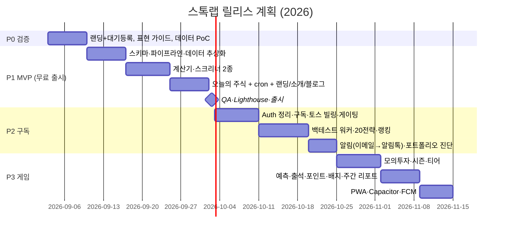

# 스톡랩(StockLab) PRD — 제품 요구사항 정의서

- 문서 버전: 1.0 (2026-09-02) · 작성: Wave 1 PM/기획
- 상위 문서: `/CLAUDE.md`(허브 규칙), `AUTH-BILLING-PLAN.md`(허브 과금 사상)
- 관련 문서: `11-feature-specs.md`, `20-db-schema.md`, `21-api-design.md`, `23-ux-flows.md`
- 코드 기준(Source of truth): `src/lib/types.ts`, `src/lib/site.ts`, `src/lib/usage.ts`

---

## 1. 비전

> **"데이터로 찾고, 시뮬레이션으로 검증하고, 알림으로 놓치지 않는 개인 투자자용 도구"** (`SITE.tagline`)

스톡랩은 **추천을 하지 않는다.** 사용자가 스스로 세운 *조건*을 국내 상장 종목 데이터에 적용해
**조건 충족 종목**을 보여주고, 그 조건이 과거에 어떤 결과를 냈는지 **백테스트**로 검증하게 하고,
조건이 다시 충족되면 **시그널(조건 충족) 발생** 알림을 보내는 도구다.
"무엇을 살지"를 대신 정해주는 서비스(리딩·추천)와 정면으로 구분되는 **A안 = 추천 없는 데이터 도구** 포지션을 취한다.

### 1.1 한 줄 포지셔닝
| 항목 | 내용 |
|---|---|
| 카테고리 | 개인 투자자용 국내주식 **데이터 도구** (스크리너 · 백테스트 · 알림 · 모의투자) |
| 차별점 | 전 기능 한국어 · 모바일 우선 · 무료 시작 · 추천 없이 **조건 → 검증 → 알림** 루프 |
| 하지 않는 것 | 종목 추천, 목표가 제시, 매매 신호 판매, 실계좌 주문 연동(P3까지 없음) |
| 수익 모델 | 무료(AdSense 결과 하단 1개) + 구독(베이직 ₩9,900 / 프로 ₩29,000, 토스페이먼츠 빌링) |

## 2. 타깃 & JTBD

### 2.1 페르소나
| 페르소나 | 특성 | 현재 대안 | 불만 |
|---|---|---|---|
| **P-A 데이터형 초심자** (25~35, 직장인) | 유튜브·책으로 PER/PBR 개념은 알지만 실제 종목을 걸러 본 적 없음 | 네이버증권 종목 리스트 수동 정렬, 엑셀 | 조건을 한 번에 여러 개 걸 수 없음, 스마트폰에서 불편 |
| **P-B 배당 장기투자자** (35~55) | 배당수익률·연속배당 중시, 월 1회 점검 | 증권사 HTS 조건검색 | HTS는 PC 전용·복잡, 배당 히스토리 통합 뷰 없음 |
| **P-C 퀀트 지향 개인** (30~45) | 매매 규칙을 만들어 검증하고 싶음, 파이썬은 부담 | 퀀트킹, 젠포트, 직접 코딩 | 월 5~10만원 고가, 러닝커브, 결과 공유 어려움 |
| **P-D 게임형 라이트 유저** (20~30) | 투자 관심은 있지만 실전은 부담 | 모의투자 앱 | 재미 요소 부족, 데이터 학습과 연결 안 됨 |

### 2.2 JTBD (Jobs To Be Done)
| # | When (상황) | I want to (행동) | So I can (결과) | 대응 기능 |
|---|---|---|---|---|
| J1 | 시장 뉴스 보고 "싼 종목" 찾고 싶을 때 | PER·PBR·ROE·부채비율 조건을 동시에 걸고 | 조건 충족 종목만 빠르게 좁힌다 | 저평가 스크리너 |
| J2 | 배당 시즌 전 포트폴리오 점검할 때 | 배당수익률·연속배당연수·배당성향으로 걸러 | 배당 안정성 있는 종목을 비교한다 | 고배당 스크리너 |
| J3 | 적립식 투자 계획을 세울 때 | 월 납입액·수익률·기간을 넣어 | 미래 자산 곡선을 확인한다 | 복리 계산기 |
| J4 | 매일 아침 출근길 | 오늘 조건 충족 종목 1개와 그 근거를 30초 안에 보고 | 데이터 감각을 유지한다 | 오늘의 주식 |
| J5 | 내 매매 규칙이 통하는지 궁금할 때 | 과거 20년 데이터에 규칙을 돌려 | CAGR·MDD·승률로 검증한다 | 백테스트 |
| J6 | 조건이 다시 충족될 때 | 이메일/알림톡/푸시로 즉시 받아 | 매일 스크리너를 열지 않아도 된다 | 시그널 알림 |
| J7 | 실전 전에 감을 익히고 싶을 때 | 가상 1,000만원으로 거래하고 랭킹을 비교하며 | 부담 없이 학습한다 | 모의투자 게임 |
| J8 | 내 보유 종목이 편중됐는지 궁금할 때 | 종목·비중을 넣어 | 섹터 편중·상관관계를 확인한다 | 포트폴리오 체크 |

## 3. 성공 지표

### 3.1 North Star Metric
> **WAE (Weekly Active Evaluators)** = 주간 "조건 실행" 사용자 수
> (스크리너 실행 · 백테스트 실행 · 오늘의 주식 열람 중 1개 이상 수행한 고유 사용자)

추천 서비스의 "클릭"이 아니라 **사용자가 스스로 조건을 평가한 행위**를 성장 지표로 삼는다.

### 3.2 Phase별 KPI
| Phase | 기간 | KPI | 목표 | 측정 |
|---|---|---|---|---|
| **P0 검증** | 1주 | 랜딩 대기 등록 전환율 | 방문 → 이메일 등록 ≥ 8% | Vercel Analytics + `waitlist` 폼 |
| | | 설문: "추천 없이 조건만 보여줘도 쓸 것인가" 긍정 | ≥ 60% | Tally/Google Form |
| **P1 MVP** | 3~4주 + 출시 후 4주 | MAU | 3,000 | GA4/Vercel Analytics |
| | | 스크리너 실행 수(월) | 10,000 | `usage_limits` 집계 + 서버 로그 |
| | | 오늘의 주식 재방문율 (7일 내 2회+) | ≥ 20% | 쿠키 uid 기반 |
| | | 비로그인 한도 도달 → 가입 전환 | ≥ 3% | 한도 초과 화면 CTA 클릭 → 가입 완료 |
| | | Lighthouse 모바일 | 성능/접근성/SEO ≥ 90 | CI Lighthouse |
| | | 검색 유입 (블로그+랜딩) | 월 5,000 세션 | Search Console |
| **P2 구독** | 3주 + 8주 | 무료→유료 전환율 | ≥ 2% (가입자 기준) | `subscriptions` |
| | | MRR | ₩1,000,000 (베이직 60 + 프로 15 가정) | `subscriptions` 활성 합계 |
| | | 알림 옵트인율 (가입자 중) | ≥ 30% | `alerts` |
| | | 백테스트 작업 성공률 / p95 대기 | ≥ 98% / ≤ 60초 | `backtests.status` |
| | | 결제 실패율 | ≤ 3% | 토스 웹훅 로그 |
| **P3 게임** | 3주 + 8주 | D7 / D30 리텐션 | 25% / 12% | 코호트 |
| | | 시즌 참여자 (월) | 1,000 | `game_accounts` |
| | | 공유 카드 생성 (월) | 500 | 이벤트 로그 |
| | | 출석 7일 연속 달성률 | 15% | `points` |

### 3.3 가드레일 지표 (내려가면 안 되는 것)
- 표현 가드 위반 0건 (`npm run lint:expr`, CI 필수)
- 데이터 신선도: 06:00 KST 기준 `financials.as_of` ≤ 전 영업일 (지연 시 배너 표시)
- 알림 오발송률 ≤ 0.5%, 수신거부 처리 지연 ≤ 24h
- AdSense 정책 위반 0건 (입력 화면 광고 없음)

## 4. 기능 목록

### 4.1 요금제 × 기능 매트릭스
| 기능 | 무료 | 베이직 ₩9,900/월 | 프로 ₩29,000/월 | Phase |
|---|:-:|:-:|:-:|:-:|
| 저평가 스크리너 (PER/PBR/ROE/부채비율, 지연 시세) | 비로그인 일 5회 · 로그인 일 20회 | 무제한 | 무제한 | P1 |
| 고배당 스크리너 (배당수익률/연속배당연수/배당성향) | 비로그인 일 5회 · 로그인 일 20회 | 무제한 | 무제한 | P1 |
| 복리 계산기 (적립식/거치식 기본) | ○ | ○ | ○ | P1 |
| 오늘의 주식 (06:00 KST, 조건 충족 종목 1개) | ○ | ○ | ○ | P1 |
| 랜딩 · 소개 · 블로그 | ○ | ○ | ○ | P1 |
| 커스텀 조건식 저장 (saved_screens) | 1개 | 20개 | 무제한 | P2 |
| 멀티팩터 스크리닝 (팩터 가중 합산) | – | – | ○ | P2 |
| 조건식 공유 (공개 링크) | – | – | ○ | P2 |
| 시그널 알림 — 이메일 | – | ○ (알림 5개) | ○ (알림 50개) | P2 |
| 시그널 알림 — 카카오 알림톡 · 앱 푸시 · 실시간(KIS) | – | – | ○ | P2/P3 |
| 백테스트 | – | 월 10회 · 최대 5년 | 무제한 · 최대 20년 | P2 |
| 전략 비교 (2~4개 동시) | – | – | ○ | P2 |
| 매매법 랭킹 열람 (20 기본 전략) | 전월 1위만 | ○ | ○ | P2 |
| 전략 복제 + 내 조건 백테스트 · 랭킹 참가 | – | – | ○ | P2 |
| 단일 전략 시뮬레이션 (적립식) | – | ○ | ○ | P2 |
| 적립식 vs 거치식 비교 · 몬테카를로 | – | – | ○ | P2 |
| 포트폴리오 체크 라이트 (섹터 비중·집중도) | ○ (5종목) | – | – | P1(후반)/P2 |
| 포트폴리오 진단 기본 (변동성·배당 캘린더) | – | ○ | ○ | P2 |
| 리밸런싱 제안 · 상관관계 매트릭스 | – | – | ○ | P2 |
| 모의투자 게임 (가상 1,000만원, 주간·시즌 랭킹) | ○ | ○ | ○ | P3 |
| 오를까 내릴까 예측 · 출석 · 배지 · 주간 리포트 | ○ | ○ | ○ | P3 |
| 광고 (결과 하단 1개) | 표시 | 제거 | 제거 | P1/P2 |
| PWA · 앱 래핑(Capacitor) 푸시 | ○ | ○ | ○ | P3 |

> "포트폴리오 진단"·"리밸런싱 제안"은 **비중 계산 결과**를 보여주는 기능이며 매매 지시가 아니다. UI 문구는 `11-feature-specs.md §5`·`24-design-system.md §9` 준수.

### 4.2 MoSCoW (Phase별)
| Phase | Must | Should | Could | Won't (이번 Phase) |
|---|---|---|---|---|
| **P0** | 랜딩 + 대기 등록, 표현 가이드(`00-legal-expression-guide.md`), 데이터 소스 확정(pykrx/FDR + DART) | 설문 10문항, 경쟁 가격 조사 | 샘플 스크리너 GIF | 어떤 기능도 실구현 없음 |
| **P1** | 복리 계산기, 저평가·고배당 스크리너, 오늘의 주식 + cron, 비로그인 한도(일 5회), Supabase 스키마 7테이블 + 뷰 2 + RPC, 면책 컴포넌트, 다크모드, SEO(JSON-LD) | 로그인(Supabase Auth: 카카오·구글·이메일), 로그인 시 일 20회, 포트폴리오 체크 라이트, 블로그 4편 | 스크리너 CSV 내보내기, 종목 상세 페이지 | 결제, 백테스트, 알림, 게임 |
| **P2** | 구독·토스 빌링·웹훅 멱등, 권한 게이팅, 백테스트 워커 + 20 기본 전략 + 랭킹, 이메일 시그널 알림, 저장 조건식 | 알림톡, 전략 비교, 포트폴리오 진단 기본, 조건식 공유 | 몬테카를로, 적립식 vs 거치식, KIS 실시간 SSE | 모의투자, 예측, 앱 래핑 |
| **P3** | 모의투자 시즌제 + 티어, 예측 게임, 출석·포인트·배지, 주간 리포트, 전략 랭킹 시즌 리셋, PWA | Capacitor 앱 + FCM 푸시, 공유 카드(canvas) | 친구 초대, 길드 | 실계좌 연동, 커뮤니티 게시판 |

## 5. 유저 스토리

### 5.1 P1 상세 (Given/When/Then 수용 기준)
| ID | 스토리 | 수용 기준 |
|---|---|---|
| **US-P1-01** 복리 계산기 | 사용자로서 초기금·월 납입·연수익률·기간을 입력해 미래 자산을 보고 싶다 | `/calc/compound` · 입력 즉시(디바운스 150ms) 재계산 · 연도별 테이블 + 라인 차트 · 원금/이자 분리 · 세금(15.4%) 토글 · 결과 URL 상태(`?p=`) · 결과 하단 광고 1개 · 입력만 있고 결과 없는 상태에서 광고 미표시 |
| **US-P1-02** 저평가 스크리너 | 사용자로서 PER≤N, PBR≤N, ROE≥N, 부채비율≤N을 걸어 조건 충족 종목을 보고 싶다 | `/screener/value` · 기본값 `perMax=10, pbrMax=1, roeMin=10, debtMax=150, market=ALL, sort=per` · 결과 최대 100행 · 열: 종목/시장/현재가(지연)/시총/PER/PBR/ROE/부채비율/배당수익률/기준일 · 정렬 4종 · 결과 0건 시 빈 상태(조건 완화 제안) · 상단 `SITE.dataDisclaimer` · 하단 `Disclaimer` |
| **US-P1-03** 고배당 스크리너 | 사용자로서 배당수익률≥N, 연속배당≥N년, 배당성향≤N을 걸고 싶다 | `/screener/dividend` · 기본값 `yieldMin=3, yearsMin=3, payoutMax=0(무제한), sort=dividend_yield` · 열: 종목/현재가/시총/DPS/배당수익률/배당성향/연속배당연수/배당락일/기준일 |
| **US-P1-04** 비로그인 한도 | 비로그인 사용자로서 하루 5회까지 스크리너를 실행할 수 있어야 한다 | `consume_usage(p_key,p_feature,p_date)` 호출 후 `allowed=false`면 결과 대신 **한도 초과 카드**(남은 시간 = `resetsAt`, 가입 CTA) · key = sha256(ip+`sl_uid`+salt) 32자 · 원문 IP 저장 금지 · 필터 변경 없이 새로고침은 카운트 소비 안 함(세션 스토리지 마지막 결과 캐시) |
| **US-P1-05** 오늘의 주식 | 방문자로서 매일 06:00 KST에 선정된 조건 충족 종목 1개와 근거를 보고 싶다 | `/today` · `daily_picks` 최신 1건 · 카드: 종목명/시장/전략 라벨/충족 조건 문장 리스트/지표/데이터 기준일 · 과거 날짜 `/today/2026-09-01` 열람 · 오늘 데이터 없으면 "선정 준비 중" 빈 상태 + 최근 pick 표시 · 문구 "오늘의 조건 충족 종목" (추천 아님 고지) |
| **US-P1-06** 일일 선정 cron | 운영자로서 매일 21:00 UTC에 기본 전략으로 자동 선정되길 원한다 | `POST/GET /api/cron/daily-pick` · `Authorization: Bearer ${CRON_SECRET}` 불일치 → 401 · 멱등: 같은 `pick_date` 존재 시 200 + `{skipped:true}` · 기본 전략 `low-pbr-high-roe` · 후보 0이면 완화 전략 폴백 순서 정의(`11-feature-specs.md §1.6`) · 실패 시 Vercel 로그 + 다음 요청 재시도 가능 |
| **US-P1-07** 샘플 데이터 폴백 | 개발자로서 Supabase env 없이도 앱이 동작하길 원한다 | `getDataSource().mode==='sample'` → 모든 데이터 화면 상단 `SampleBanner` 필수 · 샘플 데이터는 합성(실종목명 아님) |
| **US-P1-08** 데이터 파이프라인 | 운영자로서 매일 KRX/DART 데이터를 Supabase에 적재하고 싶다 | `pipeline/`(Python) · pykrx/FDR 일봉 → `daily_prices` · DART → `financials` (`as_of` 갱신) · KRX+DART → `dividends` · GitHub Actions 05:00 KST · 실패 시 이전 데이터 유지 + `as_of` 미갱신 → 화면 "데이터 지연" 배너 |
| **US-P1-09** 로그인 (Should) | 사용자로서 카카오/구글/이메일로 가입해 한도를 늘리고 싶다 | Supabase Auth · `profiles` 자동 생성 트리거 · 로그인 시 한도 키 = `user_id`, 일 20회 · 닉네임만 수집(실명·전화 금지) |
| **US-P1-10** 랜딩/소개 | 방문자로서 무엇을 하는 서비스인지 10초 안에 이해하고 싶다 | `/` 히어로 + 3기능 + 오늘의 주식 위젯 + 요금제 예고 + FAQ 8 · `/about` 미션·데이터 출처 · 전 페이지 JSON-LD(SoftwareApplication+FAQPage+BreadcrumbList) |
| **US-P1-11** 공통 품질 | 모든 사용자로서 모바일에서 빠르고 다크모드로 볼 수 있어야 한다 | Lighthouse 90+ · `error.tsx`/`global-error.tsx` · `EmptyState` · `ThemeToggle`(시스템 기본) · 표는 `.tnum` · 가로 스크롤은 표 컨테이너 내부만 |

### 5.2 P2 요약
- **US-P2-01 구독**: 요금제 페이지에서 카드 등록(토스 빌링키) → 즉시 베이직/프로 활성 → 매월 자동 결제 → 실패 시 3일 유예 후 무료 전환.
- **US-P2-02 게이팅**: 유료 기능 진입 시 잠금 카드(기능 설명 + 요금제 비교 + 업그레이드 CTA), 월 한도 도달 시 잔여 표시.
- **US-P2-03 백테스트**: 전략 선택/조건 편집 → 기간·초기자본·수수료 → 실행(작업 큐) → 진행률 SSE → 결과(CAGR/MDD/Sharpe/승률/자산곡선/월별 수익) → 공유 카드 PNG.
- **US-P2-04 매매법 랭킹**: 20 기본 전략 + 참가한 사용자 전략을 같은 창(직전 36개월)에서 실현 수익률로 정렬. 월초 리셋, 전월 1위는 무료 공개.
- **US-P2-05 알림**: 저장 조건식에 알림 켜기 → 채널 선택(이메일/알림톡/푸시) → 06:30 KST 배치 평가 → 발송 → 수신거부 링크 1클릭.
- **US-P2-06 포트폴리오 진단**: 종목·수량 입력 → 섹터 비중·변동성·배당 캘린더(베이직) · 상관관계·리밸런싱 비중 계산(프로).

### 5.3 P3 요약
- **US-P3-01 모의투자**: 시즌(월) 시작 시 가상 1,000만원. 주문은 전일 종가 기준 지연 체결(P3 초기) → KIS 실시간(프로, 후반). 수수료·세금 시뮬레이션. 주간·시즌 랭킹, 티어.
- **US-P3-02 예측 게임**: 매일 3종목 "오를까 내릴까" 08:30 KST 마감, 다음 거래일 종가로 판정, 스트릭.
- **US-P3-03 출석·포인트·배지**: 7일 연속 → 백테스트 1회 쿠폰 등 기능성 보상. 현금성 보상 없음.
- **US-P3-04 주간 리포트**: 일요일 19:00 KST 이메일/푸시. 내 활동 요약 + 랭킹 변동.
- **US-P3-05 PWA/앱**: 설치 배너, Capacitor 래핑, FCM 푸시 토큰 등록.

## 6. 비기능 요구사항
| 영역 | 요구 | 검증 방법 |
|---|---|---|
| 성능 | Lighthouse 모바일 성능/접근성/BP/SEO ≥ 90 · LCP ≤ 2.5s · 스크리너 응답 p95 ≤ 800ms(Supabase 뷰) | CI Lighthouse, Vercel Speed Insights |
| 모바일 우선 | 360px 폭에서 모든 기능 사용 가능 · 표는 컨테이너 내부 가로 스크롤 · 터치 타깃 ≥ 44px | 수동 QA 체크리스트 |
| 다크모드 | `.dark` 클래스 토글 + 시스템 감지 · 깜빡임 없음(`ThemeScript`) | 시각 QA |
| 접근성 | WCAG 2.1 AA · 색상만으로 상승/하락 구분 금지(▲▼/부호 병기) · 모든 폼 `label` · 포커스 링 · `role="note"` 면책 | axe-core |
| 에러/빈 상태 | 라우트별 `error.tsx` · 결과 0건 `EmptyState`(조건 완화 제안) · 데이터 지연 배너 · 샘플 데이터 배너 | 컴포넌트 존재 검사 |
| 신뢰성 | cron 멱등 · 파이프라인 실패 시 이전 데이터 유지 · 백테스트 작업 재시도 3회 | 운영 런북 |
| 보안 | RLS 전 테이블 · service role 서버 전용 · CRON_SECRET · 웹훅 서명 검증 | `26-security-rls.md` |
| 개인정보 | 실명/전화/주민번호/이메일(가입 외) 수집 금지 · 알림톡 전화번호는 옵트인 후 암호화 저장 | `26-security-rls.md §5` |
| SEO | 페이지별 고유 title/description · JSON-LD 3종 · sitemap/robots | `sitemap.ts`, `JsonLd.tsx` |
| 국제화 | 한국어 단일 · KST 고정(`kst.ts`) · 숫자 `ko-KR` 로케일 | 코드 리뷰 |

## 7. 법적 제약 (A안: 추천 없는 데이터 도구)
| 구분 | 규칙 | 근거/비고 |
|---|---|---|
| 금지 표현 (UI·알림·블로그·OG 전부) | "매수 추천 / 매도 / 추천 종목 / 수익 보장 / 목표가 제시 / 급등" 계열 금지 — `scripts/check-expressions.mjs` BANNED 목록이 기준 | 자본시장법상 투자자문업(유사투자자문 포함) 오해 방지 |
| 허용 표현 | "조건 충족 종목", "스크리닝 결과", "시그널(조건 충족) 발생", "지정가 도달 알림", "과거 구간 성과" | `00-legal-expression-guide.md`(P0 산출물) |
| 면책 고지 | 모든 페이지 푸터 `Disclaimer` + 백테스트/랭킹 화면 본문 상단에 "과거 성과가 미래 수익을 보장하지 않음" 추가 | `SITE.disclaimer` |
| 오늘의 주식 | "선정"이 아니라 "기본 전략의 조건을 충족한 종목 1개"임을 카드 안에 명시 · 전략 규칙 링크 | 추천 오해 차단 |
| 사용자 전략 공유(프로) | 공개 조건식에 자유 텍스트 설명 허용 시 표현 가드 서버 검사 + 신고 버튼 | 사용자 생성 콘텐츠 리스크 |
| 알림 | 사용자가 설정한 조건의 충족 통지 = 거래관계 정보(광고성 아님). 마케팅 문구 혼입 금지. 마케팅 알림은 별도 옵트인 + "(광고)" 표기 | 정보통신망법 §50, `11-feature-specs.md §3.6` |
| 결제 | 구독 해지 시 기간 말 종료 · 7일 이내 미사용 전액 환불 · 청약철회 고지 | 전자상거래법, `11-feature-specs.md §5.6` |
| 데이터 | KRX 시세 재배포 조건 확인(지연 시세, 출처 표기) · DART 출처 표기 · KIS 실시간은 이용약관상 개인 사용자 화면 표시 범위 내 | `/about` 데이터 출처 섹션 |
| 게임 | 가상 화폐·기능성 보상만 · 현금/상품권 보상 없음(사행성 배제) | P3 |

## 8. 리스크 & 완화
| # | 리스크 | 영향 | 확률 | 완화 |
|---|---|---|---|---|
| R1 | 표현 위반으로 유사투자자문 오해 | 高 | 中 | CI 표현 가드 · 카피 리뷰 체크리스트 · 알림 템플릿 사전 검수 |
| R2 | 데이터 소스(pykrx 스크래핑) 차단/변경 | 高 | 中 | FDR 이중화 · 실패 시 이전 데이터 유지 + 지연 배너 · P2에 KIS 일봉 API 추가 |
| R3 | 백테스트 룩어헤드/생존편향으로 과장된 성과 | 高 | 中 | 공시일 기준 point-in-time 재무 · 상장폐지 종목 포함 · 결과 화면에 방법론 고지 |
| R4 | 결제 웹훅 중복/유실 | 中 | 中 | `webhook_events` 멱등 키 · 토스 결제조회 API 대사 배치 |
| R5 | Vercel 서버리스에서 장기 작업 불가 | 中 | 高 | 백테스트는 Python 워커(Fly.io) 분리, 큐 기반 |
| R6 | 알림톡 비용 폭증(8원/건) | 中 | 中 | 프로 전용 · 일 한도 · 쿨다운 · 배치 집계 발송 |
| R7 | 무료 한도 우회(쿠키 삭제) | 低 | 高 | ip+uid 해시 · 로그인 유도 · 무료 한도는 비용이 낮은 기능에만 |
| R8 | 모의투자 다계정/봇 | 中 | 中 | 1인 1계정 · 지연 체결 · 일 거래 한도 · 이상 탐지 플래그 |
| R9 | AdSense 정책(금융 콘텐츠·광고 위치) | 中 | 低 | 결과 하단 1개만 · 입력 화면 광고 금지 · 유료 사용자 광고 제거 |
| R10 | 1인 운영 번아웃 | 高 | 高 | Phase별 Must만 · 자동화(cron/CI) · 문서 우선 |

## 9. 릴리스 계획

| 릴리스 | 게이트(출시 조건) |
|---|---|
| P1 | `npm run check` 통과 · Lighthouse 90+ · 실데이터 3일 연속 정상 적재 · 면책 전 페이지 · 표현 가드 0 |
| P2 | 토스 테스트 결제 왕복 · 웹훅 중복 테스트 · 백테스트 정합성 테스트(`22-backtest-engine-design.md §9`) 통과 · 알림 수신거부 E2E |
| P3 | 시즌 리셋 리허설 · 다계정 탐지 룰 · 푸시 토큰 만료 처리 · 스토어 심사 문구 검토 |

## 10. 미결 사항 (Open Questions)
| # | 질문 | 담당 | 기한 |
|---|---|---|---|
| Q1 | 로그인 사용자 무료 스크리너 한도: 일 20회(본 문서 가정) vs 무제한? | 소유자 | P1 착수 전 |
| Q2 | 허브 통합 SSO(`AUTH-BILLING-PLAN.md` 안1) vs 스톡랩 독립 Supabase Auth — 코드가 이미 Supabase 전제. **독립 Auth로 시작, 이후 허브 연동**을 제안 | 소유자 | P1 |
| Q3 | 마법공식 EV/EBIT·NCAV 등 확장 재무 컬럼 — P2 `financial_statements` 테이블로 확보 가능한지 DART 원천 검증 | 데이터 | P2 착수 전 |
| Q4 | KRX 시세 재배포 약관(지연 시세 표시 범위) 법률 검토 | 소유자 | P1 출시 전 |
| Q5 | 카카오 알림톡 발신 프로필(사업자 등록 필요) 보유 여부 | 소유자 | P2 |
| Q6 | 백테스트 워커 호스팅: Fly.io vs Railway (비용 상한 월 $10) | 개발 | P2 |
| Q7 | Capacitor 앱 스토어 계정(Apple $99/yr) 지출 승인 | 소유자 | P3 |
| Q8 | `site.ts`가 참조하는 `docs/00-legal-expression-guide.md`와 `.env.example`이 참조하는 `pipeline/README.md`가 아직 없음 — P0에서 작성 필요 | 기획 | P0 |
