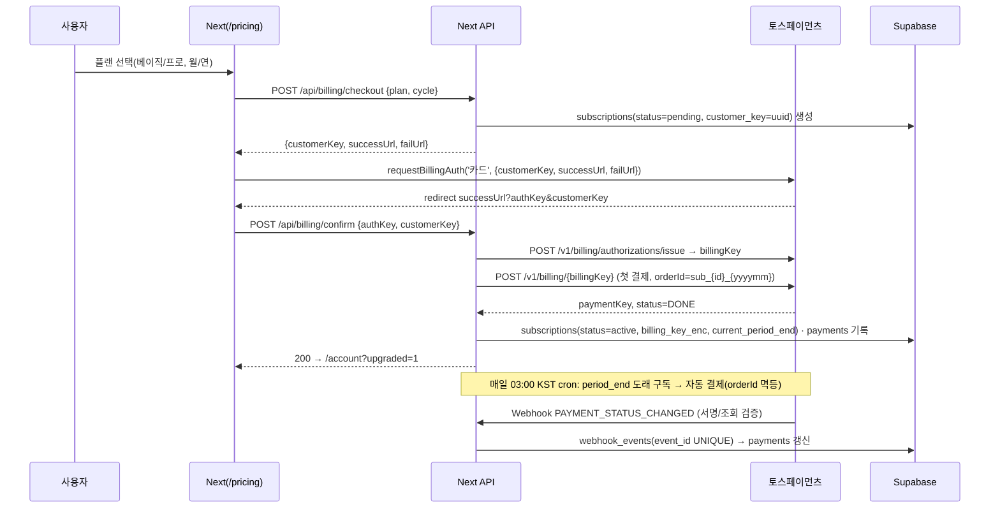

# 스톡랩 기능 명세 (Feature Specs)

- 버전 1.0 (2026-09-02) · 상위: `10-PRD.md` · 스키마: `20-db-schema.md` · API: `21-api-design.md`
- 컬럼명·타입명은 `src/lib/types.ts` 를 그대로 사용한다 (`per`, `pbr`, `roe`, `debt_ratio`, `dividend_yield`, `payout_ratio`, `consecutive_years`, `ex_dividend_date`, `as_of` …).

목차: §1 스크리너 · §2 백테스트 · §3 알림 · §4 게이미피케이션 · §5 요금제·페이월

---

## §1 스크리너

### 1.1 공통
| 항목 | 규칙 |
|---|---|
| 데이터 | `financials`(최신 스냅샷) + `dividends` + `stocks` → 뷰 `v_screen_value`, `v_screen_dividend`. 시세는 **전일 종가 지연**(`price`). |
| 결과 상한 | 무료 100행, 베이직/프로 500행 (`limit` 파라미터 상한 서버 강제) |
| 결측 처리 | `NULL` 지표는 해당 조건에서 **제외**(통과시키지 않음). PER/PBR은 `0 < x` 조건 필수(적자·음수 자본 제외) |
| URL 상태 | 모든 필터를 쿼리스트링에 반영(`?perMax=10&pbrMax=1&roeMin=10&debtMax=150&market=ALL&sort=per`) → 링크 공유 = 조건 공유 |
| 실행 트리거 | "조건 적용" 버튼(명시적). 자동 재실행 금지(한도 소비 방지) |
| 한도 | 비로그인 `ANON_DAILY_LIMIT=5`/일(KST) · 로그인 무료 20/일 · 유료 무제한. 피처 키 `screener:value`, `screener:dividend` 각각 별도 카운트 |
| 카운트 미소비 | 동일 필터 재조회(세션 캐시 히트), 정렬 변경(클라이언트 정렬), 페이지네이션 |
| 결과 표 열 | `ScreenRow`/`DividendRow` 필드 순서 그대로. 숫자 `.tnum`. 시총 "억원", 비율 소수 1자리 |
| 결과 하단 | 광고 1개(무료) → `Disclaimer` → "이 조건 저장"(P2) |
| 빈 상태 | 0건 → `EmptyState` "조건을 만족하는 종목이 없습니다" + **가장 제한적인 조건 1개 완화 제안**(예: "PER 상한을 15로 올리면 23개") — 서버가 후보 카운트 3개 반환 |

### 1.2 저평가 스크리너 `/screener/value`
| 필터 (`ValueFilters`) | 의미 | 기본값 | 범위(UI) | SQL 조건 |
|---|---|---|---|---|
| `perMax` | 주가수익비율 상한 | 10 | 1~50, step 0.5 | `per > 0 AND per <= :perMax` |
| `pbrMax` | 주가순자산비율 상한 | 1.0 | 0.1~5, step 0.1 | `pbr > 0 AND pbr <= :pbrMax` |
| `roeMin` | 자기자본이익률 하한(%) | 10 | 0~50, step 1 | `roe >= :roeMin` |
| `debtMax` | 부채비율 상한(%) | 150 | 0~500, step 10 | `debt_ratio <= :debtMax` |
| `market` | 시장 | `ALL` | KOSPI/KOSDAQ/ALL | `(:market = 'ALL' OR market = :market)` |
| `sort` | 정렬 | `per` | per↑, pbr↑, roe↓, market_cap↓ | 표 참조 |

프리셋 칩(클릭 시 필터 채움): **보수적**(PER 8/PBR 0.8/ROE 12/부채 100) · **기본**(10/1/10/150) · **완화**(15/1.5/8/200) · **대형 우량**(15/2/15/100 + 시총 ≥ 1조 — P2 `marketCapMin` 필터 추가 시).

### 1.3 고배당 스크리너 `/screener/dividend`
| 필터 (`DividendFilters`) | 의미 | 기본값 | 범위 | SQL 조건 |
|---|---|---|---|---|
| `yieldMin` | 배당수익률 하한(%) | 3 | 0~15, step 0.5 | `dividend_yield >= :yieldMin` |
| `yearsMin` | 연속 배당 연수 하한 | 3 | 0~20 | `consecutive_years >= :yearsMin` |
| `payoutMax` | 배당성향 상한(%) · 0 = 무제한 | 0 | 0~200 | `(:payoutMax = 0 OR payout_ratio <= :payoutMax)` |
| `market` | 시장 | `ALL` | | 동일 |
| `sort` | 정렬 | `dividend_yield` | dividend_yield↓, consecutive_years↓, market_cap↓ | |

배당락일(`ex_dividend_date`)이 오늘부터 30일 이내면 행에 "배당락 D-n" 배지(정보 표시, 매매 제안 아님).

### 1.4 정렬·페이지네이션
- 서버 정렬 1회 → 최대 상한 행 반환 → 클라이언트 정렬/페이지(20행) 처리. NULL은 항상 뒤.
- 동률 시 2차 정렬 `market_cap DESC`, 3차 `code ASC` (결정적 순서).

### 1.5 저장 조건식 (P2, `saved_screens`)
```jsonc
// saved_screens.filters (jsonb) — 스키마 버전 필수
{
  "v": 1,
  "kind": "value" | "dividend" | "multi",          // multi = 프로 멀티팩터
  "filters": { /* ValueFilters | DividendFilters 그대로 */ },
  "factors": [                                       // kind=multi 전용, 최대 6개
    { "field": "per", "dir": "asc", "weight": 0.4 },  // 순위 백분위 가중 합산
    { "field": "roe", "dir": "desc", "weight": 0.6 }
  ],
  "topN": 30                                         // multi 결과 상위 N
}
```
| 항목 | 규칙 |
|---|---|
| 개수 한도 | 무료 1 · 베이직 20 · 프로 무제한 |
| 이름 | 1~40자, 표현 가드(서버 정규식) 통과 필수 |
| 공개 공유(프로) | `is_public=true` → `/s/{share_slug}` 읽기 전용 페이지. 설명 텍스트 300자, 표현 가드 + 신고 버튼 |
| 알림 연결 | `alerts.saved_screen_id` FK. 조건식 수정 시 연결된 알림은 다음 평가부터 새 조건 적용 |
| 멀티팩터 계산 | 각 팩터를 전 종목 백분위(0~100)로 변환 → 가중 합 → 상위 `topN`. 필수 전처리: `per>0`, `pbr>0` |

### 1.6 오늘의 주식 선정 규칙 (P1, `daily_picks`)
| 단계 | 규칙 |
|---|---|
| 기본 전략 | `low-pbr-high-roe`: `pbr>0 AND pbr<=1 AND roe>=10 AND debt_ratio<=150 AND market_cap>=1000`(억) |
| 순위 | `roe DESC, pbr ASC, market_cap DESC` → 1위 |
| 중복 회피 | 최근 20 영업일 내 선정된 `code` 제외 |
| 폴백 | 후보 0 → `pbr<=1.5 AND roe>=8` → 그래도 0이면 `high-dividend`(`dividend_yield>=4 AND consecutive_years>=5`) 순으로. `strategy_key`/`strategy_label`에 실제 사용 전략 기록 |
| `conditions` | 사람이 읽는 문장 배열: "PBR 0.72배 (조건: 1.0배 이하)", "ROE 14.2% (조건: 10% 이상)" |
| `metrics` | `{ price, market_cap, per, pbr, roe, debt_ratio, dividend_yield }` |
| 문구 | 카드 제목 "오늘의 조건 충족 종목" · 부제 "기본 전략 '{strategy_label}' 조건을 충족한 종목 1개입니다. 매매 권유가 아닙니다." |

---

## §2 백테스트 (P2)

### 2.1 입력
| 필드 | 타입 | 기본 | 제약 (베이직 / 프로) |
|---|---|---|---|
| `strategy_id` 또는 `strategy_def` | uuid / JSON DSL(`22-backtest-engine-design.md §4`) | – | 베이직: 기본 20전략 + 파라미터 수정만 · 프로: 커스텀 DSL |
| `start_date`, `end_date` | date | 최근 5년 / 20년 | 최대 5년 / 20년 · `end_date` ≤ 마지막 데이터일 |
| `universe` | `KOSPI` `KOSDAQ` `ALL` `KOSPI200` | ALL | 시총 하한 `min_market_cap`(억) 기본 500 |
| `initial_capital` | int (원) | 10,000,000 | 1백만 ~ 100억 |
| `rebalance` | `daily` `weekly` `monthly` `quarterly` `yearly` | 전략 기본값 | 기술적 전략은 `daily` 시그널 평가 |
| `max_positions` | int | 20 | 1~50 |
| `weighting` | `equal` `market_cap` `inverse_vol` | equal | |
| `fee_bps` | number | 1.5 (0.015%, 매수·매도 각각) | 0~100 |
| `tax_bps` | number | 18 (매도 시 증권거래세+농특세 0.18%, 2026 기준) | 0~50 |
| `slippage_bps` | number | 10 (0.10%) | 0~100 |
| `dividend_reinvest` | bool | true | |
| `benchmark` | `KOSPI` `KOSDAQ` `KOSPI200` | KOSPI | |
| `dca` (적립식) | `{ amount, every: 'monthly' }` | 없음 | 단일 전략 시뮬레이션(베이직) / 적립 vs 거치 비교(프로) |

### 2.2 원칙 (정합성)
| 원칙 | 구현 규칙 |
|---|---|
| **룩어헤드 방지** | 재무 지표는 **공시일(`published_at`) + 1영업일** 이후에만 사용. 가격 시그널은 `t`일 종가로 계산 → **`t+1` 시가** 체결(시가 없으면 종가). 리밸런싱은 결정일 다음 거래일 체결 |
| **생존편향 방지** | 유니버스는 **해당 시점 상장 종목**(`stocks.listed_at`/`delisted_at`). 상장폐지 종목은 폐지일 전일 종가로 강제 청산(−100% 아닌 실제 마지막 가격) |
| 수정주가 | 액면분할·무상증자 반영 `adj_close` 사용, 배당은 현금 유입으로 별도 처리(재투자 옵션) |
| 거래정지 | 거래량 0 또는 결측일은 체결 불가 → 다음 거래 가능일 체결 |
| 유동성 필터 | 20일 평균 거래대금 < 1억 종목 제외(기본, 조정 가능) |
| 결정성 | 동일 입력 → 동일 출력. 난수 사용(몬테카를로)은 `seed` 기록 |

### 2.3 출력 지표
| 지표 | 정의 | 표시 |
|---|---|---|
| 총수익률 | `(final/initial − 1)` | % 1자리 |
| **CAGR** | `(final/initial)^(365.25/days) − 1` | % 2자리 |
| **MDD** | `min(equity/cummax(equity) − 1)` | % 1자리, 음수, `--down` 색 |
| **Sharpe** | `mean(daily_ret − rf/252)/std(daily_ret) * sqrt(252)`, rf = 3년 국고채 평균(고정 상수 테이블) | 2자리 |
| Sortino | 하방표준편차 기준 | 2자리 |
| **승률** | 종결 거래 중 수익 거래 비율 | % |
| 손익비 | 평균 이익/평균 손실 | 2자리 |
| 회전율 | 연간 매매대금/평균 자산 | % |
| 벤치마크 대비 | 초과수익률, 베타, 추적오차 | |
| 시계열 | 일별 자산곡선(equity), 드로다운, 월별 수익률 히트맵, 연도별 수익률 | 차트 |
| 거래 내역 | 종목/진입일/청산일/수익률 (최근 200건 페이지) | 표 |
| 보유 종목 스냅샷 | 최종 리밸런싱 시점 보유 종목·비중 (**"과거 시점 보유 목록"** 이라 표기, 현재 조건 충족과 구분) | 표 |

### 2.4 리밸런싱 주기 기본값
| 전략 유형 | 시그널 평가 | 리밸런싱 | 비고 |
|---|---|---|---|
| 팩터(가치/배당/퀄리티) | 월말 | `monthly`(기본), `quarterly` 권장(수수료↓) | 재무 갱신은 분기 |
| 기술적(이평/돌파/회귀) | 매 거래일 | 시그널 발생 시 | 종목 단위 진입/청산 |
| 혼합(추세 필터 + 팩터) | 일/월 | 월 | 필터 OFF 시 전량 현금 |

### 2.5 표시 고지 (모든 결과 화면 상단 고정)
> **과거 성과가 미래 수익을 보장하지 않습니다.** 이 결과는 입력한 조건을 과거 데이터에 기계적으로 적용한 시뮬레이션이며, 수수료·세금·슬리피지 가정(각 n bps)과 데이터 한계(지연 시세, 공시 기준 재무)를 포함합니다. 특정 종목의 매매를 권유하지 않습니다.

- 결과 카드(PNG)에도 동일 고지 1줄 + 워터마크 `stocklab.tomatoeggcat.com` 포함.
- 백테스트 결과의 종목 목록은 "과거 시점 보유 목록"으로만 표기. "현재 조건 충족 종목"은 스크리너에서만.

### 2.6 한도·비용
| 요금제 | 월 실행 | 최대 기간 | 동시 실행 | 결과 보관 | 전략 비교 |
|---|---|---|---|---|---|
| 베이직 | 10회 (쿠폰으로 +n) | 5년 | 1 | 90일 | – |
| 프로 | 무제한(공정 사용: 일 100회) | 20년 | 3 | 1년 | 최대 4 |
- 실행 카운트는 **작업 성공(`status=done`) 시** 차감. 실패는 미차감. 동일 입력 해시(`params_hash`) 24h 내 재실행은 캐시 반환·미차감.

### 2.7 매매법 랭킹 — 기본 20전략 정의
공통: 유니버스 ALL(시총 ≥ 500억, 20일 평균 거래대금 ≥ 1억), 초기자본 1,000만원, 수수료/세금/슬리피지 기본값, 동일가중, 랭킹 창 = **직전 36개월**(매월 1일 재계산). 전략 JSON은 `22-backtest-engine-design.md §4.4`.

| # | key | 라벨 | 유형 | 진입(선정) 규칙 | 청산/리밸런싱 | 필요 데이터 |
|---|---|---|---|---|---|---|
| 1 | `magic-formula` | 마법공식 | 팩터 | 이익수익률(EBIT/EV) 순위 + ROIC 순위 합산 상위 30. EV/EBIT 미확보 시 `1/per` 순위 + `roe` 순위로 대체(대체 사용 시 라벨에 "(근사)") | 연 1회 | `financial_statements`(P2) |
| 2 | `low-pbr-high-roe` | 저PBR + 고ROE | 팩터 | `0<pbr<=1`, `roe>=10`, `debt_ratio<=150` → roe 상위 20 | 분기 | financials |
| 3 | `dividend-growth` | 배당성장 | 팩터 | `consecutive_years>=5`, DPS 3년 CAGR > 0, `dividend_yield>=2`, `payout_ratio<=70` → yield 상위 20 | 연 1회 | dividends 히스토리 |
| 4 | `golden-cross` | 골든크로스 | 기술 | MA50이 MA200을 상향 돌파한 종목 진입 | 데드크로스(MA50<MA200) 청산 | daily_prices |
| 5 | `high-52w-breakout` | 52주 신고가 돌파 | 기술 | 종가 ≥ 직전 252일 최고 종가 | 20일 최저가 하향 이탈 시 청산 | daily_prices |
| 6 | `bollinger-reversion` | 볼린저 회귀 | 기술 | 종가 < 하단밴드(20, 2σ) & 200일선 위 | 종가 ≥ 중심선(MA20) 또는 20일 경과 | daily_prices |
| 7 | `rsi-reversion` | RSI 과매도 회귀 | 기술 | RSI(14) < 30 | RSI > 50 또는 15일 경과 | daily_prices |
| 8 | `momentum-12-1` | 12-1 모멘텀 | 팩터 | 12개월 수익률(최근 1개월 제외) 상위 20 | 월 | daily_prices |
| 9 | `low-per-large` | 대형 저PER | 팩터 | 시총 상위 200 중 `per>0` 하위 20 | 분기 | financials |
| 10 | `high-dividend` | 고배당 | 팩터 | `dividend_yield` 상위 20, `payout_ratio<=80`, `consecutive_years>=3` | 연 1회 | dividends |
| 11 | `trend-filter-value` | 지수 추세 필터 + 가치 | 혼합 | KOSPI 종가 > KOSPI MA200이면 #2 포트폴리오 보유, 아니면 100% 현금 | 월 | index_prices + financials |
| 12 | `small-cap-value` | 소형주 가치 | 팩터 | 시총 하위 30%(≥500억) 중 `0<pbr` 하위 20 | 분기 | financials |
| 13 | `quality` | 퀄리티 | 팩터 | `roe>=15`, `debt_ratio<=100`, 영업이익률(`operating_income/revenue`) 상위 20 | 분기 | financials |
| 14 | `ncav` | 청산가치(NCAV) | 팩터 | (유동자산 − 총부채) > 시총 × 1.5 → 비율 상위 20 (데이터 없으면 랭킹 제외·"데이터 준비 중") | 연 1회 | financial_statements |
| 15 | `f-score-value` | F-스코어 + 저PBR | 팩터 | 피오트로스키 F ≥ 7 & PBR 하위 20% → PBR 하위 20 | 연 1회 | financial_statements |
| 16 | `macd-cross` | MACD 시그널 교차 | 기술 | MACD(12,26) > Signal(9) 상향 교차 & MACD < 0 | 하향 교차 청산 | daily_prices |
| 17 | `turtle-20-10` | 터틀 채널 돌파 | 기술 | 종가 > 20일 최고가 | 종가 < 10일 최저가 | daily_prices |
| 18 | `short-term-reversion` | 단기 과매도 회귀 | 기술 | 5일 수익률 ≤ −10% & 200일선 위 | 5거래일 후 청산 | daily_prices |
| 19 | `ma20-disparity` | 이격도 회귀 | 기술 | 종가/MA20 − 1 ≤ −10% | 이격도 ≥ 0% 또는 30일 경과 | daily_prices |
| 20 | `low-volatility` | 저변동성 | 팩터 | 60일 일수익률 표준편차 하위 20 (시총 상위 300 중) | 월 | daily_prices |

랭킹 규칙:
- 순위 기준 **실현 수익률(총수익률)**, 동률 시 MDD 작은 순. 함께 표시: CAGR, MDD, Sharpe, 승률, 거래 수.
- 표시 문구: "직전 36개월 구간 시뮬레이션 성과 순위. 과거 성과가 미래 수익을 보장하지 않습니다."
- 프로 사용자 전략은 `strategies.is_ranked=true` 로 참가, 동일 창·동일 비용으로 재계산. 참가 전략 이름·설명은 표현 가드.
- 시즌: 매월 1일 00:30 KST 재계산 → `rankings(season='YYYY-MM')`. 전월 1위 전략은 무료 사용자에게 상세 공개(`rankings.is_public=true`).

---

## §3 알림 (P2 이메일 → P2 후반 알림톡 → P3 푸시)

### 3.1 채널
| 채널 | 제공자 | 요금제 | 단가 | 비고 |
|---|---|---|---|---|
| 이메일 | Resend | 베이직+ | 무료 3k/월 → $20 | 발신 `alerts@stocklab.tomatoeggcat.com`, DKIM/SPF |
| 카카오 알림톡 | 솔라피 또는 알리고 | 프로 | ~8원/건 | 사전 검수 템플릿 필수, 정보성만 가능, 실패 시 SMS 대체 발송 **OFF**(비용) |
| 앱 푸시 | FCM (PWA Web Push + Capacitor) | 프로(실시간) / 전체(주간 리포트·게임) | 무료 | 토큰 만료 시 자동 정리 |
| 실시간 (P2 후반) | KIS 웹소켓 릴레이 → 조건 평가 → 푸시 | 프로 | KIS 무료 | 장중 09:00~15:30 |

### 3.2 트리거
| 트리거 `alerts.type` | 조건 | 평가 시점 | 최소 요금제 | 본문 예 |
|---|---|---|---|---|
| `signal` | 저장 조건식(`saved_screen_id`)에 **새로 진입**한 종목 존재 (전일 결과 대비 diff) | 06:30 KST 일배치 | 베이직 | "시그널(조건 충족) 발생: '{조건식명}'에 3개 종목이 새로 진입했습니다." |
| `holding_move` | 보유 종목(포트폴리오) 일간 등락 ±N% (N 기본 5) | 장 마감 후 16:30 KST · 실시간(프로) | 베이직 | "{종목} 전일 대비 −5.2% (설정: ±5%)" |
| `ex_dividend` | 보유/관심 종목 배당락일 D-3 | 06:30 KST | 베이직 | "{종목} 배당락일이 3일 후({날짜})입니다." |
| `price_level` | **지정가 도달 알림** — 사용자가 입력한 가격 이상/이하 도달 | 16:30(지연) · 실시간(프로) | 베이직(지연) / 프로(실시간) | "{종목} 종가 {가격}원 — 설정한 지정가 {N}원에 도달했습니다." (**"목표가" 표현 금지**) |
| `ranking_change` | 내 참가 전략 순위 변동 또는 관심 전략 Top3 변동 | 월 1일 01:00 KST | 프로 | "전략 랭킹 갱신: '{전략}' 4위 → 2위" |
| `weekly_report` | 주간 리포트 | 일 19:00 KST | 전체(가입자, 옵트인) | P3 |

### 3.3 쿨다운·집계
| 규칙 | 값 |
|---|---|
| 동일 `alert_id` 최소 발송 간격 | 일배치 알림 24h · 실시간 알림 15분 (`alerts.cooldown_sec`) |
| 하루 집계 | 06:30 배치의 `signal`/`ex_dividend`는 **사용자당 1통**으로 묶음(다이제스트) |
| 실시간 일 상한 | 프로 사용자 50건/일, 초과분은 16:30 다이제스트로 이월 |
| 무음 시간 | 기본 21:00~08:00 KST 실시간 알림 보류(사용자가 해제 가능). 정보성이라도 야간 발송은 UX상 기본 OFF |
| 재시도 | 이메일 3회(1m/5m/30m), 알림톡 1회, 푸시 2회 · `alert_deliveries.status` 기록 |

### 3.4 요금제별 한도
| | 베이직 | 프로 |
|---|---|---|
| 활성 알림 수 | 5 | 50 |
| 채널 | 이메일 | 이메일 + 알림톡 + 푸시 |
| 실시간 | – | ○ |
| 알림톡 월 한도 | – | 300건 (초과 시 이메일로 전환, 화면 고지) |

### 3.5 옵트인 / 수신거부 UX
- 알림 생성 시 채널별 **명시적 체크** + 채널별 동의 시각·IP 해시·문구 버전 저장(`profiles.consents`).
- 알림톡: 전화번호 입력 → 인증 SMS(솔라피) → `profiles.phone_enc`(AES-GCM, 서버 키) 저장. 화면 표시는 마스킹(`010-****-1234`). 프로 해지·30일 경과 시 파기.
- 모든 이메일 하단 **1클릭 수신거부 링크**(`/u/{token}`, 서명 토큰, 로그인 불필요) + 설정 페이지 링크. 알림톡은 템플릿 하단 "설정 > 알림에서 해지" 안내.
- 수신거부 처리 지연 ≤ 즉시(DB) / 다음 배치 반영.

### 3.6 법규 판단 — 정보통신망법 제50조 "영리목적 광고성 정보"
| 메시지 | 판단 | 근거 | 요건 |
|---|---|---|---|
| 시그널·지정가·배당락·보유등락·랭킹 알림 | **비광고성(거래관계 정보)** | 사용자가 명시적으로 설정한 조건의 결과 통지, 서비스 제공의 본질 | "(광고)" 표기 불필요. 단, 본문에 **업그레이드·프로모션 문구 혼입 시 광고성으로 전환** → 금지 |
| 주간 리포트 (내 활동 요약만) | 비광고성 | 계정 활동 알림 | 옵트인 권장(기본 ON 가능하나 우리는 **기본 OFF + 옵트인**) |
| 주간 리포트 + 신기능/할인 안내 | **광고성** | 영리 목적 정보 포함 | 별도 마케팅 수신동의 · 제목 앞 `(광고)` · 발신자 명칭·연락처 · 수신거부 방법 · 21:00~08:00 전송 시 별도 야간 동의 |
| 결제 실패·구독 만료 안내 | 비광고성 | 거래 이행 통지 | 없음 |
- 정책: 알림 시스템은 **거래관계 정보 전용**으로 두고, 마케팅은 별도 `marketing_optin` 플래그·별도 템플릿·별도 발신 큐로 완전 분리. 알림 본문에 CTA는 "설정 보기"만 허용.
- 카카오 알림톡은 카카오 정책상 정보성 메시지만 가능 → 마케팅은 알림톡 사용 불가(친구톡 별도, 미도입).

---

## §4 게이미피케이션 (P3)

### 4.1 포인트 경제 (`points` 원장, 현금 가치 없음)
| 행동 | 포인트 | 일 상한 | 비고 |
|---|---|---|---|
| 출석 체크 | +10 | 1회 | 연속 7일째 +50 보너스 & **백테스트 1회 쿠폰**(`coupons`) |
| 예측 정답 (오를까 내릴까) | +20/종목 | 3종목 | 오답 0, 미참여 0 |
| 예측 스트릭 | 3연속 +30 · 7연속 +100 · 30연속 +500 | | 스트릭 = 연속 "정답 1개 이상인 날" |
| 스크리너 첫 실행 (일) | +5 | 1 | 학습 유도 |
| 모의투자 시즌 종료 | 1위 +2,000 · Top10 +1,000 · Top100 +300 · 참여 +50 | 시즌 | |
| 공유 카드 생성 | +5 | 3 | |
| 배지 획득 | 배지별 50~500 | | |

**소비(교환)** — 기능성 보상만:
| 보상 | 비용 | 요금제 |
|---|---|---|
| 백테스트 1회 쿠폰 | 300P | 베이직(무료 사용자는 보관만 → 베이직 전환 시 사용) |
| 스크리너 일 한도 +10 (당일) | 100P | 무료 |
| 프로필 테마/칭호 | 200~1,000P | 전체 |
| 저장 조건식 슬롯 +1 (영구) | 1,000P | 무료·베이직 |
> 금지: 포인트 → 현금·상품권·구독료 할인(사행성·경품 규제 회피). 포인트 유효기간 12개월(안내 후 소멸).

### 4.2 티어 (모의투자 시즌, 월간)
| 티어 | 컷 (시즌 종료 시 참여자 대비 백분위) | 표시 |
|---|---|---|
| 다이아 | 상위 1% | 💎 |
| 플래티넘 | 상위 5% | |
| 골드 | 상위 20% | |
| 실버 | 상위 50% | |
| 브론즈 | 나머지 (거래 1회 이상) | |
| 언랭크 | 거래 0회 | |
- 시즌 = 매월 1일 00:00 KST ~ 말일 15:30. 시즌 종료 시 `game_accounts` 스냅샷 → `rankings(kind='game')` 확정, 잔고 1,000만원 리셋. 직전 시즌 티어는 프로필에 1개월 표시.
- 주간 랭킹: 월~금 수익률(주 초 자산 대비), 일요일 리포트에 포함.

### 4.3 모의투자 규칙
| 규칙 | 값 |
|---|---|
| 초기 자본 | ₩10,000,000 / 시즌 |
| 체결 | P3 초기: 주문 시점 이후 **첫 확정 종가**(당일 15:30 이전 주문 → 당일 종가, 이후 → 다음 거래일 종가). 프로 실시간(P3 후반): KIS 현재가 ±슬리피지 0.1% |
| 수수료·세금 | 매수·매도 0.015%, 매도 시 세금 0.18% |
| 종목 | 시총 ≥ 500억, 관리종목·거래정지 제외 |
| 한도 | 일 주문 20건 · 종목당 비중 ≤ 50% · 공매도·신용 없음 |
| 랭킹 산식 | 총자산(현금 + 평가액) / 10,000,000 − 1 |

### 4.4 예측 게임 "오를까 내릴까"
- 매일 06:00 KST cron이 3종목 선정(시총 상위 100 중 랜덤 2 + 오늘의 주식 1) → 08:30 마감 → 다음 거래일 종가 vs 당일 종가로 판정(보합은 무효·스트릭 유지).
- 문구: "오를까 내릴까 — 재미용 예측 게임입니다. 결과는 투자 판단 근거가 아닙니다."

### 4.5 스트릭 규칙
- 출석 스트릭: KST 날짜 기준 연속. 하루 놓치면 0. 월 1회 "스트릭 보호권"(자동 적용) — 배지 보상으로만 획득.
- 예측 스트릭: 참여한 날 연속. 휴장일은 건너뜀(스트릭 유지).

### 4.6 배지 (초기 16개)
| 코드 | 조건 | 카테고리 |
|---|---|---|
| `first_screen` | 스크리너 첫 실행 | 학습 |
| `screen_100` | 스크리너 100회 | 학습 |
| `first_backtest` | 백테스트 첫 완료 | 검증 |
| `backtest_20y` | 20년 백테스트 완료 | 검증 |
| `strategy_ranked` | 전략 랭킹 참가 | 검증 |
| `attendance_7` `attendance_30` `attendance_100` | 출석 연속 7/30/100 | 습관 |
| `predict_streak_7` `predict_streak_30` | 예측 스트릭 | 게임 |
| `season_top10` `season_top1` | 시즌 순위 | 게임 |
| `diamond` | 다이아 티어 | 게임 |
| `sharer_10` | 공유 카드 10회 | 확산 |
| `dividend_hunter` | 고배당 스크리너 조건식 저장 | 학습 |
| `early_bird` | 출시 첫 달 가입 | 기념 |

### 4.7 악용 방지
| 위협 | 대책 |
|---|---|
| 다계정 | `game_accounts.user_id` UNIQUE(시즌당 1) · 동일 device fingerprint 해시 3계정↑ 플래그 · 플래그 계정은 랭킹 보류 후 검토 |
| 봇 출석/예측 | 출석은 로그인 세션 + 클라이언트 상호작용 토큰(Turnstile) · 예측은 사용자당 하루 1세트 |
| 지연 시세 악용(장중 종가 예측) | 체결가 = 주문 이후 첫 확정 종가(주문 시 알 수 없음) · 15:20~15:30 주문은 다음 거래일 종가 |
| 랭킹 조작(초고위험 몰빵) | 종목당 비중 ≤ 50% · 랭킹 표에 MDD 병기 |
| 포인트 파밍 | 행동별 일 상한 · 서버측 원장(`points`)만 신뢰 · 잔고 = SUM(ledger) |
| 공유 카드 스팸 | 일 3회 포인트 상한 |

---

## §5 요금제 · 페이월 (P2)

### 5.1 요금제
| | 무료 | 베이직 | 프로 |
|---|---|---|---|
| 월 요금 (VAT 포함) | ₩0 | ₩9,900 | ₩29,000 |
| 연 요금 (2개월 할인) | – | ₩99,000 | ₩290,000 |
| 광고 | 결과 하단 1개 | 없음 | 없음 |
| 대상 | 초심자·배당 점검 | 조건 저장·알림·기본 백테스트 | 퀀트 지향·실시간·공유 |

### 5.2 권한 매트릭스 (`plan` ∈ `free|basic|pro`, 서버 `can(user, feature)`)
| feature key | free | basic | pro | 한도 카운터 |
|---|:-:|:-:|:-:|---|
| `screener.run` | 5/일(anon) · 20/일 | ∞ | ∞ | `usage_limits` |
| `screener.save` | 1 | 20 | ∞ | COUNT(saved_screens) |
| `screener.multi_factor` | ✗ | ✗ | ○ | |
| `screener.share` | ✗ | ✗ | ○ | |
| `backtest.run` | ✗ | 10/월 | ∞(100/일) | `usage_limits(feature='backtest', p_date=월)` |
| `backtest.max_years` | – | 5 | 20 | |
| `backtest.compare` | ✗ | ✗ | ○ | |
| `backtest.custom_strategy` | ✗ | ✗ | ○ | |
| `backtest.monte_carlo` `backtest.dca_compare` | ✗ | ✗ | ○ | |
| `ranking.view` | 전월 1위만 | ○ | ○ | |
| `ranking.join` | ✗ | ✗ | ○ | |
| `alert.create` | ✗ | 5 | 50 | COUNT(alerts active) |
| `alert.channel.kakao` `alert.channel.push` `alert.realtime` | ✗ | ✗ | ○ | |
| `portfolio.lite` | 5종목 | – | – | |
| `portfolio.diagnose` | ✗ | ○ | ○ | |
| `portfolio.rebalance` `portfolio.correlation` | ✗ | ✗ | ○ | |
| `ads.hidden` | ✗ | ○ | ○ | |
| 게임·예측·출석 | ○ | ○ | ○ | |

### 5.3 게이팅 UX
| 상황 | 화면 |
|---|---|
| 기능 자체가 상위 플랜 | **잠금 카드**: 기능 1줄 설명 + 예시 이미지(흐림 처리된 실제 UI) + "베이직/프로에서 이용" + 요금제 비교 링크 + "업그레이드" `.btn-primary`. 내비게이션에서 숨기지 않음(발견 가능성) |
| 한도 도달 (스크리너 무료) | **한도 초과 카드**: "오늘 무료 조회 5회를 모두 사용했습니다" · 리셋 시각(`resetsAt` KST) 카운트다운 · 비로그인 → "로그인하면 하루 20회" `.btn-primary` + "요금제 보기" `.btn-ghost` · 로그인 무료 → "베이직: 무제한 ₩9,900/월" |
| 한도 도달 (백테스트 베이직) | "이번 달 10회를 모두 사용했습니다 (다음 리셋 {날짜})" · 보유 쿠폰 사용 버튼 · 프로 안내 |
| 잔여 표시 | 실행 버튼 옆 "남은 횟수 n/10" 배지 (`.tnum`) — 3회 이하 `--warn` |
| 구독 만료 유예 | 상단 배너 "결제가 실패했습니다. 3일 내 카드 갱신 시 유지됩니다." |
| 다운그레이드 후 | 저장 조건식 초과분은 **읽기 전용 잠금**(삭제 안 함), 알림은 비활성화(삭제 안 함) |

### 5.4 토스페이먼츠 빌링 흐름

| 단계 | 규칙 |
|---|---|
| `orderId` | `sub_{subscription_id}_{YYYYMM}` — 월 1회만 존재 가능 → 중복 결제 방어 |
| 웹훅 멱등 | `webhook_events(provider, event_id)` UNIQUE; 처리 전 INSERT 실패 시 200 반환·무시. 웹훅 페이로드는 신뢰하지 않고 **결제조회 API(`GET /v1/payments/{paymentKey}`)로 재확인** |
| 실패 | 결제 실패 → `status=past_due`, 3일 유예(1일 1회 재시도 총 3회) → `canceled` + `plan=free` |
| 해지 | 사용자 해지 → `cancel_at_period_end=true`, 기간 말까지 유지. 즉시 해지는 환불 정책 §5.6에 따를 때만 |
| 플랜 변경 | 업그레이드 즉시(일할 차액 결제) · 다운그레이드 다음 주기 |
| 카드 변경 | 새 `billingKey` 발급 후 교체, 기존 키 폐기 |
| 영수증 | 토스 영수증 URL 저장(`payments.receipt_url`) |

### 5.5 무료 한도 초과 화면 카피
> **오늘의 무료 조회를 모두 사용했습니다**
> 무료 사용자는 스크리너를 하루 5회 실행할 수 있습니다. 내일 00:00(KST)에 초기화됩니다. ({남은 시간})
> [로그인하고 하루 20회 이용] [요금제 보기]
> 마지막 결과는 이 화면에 그대로 남아 있습니다.

### 5.6 환불 정책 (전자상거래법 기준)
| 상황 | 처리 |
|---|---|
| 결제 후 7일 이내 & 유료 기능 미사용 (백테스트 0회, 알림 발송 0건, 저장 조건식 ≤ 1) | 전액 환불(토스 취소 API), 즉시 무료 전환 |
| 결제 후 7일 이내 & 사용 있음 | 사용 일수 일할 차감 후 환불 (요청 시 CS 수동, 고지) |
| 7일 초과 | 환불 불가, 기간 말 해지 가능 |
| 연간 결제 | 30일 이내 일할 환불(잔여 월수 × 월 정가 기준으로 재계산 후 잔액) |
| 서비스 장애(연속 48h+) | 해당 기간 일할 크레딧(다음 결제 차감) |
| 표기 | 결제 화면 체크박스 "청약철회·환불 정책을 확인했습니다" + `/legal/refund` 페이지 |
