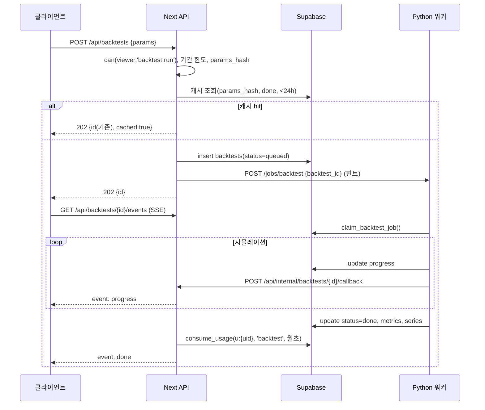

# 스톡랩 API 설계

- 버전 1.0 (2026-09-02) · 스키마: `20-db-schema.md` · 워커: `22-backtest-engine-design.md` · 보안: `26-security-rls.md`
- 구성: (A) Next.js 15 Route Handlers `src/app/api/**/route.ts` · (B) Python FastAPI 워커(내부) · (C) KIS 웹소켓 릴레이(P2 후반) · (D) 클라이언트 SSE
- 🟩 P1 · 🟦 P2 · 🟪 P3

---

## 1. 공통 규약

### 1.1 인증
| 주체 | 방식 | 검증 |
|---|---|---|
| 브라우저 → Next API | Supabase 세션 쿠키(`@supabase/ssr`) 또는 `Authorization: Bearer <supabase JWT>` | `createServerClient().auth.getUser()`; RLS는 사용자 JWT로 실행(anon key + 세션) |
| Vercel Cron → Next | `Authorization: Bearer ${CRON_SECRET}` | 상수 시간 비교, 불일치 401 |
| Next → Python 워커 | `X-Worker-Signature: HMAC-SHA256(WORKER_SECRET, timestamp + body)` + `X-Timestamp`(±5분) | 재생 방지 |
| 워커 → Supabase | service role 키 (워커 서버 env) | 워커는 `backtests`, `rankings`, `strategies`(read) 만 접근 |
| 토스 → Next 웹훅 | IP 화이트리스트 불신 → 페이로드의 `paymentKey`로 **결제조회 API 재확인** | `webhook_events` 멱등 |
| 릴레이(SSE) | 쿼리 `?token=<supabase JWT>` (EventSource 헤더 불가) → JWKS 검증 + `v_plan.plan='pro'` | 60분 재연결 |

### 1.2 플랜/권한 해석
`getViewer()` → `{ userId | null, plan: 'anon'|'free'|'basic'|'pro', usageKey }`. 권한은 `can(viewer, feature)` (`11-feature-specs.md §5.2` 매트릭스를 `src/lib/entitlements.ts` 상수로).

### 1.3 레이트리밋 (Upstash Ratelimit, sliding window · 🟦; 🟩는 `usage_limits`만)
| 티어 | 일반 API | 스크리너 실행 | 백테스트 생성 | 알림 CRUD | SSE 연결 |
|---|---|---|---|---|---|
| anon | 60/분/IP | 5/일 (`usage_limits`) | – | – | – |
| free | 120/분 | 20/일 | – | – | – |
| basic | 300/분 | ∞ (60/분 소프트) | 10/월 · 3/분 | 30/분 | – |
| pro | 600/분 | ∞ (120/분 소프트) | 100/일 · 10/분 | 60/분 | 2 동시 |
- 초과 → `429` + `Retry-After` + 본문 `RATE_LIMITED`. 한도 소진(비율 아닌 카운트) → `402`/`403` `QUOTA_EXCEEDED` (아래).

### 1.4 에러 형식
```json
{ "error": { "code": "QUOTA_EXCEEDED", "message": "오늘 무료 조회 5회를 모두 사용했습니다.", "details": { "used": 5, "limit": 5, "resetsAt": "2026-09-02T15:00:00.000Z" } }, "requestId": "req_01J…" }
```
| HTTP | code | 사용 |
|---|---|---|
| 400 | `VALIDATION_ERROR` (details: zod issues) | 입력 오류 |
| 401 | `UNAUTHENTICATED` | 로그인 필요 |
| 403 | `PLAN_REQUIRED` (details.requiredPlan) · `FORBIDDEN` · `EXPRESSION_BLOCKED`(표현 가드) | |
| 402 | `QUOTA_EXCEEDED` (details: used/limit/resetsAt) | 무료·베이직 한도 |
| 404 | `NOT_FOUND` | |
| 409 | `CONFLICT` · `ALREADY_PROCESSED` | 멱등 충돌 |
| 422 | `DATA_UNAVAILABLE` (details.asOf) | 데이터 지연/부재 |
| 429 | `RATE_LIMITED` | |
| 500 | `INTERNAL` | requestId 로그 |
| 503 | `WORKER_UNAVAILABLE` | 백테스트 워커 다운 |

### 1.5 응답 규약
- 성공: `{ data: …, meta?: { asOf, mode: 'supabase'|'sample', usage?: UsageResult } }`.
- 날짜 `YYYY-MM-DD`(KST), 시각 ISO 8601 UTC. 금액 정수 원. 비율 % 숫자(소수).
- 캐시: 공개 데이터 GET은 `Cache-Control: public, s-maxage=300, stale-while-revalidate=3600`; 사용자 데이터 `private, no-store`.
- 요청 검증 zod. 모든 라우트 `export const runtime = 'nodejs'`(crypto 사용), cron/웨훅 `dynamic = 'force-dynamic'`.

### 1.6 멱등성 (결제·웹훅·작업)
| 대상 | 키 | 저장 |
|---|---|---|
| 토스 웹훅 | `(provider='toss', event_id = payload.eventId ?? sha256(body))` | `webhook_events` PK → 중복 시 200 `{ok:true, duplicate:true}` |
| 정기 결제 실행 | `orderId = sub_{subscription_id}_{YYYYMM}` | `payments.order_id UNIQUE` — INSERT 선행 후 토스 호출, 실패 시 `status=failed` 갱신 |
| 결제 확인 `POST /billing/confirm` | 헤더 `Idempotency-Key`(클라이언트 uuid) | Upstash `SETNX idem:{key}` 24h + 응답 캐시 |
| 백테스트 생성 | `params_hash` 24h 캐시 | 동일 해시 `done` 존재 → 기존 id 반환(미차감) |
| 게임 주문 | 헤더 `Idempotency-Key` | 동일 |

---

## 2. Next.js Route Handlers

### 2.1 🟩 P1 공개·데이터
| Method | Path | Auth | 요청 | 응답 `data` | 비고 |
|---|---|---|---|---|---|
| GET | `/api/screener/value` | anon+ | query `ValueFilters` + `limit≤100/500` | `ScreenRow[]`, `meta.usage`, `meta.relax`(완화 제안 3개) | 한도 소비. 필터 해시 동일 & 세션 캐시 있으면 클라이언트가 호출 안 함 |
| GET | `/api/screener/dividend` | anon+ | `DividendFilters` | `DividendRow[]` | 동일 |
| GET | `/api/today` | anon | – | `DailyPick` | s-maxage 300 |
| GET | `/api/today/[date]` | anon | path `YYYY-MM-DD` | `DailyPick` | 404 시 최근 pick 링크 |
| GET | `/api/stocks?q=` | anon | `q` 2자+ | `Stock[]` ≤ 20 | 검색(trgm) |
| GET | `/api/meta` | anon | – | `{ asOf, mode }` | 배너용 |
| GET/POST | `/api/cron/daily-pick` | CRON_SECRET | `?date=`(선택, 재실행) | `{ pick, skipped }` | 멱등: 같은 `pick_date` 존재 → `skipped:true` |
| POST | `/api/usage/peek` | anon | `feature` | `UsageResult` | 소비 없이 잔여 확인 |

> 페이지(서버 컴포넌트)는 `getDataSource()`를 직접 호출하고, 위 API는 클라이언트 재조회·외부 도구용. 두 경로 모두 동일 `consumeUsage` 사용.

### 2.2 🟩(Should) 계정
| Method | Path | Auth | 설명 |
|---|---|---|---|
| GET | `/api/me` | user | `{ profile, plan, limits: {screener:{used,limit}}, coupons }` |
| PATCH | `/api/me` | user | `{ nickname?, quiet_hours?, marketing_optin? }` |
| DELETE | `/api/me` | user | 탈퇴: 구독 활성 시 409 → 해지 먼저. `auth.admin.deleteUser` 서비스 롤 |
| GET/PUT | `/api/portfolios/lite` | user | 라이트 포트폴리오 (5종목) |

### 2.3 🟦 P2 저장 조건식·시그널
| Method | Path | Auth | 요청 | 응답 |
|---|---|---|---|---|
| GET | `/api/screens` | user | – | `SavedScreen[]` |
| POST | `/api/screens` | user | `{name, kind, filters, description?}` | 201 `SavedScreen` · 개수 한도 402 · 표현 가드 403 |
| GET/PATCH/DELETE | `/api/screens/[id]` | owner | | |
| POST | `/api/screens/[id]/run` | owner | – | 스크리너 결과 (플랜 한도 적용) |
| POST | `/api/screens/[id]/share` | pro | `{is_public}` | `{share_slug}` |
| GET | `/api/s/[slug]` | anon | – | 공개 조건식 + 최신 결과(캐시 1h) |
| GET | `/api/screens/[id]/signals?from=&to=` | owner | | `Signal[]` |
| POST | `/api/cron/evaluate-screens` | CRON | 06:30 KST | 전 활성 조건식 평가 → `signals` diff → 알림 큐 |

### 2.4 🟦 전략·백테스트·랭킹
| Method | Path | Auth | 요청 | 응답 |
|---|---|---|---|---|
| GET | `/api/strategies` | anon | `?builtin=1` | `Strategy[]` (definition 포함, builtin 공개) |
| POST | `/api/strategies` | pro | `{label, description, definition}` | 201 · DSL 스키마 검증(zod) · 표현 가드 |
| GET/PATCH/DELETE | `/api/strategies/[id]` | owner | | |
| POST | `/api/strategies/[id]/fork` | pro | – | 복제(`forked_from`) |
| POST | `/api/strategies/[id]/rank` | pro | `{is_ranked}` | 랭킹 참가 토글 |
| POST | `/api/backtests` | basic+ | `BacktestParams`(`11-feature-specs.md §2.1`) | 202 `{id, status:'queued', cached?:true}` · 한도 402 · 기간 초과 403 |
| GET | `/api/backtests` | user | `?cursor=` | 목록 |
| GET | `/api/backtests/[id]` | owner | – | `{status, progress, metrics, series}` |
| GET | `/api/backtests/[id]/events` | owner | SSE | `progress`/`done`/`failed` 이벤트 (§4) |
| GET | `/api/backtests/[id]/trades?page=` | owner | | 거래 내역(Storage 서명 URL 또는 페이지) |
| POST | `/api/backtests/[id]/cancel` | owner | | queued/running → canceled |
| POST | `/api/backtests/compare` | pro | `{ids: uuid[2..4]}` | 정렬된 비교 테이블 |
| GET | `/api/rankings?season=&kind=strategy` | anon | | free: 1위만 + 나머지 마스킹, basic+: 전체 |
| POST | `/api/cron/rankings` | CRON | 매월 1일 00:30 KST | 워커 `/internal/rankings/run` 호출 |
| POST | `/api/internal/backtests/[id]/callback` | 워커 HMAC | `{status, progress, metrics?, series?, error?}` | 워커 → Next 진행 통지(SSE 팬아웃) |

### 2.5 🟦 알림
| Method | Path | Auth | 요청 | 응답 |
|---|---|---|---|---|
| GET | `/api/alerts` | user | | `Alert[]` |
| POST | `/api/alerts` | basic+ | `{type, saved_screen_id?, portfolio_id?, config, channels, realtime?}` | 201 · 채널 권한 403 · 개수 402 · 동의 없는 채널 400 |
| PATCH/DELETE | `/api/alerts/[id]` | owner | | |
| GET | `/api/alerts/[id]/deliveries` | owner | | 최근 50 |
| POST | `/api/alerts/test` | basic+ | `{channel}` | 테스트 발송(일 3회) |
| POST | `/api/consents` | user | `{kind:'email_alert'|'kakao_alert'|'marketing', agree:bool, ver}` | 동의 기록 |
| POST | `/api/phone/verify/start` | pro | `{phone}` | 인증번호 SMS(솔라피), 5분, 일 5회 |
| POST | `/api/phone/verify/confirm` | pro | `{code}` | `phone_enc` 저장 |
| GET | `/u/[token]` | 서명 토큰 | | 1클릭 수신거부(HTML 페이지, 로그인 불필요) |
| POST | `/api/cron/dispatch-alerts` | CRON | 06:30/16:30 KST | 큐 → Resend/솔라피/FCM 발송, 다이제스트 묶음 |
| POST | `/api/webhooks/resend` `/api/webhooks/solapi` | 서명 | bounce/delivered | `alert_deliveries.status` 갱신 |

### 2.6 🟦 결제
| Method | Path | Auth | 요청 | 응답 |
|---|---|---|---|---|
| GET | `/api/billing/plans` | anon | | 요금표(서버 상수) |
| POST | `/api/billing/checkout` | user | `{plan:'basic'|'pro', cycle}` | `{customerKey, successUrl, failUrl}` · `subscriptions(pending)` |
| POST | `/api/billing/confirm` | user + `Idempotency-Key` | `{authKey, customerKey}` | 빌링키 발급 + 첫 결제 → `{subscription}` |
| GET | `/api/billing/subscription` | user | | 현재 구독 + 최근 결제 |
| POST | `/api/billing/cancel` | user | `{immediate?:false}` | `cancel_at_period_end=true` |
| POST | `/api/billing/change-plan` | user | `{plan}` | 업 즉시 일할 / 다운 다음 주기 |
| POST | `/api/billing/update-card` | user | `{authKey}` | 빌링키 교체 |
| POST | `/api/billing/refund-request` | user | `{reason}` | 정책 판정(§5.6) → 자동 또는 CS 티켓 |
| POST | `/api/webhooks/toss` | 토스 | 토스 페이로드 | 멱등 처리, 항상 200(검증 실패는 로그+4xx) |
| POST | `/api/cron/billing-renew` | CRON | 03:00 KST | 만기 구독 결제 · 실패 재시도 · past_due→canceled |

### 2.7 🟦 포트폴리오
| Method | Path | Auth | 설명 |
|---|---|---|---|
| GET/POST | `/api/portfolios` | user | 목록/생성 (무료 1, 유료 5) |
| GET/PATCH/DELETE | `/api/portfolios/[id]` | owner | |
| PUT | `/api/portfolios/[id]/items` | owner | 전체 교체 `{items:[{code,quantity,avg_price?}]}` |
| GET | `/api/portfolios/[id]/diagnose` | basic+ | 섹터 비중·집중도(HHI)·변동성·배당 캘린더 |
| GET | `/api/portfolios/[id]/correlation` | pro | 60/250일 상관 매트릭스 |
| POST | `/api/portfolios/[id]/rebalance` | pro | `{target:'equal'|'inverse_vol'|custom}` → 목표 비중·차이 계산 (문구: "비중 계산 결과") |

### 2.8 🟪 P3 게임·포인트
| Method | Path | Auth | 설명 |
|---|---|---|---|
| GET | `/api/game/season` | anon | 현재 시즌·내 계정 |
| POST | `/api/game/join` | user | 시즌 참가(계정 생성) |
| POST | `/api/game/orders` | user + Idempotency-Key | `{code, side, quantity}` → RPC `place_game_order` |
| GET | `/api/game/account` | user | 잔고·포지션·주문 |
| GET | `/api/game/rankings?season=&kind=game_month|game_week` | anon | Top100 + 내 순위 |
| POST | `/api/cron/game-settle` | CRON | 16:00 KST | pending 체결(종가), equity 재계산, 주간 랭킹 |
| POST | `/api/cron/season-rollover` | CRON | 매월 1일 00:00 KST | 시즌 종료 스냅샷·티어·보상·리셋 |
| GET | `/api/predictions/today` | anon | 오늘 3종목·마감 |
| POST | `/api/predictions` | user | `{set_date, picks:[{code,guess}]}` 08:30 전 |
| POST | `/api/cron/predictions` | CRON | 06:00 선정 / 16:00 판정 |
| POST | `/api/checkin` | user + Turnstile | RPC `checkin()` |
| GET | `/api/points` | user | 잔고·최근 원장 |
| POST | `/api/points/redeem` | user | `{item}` |
| GET | `/api/badges` `/api/me/badges` | anon/user | |
| POST/DELETE | `/api/push/tokens` | user | FCM 토큰 등록/해제 |
| POST | `/api/cron/weekly-report` | CRON | 일 19:00 KST |

---

## 3. Python FastAPI 워커 (내부 전용, `22-backtest-engine-design.md`)
Base: `https://worker.stocklab.internal`(Fly.io private) · 인증 HMAC(§1.1) · 모든 응답 동일 에러 형식.

| Method | Path | 요청 | 응답 | 비고 |
|---|---|---|---|---|
| GET | `/health` | – | `{ok, version, data_as_of, queue_depth}` | 무인증 |
| POST | `/jobs/backtest` | `{backtest_id}` | 202 | 즉시 실행 힌트(폴링 대신 푸시). 워커는 어차피 `claim_backtest_job` 폴링 |
| GET | `/jobs/{backtest_id}` | | `{status, progress}` | |
| POST | `/jobs/{backtest_id}/cancel` | | 200 | |
| POST | `/internal/rankings/run` | `{season, window_months:36}` | 202 `{job_id}` | 20 builtin + is_ranked 전략 일괄 |
| POST | `/internal/validate-strategy` | `{definition}` | `{ok, errors[], estimated_cost}` | Next가 저장 전 호출 |
| POST | `/internal/cache/invalidate` | `{scope:'prices'|'financials'}` | 200 | 파이프라인 적재 후 |

## 4. SSE (서버 → 클라이언트)

### 4.1 백테스트 진행 `GET /api/backtests/[id]/events`
```
event: progress   data: {"progress":42,"stage":"simulate"}
event: done       data: {"metrics":{...}}
event: failed     data: {"error":"..."}
: keepalive (15s)
```
- 구현: Route Handler `ReadableStream`, `maxDuration=300`(Vercel Pro). 1초마다 `backtests.status/progress` 폴링(Supabase) 또는 Upstash Redis Pub/Sub `bt:{id}` 구독(워커가 publish). 연결 끊김 시 클라이언트 `Last-Event-ID` 재연결, 폴백 `GET /api/backtests/[id]` 3초 폴링.

### 4.2 실시간 시세 `GET wss|https://relay.stocklab.tomatoeggcat.com/sse?token=&codes=005930,000660`
```mermaid
flowchart LR
  KIS[KIS Developers WebSocket\n실시간 체결가 H0STCNT0] -->|1 conn ≤ 41 종목| R[Relay (Node, Fly.io)\n구독 관리·재접속·토큰 갱신]
  R -->|SET quote:{code} EX 15| U[(Upstash Redis)]
  R -->|PUBLISH quotes| U
  U -->|SUBSCRIBE| R2[Relay SSE 엔드포인트]
  R2 -->|text/event-stream| C[프로 사용자 브라우저]
  R -->|조건 평가: price_level/holding_move| E[알림 평가기]
  E -->|POST /api/internal/alerts/fire HMAC| N[Next API → FCM/알림톡]
  N2[Next /api/quotes?codes=] -->|GET quote:* (15s 캐시)| U
```
| 항목 | 설계 |
|---|---|
| 구독 관리 | 사용자별 최대 20종목, 릴레이 전체 종목 집합 = 활성 SSE 구독 ∪ 활성 실시간 알림 종목. KIS 연결당 41종목 제한 → 종목 수/41 개 연결(상한 5연결=205종목, 초과 시 알림 종목 우선, SSE는 15초 폴링 폴백) |
| 캐시 | `quote:{code}` = `{price, change, change_pct, volume, ts}` TTL 15s. 비프로/폴백 `/api/quotes`는 이 캐시만 읽음 |
| 장외 | 15:30~09:00 릴레이 idle, SSE는 `event: closed` 후 종료 |
| 인증 | JWT 검증(JWKS) + plan=pro. 토큰 만료 시 `event: reauth` |
| 백프레셔 | 종목당 최대 2회/초로 스로틀 후 전송 |
| 장애 | KIS 재접속 지수 백오프(1→32s), 토큰 만료 24h 전 자동 갱신, 헬스 `/health` |

## 5. 시퀀스: 백테스트 실행


## 6. 환경 변수 (API 관련 추가분)
| 변수 | Phase | 용도 |
|---|---|---|
| `CRON_SECRET` `USAGE_SALT` | 🟩 | 기존 |
| `SUPABASE_JWT_SECRET` 또는 JWKS URL | 🟦 | 릴레이 JWT 검증 |
| `WORKER_URL` `WORKER_SECRET` | 🟦 | 워커 HMAC |
| `UPSTASH_REDIS_REST_URL` `UPSTASH_REDIS_REST_TOKEN` | 🟦 | 레이트리밋·멱등·시세 캐시 |
| `TOSS_SECRET_KEY` `TOSS_CLIENT_KEY`(public) | 🟦 | 빌링 |
| `RESEND_API_KEY` `ALERT_FROM_EMAIL` | 🟦 | 이메일 |
| `SOLAPI_API_KEY` `SOLAPI_API_SECRET` `KAKAO_PF_ID` `KAKAO_TEMPLATE_*` | 🟦 | 알림톡 |
| `PHONE_ENC_KEY` `UNSUB_TOKEN_SECRET` | 🟦 | 전화번호 암호화, 수신거부 토큰 |
| `KIS_APP_KEY` `KIS_APP_SECRET` | 🟦 | 릴레이 |
| `FCM_SERVICE_ACCOUNT_JSON` | 🟪 | 푸시 |
| `TURNSTILE_SECRET` | 🟪 | 출석 봇 방지 |
