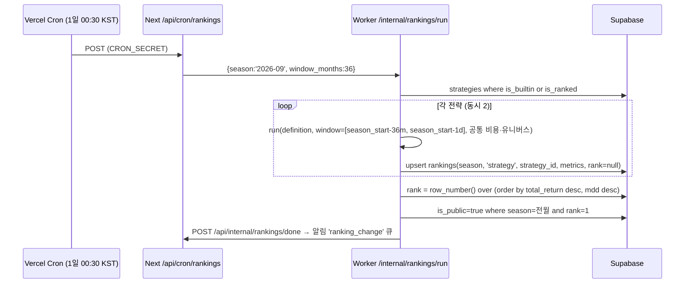

# 백테스트 엔진 설계 (Python FastAPI 워커) — P2

- 버전 1.0 (2026-09-02) · 기능 명세: `11-feature-specs.md §2` · API: `21-api-design.md §3` · 스키마: `20-db-schema.md`
- 위치: `stocklab/worker/` (별도 배포, Vercel 무관). Python 3.12, FastAPI, pandas 2.x, numpy, pyarrow, supabase-py(PostgREST) + psycopg(직접 SQL), uvicorn.

---

## 1. 목표·비목표
| 목표 | 비목표 |
|---|---|
| 20 기본 전략 + 사용자 DSL 전략을 **동일 엔진**으로 실행 | 틱/분봉 백테스트, 실계좌 주문 |
| 20년 × 2,500종목 팩터 전략을 **60초 이내**(p95) | 옵션·파생, 공매도 |
| 룩어헤드·생존편향 방지 구조적 보장 | 머신러닝 전략 |
| 결정적 결과(같은 입력 = 같은 출력, seed 기록) | 초당 수백 작업 처리 |

## 2. 데이터 모델 (워커 내부)
| 객체 | 형태 | 출처 | 갱신 |
|---|---|---|---|
| `PricePanel` | `xarray`/`pd.DataFrame` MultiIndex(`trade_date`, `code`) → wide 피벗 `close[T×N]`, `open`, `high`, `low`, `volume`, `trading_value`, `adj_close`, `market_cap` (float32) | `daily_prices` | 일 1회 파이프라인 후 `/internal/cache/invalidate` |
| `FundamentalPanel` | point-in-time 테이블: `(code, published_at, fiscal_year, quarter, items…)` → 각 거래일 `t`에 대해 `published_at + 1영업일 <= t` 인 **최신** 행을 `merge_asof`로 결합 | `financial_statements` (P2) · P1 `financials`는 최신 스냅샷이므로 백테스트에 **사용 금지** | 일 |
| `DividendPanel` | `(code, ex_dividend_date, dps)` | `dividend_history` | 일 |
| `Universe` | `(code, listed_at, delisted_at, market)` | `stocks` | 일 |
| `IndexPanel` | `close[T]` per index | `index_prices` | 일 |
| `Calendar` | 거래일 배열 (KRX 휴장 반영 = `daily_prices`에 존재하는 날짜) | 파생 | |

저장 포맷: 로컬 디스크 Parquet(연도 파티션) + 메모리 캐시(LRU, 프로세스 1개당 ≈ 2GB: 20년 close/open/volume float32 = 2500×5000×4B×3 ≈ 150MB, 지표 캐시 포함 여유).
콜드 스타트: 부팅 시 Supabase → Parquet 동기화(`SELECT … WHERE trade_date > last_local`), 증분.

## 3. 엔진 (벡터화)
```mermaid
flowchart TD
  A[Job params + Strategy DSL] --> B[Universe mask T×N\n상장·상폐·유동성·시총]
  B --> C[Feature 계산\n가격 지표(rolling) · 재무 as-of 조인]
  C --> D[Signal / Score 행렬 T×N]
  D --> E{전략 유형}
  E -->|팩터| F[리밸런싱일마다 rank→top N→목표 비중]
  E -->|기술적| G[진입/청산 이벤트 → 포지션 상태기계\n(누적 보유 마스크)]
  F --> H[목표 비중 W_target T×N]
  G --> H
  H --> I[체결: t 시그널 → t+1 시가\n수수료·세금·슬리피지]
  I --> J[포지션·현금·배당 재투자 → equity T]
  J --> K[지표 CAGR/MDD/Sharpe/승률…\n시계열 다운샘플 · 거래 로그]
```
| 단계 | 구현 메모 |
|---|---|
| Universe mask | `(listed_at <= t) & (delisted_at is null or delisted_at > t) & (trading_value_20d >= 1e8) & (market_cap >= min_cap)`; 상폐 종목은 `delisted_at` 전일 종가로 강제 청산 행 추가 |
| Feature | `close.rolling(n).mean()`, `ewm` (MACD), `rolling(n).max()`(채널), RSI(Wilder 평활), 볼린저; 재무 팩터는 `merge_asof(direction='backward', allow_exact_matches=False)` on `published_at + 1bd` |
| Score/rank | `score.rank(axis=1, pct=True)` → 팩터 가중 합 → `nlargest(N)` 마스크 |
| 체결 | 목표 비중 변화 `ΔW`를 `open[t+1]*(1±slippage)`로 체결. 매수 비용 `fee_bps`, 매도 `fee_bps + tax_bps`. 정수 주식수 반올림(내림) → 잔여 현금 |
| 배당 | `ex_dividend_date`에 보유 수량 × `dps` 현금 유입(배당소득세 15.4% 차감), `dividend_reinvest`면 다음 리밸런싱에 포함 |
| 거래정지 | `volume==0` 또는 NaN인 날은 체결 연기(다음 가능일), 청산 대기 표시 |
| 결과 | equity/drawdown/turnover 일별 → 최대 2,000점 LTTB 다운샘플 · 월별 수익 피벗 · 거래 로그 parquet → Supabase Storage `backtests/{id}/trades.parquet` |

기술적 전략의 상태기계: `enter[T×N]`, `exit[T×N]` 불 행렬에서 `held = ffill(where(enter,1,where(exit,0,nan)))` (numpy `np.maximum.accumulate` 트릭) → 동시 보유 종목 수 > `max_positions`면 시그널 강도(`rank_by`) 상위만 진입.

## 4. 전략 DSL (JSON) — `strategies.definition`
### 4.1 스키마 (v1)
```jsonc
{
  "v": 1,
  "type": "factor" | "technical" | "hybrid",
  "universe": { "market": "ALL", "min_market_cap": 500, "min_trading_value": 100000000, "exclude_sectors": [] },
  "filters": [                          // AND 결합. field ∈ 팩터 카탈로그(§4.2)
    { "field": "pbr", "op": ">", "value": 0 },
    { "field": "pbr", "op": "<=", "value": 1 },
    { "field": "roe", "op": ">=", "value": 10 }
  ],
  "rank": { "by": [ { "field": "roe", "dir": "desc", "weight": 1 } ], "top": 20 },   // factor/hybrid
  "entry": { "all": [ { "expr": "cross_above(sma(close,50), sma(close,200))" } ] },   // technical
  "exit":  { "any": [ { "expr": "cross_below(sma(close,50), sma(close,200))" }, { "hold_days": 60 } ] },
  "regime": { "expr": "close_index('KOSPI') > sma(close_index('KOSPI'),200)", "off": "cash" },  // hybrid 선택
  "rebalance": "monthly" | "quarterly" | "yearly" | "signal",
  "weighting": "equal" | "market_cap" | "inverse_vol",
  "max_positions": 20
}
```
- `expr`는 화이트리스트 함수만 허용하는 소형 표현식 언어(`lark` 파서 → AST → 벡터 연산). 파이썬 `eval` 금지.
- 허용 함수: `sma, ema, rsi, macd, macd_signal, bb_upper, bb_lower, bb_mid, highest, lowest, ret, vol, cross_above, cross_below, close_index, sma_index, rank_pct, abs, min, max, and, or, not`. 필드: `open, high, low, close, volume, trading_value, market_cap` + §4.2 팩터.
- `hold_days`, `stop_loss_pct`, `take_profit_pct`는 선언적 청산 조건.
- 비용 상한: `estimated_cost = 기간일수 × 유니버스 크기 × 피처 수`; 상한 초과(예: 20년 × ALL × 15 피처 = 상한의 1.2배) 시 `/internal/validate-strategy`가 거절.

### 4.2 팩터 카탈로그
| field | 정의 | 원천 |
|---|---|---|
| `per` | `market_cap / net_income_ttm` (음수면 NaN) | financial_statements |
| `pbr` | `market_cap / equity` | |
| `roe` | `net_income_ttm / avg_equity` % | |
| `debt_ratio` | `total_liabilities / equity` % | |
| `op_margin` | `operating_income_ttm / revenue_ttm` | |
| `earnings_yield` | `ebit_ttm / ev` (ev = market_cap + total_liabilities − cash) | 마법공식 |
| `roic` | `ebit_ttm / (equity + total_liabilities − current_liabilities − cash)` (근사) | 마법공식 |
| `ncav_ratio` | `(current_assets − total_liabilities) / market_cap` | NCAV |
| `f_score` | 피오트로스키 9항목 합 | |
| `dps_cagr_3y` `dividend_yield` `consecutive_years` `payout_ratio` | dividend_history | |
| `mom_12_1` | `close.shift(21)/close.shift(252) − 1` | prices |
| `vol_60` | 60일 일수익률 표준편차 | prices |
| `ret_5` `ret_20` | n일 수익률 | prices |

### 4.3 20 기본 전략 매핑 (요약; 규칙 원문은 `11-feature-specs.md §2.7`)
| key | type | 핵심 DSL 조각 |
|---|---|---|
| `magic-formula` | factor | `rank.by=[{earnings_yield,desc,.5},{roic,desc,.5}], top 30, rebalance yearly` |
| `low-pbr-high-roe` | factor | `filters pbr∈(0,1], roe≥10, debt_ratio≤150; rank roe desc top 20; quarterly` |
| `dividend-growth` | factor | `filters consecutive_years≥5, dps_cagr_3y>0, dividend_yield≥2, payout_ratio≤70; rank dividend_yield; yearly` |
| `golden-cross` | technical | `entry cross_above(sma(close,50),sma(close,200)); exit cross_below(...)` |
| `high-52w-breakout` | technical | `entry close >= highest(close,252); exit close < lowest(low,20)` |
| `bollinger-reversion` | technical | `entry close < bb_lower(close,20,2) and close > sma(close,200); exit close >= bb_mid(close,20) or hold_days 20` |
| `rsi-reversion` | technical | `entry rsi(close,14) < 30; exit rsi(close,14) > 50 or hold_days 15` |
| `momentum-12-1` | factor | `rank mom_12_1 desc top 20; monthly` |
| `low-per-large` | factor | `universe top200 by market_cap; filters per>0; rank per asc top 20; quarterly` |
| `high-dividend` | factor | `filters payout_ratio≤80, consecutive_years≥3; rank dividend_yield desc top 20; yearly` |
| `trend-filter-value` | hybrid | `regime close_index('KOSPI') > sma_index('KOSPI',200) off cash` + low-pbr-high-roe |
| `small-cap-value` | factor | `universe market_cap pct ≤ 30; filters pbr>0; rank pbr asc top 20; quarterly` |
| `quality` | factor | `filters roe≥15, debt_ratio≤100; rank op_margin desc top 20; quarterly` |
| `ncav` | factor | `filters ncav_ratio > 1.5; rank ncav_ratio desc top 20; yearly` |
| `f-score-value` | factor | `filters f_score≥7, rank_pct(pbr)≤0.2; rank pbr asc top 20; yearly` |
| `macd-cross` | technical | `entry cross_above(macd(close,12,26), macd_signal(close,12,26,9)) and macd(close,12,26) < 0; exit cross_below(...)` |
| `turtle-20-10` | technical | `entry close > highest(close,20).shift(1); exit close < lowest(close,10).shift(1)` |
| `short-term-reversion` | technical | `entry ret(close,5) <= -0.10 and close > sma(close,200); exit hold_days 5` |
| `ma20-disparity` | technical | `entry close/sma(close,20)-1 <= -0.10; exit close/sma(close,20)-1 >= 0 or hold_days 30` |
| `low-volatility` | factor | `universe top300 by market_cap; rank vol_60 asc top 20; monthly` |
- `strategies` 시드 SQL은 `worker/seeds/builtin_strategies.json` → 마이그레이션 `0012`에서 INSERT. `definition_hash`로 변경 감지.

## 5. 작업 큐
선택: **Supabase 테이블 폴링(`backtests.status='queued'`) + `claim_backtest_job()` (`FOR UPDATE SKIP LOCKED`)**. QStash는 옵션(Next→워커 푸시 힌트만).
| 항목 | 설계 |
|---|---|
| 폴링 | 워커 프로세스 2s 간격, 작업 없으면 지수 백오프 최대 10s. `POST /jobs/backtest` 힌트 수신 시 즉시 폴링 |
| 동시성 | 워커 인스턴스당 `MAX_CONCURRENCY=2`(CPU 2 vCPU 기준), 프로세스 풀(`ProcessPoolExecutor`) — 판다스 GIL 회피 |
| 우선순위 | `ORDER BY (plan='pro') DESC, created_at` — 프로 우선. 랭킹 배치 작업은 `priority=-1`(야간) |
| 진행률 | 단계 가중: 데이터 로드 10 · 피처 30 · 시뮬 50 · 저장 10. 5% 단위로 `backtests.progress` 갱신 + Next 콜백(HMAC) |
| 타임아웃 | 작업당 180s(프로 20년 상한 기준 실측 후 조정) → `failed: TIMEOUT` |
| 재시도 | 인프라 오류(DB 연결 등) 3회, 전략 오류(DSL) 0회 |
| 취소 | `status='canceled'`를 매 단계 시작 시 확인 |
| 고아 복구 | `running` 상태 10분 이상 & 워커 heartbeat 없음 → `queued`로 복귀 (cron) |
| 사용량 차감 | Next가 `done` 수신 시 `consume_usage`. 워커는 차감 안 함 |

## 6. 캐싱
| 레벨 | 키 | TTL | 내용 |
|---|---|---|---|
| L0 결과 | `params_hash` (`backtests` 테이블) | 24h | 동일 입력 재실행 → 기존 결과 |
| L1 피처 | `(feature, params, data_version)` 프로세스 메모리 LRU 512MB | 데이터 갱신 시 무효 | `sma(close,200)` 등 rolling 결과 |
| L2 패널 | Parquet 로컬 디스크 | 증분 | 원천 데이터 |
| L3 재무 as-of | `(data_version)` 사전 계산된 일별 팩터 패널(월말 기준만) | 일 | 팩터 전략 대부분이 월/분기 리밸런싱이므로 월말 스냅샷 250개만 필요 |
`data_version` = 파이프라인이 `system_meta.data_version` 에 기록(`as_of` 날짜).

## 7. 비용 통제
| 항목 | 값 |
|---|---|
| 호스팅 | Fly.io `shared-cpu-2x` 4GB 1대(월 ≈ $15) — 큐가 5분 이상 대기하면 수동 스케일. Railway 대안 동일 |
| 자동 정지 | 야간(00~06 KST) 랭킹 배치 외 유휴 시 `min_machines_running=0`, 콜드스타트 20s 허용(SSE에 `stage: warming`) |
| 사용자 한도 | 베이직 10/월·5년, 프로 100/일·20년, 동시 3 (`11-feature-specs.md §2.6`) |
| 비용 추정치 | `validate-strategy`가 반환하는 `estimated_cost`가 상한의 100%↑면 거절, 60%↑면 "시간이 오래 걸릴 수 있음" 경고 |
| 저장 | `series` ≤ 2,000점 · 거래 로그는 Storage(parquet) · 만료 정리 |

## 8. 랭킹 계산 (월간)

- 창: `[시즌 시작 −36개월, 시즌 시작 −1일]`, 모든 전략 동일 파라미터(`11-feature-specs.md §2.7` 공통). 사용자 전략 DSL의 `universe`·비용 오버라이드는 **무시**(공정성).
- 데이터 부족(`ncav` 등 재무 항목 미확보)은 `metrics.status='insufficient_data'`로 표기하고 순위 제외.
- 실행 예산: 20 + 참가 전략 N ≤ 200 → 각 ≈ 20s → 약 70분(동시 2). 초과 시 참가 전략은 `definition_hash` 변경 없으면 전월 결과 재사용(창만 롤링이라 재계산 필요… → 캐시된 일별 포지션 행렬로 마지막 1개월만 증분 계산 = P2 후반 최적화).

## 9. 정합성 테스트 (CI, `pytest`)
| 테스트 | 내용 | 기대 |
|---|---|---|
| `test_buy_and_hold` | 단일 종목 매수 후 보유, 비용 0 | equity == close/close[0] × 초기자본 (±1주 반올림 오차) |
| `test_no_lookahead_price` | 시그널 t일 종가에 미래 값(`shift(-1)`) 주입한 전략 | 파서가 `shift(-n)` 거절; 강제 실행 시 결과가 t+1 시가 체결과 불일치해야 함(가드 테스트) |
| `test_no_lookahead_fundamental` | 공시일 이전 재무 사용 여부 | `published_at > t-1bd` 행이 조인되지 않음 |
| `test_survivorship` | 상폐 종목 포함 유니버스 vs 제외 | 포함 시 수익률 ≤ 제외 시(정상), 상폐 종목이 폐지 전일에 청산됨 |
| `test_fee_tax` | 왕복 1회 거래 | 비용 = 매수 fee + 매도 fee + tax + 슬리피지 정확 |
| `test_dividend` | 배당락일 보유 | 현금 증가 = qty × dps × (1−0.154) |
| `test_delisting_halt` | 거래정지 중 청산 시그널 | 다음 거래 가능일 체결 |
| `test_metrics_known` | 합성 equity(연 10% 일정) | CAGR ≈ 10%, MDD 0, Sharpe 계산식 일치 |
| `test_determinism` | 동일 입력 2회 | 바이트 동일 결과 |
| `test_dsl_whitelist` | `__import__`, `eval` 등 | 파서 거절 |
| `test_builtin_20_smoke` | 20전략 3년 소형 데이터셋 | 오류 없음, 거래 ≥ 1 |
| 벤치마크 회귀 | 고정 데이터셋 결과 스냅샷 | 변경 시 명시적 승인 필요 |

## 10. 배포
| 항목 | 값 |
|---|---|
| 컨테이너 | `worker/Dockerfile` (python:3.12-slim, uv), `uvicorn app:app --workers 1` + 내부 프로세스 풀 |
| Fly.io | `fly.toml`: region `nrt`(도쿄, Supabase 리전과 근접), `[http_service] internal_port=8080, auto_stop_machines=true, min_machines_running=0`, 볼륨 10GB(Parquet) |
| Railway 대안 | 동일 Dockerfile, 볼륨 마운트 `/data` |
| 환경 변수 | `SUPABASE_URL`, `SUPABASE_SERVICE_ROLE_KEY`, `WORKER_SECRET`, `NEXT_CALLBACK_URL`, `UPSTASH_*`(선택), `MAX_CONCURRENCY`, `DATA_DIR=/data` |
| 관측 | 구조화 로그(JSON) → Fly logs; Sentry(파이썬) 오류; `/health`에 `queue_depth`, `last_job_ms`, `data_as_of` |
| 배포 | GitHub Actions `worker-deploy.yml`: `pytest` → `flyctl deploy` (main 브랜치, `worker/**` 변경 시) |
| 롤백 | `flyctl releases rollback` |

## 11. 디렉터리
```
worker/
  app.py               # FastAPI 라우트 (/health, /jobs/*, /internal/*)
  auth.py              # HMAC 검증
  queue.py             # claim/poll/heartbeat
  data/loader.py       # Supabase→Parquet 증분, 패널 구성
  data/asof.py         # point-in-time 재무 조인
  engine/features.py   # 지표 (sma/ema/rsi/macd/bb/…)
  engine/dsl.py        # lark 문법, AST → numpy
  engine/portfolio.py  # 목표비중, 체결, 비용, 배당
  engine/metrics.py    # CAGR/MDD/Sharpe/…
  engine/run.py        # 파이프라인 오케스트레이션, 진행률
  rankings.py          # 월간 랭킹
  seeds/builtin_strategies.json
  tests/
  Dockerfile  fly.toml  pyproject.toml
```
