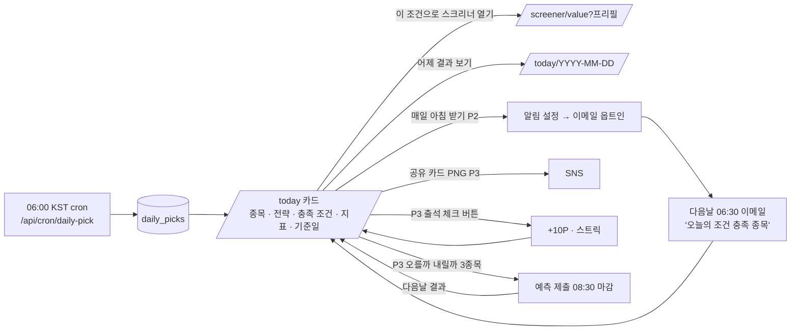

# 스톡랩 UX 플로우 & 화면 인벤토리

- 버전 1.0 (2026-09-02) · 기능: `11-feature-specs.md` · 디자인: `24-design-system.md` · API: `21-api-design.md`
- 모든 화면 공통: `Header`(NAV) · `Breadcrumb` · 본문 · 결과 하단 광고(무료, 결과 있을 때만) · `Disclaimer` · `Footer`. 데이터 화면은 `SampleBanner`(mode=sample) / 데이터 지연 배너 조건부.

---

## 1. 첫 방문 → 스크리너 → 한도 초과 → 가입 (P1)
```mermaid
flowchart TD
  A[검색/블로그/SNS 유입\n/ 또는 /blog/*] --> B[/ 랜딩\n히어로 + 3기능 + 오늘의 주식 위젯/]
  B -->|"저평가 스크리너 열기"| C[/screener/value\n기본값 프리필, 결과 미표시/]
  C -->|프리셋 칩 또는 슬라이더 조정| D[조건 적용 클릭]
  D --> E{consume_usage\nallowed?}
  E -->|yes| F[결과 표 ≤100행\n정렬·페이지 클라이언트\n하단: 광고1 · 면책 · '조건 저장(P2)']
  F -->|조건 수정 후 적용| D
  F -->|링크 복사| G[URL 쿼리 공유]
  E -->|no| H[한도 초과 카드\n'오늘 5회 모두 사용' · 리셋 카운트다운\n마지막 결과 유지]
  H -->|로그인하고 하루 20회| I[/login\n카카오·구글·이메일/]
  H -->|요금제 보기| J[/pricing/]
  I -->|가입 완료 → 원래 URL 복귀| C
  F -->|결과 0건| K[EmptyState\n'PER 상한 15로 완화하면 23개' 칩]
  K -->|칩 클릭 = 필터 변경 + 재적용| D
```
설계 포인트: 한도 초과 시 **결과 화면을 비우지 않는다**(마지막 결과 유지). 로그인 후 `redirect` 파라미터로 동일 필터 URL 복귀. 광고는 결과가 그려진 뒤에만 마운트.

## 2. 오늘의 주식 재방문 루프 (P1 → P3 강화)

재방문 장치 우선순위: (P1) 날짜 URL + "내일 06:00 갱신" 문구 + 홈 위젯 → (P2) 이메일 → (P3) 출석·예측·푸시.

## 3. 백테스트 실행 → 결과 → 공유 카드 (P2)
```mermaid
flowchart TD
  A[/backtest\n전략 목록 20 + 내 전략/] --> B{플랜}
  B -->|free| L[잠금 카드\n'베이직에서 월 10회' · 예시 결과 흐림] --> P[/pricing/]
  B -->|basic/pro| C[전략 선택 → /backtest/new?strategy=]
  C --> D[파라미터 폼\n기간(플랜 상한) · 초기자본 · 리밸런싱 · 비용(기본값 접힘)\n남은 횟수 n/10 배지]
  D -->|실행| E{한도·기간 검증}
  E -->|402 QUOTA| F[한도 카드: 쿠폰 사용 / 프로 안내]
  E -->|ok 202| G[/backtest/id\n진행 바 SSE · 단계 텍스트/]
  G -->|done| H[결과: 고지 배너 고정\nKPI 4 (CAGR·MDD·Sharpe·승률)\n자산곡선 vs 벤치마크 · 드로다운\n월별 히트맵 · 거래 내역 · '과거 시점 보유 목록']
  G -->|failed| I[오류 카드 + 재시도(미차감)]
  H -->|공유 카드 만들기| J[canvas PNG\n전략명 · 기간 · KPI 4 · 곡선 썸네일\n고지 1줄 · 워터마크]
  J --> K[저장 / X / 링크 복사 /share/bt/id]
  H -->|이 전략 복제해서 수정 pro| C
  H -->|비교에 추가 pro| M[/backtest/compare?ids=]
  H -->|랭킹 참가 pro| N[strategies.is_ranked=true]
```
공유 링크 `/share/bt/{id}`: 공개 읽기 전용(소유자가 켠 경우), 종목 목록은 숨기고 KPI·곡선만.

## 4. 알림 설정 (P2)
```mermaid
flowchart TD
  A[저장 조건식 상세 또는 /alerts] --> B[알림 추가]
  B --> C[유형 선택\n시그널 · 보유 등락 · 배당락 D-3 · 지정가 도달 · 랭킹 변동]
  C --> D[조건 입력\n예: 지정가 74,000원 이상]
  D --> E[채널 체크\n이메일(basic+) · 알림톡(pro) · 푸시(pro)]
  E -->|알림톡 최초| F[전화번호 입력 → SMS 인증 → 동의 문구 체크\n'정보성 알림 수신 동의' 시각 저장]
  E -->|푸시 최초| G[브라우저 권한 요청 → 토큰 등록]
  E --> H{개수 한도 5/50}
  H -->|초과| I[한도 카드 → 프로]
  H -->|ok| J[저장 · '테스트 발송' 버튼]
  J --> K[알림 목록: 활성 토글 · 최근 발송 · 무음시간 설정]
  K -->|이메일 하단 링크| U[/u/token 1클릭 수신거부\n→ active=false 즉시]
```

## 5. 결제 / 업그레이드 (P2)
```mermaid
flowchart TD
  A[게이팅 지점\n잠금 카드 · 한도 카드 · 헤더 '업그레이드'] --> B[/pricing\n3열 비교표 · 월/연 토글 · FAQ/]
  B -->|플랜 선택| C{로그인?}
  C -->|no| D[/login?redirect=/pricing/] --> B
  C -->|yes| E[/checkout\n주문 요약 · 환불정책 체크박스 · '카드 등록하고 시작']
  E --> F[토스 카드 등록창 requestBillingAuth]
  F -->|성공 redirect| G[/checkout/confirm\n스피너 · POST /billing/confirm Idempotency-Key]
  F -->|실패| H[/checkout/fail\n사유 · 다시 시도]
  G -->|200| I[/account?upgraded=1\n성공 토스트 · 플랜 배지 · 다음 결제일]
  G -->|결제 실패| H
  I --> J[/account/billing\n카드 변경 · 플랜 변경 · 해지 · 영수증]
  J -->|해지| K[확인 모달: '기간 말까지 유지' · 7일 내 미사용 시 환불 안내] --> L[cancel_at_period_end]
```

## 6. 모의투자 시즌 (P3)
```mermaid
flowchart TD
  A[/game 시즌 홈\n현재 시즌 · D-n · 내 순위/티어 · Top10/] -->|참가| B[game_accounts 생성\n가상 1,000만원]
  B --> C[/game/trade\n종목 검색 · 지연가 표시 · 수량 · '체결은 다음 확정 종가' 고지]
  C -->|주문| D[pending 주문]
  D -->|16:00 cron 체결| E[포지션·평가액 갱신]
  E --> F[/game/account\n보유 · 수익률 · 주문 내역]
  F --> G[주간 랭킹(월~금) · 시즌 랭킹]
  G -->|일요일 19:00| H[주간 리포트 이메일/푸시]
  G -->|월말 15:30 마감| I[시즌 종료 cron\n스냅샷 · 티어 · 포인트 · 배지]
  I --> J[/game/result/season\n내 티어 카드 · 공유 PNG]
  J -->|다음 시즌 자동 참가| B
  A -->|랭킹 표| K[MDD 병기 · 플래그 계정 '검토 중']
```

## 7. 화면 인벤토리
| 라우트 | 화면 | Phase | 인증 | 핵심 컴포넌트 | 광고 | 비고 |
|---|---|---|---|---|---|---|
| `/` | 랜딩 | P1 | – | Hero, FeatureGrid(3), TodayWidget, PricingTeaser, FAQ, JsonLd | – | `25-landing-site-design.md` |
| `/about` | 소개·데이터 출처 | P1 | – | prose-kr | – | |
| `/blog`, `/blog/[slug]` | 블로그 | P1 | – | prose-kr, JsonLd(Article) | 본문 하단 1 | MDX |
| `/calc/compound` | 복리 계산기 | P1 | – | CalcForm, YearTable(tnum), LineChart | 결과 하단 1 | URL 상태 |
| `/screener/value` | 저평가 스크리너 | P1 | anon+ | FilterPanel(슬라이더+프리셋), ResultTable, UsageBadge, QuotaCard, EmptyState(relax) | 결과 하단 1 | |
| `/screener/dividend` | 고배당 스크리너 | P1 | anon+ | 동일 + ExDivBadge | 결과 하단 1 | |
| `/today`, `/today/[date]` | 오늘의 주식 | P1 | – | PickCard, ConditionList, MetricGrid, DateNav | 카드 하단 1 | |
| `/portfolio/lite` | 포트폴리오 체크 라이트 | P1(후) | – | ItemsForm(5), SectorDonut, ConcentrationBar | 결과 하단 1 | 로컬 스토리지 |
| `/login`, `/auth/callback` | 로그인 | P1(Should) | – | OAuthButtons, EmailForm | – | |
| `/account` | 계정 | P1(Should) | user | ProfileForm, PlanBadge, UsageSummary | – | |
| `/legal/terms` `/legal/privacy` `/legal/refund` | 약관 | P1 | – | prose-kr | – | |
| `/pricing` | 요금제 | P2 | – | PlanTable(3), CycleToggle, FAQ | – | |
| `/checkout`, `/checkout/confirm`, `/checkout/fail` | 결제 | P2 | user | OrderSummary, PolicyCheckbox, TossWidget | – | |
| `/account/billing` | 구독 관리 | P2 | user | SubscriptionCard, PaymentList, CancelModal | – | |
| `/screens`, `/screens/[id]` | 저장 조건식 | P2 | user | ScreenList, ScreenEditor, SignalHistory, ShareToggle(pro) | – | |
| `/s/[slug]` | 공개 조건식 | P2 | – | ReadonlyFilters, ResultTable, ReportButton, CTA '나도 만들기' | 하단 1 | |
| `/backtest` | 전략 목록 | P2 | – | StrategyGrid(20), LockCard(free) | – | |
| `/backtest/new` | 파라미터 | P2 | basic+ | ParamForm, CostAccordion, QuotaBadge | – | |
| `/backtest/[id]` | 결과 | P2 | owner | NoticeBanner, KpiTiles(4), EquityChart, DrawdownChart, MonthlyHeatmap, TradesTable, HoldingsSnapshot, ShareCardButton | – | |
| `/backtest/compare` | 비교 | P2 | pro | CompareTable, MultiEquityChart | – | |
| `/share/bt/[id]` | 공개 백테스트 | P2 | – | KpiTiles, EquityChart, Notice | 하단 1 | |
| `/rankings` | 매매법 랭킹 | P2 | – | SeasonSelect, RankTable(free 마스킹), StrategyDrawer | 하단 1 | |
| `/strategies/[id]` | 전략 상세/편집 | P2 | pro | DslEditor(폼 기반), ValidateButton, ForkButton | – | |
| `/alerts` | 알림 | P2 | basic+ | AlertList, AlertForm(유형/채널), PhoneVerify, QuietHours, DeliveryLog | – | |
| `/u/[token]` | 수신거부 | P2 | 토큰 | Confirm | – | 로그인 불필요 |
| `/portfolios`, `/portfolios/[id]` | 포트폴리오 진단 | P2 | user | ItemsEditor, Diagnose(Sector/Vol/DivCalendar), Correlation(pro), Rebalance(pro) | – | |
| `/game`, `/game/trade`, `/game/account`, `/game/rankings`, `/game/result/[season]` | 모의투자 | P3 | user(랭킹 anon) | SeasonHeader, OrderForm, PositionsTable, RankTable, TierCard | 랭킹 하단 1 | |
| `/predict` | 오를까 내릴까 | P3 | user | ThreeStockCards, StreakBadge, Countdown | – | "재미용" 고지 |
| `/me/points`, `/me/badges` | 포인트·배지 | P3 | user | Ledger, RedeemGrid, BadgeGrid | – | |
| `/report/weekly/[week]` | 주간 리포트 웹뷰 | P3 | user | Summary, RankDelta | – | 이메일 링크 |
| 공통 | `error.tsx`, `not-found.tsx`, `loading.tsx` | P1 | – | ErrorCard(재시도), EmptyState | – | 라우트 그룹별 |

## 8. 상태 매트릭스 (데이터 화면 공통)
| 상태 | 표시 | 컴포넌트 |
|---|---|---|
| 로딩 | 스켈레톤 표 8행 | `loading.tsx` |
| 정상 | 결과 + `meta.asOf` "데이터 기준 2026-09-01" | |
| 0건 | 빈 상태 + 완화 칩 3개 | `EmptyState` |
| 한도 초과 | 한도 카드(결과 유지) | `QuotaCard` |
| 샘플 모드 | 상단 노란 배너 "샘플 데이터 — 실제 시세 아님" | `SampleBanner` |
| 데이터 지연 | 상단 배너 "데이터 갱신이 지연되고 있습니다 (기준 2026-08-29)" | `StaleBanner` (asOf < 전 영업일) |
| 오류 | 오류 카드 + 재시도 + requestId | `error.tsx` |
| 오프라인(PWA) | "오프라인 — 마지막 결과 표시" | P3 |
